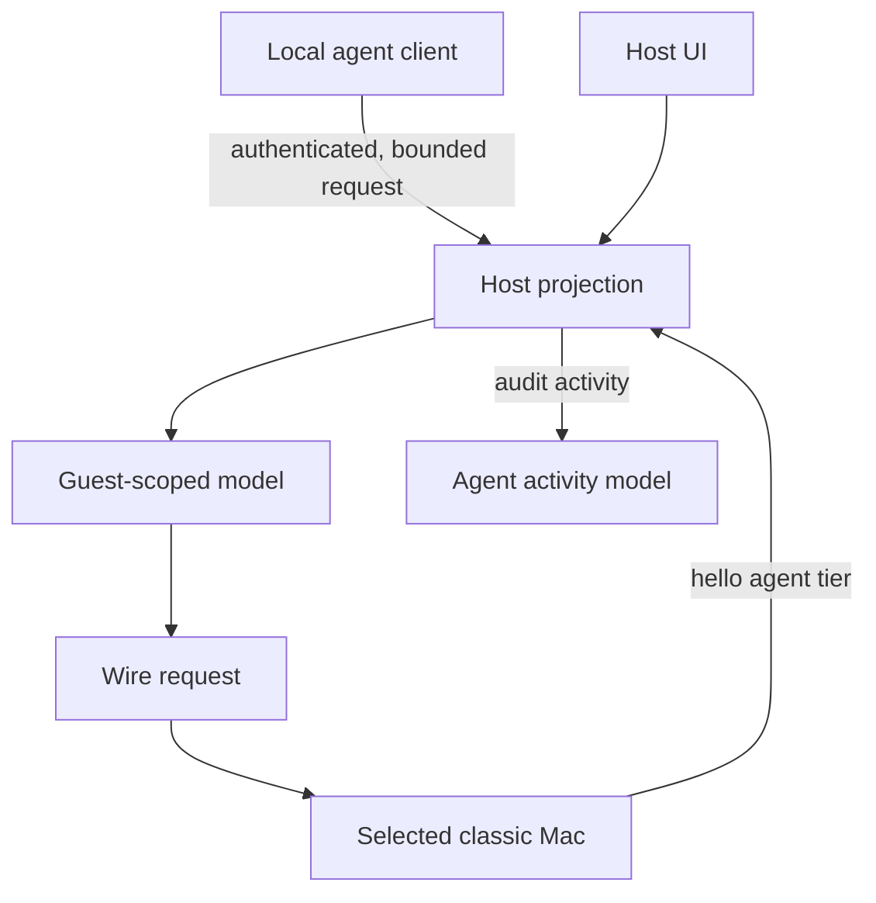

# Agent boundary

The agent companion is a client of the host, not an alternate face of the guest. `HostProjectionCatalog` declares capabilities once so the app UI and approved client share schemas, availability rules, bounds, and implementations.

Text equivalent: the local client and host UI converge on the same projection, which uses guest-scoped state and the existing wire. The selected machine's hello tier constrains the request. Activity is recorded by the host; the client cannot bypass the projection to reach the socket.

Missing or unknown policy is never consent. A capability that cannot name its target, bounds, availability, and refusal behavior is not ready to enter the catalog.
