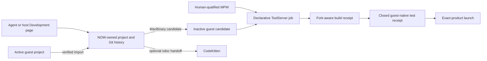

# Projects and Development

Development is a headless service with human controls, not an IDE embedded in
NOW. The host owns bounded project history and scratch workspaces; the classic
Mac owns its selected project directory and toolchains. CodeKitten is an
optional handoff when a person wants an IDE, never the build authority.

Text equivalent: the host page and agent projection share a NOW-owned project
store. A guest project enters only through verified import. Publication creates
an inactive MacBinary candidate, which a human-qualified MPW toolchain builds
through declarative actions. A fork-aware receipt gates a closed guest-native
test and exact-product launch.
CodeKitten may open the project separately for a human.

## Two project homes

A host-home project is authoritative beneath NOW's Application Support
Projects directory. A guest-home project remains authoritative on the classic
Mac; import gives the agent a recoverable host scratch repository for edits
and Git commits. Promotion is a separate compare-and-swap operation against
the imported base digest, so a changed classic tree is preserved rather than
overwritten.

This split lets an agent work on a project whose only original copy was on the
classic Mac without pretending the HFS tree is a POSIX checkout or granting
general host filesystem access.

## Classic files are logical records

Every source file is a data fork, resource fork, Finder type, creator, and
flags. The project digest covers all of them. NOW's Git representation keeps
ordinary data forks at their normal paths and writes a private `.now-classic`
recovery tree containing MacBinary packages and an index. Candidate transport
also uses MacBinary. This is why iterative text editing and normal Git history
do not erase the metadata MPW and Finder require.

## Jobs and receipts

`Project.ckp` contains a closed action vocabulary rather than shell or MPW
command strings. One asynchronous job owns ToolServer at a time. A terminal
build receipt binds the project or candidate, source digest, qualified
toolchain, action results, transcript, and exact product identity. Run
re-measures that identity and separately matches the launched process.

Build, test, run, and human IDE handoff are different outcomes. The version-1
test plan is all-or-none and closed: launch the unchanged measured product,
then assert its exact Process Manager identity within a bounded timeout. It
returns `ckproject.test-receipt/1`; richer UI behavior belongs to the semantic
scene journal. CodeKitten is a separate human handoff: NOW waits for and
validates `ckproject.open-receipt/1`, so AppleEvent dispatch alone is not
document acceptance and CodeKitten remains outside the executor path.

## Agent integration and settlement

`now_projects`, `now_development_environment`, and `now_development` project
the same services used by the host UI. Their mutations require caller-retained
attempt IDs. The local server journals bounded terminal responses before
replying, so retry after response loss or host restart returns the original
receipt rather than running the mutation twice. A compatibility preflight
names the host build, companion protocol, projection catalog and schema
revisions before domain dispatch, and operation-discriminated schemas reject
impossible sibling fields at the client boundary.

Snapshot, target resolution and action planning now read the same atomically
published `MirrorStateEngine`. Every accepted semantic action has a journal
operation ID, and `wait_for_settlement` returns its terminal state or an honest
still-pending receipt. A direct action without a declared postcondition ends
as `unconfirmed`; acceptance or dispatch is not relabeled as observed effect.

NOW has two transports over the same in-process dispatcher. A client launches
the normal `New Old World` executable in `--mcp-stdio` mode; the normal app owns
the explicitly enabled authenticated loopback HTTP listener directly. Only the
narrow stdio process reaches the running app through the private same-user
socket. Cross-transport parity tests compare initialization and notification lifecycle,
ping, resources, prompts, full tool descriptors and schemas, real tool results,
and protocol errors. The same 46-tool conformance recipe runs against each.
HTTP separately validates bearer, loopback Host and Origin; bounds and expires
sessions; supports explicit deletion; rejects ambiguous framing; and has a
incremental-request liveness gate. HTTP was introduced without prior
slice approval; these gates close that introduced transport debt rather than
setting a precedent for silent scope expansion.

CodeKitten contains useful pure-C lifecycle, journal, arbitration, and corpse
recovery concepts. NOW already has a richer Mirror operation journal. There is
no shared neutral module today. Reuse should begin with cross-repository
conformance fixtures and a small neutral operation vocabulary; neither app
should import the other's UI, transport, storage or executor.

See the [detailed engineering record](../../development.md), the
[metal handoff](../../plans/2026-08-10-030-handoff.md), and the
[hardening plan](../../plans/2026-08-10-031-feat-development-agent-loop-hardening-plan.md).
