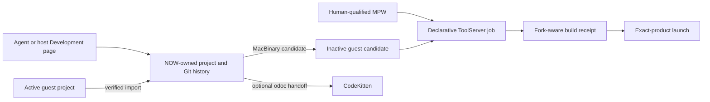

# Projects and Development

Development is a headless service with human controls, not an IDE embedded in
NOW. The host owns bounded project history and scratch workspaces; the classic
Mac owns its selected project directory and toolchains. CodeKitten is an
optional handoff when a person wants an IDE, never the build authority.

Text equivalent: the host page and agent projection share a NOW-owned project
store. A guest project enters only through verified import. Publication creates
an inactive MacBinary candidate, which a human-qualified MPW toolchain builds
through declarative actions. A fork-aware receipt gates exact-product launch.
CodeKitten may open the project separately for a human.

## Two project homes

A host-home project is authoritative beneath NOW's Application Support
Projects directory. A guest-home project remains authoritative on the classic
Mac; import gives the agent a recoverable host scratch repository for edits
and Git commits. Promotion is a separate compare-and-swap operation against
the imported base digest, so a changed classic tree is preserved rather than
overwritten.

This split lets an agent work on a project whose only original copy was on the
classic Mac without pretending the HFS tree is a POSIX checkout or granting
general host filesystem access.

## Classic files are logical records

Every source file is a data fork, resource fork, Finder type, creator, and
flags. The project digest covers all of them. NOW's Git representation keeps
ordinary data forks at their normal paths and writes a private `.now-classic`
recovery tree containing MacBinary packages and an index. Candidate transport
also uses MacBinary. This is why iterative text editing and normal Git history
do not erase the metadata MPW and Finder require.

## Jobs and receipts

`Project.ckp` contains a closed action vocabulary rather than shell or MPW
command strings. One asynchronous job owns ToolServer at a time. A terminal
build receipt binds the project or candidate, source digest, qualified
toolchain, action results, transcript, and exact product identity. Run
re-measures that identity and separately matches the launched process.

Build, test, run, and human IDE handoff are different outcomes. Test has no
typed operation or receipt yet. CodeKitten launch and `odoc` dispatch do not
yet prove document acceptance.

## Agent integration and settlement

`now_projects`, `now_development_environment`, and `now_development` project
the same services used by the host UI. The PowerBook acceptance proved that
this path can carry classic identity through a complete MPW build and launch.
It also exposed the remaining autonomous-loop boundary: a semantic snapshot
was published from `MirrorStateEngineRegistry`, while act resolution read
`NOWMirrorSource.scene` and found no scene. A human could dismiss the verified
dialog; the agent could not rely on the object it had just observed.

The next hardening slice therefore treats state settlement as a cross-surface
contract, not a retry convention. Read, wait, act, and terminal receipts must
share one machine/session epoch and one published scene authority. Transport
health and host/companion compatibility must be diagnosed before domain
operations, and operation-specific schemas must reject impossible argument
combinations before dispatch.

CodeKitten contains useful pure-C lifecycle, journal, arbitration, and corpse
recovery concepts. NOW already has a richer Mirror operation journal. There is
no shared neutral module today, and the two repositories' project fixtures have
drifted. Reuse should begin with cross-repository conformance fixtures and a
small neutral operation vocabulary; copying an IDE command lifecycle into
desktop observation would not fix the scene-authority split.

See the [detailed engineering record](../../development.md), the
[metal handoff](../../plans/2026-08-10-030-handoff.md), and the
[hardening plan](../../plans/2026-08-10-031-feat-development-agent-loop-hardening-plan.md).
