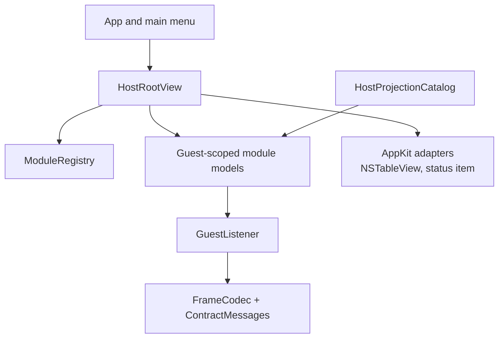

# macOS host architecture

The host is a Swift application using SwiftUI for composition and AppKit where native behavior requires it. `ModuleRegistry.standard` is the module inventory. `HostRootView` renders navigation, while feature models and views own their state.

`GuestListener` owns the listening socket, frame decoding, session lifecycle, and active-guest routing. Guest-scoped models either retain state per guest or explicitly discard it when the driven guest changes. A request-shaped action never silently targets every connected machine.

## Ownership map

Text equivalent: the app shell owns menus and root composition; the registry owns module identity; models own feature state and use the listener; the listener uses the codec and contract types. AppKit adapters provide native behaviors. Agent projections call the same models rather than bypassing them.

Prefer native controls over replicas. In particular, the Files table remains AppKit-backed because it must participate in native drag and file-promise behavior.

