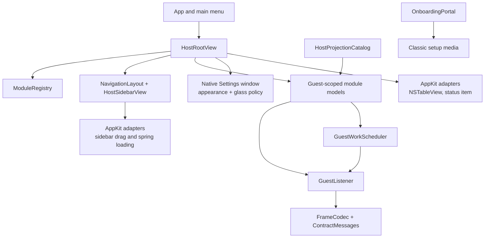

<!-- now-doc-provenance: generated reviewed=false -->

# macOS host architecture

The host is a Swift application using SwiftUI for composition and AppKit where native behavior requires it. `ModuleRegistry.standard` is the immutable module inventory. `NavigationLayout` stores only stable module and shelf identities; `HostRootView` routes the resulting selection while feature models and views continue to own their state.

`GuestListener` owns the listening socket, frame decoding, session lifecycle, and active-guest routing. Guest-scoped models either retain state per guest or explicitly discard it when the driven guest changes. A request-shaped action never silently targets every connected machine.

`GuestWorkScheduler` is the session-wide admission point for guest requests.
Human work is FIFO and is selected before already queued ambient work at the
next safe boundary; it does not preempt a traversal already running on the
cooperative classic guest. Automatic Finder, diagnostics, and paging work is
bounded so the queue cannot grow without limit.

## Ownership map

Text equivalent: the app shell owns menus, root composition, the serializable navigation layout, and the native Settings window; the registry owns stable module identity. Models own feature state and admit guest work through the scheduler before using the listener; the listener uses the codec and contract types. AppKit adapters provide native drag, tables, and status-item behavior. Agent projections call the same models rather than bypassing them. The onboarding portal separately creates classic setup media and joins this architecture only when the installed guest performs the normal hello.

## Navigation ownership

Shelves are shell composition, not feature modules. `NavigationLayout` is a
versioned total partition of the live registry: every registered leaf appears
exactly once in the upper sidebar, lower sidebar, or drawer. It stores stable
IDs and user-shelf metadata, while labels, summaries, drawer counts, and the
Network connection indicator are derived presentation.

The default machine shelf has an Overview hero plus `census`, `software`,
`processes`, and `diagnostics`. Screen contains `screen` and `mirror`; Files
contains `files` and `icloud`. The lower Network shelf uses `settings` as its
Connections hero, followed by `networking`, `mcp`, and `web`; `web` keeps its
wire and preference identity while presenting the title **Web Proxy**. Console
and Logs are lower standalone modules. There is no registered `continuity`
descriptor in this revision, so the Screen shelf does not manufacture one.

The sidebar renders one row per shelf, not one row per shelf member.
`NavigationShelfTab` derives the stable tabs for that shelf, and
`ShelfDetailView` renders them as a centered pill strip above the existing
module view. The synthetic machine Overview remains window-local; every other
pill retains its real module ID. The lower Network shelf, Console, and Logs are
collected in the sidebar's compact pinned utility area, immediately above the
labeled drawer. The primary destinations use SwiftUI's native sidebar `List`;
the shell does not recreate list scrolling or row layout.

`NavigationLayoutStore` migrates the earlier flat order and sanitizes stored
layouts against the current registry. The machine and Network shelves remain
structurally present; the machine shelf cannot enter the drawer, while Network
can and carries its status indicator there. User shelves decompose at one
module. New registry leaves are adopted into their known family or appended as
a standalone upper item.

`SidebarNativeDragSurface` is the AppKit drag surface used from SwiftUI,
including on the detail-pane pills so a shelf member can still be reordered or
extracted. Ordinary dragging produces pure commands through
`NavigationDragCoordinator`; hover and spring-loading provide feedback,
including the double flash, but mutation occurs only on drop. The AppKit bridge
snapshots the rendered row or pill for its drag image instead of substituting a
generic label. Feature entry points remain unchanged: navigation routes the
registered leaf into the existing module view rather than wrapping feature
ownership in the shelf.

## Disconnection and appearance

`ModuleAvailabilityPresentation` derives one shell treatment from the module
ID and connection status. Host-owned modules stay local, retained machine
state may receive an offline banner, and live-only modules receive a recovery
surface. The policy does not clear caches or change selection; module models
retain ownership of their data and reconnection rebinds the same destination.

Application appearance is not a registry module. The AppKit application
delegate owns one `SettingsWindowController`, opened by Command-,. Its
`AppearancePreferences` applies System, Light, or Dark immediately and stores
the three-detent Off, Clear, or Regular glass choice. `GlassStyle` centralizes
the macOS 26+ Liquid Glass path and uses material on macOS 13–25 or when Reduce
Transparency or Increase Contrast requires it.

Prefer native controls over replicas. In particular, the Files table remains AppKit-backed because it must participate in native drag and file-promise behavior.

See [Onboarding and setup media](onboarding.md) for the bootstrap path. It is
deliberately not part of the NOW wire contract.
