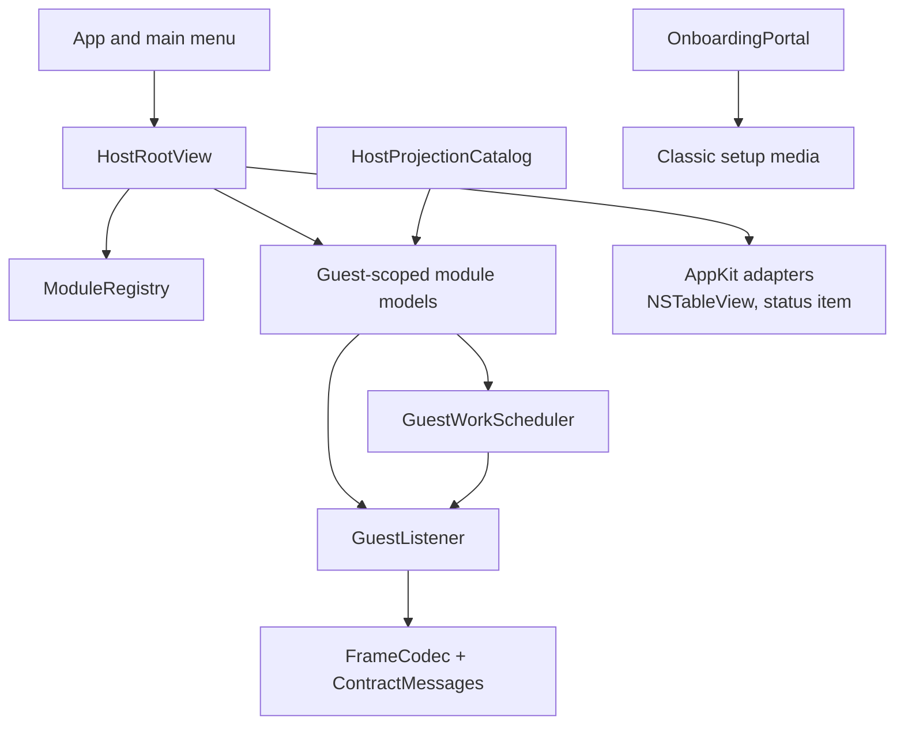

<!-- now-doc-provenance: generated reviewed=false -->

# macOS host architecture

The host is a Swift application using SwiftUI for composition and AppKit where native behavior requires it. `ModuleRegistry.standard` is the module inventory. `HostRootView` renders navigation, while feature models and views own their state.

`GuestListener` owns the listening socket, frame decoding, session lifecycle, and active-guest routing. Guest-scoped models either retain state per guest or explicitly discard it when the driven guest changes. A request-shaped action never silently targets every connected machine.

`GuestWorkScheduler` is the session-wide admission point for guest requests.
Human work is FIFO and is selected before already queued ambient work at the
next safe boundary; it does not preempt a traversal already running on the
cooperative classic guest. Automatic Finder, diagnostics, and paging work is
bounded so the queue cannot grow without limit.

## Ownership map

Text equivalent: the app shell owns menus and root composition; the registry owns module identity; models own feature state and admit guest work through the scheduler before using the listener; the listener uses the codec and contract types. AppKit adapters provide native behaviors. Agent projections call the same models rather than bypassing them. The onboarding portal separately creates classic setup media and joins this architecture only when the installed guest performs the normal hello.

Prefer native controls over replicas. In particular, the Files table remains AppKit-backed because it must participate in native drag and file-promise behavior.

See [Onboarding and setup media](onboarding.md) for the bootstrap path. It is
deliberately not part of the NOW wire contract.
