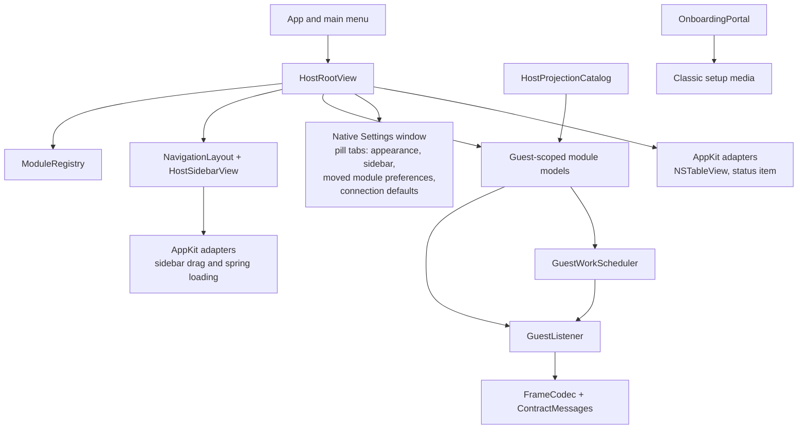

<!-- now-doc-provenance: generated reviewed=false -->

# macOS host architecture

The host is a Swift application using SwiftUI for composition and AppKit where native behavior requires it. `ModuleRegistry.standard` is the immutable module inventory. `NavigationLayout` stores only stable module and shelf identities; `HostRootView` routes the resulting selection while feature models and views continue to own their state.

`GuestListener` owns the listening socket, frame decoding, session lifecycle, and active-guest routing. Guest-scoped models either retain state per guest or explicitly discard it when the driven guest changes. A request-shaped action never silently targets every connected machine.

`GuestWorkScheduler` is the session-wide admission point for guest requests.
Human work is FIFO and is selected before already queued ambient work at the
next safe boundary; it does not preempt a traversal already running on the
cooperative classic guest. Automatic Finder, diagnostics, and paging work is
bounded so the queue cannot grow without limit.

## Ownership map

Text equivalent: the app shell owns menus, root composition, the serializable navigation layout, and the native Settings window; the registry owns stable module identity. Models own feature state and admit guest work through the scheduler before using the listener; the listener uses the codec and contract types. AppKit adapters provide native drag, tables, and status-item behavior. Agent projections call the same models rather than bypassing them. The onboarding portal separately creates classic setup media and joins this architecture only when the installed guest performs the normal hello.

## Navigation ownership

Shelves are shell composition, not feature modules. `NavigationLayout` is a
versioned total partition of the live registry: every registered leaf appears
exactly once in the upper sidebar, lower sidebar, or drawer. It stores stable
IDs and user-shelf metadata, while labels, summaries, drawer counts, and the
Connections status indicator are derived presentation.

The default machine shelf has an Overview hero plus `census`, `software`,
`processes`, and `diagnostics`. Screen contains `screen` and `mirror`; Files
contains `files` and `icloud`. The main Connections shelf (internally
`shelf.network`) uses `settings` as its hero, followed by `networking`, `mcp`,
and `web`; `web` keeps its wire and preference identity while presenting the
title **Web Proxy**. The default lower stack is the Debug shelf (`console`,
`logs`) followed by Connections as the bottommost row. There is no
registered `continuity` descriptor in this revision, so the Screen shelf does
not manufacture one.

The window uses AppKit's unified full-size toolbar. Guest selection and the
compact-sidebar control live there instead of in a simulated sidebar header;
macOS 26.1 and newer keep the guest selector visible ahead of lower-priority
toolbar content, while the same selector remains a normal toolbar item on the
macOS 13 fallback. The sidebar renders one row per shelf, not one row per shelf member.
`NavigationShelfTab` derives the stable tabs for that shelf, and
`ShelfDetailView` renders them as a centered pill strip above the existing
module view. The synthetic machine Overview remains window-local; every other
pill retains its real module ID. Debug and Connections occupy the lower stack inside the same sidebar
canvas, while the upper stack grows downward. The labeled drawer alone uses
the separate footer. Full rows list shelf member titles while loose modules
retain their registry summaries. The primary destinations use SwiftUI's native sidebar `List`;
selected rows use AppKit's active or inactive selection colors, and the shell
does not recreate list scrolling or row layout.

`NavigationLayoutStore` migrates the earlier flat order and sanitizes stored
layouts against the current registry. Version 2 moves an existing Connections
shelf into the new lower stack. Version 3 groups loose Console and Logs rows
as Debug and moves Connections to the bottom when it already occupies that
stack; shelves deliberately moved elsewhere remain there.
The machine and Connections shelves remain structurally present; the machine
shelf cannot enter the lower stack or drawer, while Connections can and carries its status
indicator there. User shelves decompose at one module. New registry leaves are
adopted into their known family or appended as a standalone upper item.

`SidebarNativeDragSurface` is the AppKit drag surface used from SwiftUI,
including on the detail-pane pills so a shelf member can still be reordered or
extracted. Ordinary dragging produces pure commands through
`NavigationDragCoordinator`. Accepted insertion targets derive a transient
`NavigationDragPreview` from the persisted baseline on every hover update, so
stable sidebar rows and pill tabs animate around the dragged item without
accumulating index drift. The preview never writes preferences: a completed
drop commits the command, while the native source's ended callback discards it
after cancellation. Combining two loose modules still waits for release because
forming a shelf during hover would remove the active hit-tested rows. Hover and
spring-loading continue to provide target feedback, including the double flash.
The AppKit bridge
snapshots the rendered row or pill for its drag image instead of substituting a
generic label. Feature entry points remain unchanged: navigation routes the
registered leaf into the existing module view rather than wrapping feature
ownership in the shelf.

The row overlays keep precise reorder and combine targets. A registered native
ancestor of the list owns the remaining canvas, so the scroll view's empty
document area cannot block drops. It resolves the pointer to the
nearest stack: the end of the upper stack or the beginning of the lower stack,
which makes the latter grow upward. A trailing pill insertion target lets a
module move to the end of its shelf as well as before another tab. Combining two
loose modules assigns the
first available **New Shelf** name and `SidebarPreferences` requests one
focused inline rename. Escape restores the exact layout from before that
creation; committing or leaving the field keeps the shelf. `NavigationShelfSessionState` is deliberately
window-local; it remembers the last selected tab per shelf without adding
transient navigation history to the persisted module preference.

## Disconnection and appearance

`ModuleAvailabilityPresentation` derives one shell treatment from the module
ID and connection status. Host-owned modules stay local, retained machine
state may receive an offline banner, and live-only modules receive a recovery
surface. The policy does not clear caches or change selection; module models
retain ownership of their data and reconnection rebinds the same destination.

Settings is not a registry module. The AppKit application delegate owns one
`SettingsWindowController`, opened by Command-, or by a module's own
"Settings…" button. Its `HostSettingsView` is a pill switcher over
`HostSettingsTab`, holding Appearance alongside preferences moved out of
individual modules: Sidebar (row density, icon collapse), MCP and Web
start-automatically, Web compatibility/safety, Logs' disk-write switch, and a
"Defaults for New Connections" tab seeding `MirrorContinuityController`'s
per-machine values for a Mac it has never paired with before
(`ContinuityConnectionDefaults`). A module reaches a specific tab through
`HostModuleContext.showSettings`, threaded through `HostAppState
.settingsPresenter` to `AppDelegate.openSettings(selecting:)`, which
`SettingsWindowController.select(_:)` applies to the one navigation object
the window's pill reads — the same shape `selectModule` already gives a
module for the shelf. `AppearancePreferences` applies System, Light, or Dark
immediately and stores the three-detent Off, Clear, or Regular glass choice.
`GlassStyle` centralizes the macOS 26+ Liquid Glass path and uses material on
macOS 13–25 or when Reduce Transparency or Increase Contrast requires it.
Files and Screenshots keep their own in-module settings panes; Continuity's
and Mirror's per-machine controls stay in-module too — Mirror's
Finder-emulation "Development controls" are deliberately excluded even from
the new connection-defaults tab, since that surface is still evolving.

Prefer native controls over replicas. In particular, the Files table remains AppKit-backed because it must participate in native drag and file-promise behavior.

See [Onboarding and setup media](onboarding.md) for the bootstrap path. It is
deliberately not part of the NOW wire contract.
