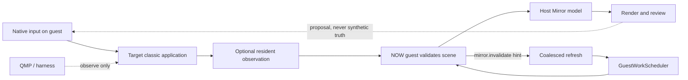

# Mirror architecture

Mirror projects guest-provided scene state into a host rendering and review surface. Its control loop is asymmetric by design: native guest input drives; QMP and capture tools observe. Guest-provided state is the only input permitted to mutate the Mirror model.

Text equivalent: a person acts through native guest input. The resident component may observe the target; the NOW guest validates that state and sends it to the host; the host renders it for review. Invalidation hints coalesce a refresh admitted through the session scheduler. QMP observes the machine but does not become the product input path.

## Admission, refresh, and publication

The session scheduler selects queued human work before queued ambient reads at
the next safe boundary. It cannot interrupt guest work already executing, so
the observable timing brackets distinguish admission wait, guest execution,
settlement, and publication instead of collapsing them into one number.

`mirror.invalidate` is an additive, symmetric hint. It carries the session,
overall and per-domain generations, source, loss count, and a quality of
`sampled`, `gap`, or `unknown`. Hints coalesce rather than creating one read
per event. Gaps and unknown quality force repair, and cadence polling remains
the fallback when hints are absent. The host publishes only a coherent,
current generation set and refuses stale enrichment.

Any measurement must prove the content plane armed in the stored artifact. An invocation log or an empty capture is not evidence that observation occurred.

The scheduler, invalidation, and generation behavior is tested locally. The
2,000 ms ambient-wait target on the PowerBook 1400c is not metal-verified.
