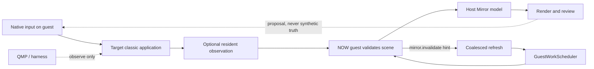

# Mirror architecture

Mirror projects guest-provided scene state into a host rendering and review surface. Its control loop is asymmetric by design: native guest input drives; QMP and capture tools observe. Guest-provided state is the only input permitted to mutate the Mirror model.

Text equivalent: a person acts through native guest input. The resident component may observe the target; the NOW guest validates that state and sends it to the host; the host renders it for review. Invalidation hints coalesce a refresh admitted through the session scheduler. QMP observes the machine but does not become the product input path.

## Admission, refresh, and publication

The session scheduler selects queued human work before queued ambient reads at
the next safe boundary. It cannot interrupt guest work already executing, so
the observable timing brackets distinguish admission wait, guest execution,
settlement, and publication instead of collapsing them into one number.

`mirror.invalidate` is an additive, symmetric hint. It carries the session,
overall and per-domain generations, source, loss count, and a quality of
`sampled`, `gap`, or `unknown`. Hints coalesce rather than creating one read
per event. Gaps and unknown quality force repair, and cadence polling remains
the fallback when hints are absent. The host publishes only a coherent,
current generation set and refuses stale enrichment.

Any measurement must prove the content plane armed in the stored artifact. An invocation log or an empty capture is not evidence that observation occurred.

## Visual truth and profiles

Mirror remains a semantic renderer; an emulator framebuffer is the visual
oracle, not an alternative model. `mirror-render` exposes the production
`RenderShot` path for evidence tooling, and `tools/mirror-oracle` compares that
output with SheepShaver or QEMU pixels by named regions. It never promotes a
whole-screen similarity score into a fidelity claim.

Visual versioning is explicit at the tooling boundary. The initial
`platinum.macos-8.6.default` profile records system, theme, screen/depth,
calibration source, and asset policy. It does not claim that Mac OS 8.6 and 9.1
are identical. A later 9.1, localized, alternate-theme, or 68K profile must
name its own evidence-backed deltas. The host already knows the connected
guest's system version; profile selection can move into runtime policy after
the first corpus establishes which deltas actually matter.

The first measured procedure is the Mac OS 8.6 Finder menu bar. Its 20-row
bezel, asymmetric cap pixels, lower bevel, application divider and title
baseline live in `PlatinumMenuBar`; Apple and Finder-owned bitmap marks stay in
the external versioned asset pack. A profile-declared derivation copies those
crops from an attributed native framebuffer without adding guest pixels to the
semantic wire protocol or repository. With the OS 8.6 font/icon pack and those
two chrome crops, the current reference-only comparison differs in 35 of
13,500 unmasked menu pixels, all within Charcoal “View”. The remaining bearing
delta is kept visible: a trial use of FOND fractional family widths worsened
other already-exact titles and was rejected. The extractor preserves that
table as data, but the renderer does not globally enable an unproven spacing
mode.

The same profile now declares its `Mac OS Default` desktop tile explicitly.
Pack derivation promotes that declaration only after every RGB pixel in the
profile's unobscured proof regions equals the origin-zero tiled asset; a
one-pixel mismatch refuses the derived pack. The current color-correct native
capture proves 69,160 of 69,160 background pixels. Mirror resolves a guest
naming that pattern through the manifest to the sanitized `desktop.png` asset
and records machine provenance. This is a bounded background proof, not an
accepted Finder-desktop scene—the capture still contains a transfer window and
desktop items absent from the semantic calibration scene.

The scheduler, invalidation, and generation behavior is tested locally. The
2,000 ms ambient-wait target on the PowerBook 1400c is not metal-verified.
