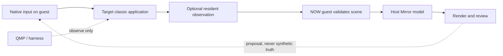

# Mirror architecture

Mirror projects guest-provided scene state into a host rendering and review surface. Its control loop is asymmetric by design: native guest input drives; QMP and capture tools observe. Guest-provided state is the only input permitted to mutate the Mirror model.

Text equivalent: a person acts through native guest input. The resident component may observe the target; the NOW guest validates that state and sends it to the host; the host renders it for review. QMP observes the machine but does not become the product input path.

Any measurement must prove the content plane armed in the stored artifact. An invocation log or an empty capture is not evidence that observation occurred.

