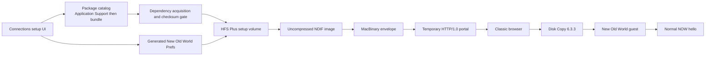

# Onboarding and setup media

Onboarding is a host-owned bootstrap path that ends at the normal NOW wire; it
is not a second application protocol. The Connections UI chooses packages and
network settings, the builder produces classic-compatible media, and a narrow
temporary HTTP server makes that media reachable to old browsers.

Text equivalent: the setup UI resolves packages from the user store before
the app bundle, generates preferences, and passes accepted assets through the
HFS Plus, NDIF, and MacBinary builders. The temporary HTTP portal serves the
result to a classic browser; Disk Copy mounts it, and the installed guest uses
the ordinary NOW connection handshake.

## Contracts and boundaries

- The portal accepts GET and HEAD on fixed `/now` setup routes. It has no
  upload, listing, or general file-server surface.
- The browser-facing page and response framing remain HTTP/1.0 compatible.
- `New Old World Prefs` uses the classic guest's existing binary preference
  format and byte order; the onboarding code does not invent a second config
  schema.
- The volume is tight HFS Plus inside an uncompressed NDIF image, optionally
  wrapped in MacBinary so transport can preserve its classic metadata.
- User Application Support packages override bundled packages. Known acquired
  dependencies are accepted only after their recorded checksum matches.
- CarbonLib is not stored in this repository or its GitHub releases. Public
  instructions point to Macintosh Repository, while any combined
  binaries-plus-CarbonLib package remains separately hosted and must publish
  its exact URL, contents, and checksum. Archive extraction may use a local
  `unar` prerequisite when the source format requires it.

## Verification boundary

Unit tests cover routes, asset precedence, preferences, dependency checks,
MacBinary, NDIF, and image construction. The setup image has mounted in a Mac
OS 9.1 QEMU guest. Classic-browser download, automatic decoding, and the first
hello from physical hardware remain unverified and must be stated that way.
