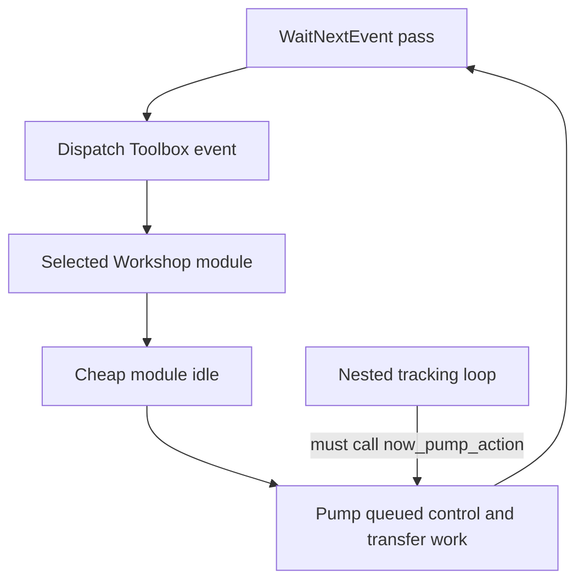

# PowerPC guest architecture

The reference guest is C compiled with Retro68's retrocarbon environment for CarbonLib 1.6 on Mac OS 8.6–9.2.2. It uses a cooperative `WaitNextEvent` loop. Network progress therefore depends on returning to, or explicitly pumping, that loop.

The application has one window: the Workshop. Every feature page implements `WorkshopModuleOps`; modules create controls lazily, own their child identities, and do nearly free work in `idle`. Read `docs/guest-ui-start-here.md` before UI changes: UPP construction, nested Toolbox loops, and redraw ownership are runtime constraints, not style preferences.

The guest has two faces. Its Workshop/console and its wire dispatch must reach one implementation. `CommandParityTests` guards the inventory and records deliberate asymmetries.

## Cooperative scheduling

Text equivalent: each event-loop pass dispatches UI work, lets the active module perform bounded idle work, and advances the wire. Any nested control-tracking loop must also pump the wire or the classic Mac appears disconnected while the user is interacting.
