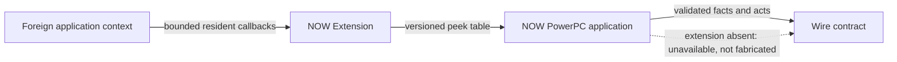

# Resident components

The NOW Extension performs only work that must run in a foreign application context. The PowerPC application is the sole reader of foreign memory and exposes the result to the rest of the product. The extension is optional: the application must report an unavailable plane honestly and keep non-resident features usable.

Text equivalent: resident callbacks observe or act in the foreign application, write a versioned shared table, and the NOW application validates and reads it before publishing results. Without the extension, the application reports unavailability rather than emulating resident state.

`contract/peek_table.h` is compiled by every reader and writer, with layout assertions. A change to `ext/` or that header requires an exact-source bake receipt before landing on `main`; a written deferral may permit a checkpoint but never the landing.

