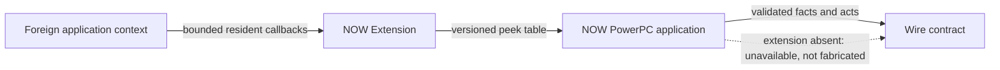

# Resident components

The NOW Extension performs only work that must run in a foreign application context. The PowerPC application is the sole reader of foreign memory and exposes the result to the rest of the product. The extension is optional: the application must report an unavailable plane honestly and keep non-resident features usable.

The public [Extension feature coverage
matrix](../../user-guide/explanation/optional-extension.md#feature-coverage)
starts with user outcomes. This page owns the deeper P0–P8 execution, memory,
shared-header, bake, and recovery contracts.

Text equivalent: resident callbacks observe or act in the foreign application, write a versioned shared table, and the NOW application validates and reads it before publishing results. Without the extension, the application reports unavailability rather than emulating resident state.

`contract/peek_table.h` is compiled by every reader and writer, with layout assertions. A change to `ext/` or that header requires an exact-source bake receipt before landing on `main`; a written deferral may permit a checkpoint but never the landing.

<!-- derived-doc v1
sources: contract/peek_table.h ext/src/now_ext.c now-guest-ppc/src/peek/peek.c docs/resident-components.md scripts/docs-source-group tools/docs-gate
sources-sha1: 26082812f53cc4619214a9251fa3b6be3996d62b
derive resident-contract sha256=e423b6ffb62efdc0b3f336dd334c3df87437691f7d41ddb8e81d8536e9cd15fa lines=11
    scripts/docs-source-group resident
rederived: pending
rederived: 2026-08-09T16:22:14-0400 9034e3eb sources, resident-contract 11->11
rederived: 2026-08-09T16:29:42-0400 9034e3eb sources
rederived: 2026-08-09T17:05:28-0400 446cf620 sources
rederived: 2026-08-09T17:08:03-0400 446cf620 sources
rederived: 2026-08-09T17:53:28-0400 ed9436c0 sources
rederived: 2026-08-09T18:53:51-0400 181db7a5 sources
rederived: 2026-08-09T18:56:22-0400 181db7a5 unchanged
-->
