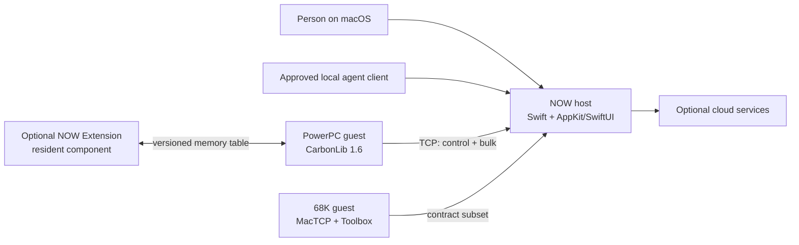

# System context

The classic Mac initiates one TCP connection to the native macOS host. Control JSON and bulk bytes share that connection through a small binary frame header. The host can accept several guests, but drives one selected guest at a time.

Text equivalent: a person and an approved local agent act through the host. Either guest dials the host over the same contract. Only the PowerPC application can consume the optional extension's in-memory table. Cloud services are host-owned and optional.

## Ownership rules

The host owns listening, guest selection, modern file and cloud integration, and agent policy. Each guest owns the facts and actions on its own classic Mac. The resident component owns only the foreign-context work that cannot safely occur in the application; it is always optional.

No component may infer consent from absence. The guest's hello describes its agent tier, and the host enforces it at the projection boundary.

