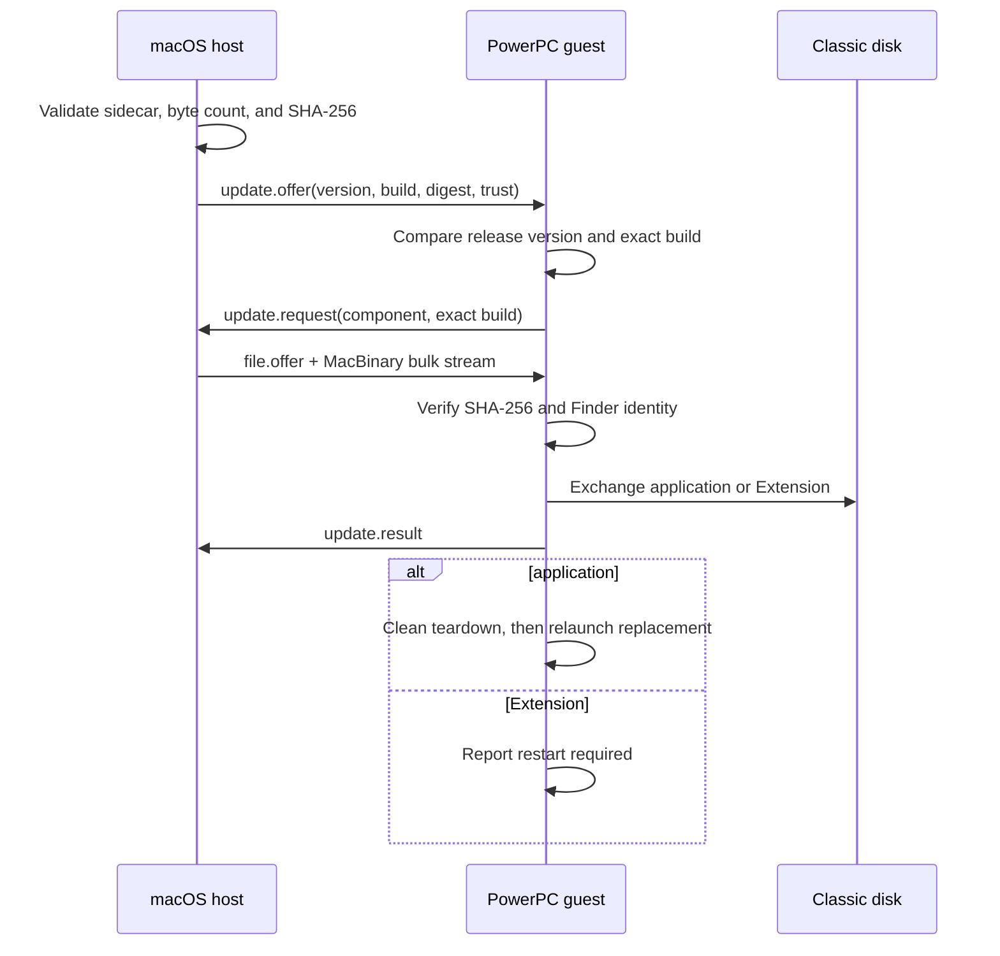

# Host-owned updates

The modern host is the only update provider. The guest never searches the
internet, chooses a channel, or accepts a host-selected replacement without a
request. Publication and installation are separate decisions.

Text equivalent: the host validates its catalog before sending an offer; the
guest compares exact identity and requests one build; the host transfers that
MacBinary through the existing file lane; the guest verifies the stream and
Finder identity before exchanging files. It then reports the outcome and
either tears down and relaunches the application or tells the person that the
Extension will become active only after restart.

## Publication unit

`tools/write-update-manifest.py` writes an adjacent
`.now-update.json` sidecar for each canonical MacBinary. It contains the
component, release version, exact build identity, byte count, SHA-256, channel,
and signature state. A loose artifact without a valid sidecar may still serve
onboarding, but `UpdateProvider` will not advertise it. The provider reads the
normal onboarding catalog, then recomputes byte count and SHA-256 before every
catalog snapshot becomes an offer.

`contract/product_version.h` owns the host/PPC application-family release
version. The classic `vers` resource, Swift identity, Xcode marketing version,
and fallback host `Info.plist` remain checked copies because their build systems
cannot all consume the same C macro. Application build identity is the guest
source hash. The Extension continues to use `contract/resident_version.h` plus
its generated resident fingerprint. NOW-68K retains its separate experimental
deployment version.

The wire has a third identity: `info.x-contract-revision` in AsyncAPI, shared
through `contract/wire_limits.h`. It gates compatibility during `hello` and is
not a product or Extension release number. AsyncAPI's own `info.version`
versions the contract document; it may happen to equal a product release but no
gate treats that equality as an invariant.

Release version answers product ordering and display. Build identity answers
which bytes. A host scratch build with the same version and a different source
hash is therefore a real offer rather than “already current.” An older host
artifact is identified as older and cannot arm Install; a version difference is
not permission to downgrade.

`tools/product-version-gate` enforces the release boundary. Branch commits may
keep a semantic version while producing distinct scratch hashes. Any update to
the host or PPC product surface that moves `refs/heads/main` must advance the
three-part product version, and the candidate's header, Finder resource, Swift
identity, Xcode setting and fallback bundle plist must all agree. The
`reference-transaction` hook covers merge commits, fast-forwards,
`git fetch . branch:main`, and forced local ref moves. Extension source follows
the parallel two-part resident-version and shared-bake gate instead.

## Transfer and install

The guest requests the exact offered build. The host serves it through the
existing `file.offer` and bulk lane with an update purpose and SHA-256. Update
receives cannot resume, cannot choose an arbitrary destination, and must match
the pending component, request id, exact offer, byte count, and digest.

The SHA-256 covers the raw MacBinary stream. After the existing receiver has
decoded and committed the classic file, the installer also checks Finder
identity: `APPL/NOWo` for the application and `INIT/NOWx` for the Extension.

- The application uses `FSpExchangeFiles` against the running canonical file.
  The replacement takes the canonical place while the previous bytes remain at
  the staging name. The main loop exits normally, closes logging, and only then
  asks Process Manager to launch the canonical application.
- The Extension is exchanged with the installed resident or renamed into its
  canonical place. The retained old file is changed away from Finder type
  `INIT`, so two residents cannot load at the next boot. Activation is never
  claimed until the person restarts the classic Mac.

The guest compares the active table's resident major/minor with the version it
compiled against and warns when they differ. Capability bits, not version, still
govern which resident planes the application may use.

## Trust boundary

SHA-256 is integrity, not signing. Every generated manifest currently says
`signed: false`; the guest labels the offer unsigned and requires local modal
confirmation in Connections. The shared console/wire command can inspect these
offers but cannot start an unsigned install, so a remote command cannot spend
the person's consent. A future release-signing design needs a pinned trust root,
key rotation and recovery policy before that flag can become true.

The underlying classic wire remains plaintext and unauthenticated. Artifact
signing will authenticate release bytes, not make the transport safe for an
untrusted network.

## Verification boundary

Native tests cover SHA-256, exact-build comparison, trust labels, provider
validation, contract round trips, and critical source ordering. Guest
cross-builds prove the Carbon and Toolbox APIs compile. Emulator acceptance
must still prove exchange, clean relaunch, Extension replacement, restart
activation, and rollback. Only physical hardware can make the result
metal-verified.
