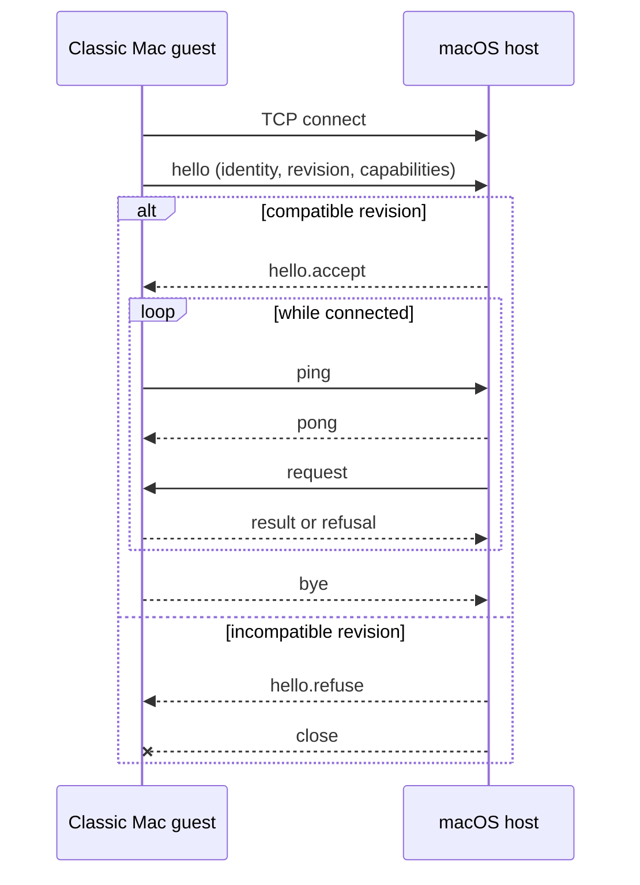
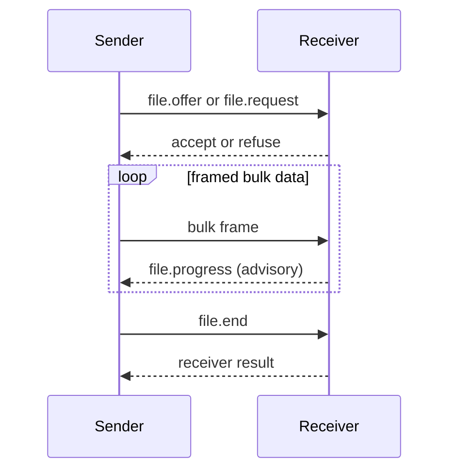
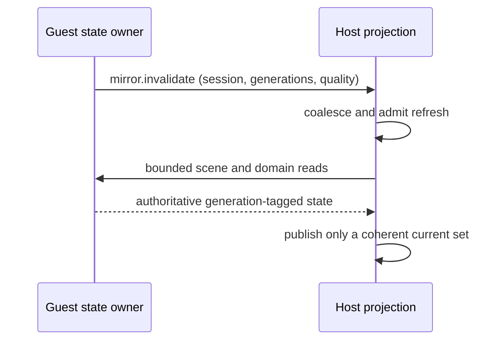

<!-- now-doc-provenance: generated reviewed=false -->

# Wire contract

`contract/asyncapi.yaml` is the normative source for messages, required fields, connection rules, and the command registry. [The generated page](../../generated/asyncapi.md) is a projection for reading; edit the YAML, not the projection.

## Connection sequence

Text equivalent: the guest dials, identifies itself and its contract revision, and waits for acceptance. Only then may either side exchange application messages. Heartbeats keep the session observable. A graceful side sends `bye`; incompatible revisions are refused before normal traffic.

## Frame and lane rules

An eight-byte header identifies channel, flags, transfer, and payload length. JSON control frames and raw bulk frames are multiplexed. Control words queue and retry; bulk data is recoverable and may be abandoned only at a frame boundary. One transfer owns the bulk lane at a time.

## File transfer

Text equivalent: the initiator proposes one transfer, the receiver accepts or refuses, bulk frames follow, and only receiver-originated progress proves bytes arrived. Completion is receiver-owned; a sender's socket acceptance is not delivery evidence.

## Compatibility rule

Fields are additive unless a revision explicitly changes meaning. Unknown enum values are not consent. Every local `$ref` must resolve, every behavior change begins in the contract, and both receiving directions must retain the same meaning.

## Mirror invalidation

`mirror.invalidate` is an optional symmetric notification, not a command and
not authoritative state. It identifies one session and the newest known
overall and per-domain generations, with quality and loss information. The
receiver coalesces refresh work, repairs `gap` or `unknown` quality, and keeps
cadence polling as the fallback. A hint can make a read happen sooner; only a
coherent reread can publish the new state.

Text equivalent: the guest hints that one or more generations changed; the
host coalesces and schedules bounded reads, receives authoritative tagged
state, and publishes only when the generation set is coherent and current.

<!-- derived-doc v1
sources: contract/asyncapi.yaml now-host/Sources/Host/FrameCodec.swift now-host/Sources/Host/ContractMessages.swift now-guest-ppc/src/core/wire.c now-guest-68k/src/core/wire68.c scripts/docs-source-group tools/docs-gate
sources-sha1: e85786458902ea46c155f6a93f998942a29c2bfb
sources-sha1: e85786458902ea46c155f6a93f998942a29c2bfb
sources-sha1: e85786458902ea46c155f6a93f998942a29c2bfb
sources-sha1: e85786458902ea46c155f6a93f998942a29c2bfb
derive contract-summary sha256=8f6f7fd03ea8af70207e29b42fafeee48c4c5b823cc760563374216d5eb10b18 lines=6
    scripts/docs-source-group contract
rederived: pending
rederived: 2026-08-09T16:22:14-0400 9034e3eb sources, contract-summary 6->6
rederived: 2026-08-09T16:29:42-0400 9034e3eb sources
rederived: 2026-08-09T17:05:28-0400 446cf620 sources
rederived: 2026-08-09T17:08:04-0400 446cf620 sources
rederived: 2026-08-09T17:53:28-0400 ed9436c0 sources
rederived: 2026-08-09T18:53:51-0400 181db7a5 sources
rederived: 2026-08-09T18:56:22-0400 181db7a5 unchanged
rederived: 2026-08-09T19:21:55-0400 dc5bfcd2 sources
rederived: 2026-08-09T19:33:55-0400 c854246d sources
rederived: 2026-08-09T20:56:35-0400 9864da82 sources, contract-summary 6->6
rederived: 2026-08-09T21:05:27-0400 9864da82 sources
rederived: 2026-08-09T21:43:46-0400 2b3c2c0e sources
rederived: 2026-08-09T22:09:30-0400 d54812c2 sources
rederived: 2026-08-09T22:18:48-0400 e637efd3 sources
rederived: 2026-08-10T03:07:04-0400 9cbb4c28 sources, contract-summary 6->6
rederived: 2026-08-10T03:08:46-0400 9cbb4c28 unchanged
rederived: 2026-08-10T03:11:42-0400 9cbb4c28 sources
rederived: 2026-08-10T03:46:36-0400 68d74d72 sources
rederived: 2026-08-10T02:53:59-0400 62603174 sources, contract-summary 6->6
rederived: 2026-08-10T04:18:14-0400 423ef214 sources, contract-summary 6->6
rederived: 2026-08-10T04:49:22-0400 cd585106 sources
rederived: 2026-08-10T04:27:16-0400 886ee556 sources, contract-summary 6->6
rederived: 2026-08-10T04:38:54-0400 886ee556 unchanged
rederived: 2026-08-10T05:38:07-0400 a0ede9ec unchanged
rederived: 2026-08-10T13:37:38-0400 2f62ec11 sources, contract-summary 6->6
rederived: 2026-08-10T13:51:46-0400 f4a92045 sources
rederived: 2026-08-10T14:07:44-0400 b22898ee sources
rederived: 2026-08-10T13:10:56-0400 47bf54fb sources
rederived: 2026-08-10T13:36:45-0400 b15b4827 unchanged
rederived: 2026-08-10T14:49:44-0400 4ea2d97d unchanged
rederived: 2026-08-10T14:20:13-0400 9e432b8b sources
rederived: 2026-08-10T15:11:51-0400 eb9d991c unchanged
rederived: 2026-08-10T15:34:28-0400 72868e9e unchanged
rederived: 2026-08-10T15:52:47-0400 77329146 unchanged
rederived: 2026-08-10T16:52:02-0400 d77cc444 unchanged
rederived: 2026-08-10T20:03:21-0400 d3e26c39 sources
rederived: 2026-08-10T20:22:52-0400 818c1577 unchanged
rederived: 2026-08-10T21:35:35-0400 a79833e9 unchanged
rederived: 2026-08-10T22:32:23-0400 e9bf9632 unchanged
rederived: 2026-08-10T22:33:05-0400 e9bf9632 sources
rederived: 2026-08-10T22:47:48-0400 431e7308 unchanged
rederived: 2026-08-11T00:25:05-0400 bbab04b9 unchanged
rederived: 2026-08-11T00:33:21-0400 4b24cc1f unchanged
rederived: 2026-08-11T19:45:15-0400 065da692 sources
rederived: 2026-08-11T20:08:53-0400 852b41ae sources
rederived: 2026-08-11T20:43:59-0400 5c07bcd6 sources
rederived: 2026-08-11T20:54:11-0400 f9ceab81 sources
rederived: 2026-08-11T21:13:10-0400 098805ff sources
rederived: 2026-08-11T21:20:50-0400 15514cc9 unchanged
rederived: 2026-08-11T21:26:22-0400 7bfb617b unchanged
rederived: 2026-08-11T21:32:38-0400 57a081ab unchanged
rederived: 2026-08-11T21:39:37-0400 5a82bf82 unchanged
rederived: 2026-08-11T21:49:34-0400 7dc5b09d unchanged
rederived: 2026-08-11T21:54:55-0400 8c482312 unchanged
rederived: 2026-08-11T21:59:53-0400 562b4b50 unchanged
rederived: 2026-08-11T22:06:34-0400 65f52bf3 unchanged
rederived: 2026-08-11T22:10:48-0400 3df65dde unchanged
rederived: 2026-08-11T22:15:20-0400 68853632 unchanged
rederived: 2026-08-11T22:31:03-0400 a16b6a61 unchanged
rederived: 2026-08-11T22:41:39-0400 e1fc84c4 unchanged
rederived: 2026-08-11T22:47:33-0400 9776cf7a unchanged
rederived: 2026-08-11T23:12:01-0400 ddf740ce sources
rederived: 2026-08-11T23:31:21-0400 ad4d680 sources
rederived: 2026-08-11T23:37:11-0400 ad4d680 unchanged
rederived: 2026-08-12T13:02:41-0400 7cea759e sources, contract-summary 6->6
rederived: 2026-08-12T13:11:34-0400 7cea759e unchanged
rederived: 2026-08-12T13:12:13-0400 7cea759e unchanged
rederived: 2026-08-12T15:54:08-0400 939e43b7 sources
rederived: 2026-08-12T17:19:19-0400 338eca21 sources
rederived: 2026-08-12T18:34:28-0400 3688b9f6 unchanged
rederived: 2026-08-12T18:58:27-0400 3771e144 sources
rederived: 2026-08-12T19:15:23-0400 3771e144 unchanged
rederived: 2026-08-12T19:31:57-0400 3771e144 unchanged
rederived: 2026-08-12T20:08:32-0400 5a601a18 sources
rederived: 2026-08-12T20:15:21-0400 9e828cdc unchanged
rederived: 2026-08-12T20:34:41-0400 4d9ba67d sources
rederived: 2026-08-12T20:37:07-0400 633da491 sources, contract-summary 6->6
rederived: 2026-08-12T20:45:45-0400 a0878023 sources
rederived: 2026-08-12T22:18:36-0400 18d0d3c4 sources
rederived: 2026-08-12T23:59:06-0400 e5b16a71 sources
rederived: 2026-08-13T00:21:45-0400 e5b16a71 sources
rederived: 2026-08-13T00:58:12-0400 9f5139cf sources
rederived: 2026-08-13T01:23:45-0400 9f5139cf sources
rederived: 2026-08-13T01:47:12-0400 59852197 unchanged
rederived: 2026-08-13T02:45:48-0400 e504061c unchanged
rederived: 2026-08-13T04:30:00-0400 47f632b3 sources
rederived: 2026-08-13T13:50:55-0400 a9e64fa4 sources
rederived: 2026-08-13T14:32:32-0400 4da9c4a3 unchanged
rederived: 2026-08-13T15:15:22-0400 2ccde05b unchanged
rederived: 2026-08-13T17:36:05-0400 043777df sources
rederived: 2026-08-13T17:37:43-0400 043777df unchanged
rederived: 2026-08-13T18:23:46-0400 e6d7996d sources
rederived: 2026-08-13T19:30:44-0400 1d154b67 sources
rederived: 2026-08-13T21:59:04-0400 8433efda sources
rederived: 2026-08-13T23:16:01-0400 fc235d4e sources
rederived: 2026-08-14T00:51:50-0400 94f1c614 sources
rederived: 2026-08-14T00:55:47-0400 3bd83df2 sources
rederived: 2026-08-14T02:20:51-0400 81247e50 sources
rederived: 2026-08-14T03:25:52-0400 ee8ef8a4 sources
rederived: 2026-08-14T03:54:48-0400 d016e771 sources
rederived: 2026-08-14T03:57:09-0400 e122c6c3 unchanged
rederived: 2026-08-14T04:03:19-0400 908215de unchanged
rederived: 2026-08-14T04:36:35-0400 e66db808 unchanged
rederived: 2026-08-14T12:32:38-0400 7742eab5 sources
rederived: 2026-08-14T12:35:44-0400 49e6dd98 unchanged
rederived: 2026-08-14T12:44:43-0400 4d52ba1a sources
rederived: 2026-08-14T12:47:23-0400 804be291 sources
rederived: 2026-08-14T12:49:05-0400 655b2bf1 unchanged
rederived: 2026-08-14T13:16:43-0400 90cfd8fa sources
rederived: 2026-08-14T14:27:57-0400 6d037a57 sources
rederived: 2026-08-14T16:58:27-0400 cf962dbb sources, contract-summary 6->6
rederived: 2026-08-14T17:12:28-0400 32ac9165 unchanged
rederived: 2026-08-14T17:36:04-0400 02e9de5e unchanged
rederived: 2026-08-14T18:14:39-0400 db6a7c6a unchanged
rederived: 2026-08-14T18:17:41-0400 d9ed70d2 unchanged
rederived: 2026-08-14T18:19:50-0400 60bb3427 sources, contract-summary 6->0, sources, contract-summary 6->0
rederived: 2026-08-14T15:56:43-0400 835e6acf sources
rederived: 2026-08-14T18:20:41-0400 23dc0759 sources, sources, sources
rederived: 2026-08-14T18:22:07-0400 23dc0759 unchanged
rederived: 2026-08-14T18:23:11-0400 e2c66126 sources, sources, sources, sources
rederived: 2026-08-14T18:30:52-0400 b248c9a1 unchanged
rederived: 2026-08-14T18:31:12-0400 b248c9a1 unchanged
rederived: 2026-08-14T18:31:25-0400 b248c9a1 contract-summary 0->6
rederived: 2026-08-14T20:24:56-0400 6d3d74d7 sources
rederived: 2026-08-14T20:18:49-0400 cccec57a unchanged
rederived: 2026-08-14T21:50:42-0400 edcc526f unchanged
rederived: 2026-08-14T22:27:41-0400 5a6c46dc unchanged
rederived: 2026-08-14T22:10:44-0400 568967b9 unchanged
rederived: 2026-08-14T23:30:11-0400 0017d984 sources
rederived: 2026-08-14T22:14:12-0400 0e743bc5 sources
rederived: 2026-08-14T23:32:09-0400 a9afc153 sources, sources
rederived: 2026-08-14T22:19:01-0400 fe3d18a0 sources
rederived: 2026-08-14T23:33:01-0400 09abc942 sources, sources, sources
rederived: 2026-08-14T22:27:26-0400 67772e4a sources
rederived: 2026-08-14T23:33:52-0400 521b590f sources, sources, sources, sources
-->
