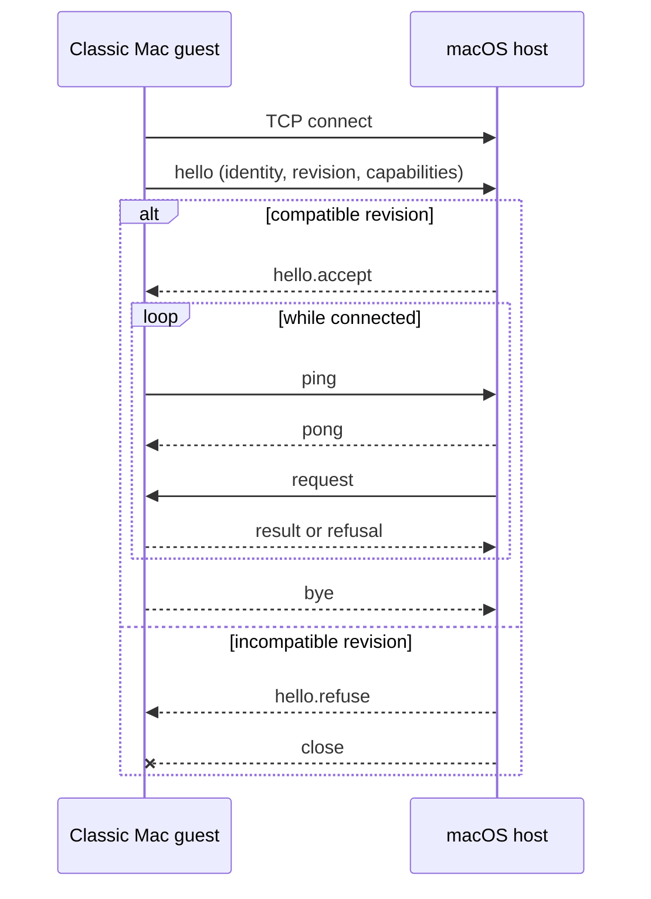
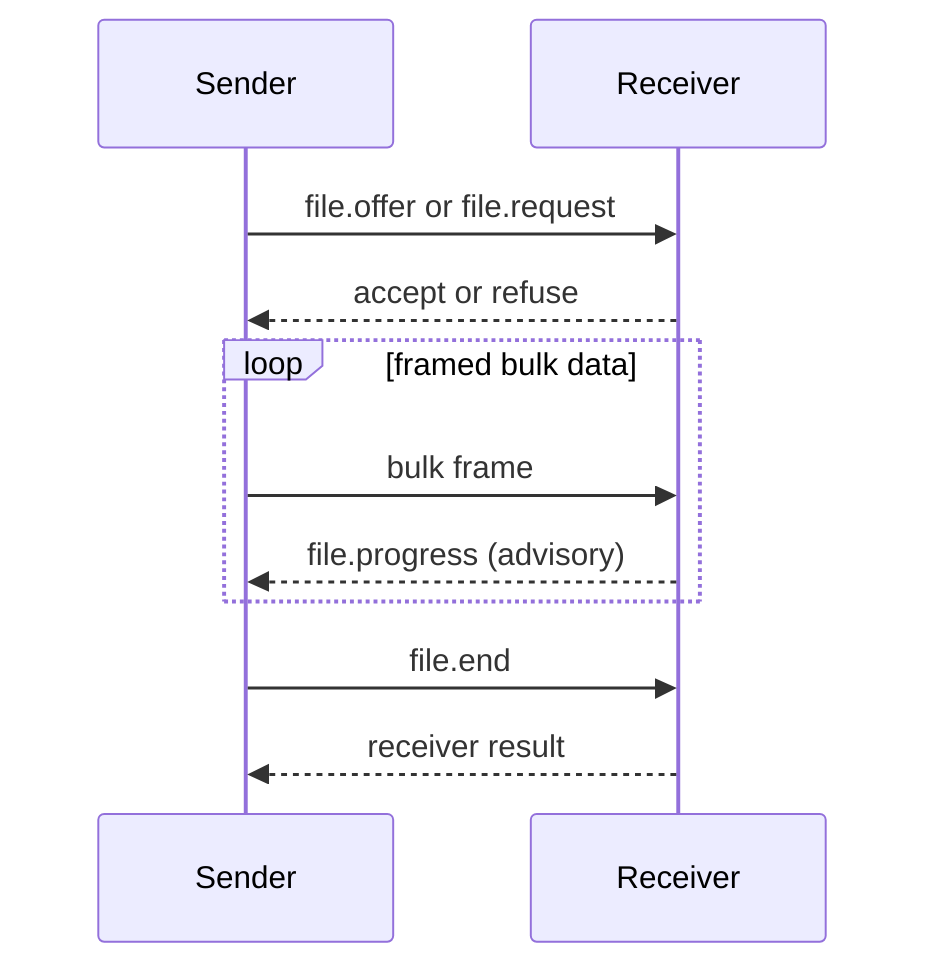
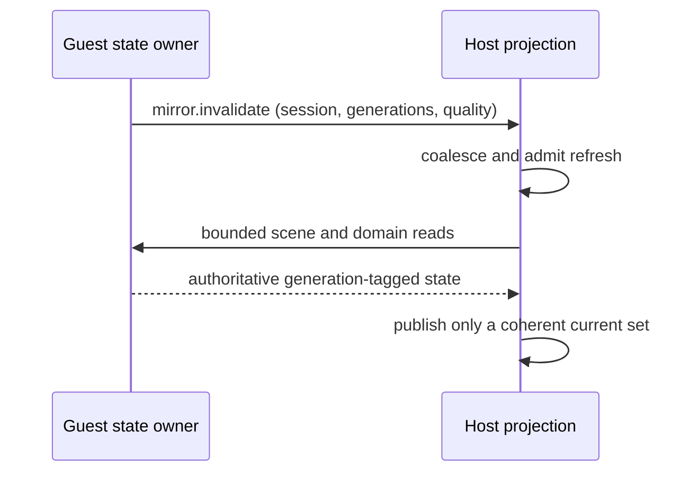

# Wire contract

`contract/asyncapi.yaml` is the normative source for messages, required fields, connection rules, and the command registry. [The generated page](../../generated/asyncapi.md) is a projection for reading; edit the YAML, not the projection.

## Connection sequence

Text equivalent: the guest dials, identifies itself and its contract revision, and waits for acceptance. Only then may either side exchange application messages. Heartbeats keep the session observable. A graceful side sends `bye`; incompatible revisions are refused before normal traffic.

## Frame and lane rules

An eight-byte header identifies channel, flags, transfer, and payload length. JSON control frames and raw bulk frames are multiplexed. Control words queue and retry; bulk data is recoverable and may be abandoned only at a frame boundary. One transfer owns the bulk lane at a time.

## File transfer

Text equivalent: the initiator proposes one transfer, the receiver accepts or refuses, bulk frames follow, and only receiver-originated progress proves bytes arrived. Completion is receiver-owned; a sender's socket acceptance is not delivery evidence.

## Compatibility rule

Fields are additive unless a revision explicitly changes meaning. Unknown enum values are not consent. Every local `$ref` must resolve, every behavior change begins in the contract, and both receiving directions must retain the same meaning.

## Mirror invalidation

`mirror.invalidate` is an optional symmetric notification, not a command and
not authoritative state. It identifies one session and the newest known
overall and per-domain generations, with quality and loss information. The
receiver coalesces refresh work, repairs `gap` or `unknown` quality, and keeps
cadence polling as the fallback. A hint can make a read happen sooner; only a
coherent reread can publish the new state.

Text equivalent: the guest hints that one or more generations changed; the
host coalesces and schedules bounded reads, receives authoritative tagged
state, and publishes only when the generation set is coherent and current.

<!-- derived-doc v1
sources: contract/asyncapi.yaml now-host/Sources/Host/FrameCodec.swift now-host/Sources/Host/ContractMessages.swift now-guest-ppc/src/core/wire.c now-guest-68k/src/core/wire68.c scripts/docs-source-group tools/docs-gate
sources-sha1: 3efceab06a53f0e0c10dc432d6796e0d16d4cf35
derive contract-summary sha256=673228e023edbe7ff287effee94c8278eb044e08f0b2503144171abddb853abe lines=6
    scripts/docs-source-group contract
rederived: pending
rederived: 2026-08-09T16:22:14-0400 9034e3eb sources, contract-summary 6->6
rederived: 2026-08-09T16:29:42-0400 9034e3eb sources
rederived: 2026-08-09T17:05:28-0400 446cf620 sources
rederived: 2026-08-09T17:08:04-0400 446cf620 sources
rederived: 2026-08-09T17:53:28-0400 ed9436c0 sources
rederived: 2026-08-09T18:53:51-0400 181db7a5 sources
rederived: 2026-08-09T18:56:22-0400 181db7a5 unchanged
rederived: 2026-08-09T19:21:55-0400 dc5bfcd2 sources
rederived: 2026-08-09T19:33:55-0400 c854246d sources
rederived: 2026-08-09T20:56:35-0400 9864da82 sources, contract-summary 6->6
rederived: 2026-08-09T21:05:27-0400 9864da82 sources
-->
