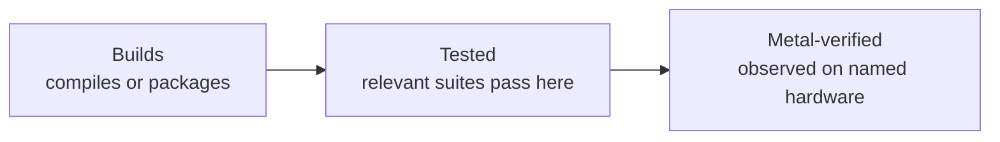

# Verification levels

Text equivalent: a successful build is the first and weakest claim. Passing relevant automated suites permits “tested.” Only a recorded observation on the named classic Mac permits “metal-verified.” Each level includes the previous evidence but answers a stronger question.

| Level | Proves | Does not prove |
|---|---|---|
| Builds | The selected toolchain accepted the source | Runtime behavior, interaction, or real-hardware compatibility |
| Tested | Named automated suites passed in the stated environment | Behavior outside their coverage or on a physical classic Mac |
| Metal-verified | A person or instrument observed the named build on named hardware | Untested machines, configurations, or broader reliability |

“Works” is not a verification level. Record skips, the identity of the build that answered, and whether the artifact itself proves the observation plane armed.

