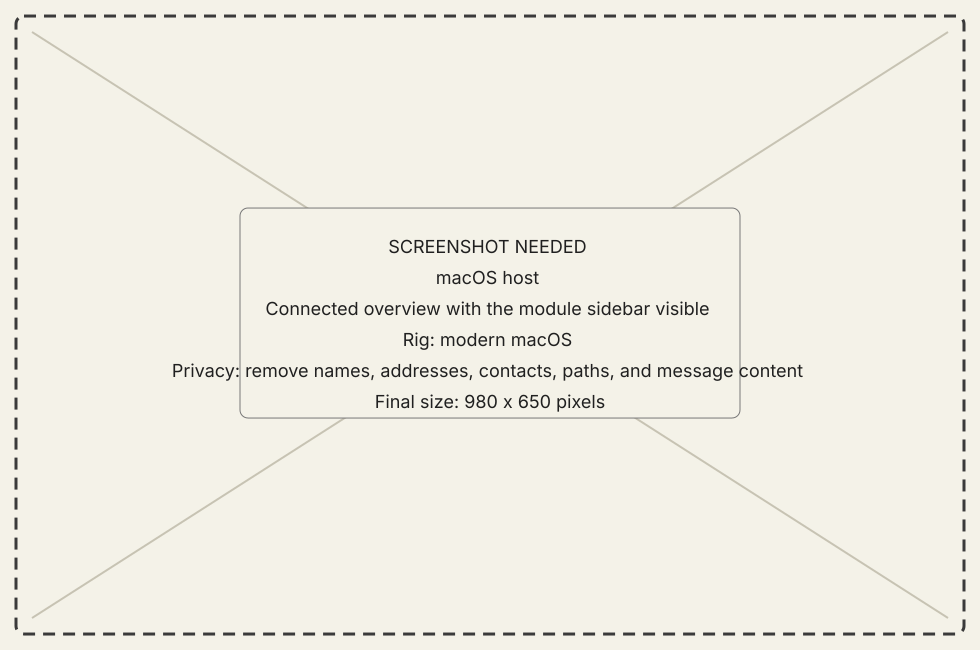
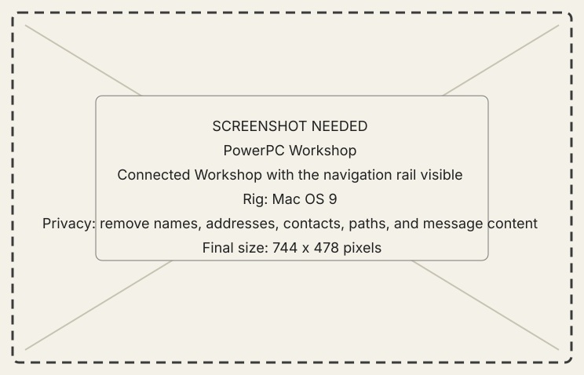

# New Old World documentation

New Old World connects a modern macOS host to a classic Macintosh. The modern
Mac supplies native browsing, services, and agent integration; the classic Mac
supplies its own files, processes, screen, software inventory, and human-facing
Workshop. They meet through one versioned contract.

The alpha targets the PowerPC Carbon guest. The pre-Carbon NOW-68K source
remains in the repository, but its current build is stale and is not planned
for the alpha. The
[alpha feature profile](user-guide/reference/release-profile.md) is the
authoritative release-facing statement.

{ .now-placeholder }

{ .now-placeholder }

## Start here

- [Connect your first classic Mac](user-guide/tutorials/first-connection.md)
  for the guided path from artifacts to a named session.
- [Set up a new PowerPC Mac](user-guide/how-to/set-up-new-mac.md) to have the
  host build and serve a personalized classic setup disk.
- [Explore core features and Extension coverage](user-guide/explanation/core-features.md)
  after connecting, including which features work without the optional
  component and which remain experimental.
- [Review alpha features](user-guide/reference/release-profile.md) for
  what is included, optional, and excluded.
- [Browse the module reference](user-guide/reference/modules/index.md) when
  you already have a connection and want to understand one surface.
- [Read the developer orientation](developer-guide/orientation.md) before
  digging into the source, contracts, guests, resident components, or gates.

## Pre-alpha posture

The documentation uses the same evidence vocabulary as the repository:
**Builds**, **Tested**, **Emulator-verified**, and **Metal-verified** are
different claims. A feature described here may still be experimental or
unverified on one guest. Read [current limitations](user-guide/reference/limitations.md)
before putting irreplaceable data or an untrusted network in the loop.

## Documentation map

- The **user guide** contains one tutorial, outcome-oriented how-to guides,
  explanations, and reference pages.
- The **developer guide** explains how the code works, how to trace and debug
  it, and why its contracts and verification boundaries exist.
- **Engineering records** preserve status, measurements, known-wrong behavior,
  and the append-only issue ledger. They are evidence, not first-run prose.

## Contributing

The [contributing guide](developer-guide/workflows/contributing.md) covers the
project contribution path. Coding agents should enter through the lower
[agent guide](agent-guide/index.md), which adds repository operating, routing,
evidence, and handoff rules while linking back to the same developer
documentation for technical explanations.
