<!-- now-doc-provenance: generated reviewed=false -->

# Mirror high-water checkpoint — 2026-08-04

This document freezes the last directly driven Mirror sweep before work moves
to the host state-engine architecture. It is a recovery point, not a release
claim. The source, tests, exact native build, running guest identity, paired
captures, observed passes, and observed regressions are recorded together so a
later patch cannot quietly redefine the baseline.

The checkpoint lives on `codex/recover-ptolemy-ux-loop`. Its parent before the
Apple-menu repair is `fcc5d5a`. The commit containing this document is the
checkpoint commit; use `git show --stat` on it rather than copying the runtime
paths below into another run.

## Scope and verdict

The bounded repair prevents a later scene containing a real Apple menu shell
with no rows from destructively replacing complete rows already supplied by
the same connected guest. The newest scene still owns menu identity and
geometry. Rows are retained only from a previous nonempty guest observation,
never synthesized, never carried across guests, and surfaced as
`Apple menu expected-stale`.

The direct sweep watched the Apple rows survive the focus/scene transition
that had made the dropdown empty. The renderer displayed all 18 Finder rows,
from `About This Computer` through `Stickies`. This is a watched regression
repair, but it is not a strict green gate row: the correlated C26 evidence
manifest was not complete, and the authoritative QMP frame records the guest
desktop rather than the host-rendered open dropdown. C26 was explicitly paused
after recording its findings rather than falsely closing unscored rows.

Overall status: **tested; emulator-observed; not metal-verified; not a release
artifact**.

## Exact build and runtime

| Item | Exact value |
|---|---|
| Branch | `codex/recover-ptolemy-ux-loop` |
| Pre-repair parent | `fcc5d5a` |
| Debug host SHA-256 before verification-bundle re-signing | `f2f9f44edc303c52a927fb8b39d2c3d332ccb28ee90028b8806465a84a165c58` |
| Release host SHA-256 | `bcfe8d96e52b7f34fbb1c7057ab70b07d7e6a1b0385243dce83ddb51f9e23693` |
| Verification bundle | `/private/tmp/now-apple-checkpoint-host/New Old World.app` |
| Verification bundle id | `dev.newoldworld.now.checkpoint.apple` |
| Guest application | `0.1.0`, build `fe7fb39ff10c`, `2026-08-04T05:11:54Z` |
| NOW Extension build | `b1e5890e8cba499f25c092c945d9e7c1f54951b3` |
| Resident report | lifecycle `Active`, resident `1.0`, capability bits `15` |
| VM overlay | `/private/tmp/now-u7-extension-only/session.qcow2` |
| QMP oracle socket | `/private/tmp/now-u7-extension-only/qmp.sock` |
| Guest forwarding | host `127.0.0.1:1700` to guest `1400` |
| Host listener | `5250` |

At preservation time exactly one checkpoint host and one QEMU guest were left
running. PIDs are deliberately only diagnostic (`36435` and `93693` at that
moment), not identities to reuse. The signed verification copy has a different
executable hash because its bundle identifier was changed and it was ad-hoc
signed; the hashes above name the untouched build products that passed the
gate.

QEMU was used only as a development oracle. Every mutation below began as a
mouse action in the native NOW Mirror. QMP was used only for `screendump`; no
implementation or input route depends on QEMU.

## Verification

`scripts/test-all` passed:

- native guest tests: 100/100;
- host suites and Debug/Release app targets: passed;
- aggregate result: `all gates passed (TESTED; not metal-verified)`;
- guest cross-builds skipped because Retro68 was not available on this shell's
  toolchain path. A skip is not a guest-build proof.

An exact retained build was then produced with
`scripts/test-host /private/tmp/now-apple-checkpoint-build`. It passed 1,265
host tests with 54 opt-in metal skips and built both app configurations.

The new regression guard was also mutation-tested. Replacing the retained
Apple rows with an empty array made
`testAnEmptyAppleShellCannotEraseTheLastCompleteGuestMenu` fail with the 18
expected guest rows versus `[]`; restoring the acceptance rule made it pass.
The companion tests prove that a fresh complete guest refresh wins and an
initially empty menu remains honestly empty.

The full gate also caught an older documentation drift: `activateWindow` was a
canonical interaction primitive but absent from the derived fold-in inventory.
The inventory now records it, and its derivation test passes.

## Direct-input sweep

Every action in this table was driven through the native Mirror with mouse
input. `Pass` means the observed behavior occurred in both the Mirror and guest
oracle; it does not override the stricter evidence-manifest requirements in
`docs/mirror-drive-loop.md`.

| Check | Result | Observation |
|---|---|---|
| Workshop whole-frame fidelity | **Red** | Window structure and sidebar render, but the guest's detail rows are absent. After settling, Mirror reported `5126 earlier bytes were overwritten`. |
| Menubar geometry | Pass in observed frames | Apple, app menus, clock, and native Application menu occupy the expected blocks without the earlier far-left selector collision. |
| Apple menu contents | Watched repair; strict row unscored | Direct click opens 18 retained guest-supplied Finder rows after an empty shell arrives. No invented fallback rows. |
| Workshop resize | Pass | Grow-box drag resized the authoritative guest window and Mirror together. Host act log still says the guest supplied no dispatch row, so semantic settlement remains red. |
| Workshop close | Pass | Close-box click closed the authoritative guest window and Mirror together. Settlement reporting has the same gap. |
| Macintosh HD double-click | Pass | The Finder came front and its drive window rendered folders and items rather than an empty box. |
| Finder fidelity | Partial/red | Structure, names, layout, and folders are present. Bitmap/application art remains placeholder/OOS; the checkpoint does not score bitmap fidelity. |
| Hide Finder | **Red** | The window briefly disappeared, then returned; Finder remained the front application and `Show All` never became available. |
| Control Panels folder | Pass for structured content | The folder opens and its named control panels render. Bitmap icon art remains placeholder/OOS. |
| Date & Time launch | Pass | A direct double-click selected the icon; Finder `File > Open` completed the launch after the cooperative wait. |
| Date & Time content/fidelity | **Red** | Buttons and some structure render, but current date/time values, explanatory text, several control kinds, and layout do not match the guest. |
| Set Time Zone modal | Partial/red | It appeared within 25 seconds and the title, static prompt, buttons, and list frame rendered. The guest's city/country rows are blank in Mirror. |
| Set Time Zone Cancel | Pass | Direct Mirror click dismissed the authoritative guest modal and returned to Date & Time. |
| Workshop reopen | **Red** | `Windows > Workshop` did not reopen it. The act log says `refused: armed, and the application never called MenuSelect`. |

The modal is therefore no longer classified as “does not appear” or “Cancel is
broken.” Its current failure is delayed/partial fidelity: the authoritative
guest table contains city/country rows while the Mirror table is empty.

## Paired visual evidence

The images below are durable copies of the C26 captures. Mirror captures are
native host-window screenshots; guest captures are independent QMP
`screendump` frames. Their differences are evidence, not presentation polish.

### Apple continuity

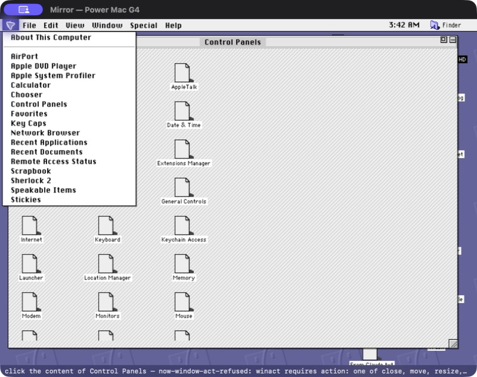

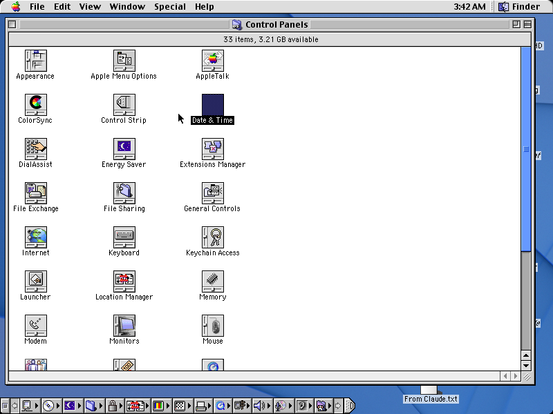

The guest capture does not show the host-rendered dropdown, so this pair cannot
green the strict menu row. It does establish the authoritative Finder
application/menu context against which the 18 retained guest rows were drawn.

### Workshop content red

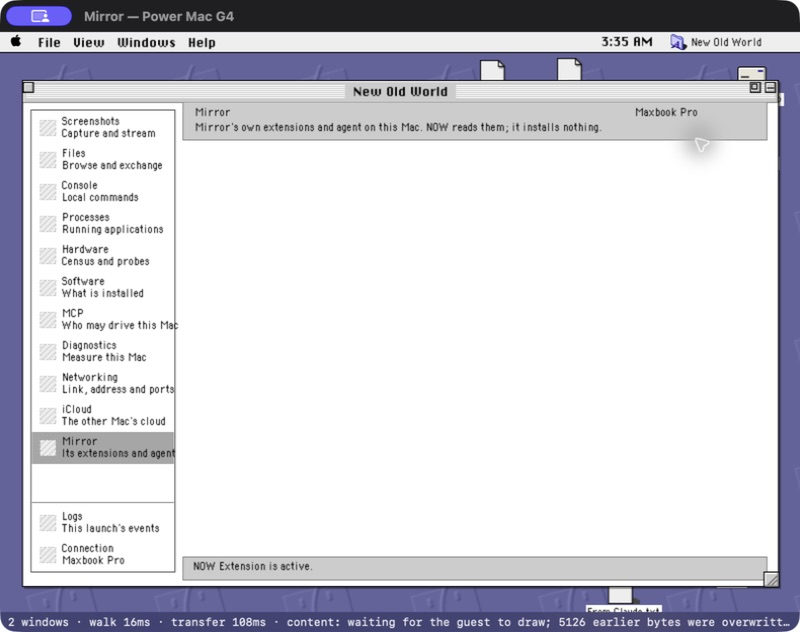

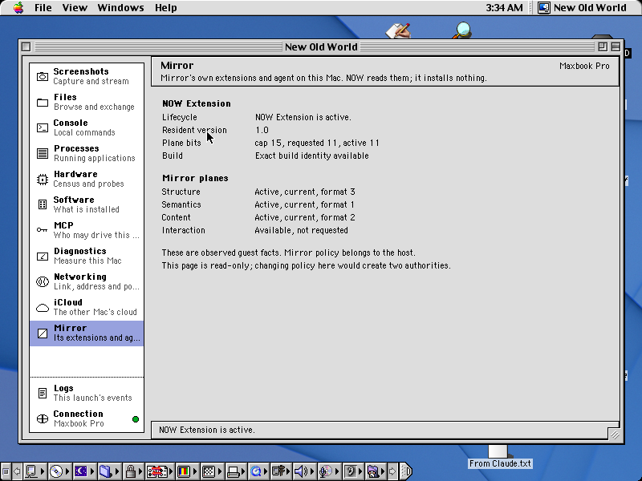

### Macintosh HD

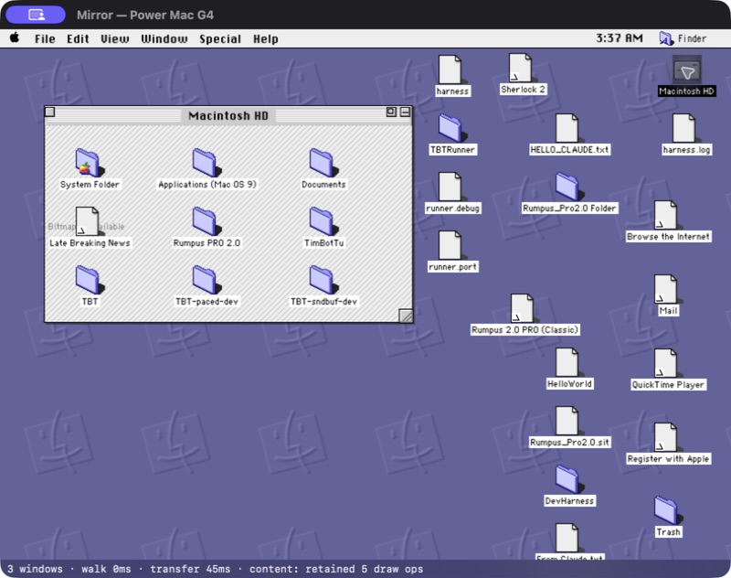

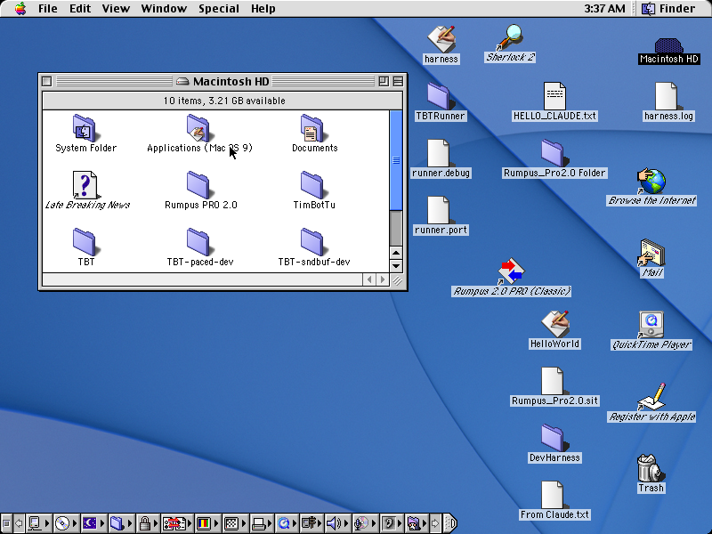

### Finder Hide red

### Date & Time fidelity red

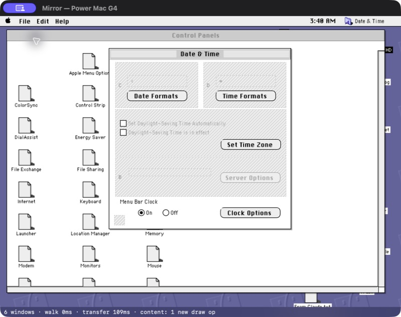

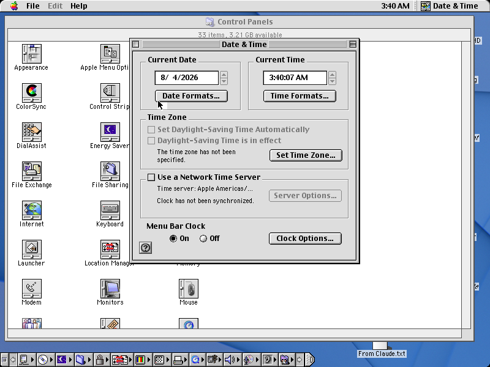

### Set Time Zone content red

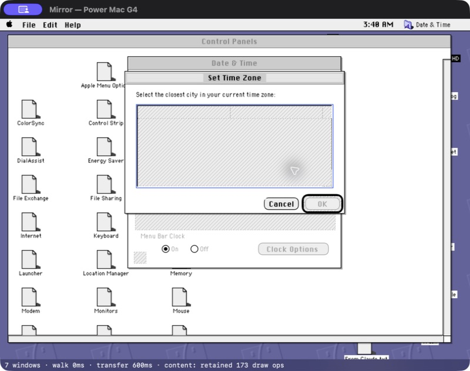

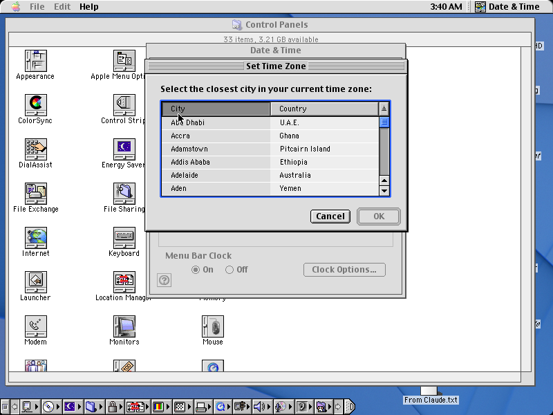

### Workshop reopen red

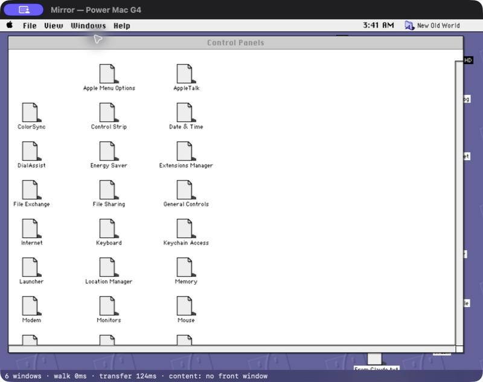

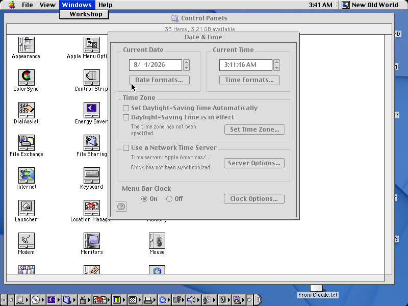

The final pair is especially useful: the guest is still inside the tracked
Windows menu while Mirror has already dismissed its local dropdown. That is a
mutation-settlement divergence, not merely a missing window.

## Why this is the architectural boundary

The Apple repair is intentionally the smallest useful precursor to the state
engine: a scene poll is an observation, not a deletion transaction. It proves
the immediate rule without making `NOWMirrorSource` the long-term authority.
The other C26 reds show why the rule must become a coherent host replica rather
than a growing set of per-widget patches:

- one later partial observation can currently erase useful prior state;
- inactive application windows can remain visible without a first-class stale
  status or can disappear before deletion is proven;
- rendered dropdown dismissal can outrun guest mutation settlement;
- app visibility and front-window ordering are not reconciled as one state
  transition;
- structured content and retained QuickDraw content have different freshness
  and failure modes but are projected as one scene.

The next plan therefore makes guest observations authoritative inputs to one
host state engine, with native Mirror and MCP as clients. Direct keyboard/mouse
driving plus paired Mirror/guest pixels remains the acceptance gate. Bitmap
piping stays deferred and non-load-bearing; missing structured content remains
red.

## Resume instructions

1. Start the next sweep at the full sanity preflight in
   `docs/mirror-drive-loop.md`; C26 is paused, not closed green.
2. Build and launch a uniquely identified host from the checkpoint commit.
3. Verify one process owns port 5250 and one guest answers with the expected
   application and resident fingerprints.
4. Re-run the Apple mutation guard before changing continuity semantics.
5. Preserve the running guest until the state-engine work is ready for its own
   staged-image checkpoint. Do not treat this disposable overlay as the clean
   canonical development image.
