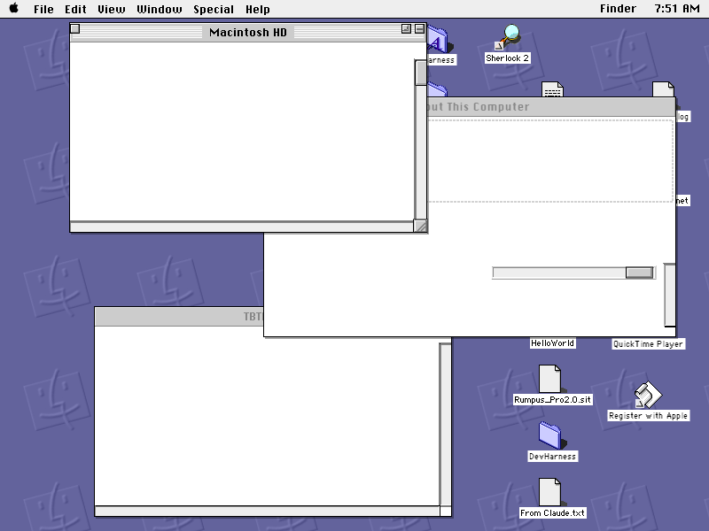
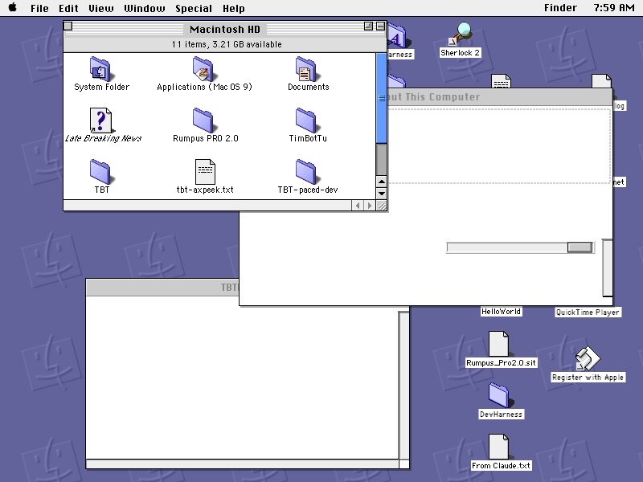
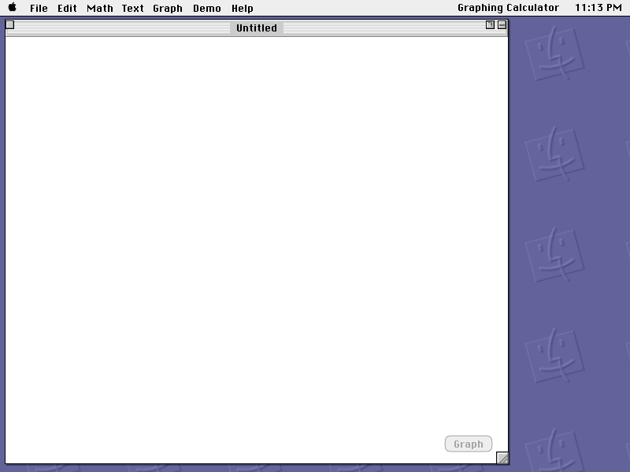
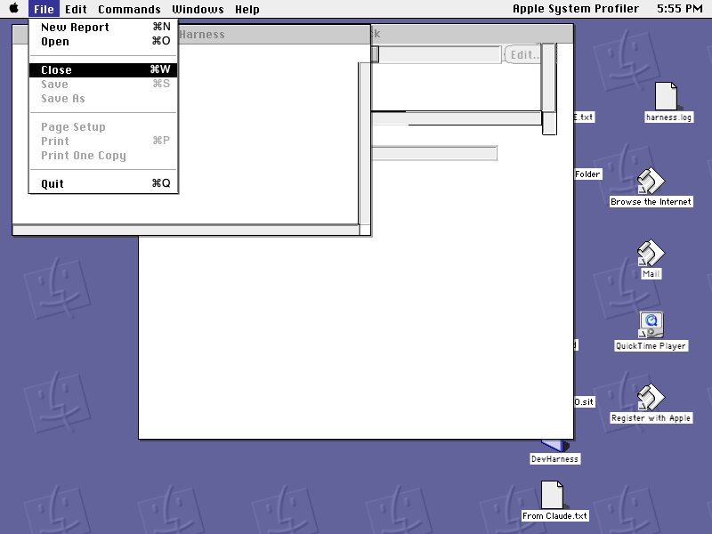
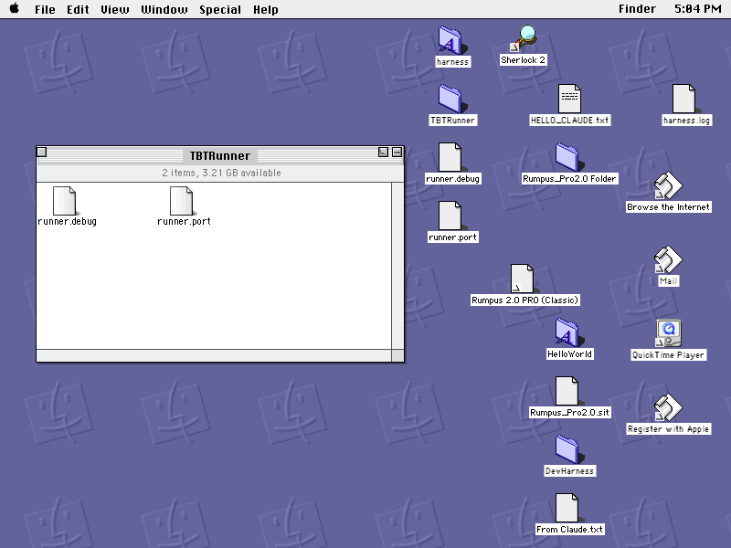
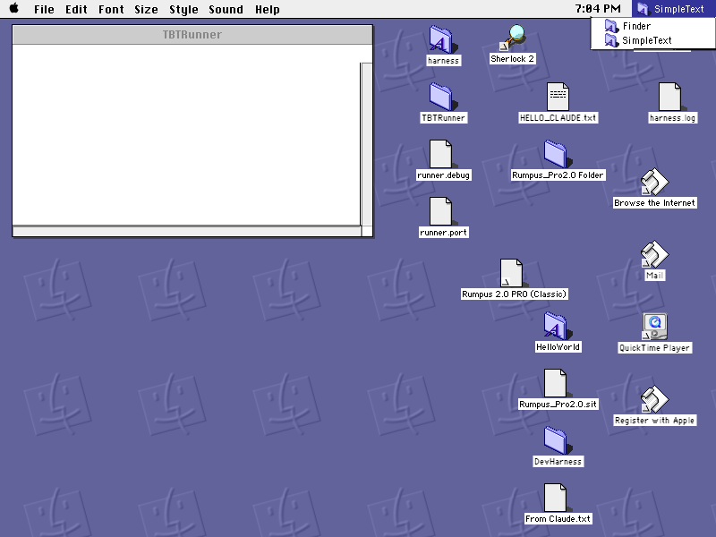
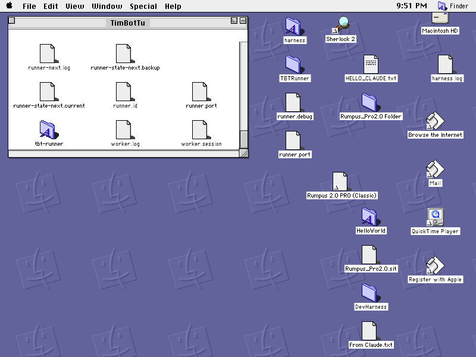
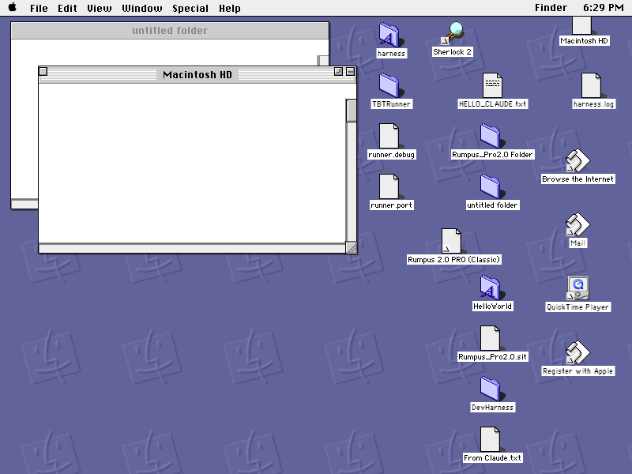
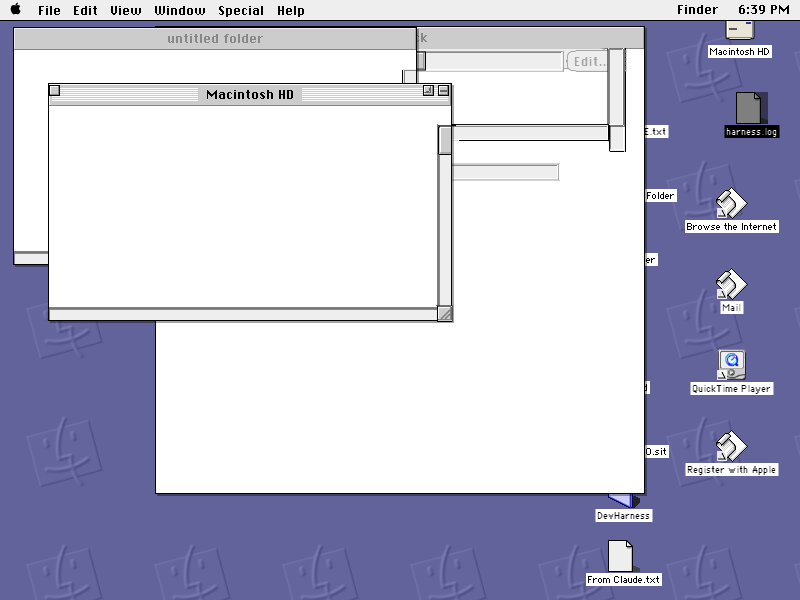

# Nine renders — what a working semantic mirror looks like

**Date:** 2026-07-31 · **Status:** recorded evidence, carried from the
parked upstream project `timbottu/mirror`. NOW produced none of these.

> **Superseded in two specific ways on 2026-08-06 — read this before
> quoting the page.** Everything below is kept as it was written,
> because it is a dated record of what nine particular images showed on
> 2026-07-31 and that has not changed. What HAS changed is the two
> limits it closes on. **Window interiors are no longer blank**: the
> content plane replays what an application actually drew, offscreen
> worlds joined back to the window they land in, so the "every window
> interior is blank" pair below documents a solved problem rather than a
> standing one. And **fidelity is no longer unjudged**: the sweep in
> [fidelity-sweep-2026-08-06.md](fidelity-sweep-2026-08-06.md) put
> eleven windows side by side with the machine's own pixels and scored
> them, which is exactly the comparison the last bullet of this page
> says no render shows. Both are emulator-only; neither has touched
> metal. See [render-composition.md](render-composition.md) for how the
> planes compose now.

## What these images are, and are not

Every one of them is a **host-side render** — a macOS application
drawing a Mac OS 9 desktop from **semantic state read over the wire**,
plus, in two cases, a bounded region of the guest's real pixels.

They are **not screenshots of the guest.** No image here was captured
from the emulator's framebuffer. The window frames, the menu bar, the
title bars, the scroll bars, the shortcut glyphs and the desktop pattern
were all drawn by the host from data.

That distinction is the entire point. A screenshot proves a machine
drew something. These prove the state was **read, understood, and
redrawn** — which is what makes it addressable.

**Provenance.** All nine were produced against a QEMU `mac99` guest
running Mac OS 9.1 at 800×600, on 2026-07-29 through 2026-07-31. None
came from real hardware.

**Fidelity is unjudged.** Upstream recorded that whether these *look*
right against the guest's own pixels was still Michelle's call, not a
measured result. The one fidelity check that was run compared *which*
items appeared in *which* grid cells, not appearance.

## The pair that proves the most

|  |  |
|---|---|
| `render-2026-07-30-desktop-icons.png` | `render-2026-07-30-pixel-island.png` |

**Same desktop, eight minutes apart (7:51 and 7:59).** Read them
together.

The left image is the semantic plane alone, and it is exactly as
informative about its own limits as it is about its capability. Three
Finder windows are drawn at true geometry in true stacking order, with
correct titles, live scroll bars and grow boxes; the desktop icons are
at their real positions with real per-type art and real labels; the
menu bar carries the front application's own menus. **And every window
interior is blank**, because the Finder composites its icon views
offscreen and the semantic plane has nothing to read.

The right image is the same scene with a **pixel island** composited
into the front window: `11 items, 3.21 GB available`, nine folder and
document icons in colour at their real positions, a live scroll bar
beside them. **The chrome is still drawn by the host** — the island is
only the content rect.

This pair is the argument for the braid. Neither plane is sufficient and
the composition is honest about which is which.

## The renders, one by one

### `render-2026-07-29-graphcalc.png`

Graphing Calculator frontmost: its own menu bar (`File Edit Math Text
Graph Demo Help`), the application name at the right, the clock, one
`Untitled` document window with a title bar, a close box, zoom and
collapse widgets, a grow box, and a **greyed `Graph` button** in the
bottom right.

**What it proves.** Foreign menus, foreign windows and foreign controls
read from a process that is not the reader's. And the grey button is a
measurement, not a style choice: that window exposes eleven controls, of
which ten report themselves invisible, and the single visible one
reports itself **disabled** — because there is no equation yet. The
render is showing a real fact about the application's state.

### `render-2026-07-30-desktop-icons.png`

*(shown above, left)* Three stacked Finder windows, an `About This
Computer` window with a live progress-style bar, and a full desktop of
icons at real positions.

**What it proves.** Cross-application window stacking, per-application
icon art keyed by creator and type, and desktop positions taken from the
catalog — where they are correct, because desktop items are hand-placed.
Also, by omission, that window interiors are not semantic.

### `render-2026-07-30-pixel-island.png`

*(shown above, right)* The same scene with the front window's interior
filled from the guest's own pixels.

**What it proves.** The island mechanism end to end: detect from the op
stream that the guest repainted, fetch exactly that rect, composite it
inside host-drawn chrome. Upstream measured a full-window island of
426×358 at depth 16 at about 947 ms on mac99, fetched roughly once per
four polls.

### `render-2026-07-30-menu-hover.png`

Apple System Profiler frontmost with its **File menu open** — `New
Report ⌘N`, `Open ⌘O`, `Close ⌘W` highlighted in inverse, `Save ⌘S` and
`Save As` dimmed, a separator, three dimmed print items, a separator,
`Quit ⌘Q`.

**What it proves.** Menu items are read with their command characters,
their enabled state, their marks and their separators — and the host can
draw an open menu with a hover highlight without the guest having opened
one.

**And it shows the trap.** Those dimmed items are the reason a menu
item's `enabled` bit **must not gate actuation**: classic applications
disable menus at rest and only adjust them when a menu is actually
pulled down. `Save` is dimmed here and would very likely work. Upstream
gated on this bit once and silently refused every File-menu action,
including the reliable keystroke path.

Note also that this menu's item heights are **not uniform** — the
separators are shorter than the items. Assuming 16 px rows accumulated a
30 px error.

### `render-2026-07-30-agent-shot.png`

The Finder frontmost, a `TBTRunner` folder window showing `2 items, 3.21
GB available` with two named documents, and the desktop.

**What it proves.** This one is about the *caller*, not the content. It
was produced through the agent-facing service rather than by a human
running a viewer — an agent asked for a picture of the machine and got
one. Upstream's agent session recorded a comparable render at 800×600
and 53 KB.

### `render-2026-07-31-app-switcher.png`

SimpleText frontmost — note the menu bar has become `File Edit Font Size
Style Sound Help` — with the **application menu open at the top right**
listing `Finder` and `SimpleText`, each with its own icon, and the
`TBTRunner` window behind it drawn **as a background window**: a grey,
patternless title bar with no widgets.

**What it proves.** Three things at once. The process list and the front
application are read correctly and rendered as the system's own
switcher. The menu bar follows the front application. And **background
windows are drawn as background windows** — that inactive title bar is
Platinum's real behaviour, reproduced from a `front` flag rather than
copied from pixels.

### `render-2026-07-31-folder-items.png`

The `TimBotTu` folder window with **nine named items** —
`runner-next.log`, `runner-state-next.backup`,
`runner-state-next.current`, `runner.id`, `runner.port`, `tbt-runner`,
`worker.log`, `worker.session` — drawn as a model, not as pixels.

**What it proves.** The most expensive single correction in upstream's
history. This window used to be a pixel island, and pixels **cannot be
addressed**: an agent could see a file and had no way to name it. These
items come from the Finder's own live layout, which is
window-content-local and scroll-compensated.

Clicking a point computed from that layout selected the item aimed at
**40 times out of 40** — 20 at rest and 20 after scrolling eight lines.
The same code reading the *saved* catalog position instead scored
**0 / 40**.

Two limits visible in the frame: `tbt-runner` draws with a real
application icon while everything else falls back to a generic document
glyph, and the info bar strip at the top of the window is **empty** —
the guest draws an item count and free space there, and the scene has no
field for it.

### `render-2026-07-31-volumes.png`

An `untitled folder` window behind a `Macintosh HD` window, and — top
right — **the `Macintosh HD` volume icon itself**, drawn procedurally.

**What it proves.** Mounted disks are **not** Desktop Folder catalog
entries; the Finder places them, so their positions have to be asked for
rather than read. And the hard-disk icon has no file behind it at all —
it lives in ROM and Icon Services — so it is drawn rather than
extracted.

There is a second, quieter fact in this frame: the two windows differ in
their title bars. The front one has the full active treatment; the one
behind does not.

### `render-2026-07-31-selection-and-volume.png`

The same desktop with `harness.log` **drawn selected** — the icon
inverted, the label reversed out — beneath a stack of four overlapping
windows.

**What it proves.** Selection is state that is read and rendered, not a
local highlight the viewer invented. It is also the visual form of the
oracle behind the 40/40 number above: *click the computed point, then
ask the Finder what is selected.* This is what a correct answer looks
like.

## What no render shows

- **Real hardware.** All nine are emulator scenes.
- **A list or column Finder view.** Every folder window here is an icon
  view, which is the only view the item model was measured against.
- **A document body.** No render carries replayed text from an
  application's own content — the milestone that would have produced one
  was not reached. *(Reached 2026-08-06: the content plane replays the
  drawing itself. No image on THIS page shows one — the statement stands
  about these nine renders and no longer about the project.)*
- **A comparison against the guest's own framebuffer.** The pixel-island
  frames contain guest pixels, but no image here is a side-by-side
  fidelity check. *(Done 2026-08-06, elsewhere:
  [fidelity-sweep-2026-08-06.md](fidelity-sweep-2026-08-06.md) is
  nothing but side-by-side checks, eleven of them, with a red list.)*

Two things these nine still show that nothing has superseded: they
predate the measured Platinum asset pack and the accent ramps read from
the theme file, so their chrome and their icon art are **not** what the
renderer draws today. Do not use this page as a picture of current
output — use it for what it was made for, which is the argument that
state read and redrawn is different in kind from a screenshot.
