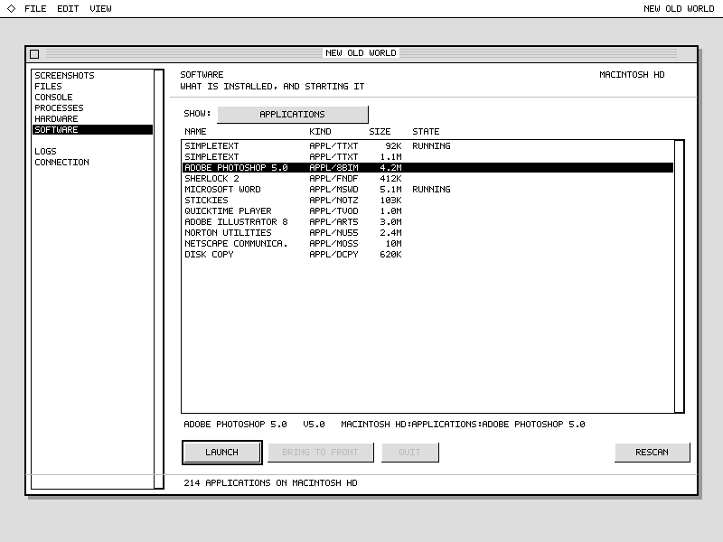
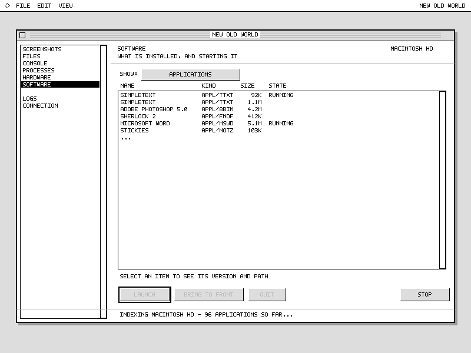
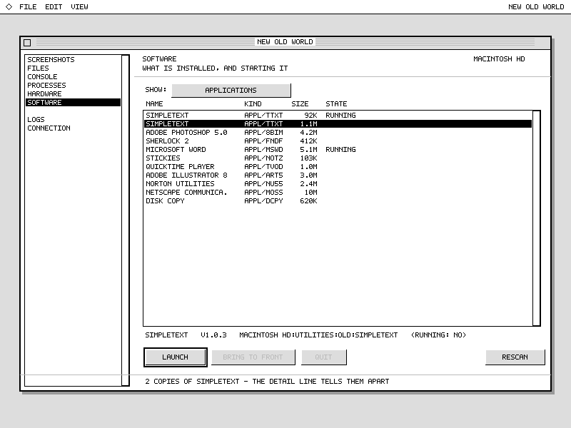
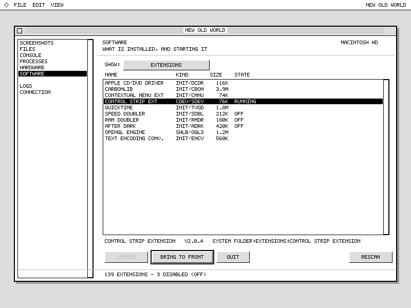

# Software module — UI mockups

Capability-gated **measured previews** for `platinum-carbonlib` (Mac OS
8.6–9.2.2, CarbonLib 1.6, Platinum), rendered with the
`classic-mac-render-preview` skill before building the page. Regenerate
with [`software-scenes.py`](software-scenes.py).

**What they prove:** the declared control set, the 744×478 content
geometry (`kWorkshopStd*`), the palette depth, and that **every control
is `native-api-route` on the real target — the Data Browser included**
(zero fallbacks, zero warnings across all four scenes). **What they do
not prove:** anything about the running app. They are not pixel-identical
system chrome and are not target-runtime verification; only the
PowerBook/emulator can do that.

## States

| | |
|---|---|
|  | **Applications, populated.** Domain popup, aligned Name / Kind / Size / State columns, a running tag, two `SimpleText` copies as sibling rows, a non-running app selected → **Launch** (default), Front/Quit disabled. |
|  | **Applications sweeping.** Rows stream in (`…` tail), no selection, actions disabled, **Rescan → Stop**, and honest *text* progress in the status placard — no determinate bar, because `PBCatSearch` has no known total mid-sweep. |
|  | **Duplicate / version disambiguation.** The two `SimpleText` rows look alike in the list; selecting one resolves it in the **detail line** (full path + version). No modal picker — telling copies apart is the detail pane's job. |
|  | **Extensions, with disabled + running.** Disabled siblings tagged `(off)`, a running extension selected → **Bring to Front** (default) + Quit, **Launch disabled** (an extension is not launched). |

## Preview approximations (mockup only, not target claims)

The renderer's component set is smaller than Carbon's, so a few things
stand in for the real controls:

- **The rail** is custom-drawn in the app (`plot_small_icon` two-line
  rows + a 1px divider above the pinned Logs/Connection pair). Here it is
  a `List`, which gives the framed panel and the selected-row highlight;
  the blank row approximates the divider.
- **The domain selector** is a native **popup menu** (Appearance popup
  CDEF, `native-api-route`); the renderer has no popup primitive, so a
  button labeled with the current domain stands in.
- **Column headers** are drawn by the Data Browser itself (with a sort
  arrow on Name); here they are labels above the list.
- **Font** is the skill's fixed 6px **uppercase** planning font; the real
  UI is mixed-case Charcoal/Geneva. Not pixel-accurate.
- **No row icons** — v1 is icon-less text by design; small icons are a
  later nicety.

## Design decisions these make visible (confirm before building)

- **The action buttons adapt to selection + domain.** App not running →
  Launch (default). App running → Bring to Front (default) + Quit. This
  reuses `proc_actions`, exactly as the Processes page does.
- **Open question — non-app domains.** For a selected *non-running*
  extension or control panel, every action is disabled today (shown in
  the Extensions scene: only the *running* Control Strip lights up
  Front/Quit). Is "nothing to do" right, or do these want a later verb
  (reveal in Finder, or an enable/disable toggle)? Deferred, but the
  mockup is where to decide it.
- **Duplicates are rows, not a dialog.** The console's `#n` / `-v` picker
  is a text affordance; the page tells copies apart through the detail
  line instead.
- **Sweep progress is text, not a bar** — honest about the unknown total.
