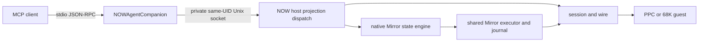
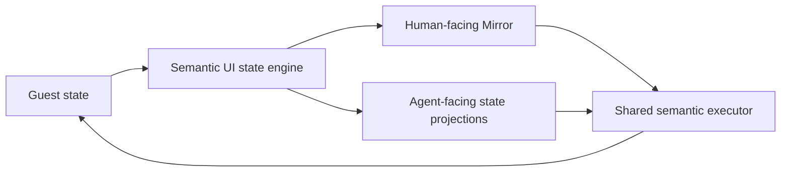

# NOW MCP audit and barrage

> Completed audit run, 2026-08-09. Mapping, the bounded first-contact pass,
> and a private identity-checked PPC Luna barrage are complete. The final
> whole-repository gate is recorded below.

This document maps NOW's agent surface, puts its integrated Mirror plane beside
the two current TimBotTu MCP designs, records CodeKitten's non-MCP automation
substrate, and defines a bounded live barrage. It is an audit inventory, not a
proposal to unify the products.

## Source snapshot

| Surface | Source examined | Snapshot | Qualification |
|---|---|---|---|
| NOW | this repository | `ab3625e8460ebdaa80c238434ba2434a30c26712` | clean head of the referenced stable thread |
| TBT classic / 0.6.4 line | TimBotTu repository: `mcp-classic/`, `runner/`, `data/capabilities.toml` | `d32cd4ea0d42bf5422379d7620389e3523ab8b18` | live checkout; read only for this audit |
| TBT 0.7 / next line | TimBotTu repository: `mcp/`, `next/` | same snapshot | candidate line, not the qualified 0.6.4 release |
| CodeKitten | CodeKitten repository | `c26c9197e22d2ffda1072c260ef10a2b67b907a6` | host-tested control substrate; no MCP implementation |

Counts below are snapshot facts derived from registries or source. They are not
new permanent product constants.

## The map in one page

| Surface | Public agent protocol | Public endpoint | Agent surface | Runtime owner behind it | Mirror relationship |
|---|---|---|---|---|---|
| NOW | MCP over stdio | client launches `NOWAgentCompanion` | 42 dedicated tools, one fixed first-contact resource, one prompt, and automatic server instructions | already-running NOW host, reached over private same-UID Unix socket | nine experimental semantic-UI tools over the same state engine and executor as human-facing Mirror |
| TBT classic / 0.6.4 line | MCP over stdio | client launches `timbottu-mcp-classic` | 29 normal tools, 5 fixed resources, 6 resource templates, 4 prompts | configured Runner, which creates bounded Session/Worker execution | no integrated Mirror surface in this MCP |
| TBT 0.7 / next | Streamable HTTP primarily; stdio parity entrypoint | `http://127.0.0.1:5251/mcp`; `timbottu-mcp-stdio` | 10 tools, 5 fixed resources, 5 resource templates, 2 prompts | Host domain graph over private same-user Unix socket | one generic `mirror_call` tool reaches a separate `mirror.sock` service |
| CodeKitten | none | none | no MCP tools, resources, or prompts | versioned file carrier now; TCP carrier present but fail-closed | none |

The most important distinction is ownership. NOW's companion is a renderer and
client of an existing host-owned projection registry. TBT classic reaches a
machine-explicit Runner and hides the ephemeral Session/Worker coordinates.
TBT 0.7 reaches a Host-owned durable domain graph; its Mirror remains a sibling
service. CodeKitten has a command seam an MCP could eventually project, but it
does not currently expose one.

The private socket in this diagram is local implementation IPC, not a second
MCP transport and not a hosted endpoint.

## NOW protocol and architecture

| Layer | Contract | Boundary and notable limits |
|---|---|---|
| MCP transport | newline-delimited JSON-RPC 2.0 over stdin/stdout | one JSON message per line; 64 KiB frame cap; supported MCP versions `2025-11-25`, `2025-06-18`, `2025-03-26`, and `2024-11-05` |
| MCP surface | initialize/initialized, ping, tools list/call, resources list/read, prompts list/get | closed tool schemas; structured replies and typed refusals; one server-owned first-contact guide exposed automatically and through discovery |
| Local host IPC | private per-UID Unix socket, `host.sock` | same-user and filesystem-mode checks; companion never launches the host |
| Projection registry | `HostProjectionCatalog` and `HostProjectionDispatch` | one transport-neutral catalog injects the optional `guest` selector, enforces consent, and emits an audit event |
| Machine addressing | optional `guest` selector | machine ID follows reconnects; session ID pins one exact session; omission means the currently driven guest; a connected but non-driven named machine is refused rather than silently redirected |
| Guest authorization | optional `hello.agent` ceiling | `disabled`, `read-only`, or `full`; unknown values deny; absence currently permits for compatibility by an explicit recorded decision |
| Guest wire | NOW async contract plus command table | the projection may address, authorize, bound, and render; the guest remains the capability owner and answerer |
| Mirror | native host state engine, executor, and operation journal | Mirror reads use retained host state and do not repoll the guest; drive uses the same executor as the human-facing host UI |

There is no NOW HTTP, SSE, or Streamable HTTP MCP listener in this snapshot.
The host can disable the local agent socket, and a connected companion then
returns a typed host-unavailable result rather than starting anything.

## NOW capability matrix

Every registered tool is named below. “Write” includes stateful host actions,
guest UI actions, transfers, and guest filesystem mutations; it is not limited
to destructive operations.

| Domain | Tools | Character | Authority path | Principal test evidence |
|---|---|---|---|---|
| Session and discovery | `now_list_machines`, `now_session_capabilities` | read | host listener and live capability ledger; machine titles share the Connections page's host-owned naming authority | companion protocol tests, capability tests, socket tests, guest identity tests |
| Hardware | `now_hardware_census`, `now_machine_facts` | read | guest census family and `gestalt` command | projection, census, contract-coverage tests |
| Processes | `now_list_processes`, `now_bring_to_front`, `now_request_quit` | read + write | guest process families; opaque references are revalidated | process projection tests, consent tests, socket tests |
| Software | `now_software_inventory`, `now_launch_software`, `now_reveal_item` | read + write | live guest catalog plus exact bounded selection | software projection and companion argument tests |
| Semantic UI | `now_observe_elements`, `now_window_act`, `now_control_act`, `now_menu_act`, `now_text_get`, `now_text_set` | read + write | guest semantic commands; observations mint opaque element references | projection strictness, forwarding parity, command-coverage tests |
| Retained semantic UI state (experimental) | `now_semantic_ui_start`, `now_semantic_ui_status`, `now_semantic_ui_snapshot`, `now_semantic_ui_find`, `now_semantic_ui_wait`, `now_semantic_ui_metrics`, `now_semantic_ui_lifecycle`, `now_semantic_ui_journal` | read, except starting changes host state | native per-session state engine shared with human-facing Mirror | state-engine open, plane, clocks, lifecycle, and projection-service tests |
| Semantic UI action (experimental) | `now_semantic_ui_act` | write | shared semantic plan executor and journal; gesture chooses the guest verb | act projection, face-parity, and executor tests |
| Screen, diagnostics, and logs | `now_guest_log_tail`, `now_capture_screen`, `now_stream_screen`, `now_catalog_search`, `now_framebuffer_probe`, `now_capture_diagnostics`, `now_transfer_diagnostics` | read, with stream lifecycle state | bounded guest commands and capture/stream families | capture, stream, diagnostics, forwarding, contract tests |
| Approved host-to-guest transfer | `now_transfer_approved_artifact`, `now_transfer_cancel` | write | existing one-at-a-time transfer lane; delivery requires a receipt minted by a person in the host UI | approval-receipt, transfer, socket, audit, and consent tests |
| Guest filesystem reads | `now_guest_files_capabilities`, `now_guest_files_list`, `now_guest_files_stat`, `now_guest_files_download` | read | persisted root-relative guest policy; bounded results; caller cannot choose a modern-host destination | guest-files projection, policy, download, socket tests |
| Guest filesystem mutation and upload | `now_guest_files_mutate`, `now_guest_files_upload_begin`, `now_guest_files_upload_append`, `now_guest_files_upload_commit` | write | typed move/trash/restore/mkdir or private staged create-only upload | mutation, upload, bounds, socket, audit, and consent tests |

### The state engine and Mirror are siblings

"Mirror" is the human product sitting on the state engine, not the agent's
conceptual boundary. Scene retention, semantic projections, action planning,
cycle clocks, and the journal form a shared semantic state engine. Human-facing
Mirror and agent-facing projections are siblings over it. The agent should not
need to know the Mirror product's vocabulary in order to understand desktop or
application state.

In the audited baseline the nine agent projections still carried
`now_mirror_*` names. They did use the same machine selector, consent gate,
socket, dispatch, audit path, state engine, and executor as every other NOW
tool; the defect was agent-facing terminology and first-contact ordering, not a
second MCP or a second state engine. This branch preserves a measured baseline
before changing those names. The state engine and human Mirror remain intact.

This differs materially from TBT 0.7. There, `mirror_call(method, params)` is
one generic MCP tool and `mirror.sock` is a standalone service with its own
session/grant model. That design keeps the experimental service replaceable,
but makes tool discovery and per-operation schema guidance weaker for an agent.

## NOW test-coverage matrix

| Risk or boundary | Gate | What it proves | What it does not prove |
|---|---|---|---|
| MCP handshake, sequencing, errors, schemas | `NOWAgentCompanionTests` | supported initialization, bounded framing, closed argument handling, structured responses | a live host or guest can answer |
| Stdio liveness | `StdioTransportLivenessTests` | one small request is answered while stdin remains open | VM behavior |
| Advertised-tool totality | `MCPClientConformanceTests` | a real spawned client can call every constructible advertised tool and get an answer or typed refusal | default mode has no live host; one human-minted receipt cannot be constructed |
| Companion-to-host parity | `SocketClientForwardingTests` | every projection/client lane has a concrete socket forwarding method | guest behavior |
| Local socket privacy and framing | `AgentIntegrationSocketTests` | same-UID and mode checks, request/reply bounds, concurrency, schema rejection, typed round trips | security outside the local same-user boundary |
| Registry integrity | `HostProjectionRegistryTests` | order, uniqueness, descriptors, annotations, and catalog construction | semantic quality of descriptions to an unfamiliar model |
| Argument closure | `HostProjectionArgumentStrictnessTests` | every row rejects unknown keys and agrees with its published schema | agents choose the right legal arguments |
| Central audit | `HostProjectionAuditTests`, `NOWAgentAuditTests` | all invocation flows cross the audited dispatch and reach the host audit path | the trace is sufficient for diagnosing model friction |
| Guest consent | `HostProjectionConsentTests` | disabled/read-only/full derivation and enforcement | the default for an absent field remains the right product decision |
| Contract and coverage drift | `MCPCoverageTests` | registry requirements/exposures agree with contract and guest dispatch; documentation table remains derived | transport liveness or live latency |
| Mirror state and act plane | Mirror projection, engine, service, lifecycle, clocks, and act suites | retained scene semantics, bounds, waits, action routing, and journal attribution | a real guest draws and reacts as expected |
| Whole build | `scripts/test-all` | native, MirrorKit, guest builds when available, host tests/app builds, optional live guest stage | physical PowerBook behavior unless a metal gate is explicitly run |

### Baseline run for this audit

At NOW `ab3625e8` on 2026-08-09:

| Command scope | Result |
|---|---|
| `swift test list` | 1,988 enumerated Swift tests in the package snapshot |
| all `NOWAgentCompanionTests` | 35 passed, 0 failed at baseline; 36 passed after the cleanup |
| focused socket/projection/coverage/Mirror suites | 193 passed, 0 failed |
| default real-client MCP conformance, no host | baseline: 42 advertised, 41 typed host-unavailable refusals, 0 failures, 1 uncovered; after cleanup: 41 refused, 0 failures, 1 human-gated, 0 uncovered |

The uncovered row is `now_transfer_approved_artifact`: no MCP operation mints
its `approvalReceipt`; a person approves the transfer in the host UI. That is
an authority boundary, but “uncovered” makes the conformance summary look like
a test omission. The live barrage should classify it as **human-gated**, then
exercise its refusal without trying to manufacture authority.

The baseline slice was **tested locally**, not VM-verified or metal-verified.
The first-contact and barrage observations below are VM-verified. Nothing in
this audit is physical-hardware evidence.

### Pre-cleanup Luna baseline

The private PPC run used lane `16136/16137`, base image SHA-256
`c466baa9a5455c343908e12197d68e57ffc7f07c140276a90c97a5ae2a137d70`, and a
guest that identified itself as `Power Mac G4`, Mac OS 9.1.0, build
`0aa097ba0c1b 2026-08-09T07:04:59Z`. The staged resident separately matched the
run's source manifest `03b7d9519617` and build fingerprint `c90c4d4ff77f`.
This is VM-verified first-contact evidence, not physical-hardware evidence.

| Probe | Result | Calls before answer | Qualitative read |
|---|---:|---:|---|
| H0, connected Mac and readiness | 17 s, correct | one: `now_session_health` | good first tool choice and a direct answer; it did not quote the guest build even though the result carried it |
| H1, visible desktop and front application | 37 s, substantively correct | five shell calls, then health + direct element walk + screen capture | poor surface-first behavior: it loaded global TBT emulator guidance, inspected an unrelated TBT runtime, and escalated to pixels without trying retained semantic state |

H1 is intentionally retained as an environment-level baseline. NOW was the
only configured MCP server, but the worker's global classic-Mac harness skill
was still discoverable and routed it toward TimBotTu. `--ignore-user-config`
removes configured MCP servers; it does not remove installed skills. The scored
barrage therefore also uses a temporary auth-only Codex home. That control is
not a product advantage: it simply separates friction in NOW's own MCP surface
from unrelated global guidance.

The raw `codex exec --json` streams, stderr, and timing metadata remain under
`docs/local/now-mcp-barrage-2026-08-09/baseline/`. They contain the emitted
event stream and token accounting, not private hidden chain-of-thought.

### Post-cleanup first contact

The controlled worker needed both an auth-only `CODEX_HOME` and an empty
`HOME`. `--ignore-user-config` removed configured MCP servers but did not hide
globally installed skills; changing only `CODEX_HOME` still allowed Atlas to
route H0 to the modern Mac and produce a confident wrong answer. With both
homes isolated, the same probes produced:

| Probe | Result | NOW calls | Input-token accounting |
|---|---:|---|---:|
| H0, connected Mac and readiness | 11 s, correct | `now_list_machines` | 76,618 |
| H1, visible desktop and front application | 26 s, correct | list machines, retained semantic snapshot, process list, then pixels | 200,093 |

The rename made the intended entry point obvious once the model chose NOW.
The first-contact resource, prompt, and initialize instructions did **not**
make arbitrary Macintosh tasks choose NOW automatically. In this client,
resources and prompts are opt-in discovery surfaces; the server instructions
were insufficient to overcome task-plane ambiguity by themselves.

## Comparative surfaces

### TBT classic / 0.6.4 line

The product/Runner line is 0.6.4; the Python MCP package currently identifies
itself as 0.4.0. Its normal surface is machine-explicit and stdio-only. It
reaches a configured Runner, which creates a bounded ephemeral Session and
Worker while keeping their assigned transport coordinates out of MCP.

| Domain | Normal typed tools |
|---|---|
| Fleet and lifecycle | `inspect_machine`, `inspect_sessions`, `inspect_activity`, `inspect_components`, `inspect_connections`, `retry_connection`, `close_session`, `hotswap_runner` |
| Files and transfer | `inspect_files`, `read_text_file`, `write_text_file`, `download_file`, `upload_file` |
| Process and app control | `inspect_processes`, `launch_application`, `activate_application`, `send_application_event` |
| Machine execution | `inspect_hardware`, `run_script`, `type_text`, `press_key`, `click` |
| Semantic and visual evidence | `inspect_ui_semantic`, `act_ui_semantic`, `extract_ui_text`, `capture_ui_region`, `capture_screen` |
| Corpus | `search_corpus`, `read_dossier` |

Discovery adds five fixed resources, six resource templates, and four prompts.
Separate developer and Mordor entrypoints deliberately expose raw diagnostic
and below-the-line operations; they are not part of the 29-tool normal count.

The immediate audit finding is documentation drift: the classic README still
says “19 operations” and enumerates the older surface, while the authoritative
capability registry contains 29.

### TBT 0.7 / next

The MCP package is 0.5.0 within the 0.7 candidate line. Its primary supervised
transport is stateless Streamable HTTP at the fixed loopback endpoint
`http://127.0.0.1:5251/mcp`. It also provides a stdio parity entrypoint. HTTP
has explicit health and readiness endpoints:

- `/.well-known/timbottu/mcp/health`
- `/.well-known/timbottu/mcp/readiness`

Supervised HTTP requires a readiness identity. Host and Origin validation keep
the endpoint loopback-only; the health contract explicitly reports no MCP auth
or encryption. MCP then calls the private same-user Host `domain.sock` using a
bounded canonical-JSON frame. Durable state and policy remain Host-owned.

| Domain | MCP tools |
|---|---|
| Guest work | `guest_operation_submit`, `guest_operation_cancel` |
| Host services | `service_start`, `service_stop`, `service_restart` |
| Updates and resources | `update_request`, `resource_close` |
| Corpus | `search_corpus`, `read_dossier` |
| Mirror | `mirror_call` |

`guest_operation_submit` is a typed envelope over 24 closed semantic operation
kinds rather than 24 separately advertised MCP tools. Discovery adds five
fixed resources, five templates, and two prompts.

The standalone Mirror service exposes 15 method names through the one generic
tool: attach, detach, status, scene, find, shot, wait, six act variants, and
app inspection. Its private protocol is shared framing, not MCP. Sessions and
semantic/tracking grants are in-memory, and tracking is emulator/QMP-only.

### CodeKitten

CodeKitten is an adjacent control-surface candidate, not a fourth MCP.

| Plane | Current state |
|---|---|
| File carrier | version-1 request/status/incoming seam under System Folder Preferences, with journal archives |
| Command layer | 15 commands dispatch into the shared `CKCommand` implementation: project open/build/run, toolchains, problems, and project-file mutations |
| TCP carrier | Open Transport listener, desired-on by default at port 49191; bounded versioned envelope |
| Admission | intentionally fail-closed before product mapping or dispatch until authenticated session/security policy exists |
| MCP | absent: no server, endpoint, tools, resources, or prompts |
| Verification | host-tested and Carbon-built; not metal-verified |

An eventual MCP should project `CKCommand`; it should not bypass the carrier's
admission work or invent a parallel command implementation. Designing that is
outside this audit.

## What NOW should learn from TimBotTu

Port principles, not either catalog wholesale:

| TBT property | Lesson for NOW | Port now? |
|---|---|---|
| Classic's machine-explicit normal tools | Machine choice should be a first-class discovery step, with transient execution coordinates hidden behind stable machine identity. | **Already applied:** `now_list_machines` plus optional `guest`; keep stable id, session id, human label, and reported name separate. |
| Classic's fixed resources, templates, and workflow prompts | Server-owned orientation is useful and versioned with the server, but only after the client chooses that server. | **Partly applied:** one guide resource and prompt. Add machine-specific resource templates only if agents demonstrably use them. |
| 0.7's Host-owned domain graph | Keep durable identity, policy, and state in the host; make transports thin projections. | **Already NOW's shape:** the companion is a thin stdio client of the host-owned registry/state. |
| 0.7's closed `guest_operation_submit` envelope | A typed domain envelope can expose many operation kinds without advertising one large schema per verb. It may reduce catalog cost. | **Measure first:** F-006. A single generic escape hatch would lose per-operation guidance; do not copy it blindly. |
| 0.7's HTTP/stdio parity and readiness identity | Hosted transports need explicit readiness, identity, Host/Origin policy, and parity tests. | **No current port:** NOW has no remote/hosted requirement. Adding HTTP would enlarge its trust boundary for no measured gain. |
| 0.7's separate generic `mirror_call` service | A sibling experimental service can remain replaceable, but one generic call weakens agent discovery and schemas. | **Do not port:** NOW's sibling relationship is conceptual inside one host; keep typed semantic projections while experimental. |
| Classic's richer normal/developer/Mordor surface split | Dangerous diagnostics need an unmistakable boundary instead of crowding normal work. | **Keep as a review lens:** NOW's current direct probes are bounded normal tools; revisit their placement only with post-barrage hierarchy data. |

The most immediate borrowed lesson is also the negative one: TBT's resources
and prompts would not have fixed NOW's bare-task failures by themselves. The
client still needs a small routing layer. The most promising later experiment
is TBT 0.7's typed operation-envelope economy, compared against NOW's flat
catalog without adopting its generic Mirror escape hatch.

## Review findings and bounded cleanups

### Applied before the scored barrage

1. Removed current-source prose counts that had already drifted from 41 to 42.
   Historical issue and plan records remain historical.
2. Classified `now_transfer_approved_artifact` as `human-gated`, not
   `uncovered`. Default conformance now reports 42 advertised, 41 typed
   refusals, zero failures, one human-gated, and zero uncovered.
3. Added automatic first-contact instructions, the same guide as one fixed MCP
   resource, and a prompt. They state machine selection, the semantic evidence
   ladder, independent verification, and the human approval boundary.
4. Replaced the agent-facing `now_mirror_*` vocabulary with nine explicitly
   experimental `now_semantic_ui_*` tools. No compatibility aliases preserve
   the old conceptual leak or enlarge the catalog.
5. Made `now_list_machines` the obvious discovery entry point and shared its
   human-facing machine title with the Connections page. Stable machine id,
   exact session id, and guest-reported name remain separate fields.

The barrage stays manual and machine-readable until its first batch proves a
runner would be useful. Deeper consolidation of direct probes, retained state,
and action hierarchy waits for the measured results.

### Record, but do not cross the repository boundary here

1. TBT classic's README should derive or link its normal inventory instead of
   stating 19 while the registry contains 29.
2. TBT 0.7's single generic `mirror_call` is a discoverability tradeoff worth
   measuring in its own agent barrage. It is not a reason to copy NOW's nine
   projections into the candidate line during this work.
3. CodeKitten needs an authenticated admission decision before an MCP adapter;
   adapter work now would invert its security boundary.

No other cleanup is in scope without a failure from the live barrage.

## Live Luna barrage

### Isolation and evidence

The run used one private PPC clone and matching host from this branch. QMP was
used only for lifecycle; actions went through NOW. The guest identity and
build are recorded in the baseline section. Fresh non-interactive
`gpt-5.6-luna` workers ran from empty directories with temporary `HOME` and
`CODEX_HOME`; NOW was their only MCP. The raw JSONL, stderr, prompts, and timing
metadata remain in `docs/local/now-mcp-barrage-2026-08-09/`.

The JSON event stream has process start/end timing but no timestamp on each
MCP event. “Hello” below therefore records whether identity was the first NOW
call; elapsed time is an upper bound, not a fabricated exact `T3 - T0`.

### Bare prompts versus minimal routing

The first batch used the bare tasks below. Failed tasks were repeated with one
additional sentence: “Use the NOW integration on the connected classic
Macintosh.” It named neither a tool nor a workflow.

Scores use the 100-point rubric defined for the run: connection 15, discovery
15, execution 25, verification 20, safety 15, communication 10. They are a
review aid, not a model benchmark.

| ID | Bare result | Routed result | Hello | Score, bare → routed |
|---|---|---|---|---:|
| H0 | correct after cleanup | not repeated | first and only call was `now_list_machines`; total 11 s | 98 |
| R1 | correct process list and front app | not needed | `now_list_machines` first; total 29 s | 98 |
| R2 | confidently listed the modern Unix root as the Mac disk | correct folder inventory; total 26 s | none bare; first call routed | 18 → 93 |
| A1 | searched modern macOS and falsely said SimpleText was absent | catalogued, launched, and independently confirmed SimpleText frontmost; total 29 s | none bare; first call routed | 20 → 95 |
| M1 | declared an unrelated workspace read-only | found the guest root, but every mutation was cancelled at the non-interactive client confirmation boundary; absence reverified; total 40 s | none bare; first call routed | 20 → 69 |
| X1 | declared an unrelated workspace read-only and SimpleText absent | chose the right domains, but non-empty staging and UI actions were refused; file absence and blank window reverified; total 84 s | none bare; first call routed | 20 → 70 |
| N1 | declined for unrelated read-only/no-file reasons | copied and verified a zero-byte Desktop file through guest upload; total 72 s | none bare; first call routed | 20 → 74 |

The dominant result is categorical: only two of seven bare tasks entered NOW.
All five minimally routed repeats did so immediately. Server-owned
instructions, a resource, and a prompt improve the route *after NOW is
selected*; they are not a reliable client-side router.

### What the barrage found

1. **First-contact routing is the largest friction.** “Macintosh” and classic
   app names did not cause the client to select the only MCP. Four workers
   instead reasoned about their empty working directory; one searched the
   modern host. A small client-side NOW skill is the likely next cheap win.
   It should say when to select NOW and then defer to the server-owned guide;
   it should not duplicate 42 tool descriptions.
2. **Once routed, machine discovery is good.** Every repeat began with
   `now_list_machines`, selected `guest-1`, and received the human-visible
   `Power Mac G4` name plus the exact live session identifier. The host label,
   reported name, stable id, and session id remained distinguishable.
3. **The semantic ladder improved but is not settled.** H1 used retained state
   before pixels. R2 tried retained snapshots, then used the filesystem list
   for authoritative folder typing. X1 moved from transfer to semantic UI and
   direct observation. This is enough evidence to design the deeper hierarchy
   later, not enough reason to collapse those planes during this pass.
4. **The barrage found and the cleanup fixed non-empty guest upload on this
   Mac.** The host reported
   `volumeAvailableCapacityForImportantUsage == 0` while ordinary available
   capacity was about 714 GB. Every positive-size reservation therefore
   returned `now-files-insufficient-host-space`; a zero-byte reservation and
   commit succeeded. A four-byte live conformance run had already recorded the
   same symptom on 2026-08-07. Both transfer directions now share a capacity
   resolver that falls back to ordinary capacity without weakening the reserve.
   A post-fix four-byte VM upload completed through the real MCP companion and
   statted as four data-fork bytes on the guest.
5. **The transfer authority model is narrower than the original N1 expected.**
   `now_transfer_approved_artifact` requires a human-minted receipt because it
   redeems a host-selected private file. `now_guest_files_upload_*` accepts
   caller-supplied bytes under full guest agent access and requires no such
   receipt. A Codex worker that can read the modern Desktop can therefore read
   a file itself and upload its bytes. That is the implemented distinction,
   not a forged receipt; whether the product intends all modern-host files to
   require a second approval is a separate authority decision.
6. **Mutation evaluation needs an interactive approval mode.** Destructive
   annotations caused non-interactive Codex to return `user cancelled` before
   NOW executed `mkdir`, semantic typing, or menu actions. The refusals are
   safe and the workers reported them honestly, but this batch did not test a
   successful reversible mutation chain.
7. **Context cost is material.** The clean one-call H0 recorded 76,618 input
   tokens. Routed R2 and A1 recorded 270,593 and 250,909; X1 reached 856,750
   across eleven NOW calls, including large semantic payloads. These are
   end-to-end Codex accounting numbers, not a claim that tool schemas alone
   caused all of them. Catalog size and rich repeated results both deserve a
   separate bounded measurement before redesign.

The emitted traces contained tool calls, tool results, final answers, and
occasional reasoning summaries. They did not expose private hidden
chain-of-thought, so this audit makes no claim to have captured it.

### Verification status and next review

The first-contact cleanup is **tested and VM-verified for H0/H1/R1/R2/A1**.
The staging failure, zero-byte baseline, and successful four-byte post-fix
upload are VM-observed. M1 and X1 are not behavior-verified because client
confirmation prevented the intended mutation. Nothing here is metal-verified.

The next brief review should decide only:

1. whether a packaged client-side NOW routing skill is the intended first
   contact layer;
2. whether caller-supplied guest upload bytes are intentionally outside the
   one-time host-file approval boundary;
3. how to run one interactive M1/X1 follow-up without weakening confirmations.

The larger direct-observation/retained-state/tool-hierarchy redesign remains a
post-barrage design pass, now informed by these traces.

### Final repository gate

After aligning the drive-menu tests with the host-owned human machine names,
`scripts/test-all` passed end to end on 2026-08-09:

- staged-image discipline: 28 passed;
- native guest tests: 149 passed;
- MirrorKit gate: passed;
- PPC, 68K, Extension, shutdown, wedge, GWorld, and ATA cross-builds: passed;
- host gate: both 1,954-test passes (asset pack and no-pack degradation) plus
  Debug and Release app builds passed;
- live-guest gate: skipped because `NOW_GUEST_LIVE` was not set.

That is **tested**. The private barrage observations remain separately
**VM-verified**; nothing in this branch is physical-hardware/metal-verified.
