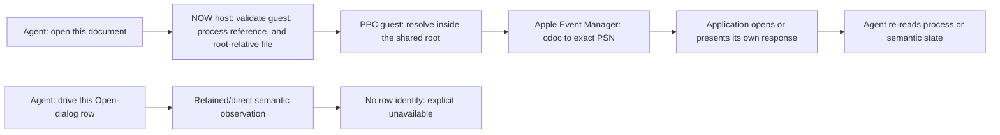

<!-- now-doc-provenance: generated reviewed=false -->

# NOW MCP: document opening and Standard File rows

This review follows F-010 from the 2026-08-09 MCP barrage. It separates two
different user outcomes that happened to meet in one prompt:

1. open a known guest document in a named application;
2. inspect and drive the rows of an application's Open dialog.

NOW cannot currently do the second semantically. It already has nearly all of
the guest mechanism needed for the first. Treating them as one problem would
turn a bounded agent-surface improvement into a resident UI-reverse-engineering
project.

## Observed failure

The isolated Luna run uploaded and byte-verified `Luna Contract.txt`, launched
SimpleText, opened its Open dialog, and found the semantic `Open` button. The
retained scene and the direct element walk both represented the file browser as
an unnamed `userItem`: no filenames, row identities, or selected row were
published. Setting the dialog's editable text did not change the browser
selection. Pressing `Open` therefore opened the previously selected
`Apple DVD Player Read Me`.

This is not an action-vocabulary failure. F-009 made `dialogItem` discoverable
and exact; the worker found and used it. The missing fact is the browser's row
identity.

## What the current semantic planes can prove

The retained IR already carries `semantic.listCells`, `listTotalCount`, and
per-cell selection. [The resident semantic walker](../ext/src/now_semantic.c)
obtains those facts only after a target-context Control Manager walk proves an
exact control and the public `kControlListBoxListHandleTag` yields its
`ListHandle`. `ctlact` part 0 can then press a caller-supplied point inside that
exact control, which is how a standard list row selects.

The observed Open dialog did not expose such a control. Its browser occupied a
Dialog Manager `userItem`. A `dialogItem` action deliberately accepts only
push-button, checkbox, and radio-button DITL items, so widening it to press the
middle of a `userItem` would be a coordinate guess with a semantic name.

The dialog is Navigation Services-shaped (`Show Preview`, `Desktop`, `Eject`,
and the browser user item), but the runtime owner was not directly proven.
Installed Universal Interfaces do prove the relevant public API shape:

- `NavCustomControl(..., kNavCtlGetSelection, ...)` and
  `kNavCtlSetSelection` read and set the browser selection;
- those calls require an opaque `NavDialogRef`;
- `NavDialogRef` is explicitly distinct from a Dialog Manager `DialogRef`;
- `NavDialogGetWindow` maps a Nav dialog to its window, but the public header
  exposes no inverse window-to-Nav-dialog lookup.

That declaration does not create an actuation seam for NOW. The resident is a
flat 68K INIT and, by charter, cannot depend on CarbonLib. The observable window
therefore does not provide the opaque object required by Navigation Services.
Capturing that object generically would require a new in-context interception
or registration mechanism and a new resident contract. It is not a cheap MCP
cleanup, and it is not justified by one barrage task.

## Bounded product-level seam

The PPC guest already implements
[`aesend`](../now-guest-ppc/src/input/input_cmds.c), including `odoc`:

- the event vocabulary is closed to `quit`, `oapp`, `odoc`, and `pdoc`;
- the target is an exact Process Manager serial number;
- an `odoc` request resolves one HFS path, builds one alias-list direct object,
  and sends `kAEOpenDocuments` with `kAENoReply | kAECanInteract`;
- the response says `sent`, never `performed`, and requires a fresh observation
  for outcome verification;
- the operation is described by the guest as metal-safe.

This is the capability the failed task actually needed. It is guest-owned,
bounded, and does not require the agent to understand Navigation Services.

## Recommended implementation slice

Add one typed tool, `now_open_document`, rather than exposing the generic
`aesend` command.

Its caller-facing arguments should be:

- `processReference`: one current opaque reference from `now_list_processes`;
- `path`: one canonical path beneath the host-owned `guestRoot`.

The host should re-list and revalidate the process identity, stat the file
through the existing bounded
[Files policy](../now-host/Sources/Host/Automation/GuestFilesCommands.swift),
refuse folders and absent or scan-limited files, and delegate the effect to the
guest. The guest should resolve a share-relative path to an `FSSpec` before
constructing `odoc`; the host must not reconstruct an actionable full HFS path
from the display-only `rootLabel`. This is an accretive contract change because
today's `aesend.path` means a full HFS path. A new `sharedPath` argument,
mutually exclusive with `path` and valid only for `odoc`/`pdoc`, is the smallest
compatible guest seam. The MCP projection should use only `odoc`; `quit`
already has `now_request_quit`, and printing is a separate authority and
product decision.

The result should preserve the guest's claim boundary:

- `sent`: the Apple Event left NOW for the exact process;
- `unavailable`: this guest does not serve `aesend` (including NOW-68K);
- `stale`: the session, process reference, or file observation changed;
- `notFound`, `refused`, or `failed`: the existing typed guest/host reasons.

No result may say the document opened. The caller verifies with a fresh
`now_semantic_ui_snapshot`, `now_semantic_ui_wait`, or process observation.

## What to port from TimBotTu

TBT classic's `send_application_event` contributes three useful principles:

1. refresh and revalidate the exact process before sending;
2. keep the event vocabulary closed;
3. say that delivery is not performance and require a later observation.

NOW should not port the generic tool. A smaller agent should see
`now_open_document(processReference, path)`, not learn four Apple Event
mnemonics or decide whether `quit` duplicates another tool. TBT 0.7's generic
operation envelope and `mirror_call` do not improve this particular seam.
CodeKitten has no MCP and contributes no document-opening primitive here.

## Verification gates

Before calling the slice tested:

1. update the async contract first and keep console/wire command parity;
2. mutation-watch native guest guards for mutually exclusive path forms,
   root escape, missing file, folder refusal, stale process, and any accidental
   event other than `odoc`;
3. add projection schema/strictness, registry, capability, consent, central
   audit, local-socket, stale-session, process-revalidation, and Files-policy
   tests;
4. prove NOW-68K reports typed unavailability rather than a weaker fallback;
5. run `scripts/test-all`;
6. repeat a bare Luna task that asks only to open and verify the document, and
   require `now_open_document` plus a fresh semantic read;
7. retain the original "through the Open dialog" task as the F-010 baseline.
   It remains expected to report semantic row selection unavailable until a
   separately approved Navigation Services design exists.

## Decision boundary

Recommended now: implement the bounded `now_open_document` slice and add it to
the next barrage. Defer generic Standard File/Navigation Services row capture.
The latter is a resident-contract project, not a prerequisite for a joyous
document-opening workflow.
