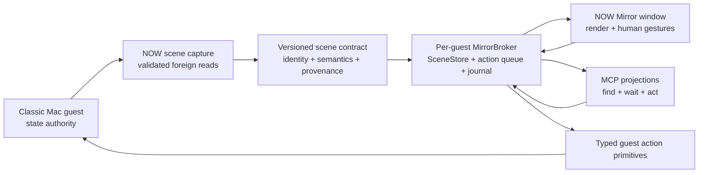
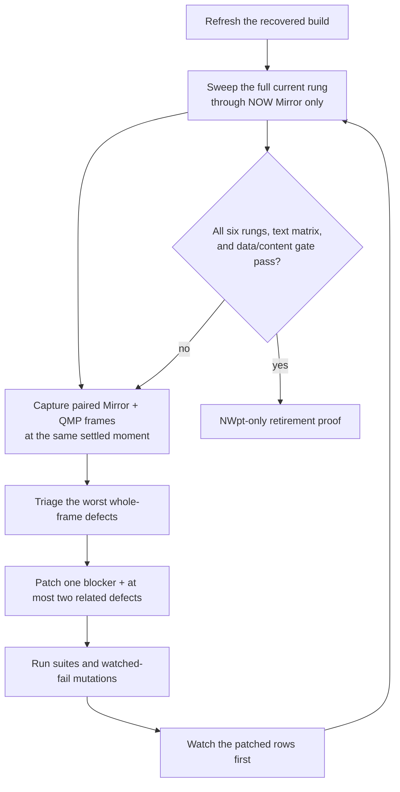

# NOW Mirror UX Completion - Plan

## Summary

Complete the recovered NOW Mirror as a faithful and operable classic Mac surface. The guest remains the authority for machine state. The NOW Mirror renders that state and mutates it through identity-bearing guest operations. Human gestures and MCP operations share one scene, one action catalog, one broker, and one truthful operation journal.

The work starts from recovered commit `2047b6b`. Its committed Cycle 18 ledger is the characterization baseline: 10 of 40 rows pass, 16 fail, 2 are blocked, 2 are not applicable, and 10 remain unscored. Execution is blocked until [the unified NOW Extension prerequisite](2026-08-03-002-feat-unified-now-extension-plan.md) has delivered and proven P1-P4, retired MirrorApp/port 1420/TB* runtime dependencies, and promoted the clean extension-only development image. This plan then consumes those artifacts and completes the broader broker, renderer, UX, and MCP campaign; bounded pixel exceptions remain a later roadmap unit.

## Status, 2026-08-05

**The prerequisite block is lifted and this plan is the live destination
again.** Execution was blocked until the unified NOW Extension had
"delivered and proven P1-P4". The resident now reports `cap 31` with all
five planes supported, and the interaction plane published its first
generation on 2026-08-05 — so U2 onward can proceed.

**One slice goes first:**
[011, A Mirror that survives being driven](2026-08-05-011-feat-a-mirror-that-survives-being-driven-plan.md).
A hand drive on 2026-08-05 ended with the guest deaf, acts queued 87
seconds deep, and the session dead after one ordinary Macintosh event.
Cycle 18 is a SCORING exercise, and a machine that wedges cannot be
scored — so survivability precedes fidelity, and 011 is deliberately
narrow so it does not become this plan.

**Update, later on 2026-08-05: the survivability detour is far enough
along that scoring can resume.** 011 § A and § F landed — the lane is
bounded and cancellable, and `serve` has a test seam, so a fix in that
band can be told from its neighbours. A deliberate re-drive of the same
wedge: **five acts across it answered in 2.1 s, none blocked**, against
87.5 s before.

It also found something 011 could not fix, which became
[012, Liveness below the application](2026-08-05-012-feat-liveness-below-the-application-plan.md):
the guest's deafness OUTLIVES the host's 75 s silence window, so the wire
died against a healthy Macintosh. 012's host half is done — a starved Mac
is now told apart from a gone one and the Mirror says which — and its
guest half is parked: the resident cannot be an OT client from a flat
INIT (a linker fact, not a metal one), and its interrupt-time vehicle
hung a boot and ships disarmed. Its "Picking this up cold" section
carries the state, the two named suspects and the rig commands.

**Update, 2026-08-06: two more subordinate slices, both landed.**
[013, A guest that notices instead of polling](2026-08-06-013-feat-a-guest-that-notices-instead-of-polling-plan.md)
took the guest's own cost apart, and
[014, A frame that does not wait for the Finder](2026-08-06-014-feat-a-frame-that-does-not-wait-for-the-finder-plan.md)
took the host's: the Mirror's cycle went from a 364 ms median to 25 ms,
and the symptom it was chasing — acts refusing because a long cycle
lapsed the act plane's ten-second lease — has its cause removed. Both
are emulator-verified and neither has run on metal. Relevant here
because a re-score is only meaningful on a machine whose acts bind; the
one thing still unproven is Michelle's own dialog act, which a drive
should re-test first.

**What that means for THIS plan: nothing is blocked.** A modal still ends
a session when the extension cannot answer for the machine, and that is a
known, documented gap rather than a wedge that stops work — the drive
loop's own rule is to record a blocker and step over it. U2 and U6 are
the live work, and **the Cycle 18 re-score is still the first thing U6
should do.**

**The Problem Frame below has aged well, which is the useful part.** Its
three named symptoms were re-observed by a person on 2026-08-05, two days
after they were written: Date & Time's controls, a popup that invokes the
wrong Toolbox part, and the Mail alert's wrong buttons. They are U6 rows,
not new defects, and they should not be re-investigated from scratch —
what they need is the authoritative semantics of U2 and the renderer of
U6, in that order.

What HAS changed under it: the guest now serves far more meaning than it
did (control classification through `kControlKindTag`, `window.display`
projected, the semantic transport rebuilt to type a whole window per
request rather than one control per scene), and the reason those gains
are not yet visible in the ledger is that nothing has re-scored Cycle 18
against them. **That re-score is the first thing U6 should do**, not the
last — the baseline it inherits is from a build that predates all of it.

## Problem Frame

The recovered branch has the NOW-owned Mirror window, guest scene production, object-first interactions, and a disciplined UX loop. It is not yet a polished emulator surface.

The remaining failures share three causes:

- The guest does not report enough authoritative meaning for foreign controls and dialog items. The host guesses roles, values, and default buttons from titles and geometry. A wrong guess changes both drawing and actuation.
- A sent request is sometimes shown as a successful mutation even when the guest state did not change. Other real mutations remain `outcome-unknown` because the operation has no settlement model.
- Human and MCP paths do not yet consume one canonical scene and one serialized action broker. Independent pollers or action controls can duplicate cooperative guest work and cross-fire against the guest's single act cell.

Cycle 18 makes these defects visible. Date & Time fields render as scroll bars. A popup renders as a button and invokes the wrong Toolbox part. The Mail alert shows the wrong default button. Background-window activation and Hide Others report success without changing the guest. Text focus works, but the value and selection do not.

## Product Contract

### Goal Capsule

**Goal:** A person can use NOW Mirror like a polished classic Mac emulator across the six-rung supported corpus while an agent can inspect and operate the same guest through MCP.

**Success signal:** The complete six-rung UX campaign passes with paired NOW Mirror and same-moment guest-framebuffer evidence. Every supported action either produces the expected guest state or reports an honest non-success outcome. Out-of-scope bitmap or manually drawn regions use declared placeholders whose bounds are checked against the guest capture. Unrecognized semantics degrade visibly and honestly.

**Non-negotiable:** Guest state is authoritative. Host inference may improve presentation only when labeled as host provenance, and it must never select a mutation path.

### Actors

- A1. **Person** uses the NOW Mirror window with ordinary pointing, keyboard, menus, window chrome, and text interactions.
- A2. **MCP agent** reads and mutates an explicitly addressed pinned guest through grants and the same underlying Mirror primitives after the direct interaction path is proven.
- A3. **Guest** owns the desktop, applications, windows, controls, content, focus, and effects of every mutation.

### Flows

- F1. **Observe and render.** The guest captures an authoritative scene. The host decodes it once, merges labeled host enrichment once, and renders the canonical snapshot.
- F2. **Human mutation.** A gesture resolves to an identity-bearing object. The shared action catalog selects a typed operation. The broker dispatches it, observes settlement, and refreshes the scene.
- F3. **Agent mutation.** MCP authorization admits an operation. The same catalog and broker execute it with agent attribution. The Mirror window observes the resulting canonical snapshot without a parallel poller.
- F4. **Concurrent use.** Human and agent reads share the scene cache. Mutations serialize fairly through one per-guest act cell. A session change refuses queued stale work.
- F5. **UX proof.** An agent looks at NOW Mirror and drives that window with keyboard and mouse input. It captures the same settled guest frame through QMP, compares the pixels and visible state, inspects logs and guest evidence, records the worst mismatch, and only then scores the row.
- F6. **Retirement handoff.** The prerequisite retains old source, fixtures, and an isolated comparison image while removing the old runtime from normal staging. This plan consumes its disposition ledger and NWpt-only proof; it does not reinstall the legacy stack as a live dependency.

### Requirements

#### State authority and fidelity

- R1. The guest provides the authoritative state for applications, menus, windows, chrome, controls, dialog items, text, Finder objects, and guest-rendered content.
- R2. Every scene field preserves `known`, `unknown`, `not reported`, `truncated`, and `stale` where those states differ; the host must not flatten them into empty or plausible values.
- R3. The scene carries exact semantic kinds and state needed to render and operate foreign controls and dialog items, including values, selection, checked state, editability, focus, and default-button identity when the guest can prove them.
- R4. The NOW Mirror must match the whole settled guest frame outside declared visual-exception regions; missing or incorrect text, labels, values, item kinds, chrome, structured draw content, and interactions fail fidelity.
- R5. Raw guest-pixel transport is out of scope for the core Mirror. Bitmap, PICT, and manually drawn background regions first use an explicit placeholder; a post-core roadmap unit may add bounded pixels for proven exceptions without suppressing adjacent semantic content or interaction.

#### Mutation and outcome truth

- R6. Every human or agent mutation resolves from the displayed snapshot through an observation-minted identity bound to the machine and guest session; dispatch revalidates that stable target and its advertised capability against the current snapshot.
- R7. The action catalog uses distinct operations for ordinary controls, popup tracking, Dialog Manager items, text, menus, Finder objects, app activation, application hide/show, and window chrome.
- R8. Unknown or unsupported semantic kinds refuse by name; no coordinate or generic-click fallback may make an unsafe action appear supported.
- R9. Each operation has a correlation ID, source attribution, lifecycle timestamps, terminal outcome, reason, and elapsed time.
- R10. Dispatch acknowledgement is not success. An operation may report confirmed, dispatched-but-unconfirmed, refused, timed out, cancelled, session-changed, or unknown according to evidence.
- R11. Operations with observable postconditions settle against a fresh guest snapshot. A display timeout does not erase a later guest-confirmed success.

#### Shared human and agent surface

- R12. One broker per pinned guest session owns scene polling, enrichment, content ownership, action serialization, operation settlement, and the journal.
- R13. The NOW Mirror UI and MCP projections consume the same snapshot IDs, completeness, object references, and operation records.
- R14. MCP authorization remains above the broker. A local human gesture does not impersonate an agent, and an agent act remains visible without manufacturing a human gesture.
- R15. Context operations include status, scene, object search, snapshot-aware wait, and a Mirror-rendered shot that is distinct from guest-framebuffer evidence.
- R16. Concurrent human and agent use must not duplicate guest polls, cross-fire acts, starve mutations behind bulk content, or misattribute an operation.
- R17. An open Mirror is pinned to one guest key and session; changing NOW's active-guest picker must not silently retarget its scene, title, queued work, or action plane.
- R18. Keyboard-and-mouse interaction through the NOW Mirror is the implementation priority; MCP parity may share a slice when cheap, but it cannot delay or substitute for the direct interaction path.

#### UX proof and migration

- R19. `docs/mirror-drive-loop.md` owns behavioral acceptance: the agent must look at and operate NOW Mirror with keyboard and mouse, QMP is observation-only, and a row can pass only after paired pixels, state, logs, and guest evidence agree.
- R20. The campaign must pass all six rungs and the complete text matrix while retaining every prior pass: windows, Finder, Apple control panels, modal alerts, representative applications, and background applications.
- R21. Each new guard is watched failing under a deliberate mutation before it is accepted.
- R22. MirrorApp, `--serve`, port 1420, the TB* components, and compatibility forwarding are absent before this plan resumes. Their registry-derived disposition ledger and NWpt-only proof are prerequisite artifacts; this plan verifies continued absence while adding only remaining broker/MCP host projections.
- R23. Contract coverage, MCP coverage, the open-issues ledger, README capability limits, and durable Mirror knowledge change in the same arc as the behavior they describe.
- R24. Verification reports `Builds`, `Tested`, and `Metal-verified` separately. This plan does not authorize a hardware run.

### Scope Boundaries

**In scope**

- PPC guest scene semantics, structured draw operations, resident act primitives, NOW wire contract, host broker, MirrorKit model and rendering, NOW Mirror UI, MCP projections, UX harness, and old-stack retirement.
- Cycle 18 failures plus later failures exposed by the six-rung campaign.
- Semantic content, resource-derived art, structured QuickDraw data, and explicit visual-exception placeholders.

**Deferred until after the first-party semantic gate, but still inside this roadmap**

- Broad third-party application coverage beyond the representative rung-5 set. The implementation must avoid application-name-specific render or act paths, while unrecognized semantics remain honestly unsupported under R8 until separately accepted.

**Out of scope for core completion**

- App Intents as a shipped face.
- Arbitrary Apple Events as an automation escape hatch.
- QMP, raw wire commands, or the guest console as a product mutation path.
- Agent control of guest consent, macOS authorization, or platform authentication dialogs.
- A visual redesign that makes the Mirror feel native to modern macOS at the cost of classic Mac fidelity.
- Raw guest-pixel, framebuffer-region, pixel-island, or PICT-byte transport during U1-U8. U9 is the only later roadmap entry for that work.

**Post-core roadmap**

- Bounded guest-pixel transport for proven visual exceptions begins only after U1-U8 complete. It does not gate the data-driven core or replace a semantic/action obligation.

### Acceptance Examples

- AE1. When Date & Time reports a popup menu, text fields, and a default button, the Mirror renders those exact kinds and values. Opening the popup uses popup semantics and changes the guest selection.
- AE2. When the Mail setup alert is visible, the Mirror shows all guest-reported content and rings the guest-reported default button. Return invokes that button. A pointer click invokes the selected dialog item through the Dialog Manager path.
- AE3. When two Finder windows are open, clicking the background window title activates that exact guest window. The operation is not confirmed until the front-window state changes.
- AE4. When Hide Others cannot be proven, the UI reports dispatched-but-unconfirmed or a named refusal. It never shows a success checkmark from send completion alone.
- AE5. When a text field is active, the person can place the caret, select, type, edit, delete, tab, and commit. The Mirror and guest framebuffer show the same value and focus state after each settled step.
- AE6. When a guest reports an unknown control kind, the Mirror renders an honest unsupported representation and refuses a mutation that depends on a guessed kind.
- AE7. When an action times out in the host display window and the cooperative guest later reaches the expected state, the journal retains the timeout and records the later observed settlement.
- AE8. When a person and an MCP agent act concurrently, one fair queue orders the acts. Each result retains its source and target. Both surfaces render the same resulting snapshot.
- AE9. When a bitmap, PICT, or manually drawn background cannot be expressed as data, the Mirror shows a bounded unavailable-visual placeholder and records its kind and reason. The guest capture proves the bounds, while surrounding text, controls, and interactions remain fully scored.
- AE10. When old Mirror services are removed, every former service method and UI affordance has a NOW disposition and the NWpt-only campaign passes without port 1420 or TB* components.
- AE11. When an MCP operation succeeds without the agent looking at and operating the Mirror window, the result may prove a broker primitive but cannot make any UX-loop row pass.
- AE12. When an application is labeled an exception, only the declared raw-visual region is excepted. Missing semantic state, structured draw content, or actions still fail the row.

## Planning Contract

### Key Technical Decisions

- KTD1. Introduce scene IR v2 because v1 requires a `role` value that NOW cannot prove. V2 makes semantic kind and action capability independently optional, preserves honest unknowns, and keeps v1 decoding as approximate read-only compatibility. Covers R1-R3 and R8.
- KTD2. Remove role, default-button, and action selection guesses from consumers. Presentation-only fallback must carry host provenance and cannot enter hit testing or `InteractionPolicy`. Covers R2-R4 and R8.
- KTD3. Introduce one pinned per-guest-session `MirrorBroker` with a `SceneStore`, coalescing poller, enrichment seam, content owner, serialized action queue, settlement evaluator, and bounded journal. Covers R12-R17.
- KTD4. Give the displayed snapshot a lease for interaction. Enqueue the identity the person actually saw, then require the same machine and session and revalidate stable identity and advertised capability against the current snapshot at dispatch. A newer generation alone is not stale. Covers R6 and R16.
- KTD5. Keep one typed action catalog, but preserve distinct Toolbox implementations. `TrackControl`, popup CDEF tracking, Dialog Manager items, TextEdit, menu patches, window parts, and Process Manager operations must not collapse into generic click. Covers R7-R8.
- KTD6. Model outcome as an evidence-backed lifecycle. Write a start record before waiting, one primary terminal record, and optional later settlement evidence without rewriting history. Covers R9-R11.
- KTD7. Place source-specific authorization above the shared broker. MCP keeps grant and consent checks; local human input uses the same primitive without entering the MCP authorization model. Covers R13-R14.
- KTD8. Keep the core Mirror data-driven. Semantic objects and structured draw operations own rendering and interaction; raw visual regions first get bounded placeholders and exception records. Pixel transport is a post-core exception expansion and never a competing action target. (session-settled: user-directed — chosen over pixel-first completion: stateful data-driven behavior must be proven before later pixel piping.) Covers R4-R5.
- KTD9. Use the breadth-first drive loop as the execution rhythm. The scored agent drives NOW Mirror by keyboard and mouse and reconciles Mirror pixels, the guest capture, state, and logs before marking a row green. MCP-only actuation is insufficient. Sweep before editing, then patch the blocker plus at most two related defects. (session-settled: user-directed — chosen over MCP-only verification: MCP-only agents missed visible UX and fidelity failures.) Covers R19-R21.
- KTD10. Retire the old stack through a strict strangler gate. Compatibility code remains readable and runnable until every method and affordance has a disposition and the NWpt-only proof passes. Covers R22-R23.
- KTD11. Build and prove the input-device path before MCP parity. A unit may add its MCP projection in the same pass only when it is a thin adapter over the proven broker primitive and does not delay the keyboard-and-mouse result. (session-settled: user-directed — chosen over MCP-first implementation: direct Mirror interaction is the product path and the stronger defect detector.) Covers R13 and R18.

### High-Level Technical Design

#### Canonical state and action path

The guest scene producer gains a semantic layer beside the current validated structural walk. DITL and Control Manager facts enter the scene only when the guest can prove them. The versioned contract preserves absence and provenance. `MirrorBroker` decodes one canonical `MirrorSnapshot` and exposes read-only projections to the renderer and MCP.

Both mutation faces resolve a `MirrorObject` from the displayed snapshot. The broker checks the active machine and session, then revalidates stable identity and capability against the current snapshot. It serializes the typed operation through the guest act plane. A settlement policy compares a fresh snapshot with an operation-specific postcondition where one exists.

```mermaid
stateDiagram-v2
    [*] --> Requested
    Requested --> Queued
    Queued --> Cancelled: source cancels before dispatch
    Queued --> SessionChanged: machine or session invalid
    Queued --> Started
    Started --> Refused: validation or guest refusal
    Started --> Dispatched
    Dispatched --> Confirmed: fresh snapshot satisfies postcondition
    Dispatched --> DispatchedButUnconfirmed: dispatch proven; no honest postcondition
    Dispatched --> TimedOut: display window expires
    Dispatched --> Unknown: dispatch or outcome evidence incomplete
    note right of TimedOut
      Later settlement evidence augments
      the terminal timeout record.
    end note
    TimedOut --> [*]
    Refused --> [*]
    Cancelled --> [*]
    SessionChanged --> [*]
    Confirmed --> [*]
    DispatchedButUnconfirmed --> [*]
    Unknown --> [*]
```

#### UX implementation rhythm

### System-Wide Impact

- **Contract:** Scene IR v2 and operation outcomes affect guest encoding, host decoding, compatibility fixtures, conformance, and coverage.
- **Resident components:** Semantic reads, structured draw data, and new action paths must keep validated foreign-memory boundaries and shared-header layout assertions.
- **Cooperative scheduling:** One poller and one action queue reduce duplicated guest work. The broker must yield while targets run and must not busy-wait.
- **Host ownership:** `NOWMirrorSource` becomes a projection over the broker rather than an independent scene and action owner.
- **Agent surface:** MCP reads and acts become projections of the canonical Mirror model. Authorization remains separate from execution.
- **Migration:** Legacy Mirror lifecycle UI and forwarding remain until U8. No incremental cleanup may remove the differential reference early.
- **Privacy:** The journal records bounded action classes and targets. It must not record typed text, file contents, arbitrary paths, or wire payloads.

### Risks and Dependencies

- Foreign ControlRecord and DITL layouts can be misread across system versions. New reads require a published layout or a bounded measured proof, validation, native fixtures, and emulator characterization.
- Exact control type may require `contrlDefProc` or resource metadata that the current walk deliberately omits. If the guest cannot prove a type safely, the contract must remain unknown and the associated mutation must refuse.
- Some Toolbox operations mean “the application was asked,” not “the visible effect completed.” Settlement policy must not erase that distinction.
- Structured draw streams can increase wire volume and staleness. They need bounded records, clipping, invalidation, and explicit fallback to a placeholder when a visual cannot be represented honestly as data.
- Reconnects can invalidate queued refs while the UI still displays an older frame. Machine and session validation plus current-target revalidation are required at dispatch.
- A successful host suite does not prove guest behavior. Each UX-bearing unit requires the paired emulator loop in addition to automated gates.
- The original Mirror prototype is evidence, not current NOW behavior. Port its measured mechanisms only through NOW's contract and tests.

### Prerequisite boundary and unit ownership

[Unified NOW Extension prerequisite 002](2026-08-03-002-feat-unified-now-extension-plan.md)
must reach its Definition of Done before any unit below executes. Its focused
keyboard/mouse corpus is the regression floor, not a substitute for this plan's
broader six-rung campaign. Shared behavior has one owner:

| this unit | consumes from prerequisite 002 | ownership retained here |
|---|---|---|
| U1 | derived legacy ledger, R28 evidence gate, frozen focused corpus | preserve Cycle 18 and extend the broad human/MCP catalog; no gate or retirement-ledger rewrite |
| U2 | validated P2 facts, formats, refusals, and Date & Time/Apple fixtures | scene IR v2, broad normal-context translation, decoder knowledge states, and noninteractive host presentation |
| U3 | truthful plane lifecycle plus guest settlement source | per-session host broker, snapshot/cache, poll coalescing, pinning, and host enrichment |
| U4 | application-owned bounded settlement records from P4 | fair host action queue, journal, late settlement presentation, and human/agent attribution |
| U5 | typed resident/guest actions for popup, dialog, text, menu, application visibility, and window operations | MirrorKit gesture/key routing and broker integration across the full Cycle 18 interaction set |
| U6 | authoritative P2/P3 semantics and the known-good Workshop/menubar floor | full classic-Mac renderer, hit testing, fixtures, icon treatment, and whole-frame fidelity |
| U7 | lifecycle-safe initial P3 structured display and bounded placeholder contract | broad structured-content coverage across representative/background applications; no resident ABI or pixel transport |
| U8 | extension-only image, retired staging/host lifecycle, and focused direct proof | MCP adapters over the proven broker, broad cross-surface parity, documentation, and continued-absence verification |
| U9 | no implementation dependency; begins only after core completion | later optional bounded pixel exceptions; never load-bearing for normal applications |

`contract/peek_table.h`, resident sources, NOW's plane policy/status surfaces,
focused P4 settlement, legacy staging removal, and the canonical development
image belong exclusively to prerequisite 002. `MirrorBroker`, the broad action
queue/journal, full renderer and application corpus, MCP projection, and later
pixel exceptions belong here.

## Implementation Units

### U1. Freeze the parity and characterization baseline

**Goal:** Turn the recovered Cycle 18 evidence and old Mirror inventory into an executable coverage map.

**Requirements:** R19-R23.

**Dependencies:** Unified NOW Extension prerequisite 002 complete, including
its U1 ledger/evidence guards and U7 focused proof.

**Files:**

- `docs/local/mirror-sweep-state.json`
- `docs/local/mirror-drive-notes.md`
- `docs/mcp-coverage.md`
- `docs/contract-coverage.md`
- `now-host/Sources/NOWAgentIntegration/Projection/MirrorActProjections.swift`
- `now-host/Tests/HostTests/MirrorActProjectionTests.swift`
- `now-host/Tests/HostTests/MCPCoverageTests.swift`

**Approach:**

- Preserve Cycle 18 rows as the before-state. Do not relabel existing failures while implementing.
- Measure queue wait under the recovered scene, capture, and command workload. Record the baseline used by U4 and keep the invariant that no new poll or bulk chunk starts ahead of a queued act.
- Consume the prerequisite's immutable focused corpus and evidence-manifest
  guard; extend coverage only for broad-plan rows without weakening its R28
  correlation or direct-input provenance.
- Derive a matrix from the current NOW Mirror affordances and current MCP
  projections, joined to the prerequisite's old-method ledger rather than
  rebuilding it.
- Give each remaining broad UI/MCP affordance a broker projection or explicit
  divergence. Legacy runtime disposition remains owned by prerequisite 002.
- Add structural tests that fail when either the human or MCP face gains an unregistered action or context operation.

**Test scenarios:**

- Removing one current Mirror action row fails the parity test.
- Adding a UI affordance without a catalog disposition fails.
- Adding an MCP method without a broker projection or explicit divergence fails.
- A row with MCP-only input, a missing Mirror frame, a missing guest frame, uncorrelated logs, or no keyboard/mouse provenance refuses to score.

**Verification:** Run the focused host parity and MCP coverage tests. Watch one deliberate registry mutation fail. U1 is complete when the matrix is derived from code and Cycle 18 remains reproducible.

### U2. Add guest-authoritative scene semantics

**Goal:** Replace host guesses with proven control, dialog, text, and chrome facts from the guest under scene IR v2.

**Requirements:** R1-R3, R6, R8.

**Dependencies:** U1 and prerequisite 002's validated P2 artifact.

**Files:**

- `contract/asyncapi.yaml`
- `mirror/docs/IR-V1.md`
- `mirror/docs/IR-V2.md` (new)
- `mirror/host/MirrorKit/Sources/MirrorKit/IRSchema.swift`
- `mirror/host/MirrorKit/Sources/MirrorKit/Scene.swift`
- `now-guest-ppc/src/axwalk/axwalk.h`
- `now-guest-ppc/src/axwalk/axwalk.c`
- `now-guest-ppc/src/scene/scene.h`
- `now-guest-ppc/src/scene/scene_collect.c`
- `now-guest-ppc/src/scene/scene_walk.c`
- `now-guest-ppc/src/scene/scene_json.c`
- `now-guest-ppc/tests/scene_walk_test.c`
- `now-guest-ppc/tests/scene_json_test.c`
- `mirror/host/MirrorKit/Tests/MirrorKitTests/FixtureTests.swift`
- `now-host/Tests/HostTests/SceneIRDecodeTests.swift`
- `now-host/Tests/HostTests/GuestWireConformanceTests.swift`

**Approach:**

- Define IR v2 fields for semantic kind, advertised action capability, state, value, selection, focus, defaultness, provenance, and completeness.
- Add bounded DITL and control-definition reads only where the guest can validate layout and ownership.
- Consume prerequisite 002's validated P2 response facts when passive
  foreign-memory reads cannot safely prove a fact in the NOW application. Do
  not extend the resident ABI here.
- Keep structural controls and dialog items distinct when their actuation paths differ.
- Add a normative IR-v2 knowledge-state table. Define the JSON representation, applicable field or plane, decoder type, actionability, and v1 mapping for known, unknown, not reported, truncated, and stale.
- Remove `guess_role` from the action-bearing path. Keep a presentation fallback only if it is provenance-labeled and non-interactive.

**Test scenarios:**

- Date & Time encodes popup, edit text, static text, checkbox/radio, and default button with values.
- A dialog with no provable default omits defaultness.
- A malformed or truncated DITL retracts the affected plane and records an error.
- A control with an unreadable definition remains unknown and unactionable.
- V1 scenes decode as approximate read-only state and cannot authorize an action from guessed roles.
- V2 scenes decode only after the major-version gate; an unknown major still refuses before decode.

**Verification:** Run guest native scene tests, MirrorKit fixtures, host decode tests, contract tests, and guest wire conformance. Add new native tests to `scripts/test-native`. Watch mutations that restore role guessing, flatten unknown into empty, and misclassify a dialog item fail.

### U3. Introduce the canonical Mirror broker and snapshot

**Goal:** Make one per-guest owner of scene state, enrichment, content, and snapshot-aware context operations.

**Requirements:** R12-R18.

**Dependencies:** U2.

**Files:**

- `now-host/Sources/Host/MirrorBroker.swift` (new)
- `now-host/Sources/Host/MirrorSnapshot.swift` (new)
- `now-host/Sources/Host/MirrorSceneStore.swift` (new)
- `now-host/Sources/Host/GuestListener.swift`
- `now-host/Sources/Host/NOWMirrorSource.swift`
- `now-host/Sources/Host/HostAppState.swift`
- `now-host/Sources/NOWAgentIntegration/Projection/MirrorObserveModels.swift`
- `now-host/Sources/NOWAgentIntegration/Projection/ObserveElementsProjection.swift`
- `now-host/Tests/HostTests/NOWMirrorSourceTests.swift`
- `now-host/Tests/HostTests/SceneWireTests.swift`
- `now-host/Tests/HostTests/AgentIntegrationActLaneTests.swift`

**Approach:**

- Keep `MirrorBroker` in the Host target and make the NOW Mirror its first consumer. U8 adds the lower-level DTO and local-protocol adapter for MCP after the direct path is proven.
- Move scene polling, decode, host enrichment, freshness, and content ownership out of `NOWMirrorSource` into `MirrorBroker`, `MirrorSceneStore`, and `MirrorSnapshot`.
- Stamp snapshots with machine identity, guest session, sequence, digest, capture time, completeness, and provenance.
- Add GuestKey-addressed scene and command entry points to `GuestListener`; make pending scene, command, and transfer state session-scoped.
- Maintain a broker registry keyed by guest key and session. An open Mirror stays pinned. The active picker only selects which broker an explicit `Open Mirror for Current Guest` action creates or focuses.
- Coalesce simultaneous refreshes. Expose status, scene, find, wait, and rendered-shot projections without creating another poller.
- Preserve Finder host enrichment as a labeled contribution merged once. It cannot override guest-authoritative fields.
- Define the Mirror state matrix for first-scene loading, fresh, partial or truncated, stale while retrying, disconnected, session-changed, and recovered. For each state, specify retained-frame treatment, visible status, and action availability.
- Make replacement of the pinned session terminate waits and invalidate queued work with a named session outcome. A picker-only change does neither.

**Test scenarios:**

- The Mirror UI, its status, object search, wait, and rendered shot expose the same snapshot ID, digest, refs, completeness, and staleness.
- Concurrent refresh and wait requests cause one guest poll.
- A disconnect or active-guest replacement wakes waiters with a session-changed result.
- Changing NOW's active guest leaves the open Mirror pinned and opens a new binding only through an explicit action.
- Repeated `Open Mirror for Current Guest` focuses the already pinned window instead of duplicating the broker.
- Loading, partial, stale, disconnected, session-changed, and recovered snapshots have distinct visible states and action availability.
- Host enrichment collision preserves the guest value and records provenance.
- A Mirror-rendered shot identifies its snapshot and is not labeled as a guest framebuffer.

**Verification:** Run focused broker, scene wire, Mirror source, and agent integration tests. Watch a duplicate-poller mutation fail.

### U4. Add the shared action broker and truthful settlement

**Goal:** Serialize all human and agent mutations and report only evidence-backed outcomes.

**Requirements:** R6-R11, R14, R16.

**Dependencies:** U3.

**Files:**

- `now-host/Sources/Host/MirrorBroker.swift`
- `now-host/Sources/Host/MirrorOperation.swift` (new)
- `now-host/Sources/Host/MirrorOperationJournal.swift` (new)
- `now-host/Sources/Host/MirrorActionQueue.swift` (new)
- `now-host/Sources/Host/GuestListener.swift`
- `now-host/Sources/Host/Automation/AgentIntegrationActControl.swift`
- `now-host/Sources/Host/NOWMirrorSource.swift`
- `contract/asyncapi.yaml`
- `now-host/Tests/HostTests/AgentActivityModelTests.swift`
- `now-host/Tests/HostTests/AgentIntegrationActLaneTests.swift`

**Approach:**

- Define wire outcomes first in `contract/asyncapi.yaml`, then update guest encoding, host decoding, fixtures, and conformance before projecting them into UI or MCP.
- Define the operation lifecycle, fair queue, and bounded journal as separate broker-owned components.
- Route the NOW Mirror's control, menu, text, and window acts through one fair serialized queue. Keep source attribution in the primitive so U8 can add MCP without changing semantics.
- Bind targets to machine, session, displayed-snapshot provenance, and object ref at enqueue.
- Enqueue against the displayed-snapshot lease. At dispatch, revalidate machine, session, stable ref, and advertised capability against the current snapshot; do not refuse only because the generation advanced.
- Add per-action settlement policies. Use fresh-snapshot postconditions where visible state can prove success. Use dispatched-but-unconfirmed where the guest can prove only that the application was asked.
- Keep late settlement evidence after a display timeout.
- Record source, action class, bounded target identity, timestamps, outcome, reason, and latency. Do not record raw text or payloads.
- Keep the most recent human action and its evolving outcome visible. Named refusal and timeout reasons remain inspectable. Agent-attributed records enter the journal without replacing human feedback. A later settlement visibly augments the timed-out record.

**Test scenarios:**

- Two simultaneous broker actions execute in queue order and retain correct attribution; U8 supplies the cross-surface case.
- A stale queued ref refuses before dispatch.
- A harmless background refresh does not invalidate the object the person visibly targeted.
- Send completion without state change is not confirmed.
- A real state change after display timeout produces a later confirmed settlement record.
- A target that never enters the expected trap reports the guest refusal reason.
- A bulk content transfer does not starve an act.
- Once an act is queued, no new poll or bulk chunk begins ahead of it. Queue wait and guest execution time are recorded separately and checked against the emulator baseline captured in U1.
- Every lifecycle state has a distinct UI presentation, and an agent action cannot overwrite the latest human-action feedback.

**Verification:** Run focused operation, activity, act-lane, and projection tests. Watch false-success and lost-late-success mutations fail.

### U5. Close the Cycle 18 interaction gaps

**Goal:** Implement typed guest operations for the first-party failures before broadening the visual campaign.

**Requirements:** R6-R11 and R19-R21.

**Dependencies:** U2, U4, and prerequisite 002's completed typed P4 operations
and focused settlement proof.

**Files:**

- `mirror/host/MirrorKit/Sources/MirrorKit/InteractionPolicy.swift`
- `mirror/host/MirrorKit/Sources/MirrorKit/ObjectResolver.swift`
- `mirror/host/MirrorKit/Sources/MirrorKitUI/KeyCapture.swift`
- `mirror/host/MirrorKit/Tests/MirrorKitTests/InteractionPolicyTests.swift`
- `mirror/host/MirrorKit/Tests/MirrorKitTests/HitActionTests.swift`
- `mirror/host/MirrorKit/Tests/MirrorKitUITests/KeyCaptureTests.swift` (new)
- `now-guest-ppc/tests/act_args_test.c`

**Approach:**

- Integrate the prerequisite's separate popup, Dialog Manager, same-app
  activation, window, application visibility, and TextEdit operations into
  MirrorKit's gesture/key paths and the host broker.
- Treat prerequisite 002's resident table, patch set, guest commands, exact
  refusals, and Portal-derived mechanisms as immutable inputs to this unit.
- Keep exact-target, no-hijack, stale-ref, and app-never-entered-trap refusals.
- Define a visible postcondition for each Cycle 18 action where guest state can prove one.
- Preserve a keyboard-routing matrix for text, Return and Enter, Tab, Escape, arrows, navigation keys, guest Command shortcuts, key-up/modifiers, no-focus input, and macOS-reserved combinations.
- Define transient gesture states for menu and popup open-highlight-select-cancel, slider and scroll-bar press-drag-release, window move/resize preview, outside-click/Escape cancellation, disabled targets, and session change mid-gesture.

**Test scenarios:**

- Popup selection uses popup semantics and changes the guest value.
- Mail modal pointer click invokes the addressed dialog item; Return uses guest defaultness.
- Clicking a background Finder window activates that exact window.
- Hide, Show, and Hide Others confirm only after process visibility changes.
- Close asks the application and reports `dispatched-but-unconfirmed` when a save alert keeps the window open.
- Text selection, typing, deletion, tab, and commit preserve the correct field and value.
- Wrong process, wrong control, stale ref, and missing trap all refuse without hijacking another target.
- Host-reserved keyboard combinations stay local, guest shortcuts reach the guest, and an unsupported routing case is visibly refused.
- Active tracking gestures cancel safely on outside click, Escape, disabled state, or session change.

**Verification:** Run guest native act tests, MirrorKit policy/hit tests, host broker tests, and guest builds. Re-run Cycle 18 interaction rows through R19 before accepting the unit.

### U6. Render authoritative semantics with classic Mac fidelity

**Goal:** Make the NOW Mirror frame faithfully express the semantics added in U2.

**Requirements:** R3-R4 and R19-R21.

**Dependencies:** U2, U3, and U5.

**Files:**

- `mirror/host/MirrorKit/Sources/MirrorKitUI/SceneRenderer.swift`
- `mirror/host/MirrorKit/Sources/MirrorKitUI/SceneView.swift`
- `mirror/host/MirrorKit/Sources/MirrorKitUI/LiveMirror.swift`
- `mirror/host/MirrorKit/Sources/MirrorKit/WindowChrome.swift`
- `mirror/host/MirrorKit/Sources/MirrorKit/Scene.swift`
- `mirror/host/MirrorKit/Tests/MirrorKitTests/FixtureTests.swift`
- `mirror/host/MirrorKit/Tests/MirrorKitUITests/` (new semantic render fixtures)
- `now-host/Tests/HostTests/SceneRenderTests.swift`
- `now-host/Tests/HostTests/SceneHitTestTests.swift`
- `scripts/test-host`
- `tools/mirror-diff`

**Approach:**

- Remove title-based default-button and shape-based role guesses.
- Render authoritative push buttons, default buttons, checkboxes, radio buttons, popup menus, editable/static text, group boxes, lists, sliders, steppers, tabs, scroll bars, and help controls.
- Use guest values, focus, selection, enablement, and z-order. Unknown kinds render honestly and do not expose a false hit target.
- Replace `LiveMirror`'s host-owned Finder selection with guest selection. A pending local affordance may be drawn only when it cannot be mistaken for confirmed guest state.
- Make renderer, hit tester, and `ObjectResolver` consume one guest-authored window presentation and chrome-capability model.
- Replace generic Finder glyphs with guest- or resource-derived icon art while preserving item identity.
- Add deterministic host render fixtures for structure and geometry. Use paired screenshots for the actual fidelity verdict.
- Add `swift test --package-path mirror/host/MirrorKit` or an equivalent package-test invocation to `scripts/test-host`; the current host gate does not execute MirrorKit's dependency-package tests.

**Test scenarios:**

- Date & Time and Appearance fixtures render every label, value, kind, default ring, and focus state.
- The Mail alert renders its full content and actual default button.
- A present-but-unknown control does not become a button or scroll bar.
- Finder selection changes only when a newer guest snapshot reports it; local pointer state cannot confirm selection.
- Finder applications, documents, folders, and disks use correct art and remain selectable/openable.
- A semantic frame regression fails even when hit testing still works.

**Verification:** Run MirrorKit and host render/hit suites. Watch mutations restoring title/shape guesses fail. Complete rungs 1-4 and the text matrix with paired evidence.

### U7. Complete data-driven content and the full UX ladder

**Goal:** Render remaining structured guest content, account for raw-visual exceptions, and pass representative applications and background-app use.

**Requirements:** R4-R5 and R19-R21.

**Dependencies:** U6 and prerequisite 002's lifecycle-safe initial P3 display.

**Files:**

- `now-guest-ppc/src/scene/`
- `mirror/host/MirrorKit/Sources/MirrorKit/Scene.swift`
- `mirror/host/MirrorKit/Sources/MirrorKitUI/SceneRenderer.swift`
- `mirror/host/MirrorKit/Tests/MirrorKitTests/FixtureTests.swift`
- `mirror/host/MirrorKit/Tests/MirrorKitUITests/` (new display and placeholder fixtures)
- `docs/local/mirror-sweep-state.json`
- `docs/local/mirror-drive-notes.md`

**Approach:**

- Start from the prerequisite's captured initial-display fixture and validated
  P3 epoch contract before extending broad application coverage.
- Consume NOW's bounded structured draw operations for text and primitives;
  do not change the resident ABI in this unit.
- Represent bitmap, PICT, CopyBits-only, and manually drawn background regions with a data record containing bounds, visual kind, provenance, and a reason code. Render a classic-Mac-appropriate unavailable-visual placeholder.
- Do not add region capture, pixel islands, framebuffer bytes, or a runtime dependency on Mirror's old `WireClient`, W1 pager, or port 1420.
- Keep semantic objects and actions live around and above a placeholder. An exception record never masks missing semantic coverage.
- Continue the breadth-first campaign through Apple System Profiler, Sherlock 2, Stickies, Network Browser, QuickTime Player honesty cases, and background applications.

**Test scenarios:**

- About ColorSync's unsupported visual region produces a correctly bounded placeholder while all available text, window state, and actions remain scored.
- A stale or superseded structured draw list never overlays a newer semantic frame.
- Oversized or unsupported draw content reports truncation or a visual exception rather than silently corrupting the scene.
- Structured draw data from the wrong guest key, session, window ref, or generation is refused before render.
- Rung-5 applications preserve content, focus, menus, windows, and supported interactions.
- Background applications remain visible and action targets retain the correct process.
- An application-name exception cannot turn missing controls, values, labels, or actions into a pass.

**Verification:** Run display-list, placeholder, fixture, and host/guest gates. Complete rungs 5-6 and then re-run rungs 1-4 and the text matrix. Paired guest evidence must validate each declared placeholder's bounds and prevent exception creep under R19.

### U8. Prove agent parity and continued legacy absence

**Goal:** Project the proven direct broker through MCP and verify the
prerequisite's legacy-runtime absence remains intact through the broad campaign.

**Requirements:** R12-R18 and R22-R24.

**Dependencies:** U1-U7.

**Files:**

- `now-host/Sources/Host/HostAppState.swift`
- `now-host/Sources/NOWAgentIntegration/Projection/`
- `now-host/Sources/NOWAgentIntegration/AgentIntegrationLocalProtocol.swift`
- `now-host/Sources/NOWAgentIntegration/AgentIntegrationLocalClient.swift`
- `now-host/Sources/NOWAgentIntegration/AgentIntegrationCaptureModels.swift`
- `now-host/Sources/NOWAgentIntegration/Projection/AgentIntegrationClient.swift`
- `now-host/Sources/NOWAgentCompanion/SocketAgentIntegrationClient.swift`
- `now-host/Tests/HostTests/MirrorActProjectionTests.swift`
- `now-host/Tests/HostTests/MCPCoverageTests.swift`
- `now-host/Tests/HostTests/CaptureProjectionTests.swift`
- `docs/mcp-coverage.md`
- `docs/contract-coverage.md`
- `docs/open-issues.md`
- `docs/mirror-knowledge.md`
- `docs/scene-producer.md`
- `README.md`
- `now-host/Package.swift`

**Approach:**

- Define shared broker DTOs in `NOWAgentIntegration`, extend the local client/server and companion socket path, and project status, scene, find, wait, rendered shot, and supported acts from the Host-owned `MirrorBroker` through MCP.
- Stage scene documents and rendered shots behind bounded 8 KiB pages so the 16 KiB local-protocol cap is never exceeded. Repeat snapshot ID, byte count, digest, and expiry on each page; validate offsets and final digest; read the staged snapshot without polling again; support abandon and expiry.
- Require each MCP request to name a guest key and session, then route it to the same pinned broker used by the corresponding Mirror window.
- Treat MCP work as a thin parity adapter. If an adapter exposes a missing or broken direct interaction, fix and re-prove the direct path before continuing parity work.
- Keep MCP consent and grants at the adapter boundary. Verify human and agent concurrency and attribution.
- Consume every closed prerequisite disposition; do not reopen its legacy
  lifecycle UI or reinstall a differential runtime.
- Verify the promoted NWpt-only image still lacks the TB* components, Mirror
  agent, MirrorApp, `--serve`, port 1420, and compatibility forward.
- Run the full automated gate and the full paired UX campaign on that image.
- If a legacy dependency reappears, fail and route the regression back to the
  prerequisite-owned absence guard; this unit does not own staging removal.
- Update published capability and unverified-state documentation in the same commit.
- Reconcile stale vendoring, scene-producer, and open-issues claims against the live recovered code.

**Test scenarios:**

- MCP scene/find/wait and the UI share snapshot identity and refs.
- A scene larger than 16 KiB and a rendered PNG cross the local socket through staged pages without changing snapshot ID; corrupt, expired, out-of-range, and abandoned fetches refuse.
- MCP and human acts serialize and report correct sources.
- Removing a projection or UI disposition fails parity coverage.
- NOW starts and completes the six-rung campaign with no old service or port.
- A missing former method is named by the retirement gate rather than discovered after deletion.

**Verification:** Run the parity suites, `scripts/test-all`, a clean NWpt-only spin-up, and the complete R19 campaign. Report the result as `Tested`. Metal verification remains a separate explicitly authorized run.

### U9. Add bounded pixel support for proven exceptions

**Goal:** After the data-driven Mirror is complete, optionally replace selected visual placeholders with bounded guest pixels without weakening semantic or interaction coverage.

**Requirements:** R4-R5 and R19-R21.

**Dependencies:** U1-U8 complete and the core Definition of Done satisfied.

**Files:**

- `contract/asyncapi.yaml`
- `contract/content_table.h`
- `now-guest-ppc/src/screenshots/capture.c`
- `now-guest-ppc/src/screenshots/screenshots_module.c`
- `now-host/Sources/Host/GuestListener.swift`
- `mirror/host/MirrorKit/Sources/MirrorKit/Scene.swift`
- `mirror/host/MirrorKit/Sources/MirrorKitUI/SceneRenderer.swift`
- `mirror/host/MirrorKit/Tests/MirrorKitTests/PixelIslandTests.swift`
- `mirror/host/MirrorKit/Tests/MirrorKitTests/IslandLifecycleTests.swift`
- `mirror/host/MirrorKit/Tests/MirrorKitUITests/IslandRenderTests.swift`
- `docs/local/mirror-sweep-state.json`

**Approach:**

- Start only from visual exceptions recorded and bounded by U7. Do not add application-name shortcuts or use pixels to avoid a missing semantic reader or action.
- Define a versioned NOW region-capture request. Transfer regions through the existing session-scoped bulk capture lane; do not restore Mirror's old `WireClient`, W1 pager, or port 1420.
- Key each region by guest key, session, window identity, scene generation, bounds, format, and checksum. Reject stale or misaddressed regions.
- Composite the region only inside its declared placeholder bounds and at the guest-defined z position. Semantic objects retain identity and interaction above the pixels.
- Keep the placeholder as the honest fallback for unavailable, stale, truncated, or over-budget content.

**Test scenarios:**

- About ColorSync can replace only its previously declared visual placeholder while its semantic text, window state, and actions stay unchanged.
- A stale, wrong-session, wrong-window, corrupt, or oversized region refuses and leaves the placeholder visible.
- Pixels never mint a hit target or suppress a control, text value, label, focus state, or action failure.
- Removing pixel support returns the core U8 behavior without breaking any data-driven row.

**Verification:** Run the pixel-island lifecycle/render tests, the automated repository gates, and a focused paired UX sweep over every exception upgraded in U9. U9 evidence is reported as a later expansion and does not retroactively become a prerequisite for the core U8 completion claim.

## Verification Contract

### Automated gates

Run focused tests inside each unit, then run the repository gates in this order before retirement:

1. `scripts/test-native` for guest-native contract, scene, resident-layout, and action tests. Add every new native test to its manifest.
2. `scripts/test-host` for Swift suites plus Debug and Release app targets.
3. `scripts/build-guests` for PPC and 68K cross-build status.
4. `scripts/test-all` as the final ordered gate.

Contract and parity checks must include:

- `ContractMessageTests`
- `GuestWireConformanceTests`
- `SceneIRDecodeTests`
- `SceneWireTests`
- `MirrorActProjectionTests`
- `MCPCoverageTests`
- Registry-derived human/MCP context and action parity tests added in U1

### Behavioral gate

`docs/mirror-drive-loop.md` is authoritative under R19. Each UX-bearing unit must:

- Look at and drive only the NOW Mirror window with keyboard and mouse computer-use input.
- Use QMP screendumps only to observe the guest reference.
- Capture both frames at the same settled moment.
- Analyze the Mirror pixels, authoritative guest capture, decoded state, operation journal, and guest logs before scoring the whole frame.
- Wait for cooperative guest work and use positive controls before blaming instrumentation.
- Sweep the current rung before editing.
- Re-run prior passes after each bounded patch cycle.
- Watch each new regression guard fail under mutation.

MCP may observe state and logs during the scored sweep. It may not mutate the guest or substitute for keyboard-and-mouse operation of the Mirror. Concurrent MCP mutation parity is verified separately in U8 and cannot make a UX row pass.

### Evidence and status

- Store raw screenshots, run output, and working notes under `docs/local/`.
- Graduate durable rules into published docs only when the evidence supports them.
- Record the build, machine, guest identity, port, snapshot IDs, and relevant operation IDs beside measurements.
- Use `Builds`, `Tested`, and `Metal-verified` exactly as defined in `AGENTS.md`.
- Do not claim `Metal-verified` without an explicitly authorized real-machine campaign.

## Definition of Done

### Core Mirror completion

The data-driven core is complete when all of the following are true:

- U1-U8 meet their unit verification clauses.
- All requirements R1-R24 have code, tests, or an explicit evidence artifact.
- Every Cycle 18 failure is either passing or replaced by a more precise named failure that blocks completion.
- All six UX rungs and the text matrix pass with paired whole-frame evidence.
- The completion claim names the supported guest configuration and six-rung application corpus. Broader application fidelity remains the expansion direction, not evidence implied by the sample.
- Semantic controls, text, labels, values, defaultness, Finder art, and structured draw content match the settled guest frame outside explicitly bounded visual placeholders.
- Every raw-visual exception has guest-derived bounds, a reason, and tests proving it does not hide missing semantic or interaction coverage.
- Human and MCP surfaces share one canonical snapshot and one action broker.
- Every supported operation reports an evidence-backed result with correct attribution.
- MirrorApp, port 1420, `--serve`, TB* components, and compatibility forwarding are absent from the proven runtime.
- `scripts/test-all` passes. Guest build skips, if any, are reported as skips rather than successes.
- README, contract coverage, MCP coverage, Mirror knowledge, and `docs/open-issues.md` describe what works and what remains unverified.
- Dead experiments, obsolete adapters, duplicate pollers, and superseded action paths introduced during the arc are removed.
- The final closeout states the highest verified level and keeps metal uncertainty explicit.

### Later pixel expansion

U9 remains on the roadmap after core completion. When executed, it is complete only when every upgraded exception passes U9's tests and paired UX evidence, all U1-U8 gates remain green, and removing the pixel layer still leaves the proven data-driven Mirror intact.

## Sources

- `docs/mirror-drive-loop.md` — authoritative UX acceptance loop and six-rung campaign.
- `docs/local/mirror-sweep-state.json` — Cycle 18 machine-readable baseline.
- `docs/local/mirror-drive-notes.md` — paired observations and positive controls.
- `docs/plans/2026-08-02-008-mirror-fold-roadmap.md` — historical fold-in and strict-retirement intent; superseded by this implementation-ready plan for remaining work.
- `docs/scene-producer.md` — current scene truth, absence semantics, validated-walk boundary, and reference lifetime.
- `docs/mirror-act-plane.md` — measured Portal mechanisms and actuation constraints carried from the upstream prototype.
- `mirror/docs/IR-V1.md` — additive scene schema and major-version rules.
- `now-guest-ppc/src/scene/scene.h` and `now-guest-ppc/src/scene/scene_json.c` — current role-guessing seam.
- `now-host/Sources/Host/NOWMirrorSource.swift` — current NOW-owned scene and human action owner.
- `mirror/host/MirrorKit/Sources/MirrorKit/InteractionPolicy.swift` — current object-to-action policy.
- `mirror/host/MirrorKit/Sources/MirrorKitUI/SceneRenderer.swift` — current semantic rendering and default-button approximation.
