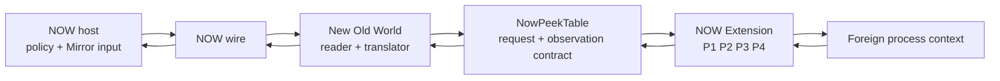
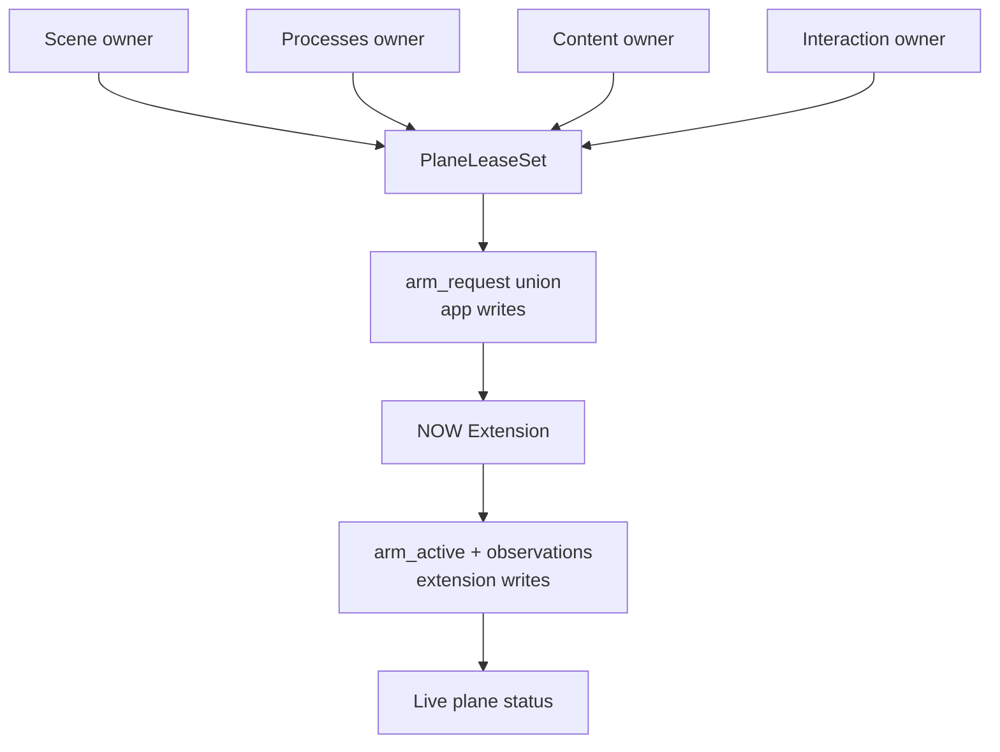
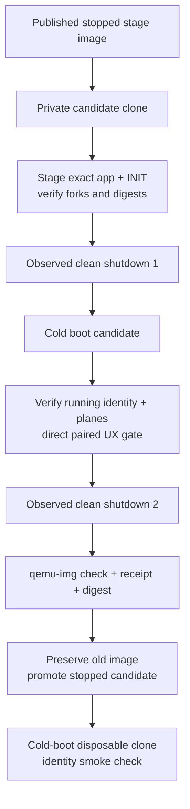

<!-- now-doc-provenance: generated reviewed=false -->

# Unified NOW Extension Prerequisite - Plan

## Summary

Consolidate the guest-side privileged capabilities required by NOW Mirror into
one production resident component, **NOW Extension**, with New Old World as the
only normal-context reader, translator, and NOW-wire endpoint. AXPeek, QDPeek,
Portal, and `mirror-agent` remain available as source, fixtures, measurements,
and differential oracles while the work is underway, but cease to be runtime
or staging requirements after every goal-relevant capability has a proven NOW
disposition.

This is a prerequisite to
[`2026-08-03-001-now-mirror-ux-completion-plan.md`](2026-08-03-001-now-mirror-ux-completion-plan.md),
not a replacement for it. This plan owns the resident ABI, plane lifecycle,
guest translation and diagnostics, retirement of the old resident/agent
bundle, focused extension-driven UX proofs, and the cleanly saved Mirror
development VM image. Plan 001 resumes afterward with the canonical host
broker, complete scene/rendering work, broad MCP parity, and the full six-rung
Mirror completion campaign. Its extension-specific assumptions must be
refreshed against the artifacts delivered here rather than independently
re-implemented.

The final artifact is not only source code. The development oracle at
`~/Lab/Assets/os91-qemu/now-mirror-stage.qcow2` must be replaced by a verified
candidate containing the exact final NOW Extension and matching New Old World
build. The candidate is promoted only after two observed guest-clean shutdowns:
one before the cold boot that loads the newly staged INIT and one after final
verification. If automation cannot prove a clean shutdown, the workflow pauses
for an attended Finder shutdown and watches the exact QEMU process exit. QMP
`quit`, signals, or another hard stop never satisfy this gate.

## Problem Frame

The desired architecture already exists in outline but not yet as a truthful,
complete product boundary:

- `contract/peek_table.h` defines one in-memory table and P1/P2/P3/P4
  capability bits. P1 Structure, P3 Content, and P4 Interaction have integrated
  mechanisms. P2 Semantics is reserved but has no meaningful payload.
- Plane claims are not yet one coherent ownership system. `peek.c` aggregates
  some owners, while content and act code can still mutate arm bits directly.
  A later aggregate publish can silently disarm another active consumer.
- P1 lacks AXPeek's measured bounded throttle for a continuously open Mirror.
- P3 arms after an application's initial drawing and has not proved safe,
  coherent redraw and teardown across target death, suspension, relaunch, port
  disappearance, or lease expiry.
- P4 can prove request and trap activity in some cases, but dispatch is not a
  visible effect. Menu identity is incomplete and normal-context postcondition
  settlement is missing.
- Host and guest compatibility surfaces still diagnose AXPeek, QDPeek, Portal,
  and `mirror-agent` as prerequisites. Staging still knows how to install them
  and reserves port 1420, contradicting the one-extension architecture.
- The staging path verifies file type and fork sizes, but the running resident
  does not expose an exact build identity. A newly copied INIT and the old code
  still resident in memory can therefore be confused.
- Automated suites can be green while the native Mirror is visibly empty or
  its controls do nothing. Extension completion therefore requires a focused
  direct-input, paired-oracle UX gate, not command reachability alone.

The preserved audit evidence is in the gitignored
`docs/local/unified-extension-audit-2026-08-03/` bundle. Its C26 pair shows
Date & Time content on the authoritative guest while NOW Mirror reports
`content: waiting for the guest to draw`. Its action log distinguishes
dispatch, refusal, timeout, and unknown outcome. Those are characterization
fixtures, not claims that the unified implementation is complete.

## Product Contract

### Goal Capsule

**Goal:** One optional NOW Extension supplies every privileged observation and
mutation primitive needed by the data-driven Mirror, while New Old World owns
all foreign-memory reads, scene translation, wire traffic, user policy, and
postcondition evaluation.

**Success signal:** A cold-booted, extension-only development VM reports the
exact expected resident build and honest P1-P4 state; the focused native
Mirror sweep is driven by keyboard and mouse and agrees with paired guest
captures, state, logs, and settlement; no product or staging path requires
AXPeek, QDPeek, Portal, `mirror-agent`, or port 1420.

**Non-negotiable:** QEMU is an observation oracle for development, never a
production mechanism. The implementation cannot read the QEMU framebuffer,
inject QMP input, access VM memory, or depend on a QEMU-only device or command.

### Actors

- A1. **Person** opens NOW Mirror and uses ordinary mouse and keyboard input.
- A2. **NOW host** renders guest-provided state, owns user plane policy, and
  submits typed operations through the existing NOW session.
- A3. **New Old World** validates the resident table, claims planes, follows
  bounded foreign-memory anchors, translates state, serves the NOW wire, and
  evaluates observable postconditions.
- A4. **NOW Extension** executes only the bounded work that requires a foreign
  process context and publishes only facts it can prove there.
- A5. **Developer/test operator** stages a disposable VM candidate, supplies an
  attended shutdown when required, and promotes only a stopped verified image.

### Flows

- F1. **Discover.** New Old World resolves `NWex`, validates the table's major,
  length, formats, capabilities, and build identity, and reports absent,
  needs-restart, wrong-version, active, or degraded without inferring state
  from a file alone.
- F2. **Claim.** A named normal-context owner requests a plane. One lease
  aggregator publishes the union to `arm_request`. The extension publishes
  `arm_active`; one owner's release cannot disarm another owner.
- F3. **Observe.** P1 supplies fresh process-local anchors. P2 supplies only
  bounded facts that cannot be safely proven from those anchors. New Old World
  performs the foreign-memory walk and builds the scene.
- F4. **Retain content.** P3 installs only for an exact target and window,
  requests one bounded coherent redraw after installation, and retains
  structured drawing by target, window, and display epoch. Unsupported bitmap
  regions remain explicit placeholders.
- F5. **Mutate.** P4 accepts one typed, identity-bearing request and publishes
  the resident stages it can prove. New Old World observes the application's
  subsequent state and completes the application-observed and postcondition
  stages.
- F6. **Control policy.** The host presents P1 Structure, P2 Semantics, P3
  Content, and P4 Interaction as one domain. User policy is distinct from
  resident support, requested state, active state, and degraded/refused state.
- F7. **Prove UX.** An agent looks at and drives the native NOW Mirror with
  keyboard and mouse, captures the same settled guest moment through QMP for
  observation only, and correlates Mirror pixels, guest pixels, plane state,
  operation settlement, and logs before scoring a row.
- F8. **Finalize image.** A private candidate receives exact artifacts, shuts
  down cleanly, cold-boots, proves the resident build and focused UX gate,
  shuts down cleanly again, passes image integrity checks, and is then promoted
  with a receipt.

### Requirements

#### Resident boundary and ABI

- R1. NOW ships one production INIT named **NOW Extension**, selector `NWex`,
  magic `NWpt`, type `INIT`, creator `NOWx`.
- R2. AXPeek, QDPeek, Portal, and `mirror-agent` are seed material and temporary
  differential oracles only. No final product, VM image, host lifecycle, guest
  page, test default, or staging path requires them.
- R3. `contract/peek_table.h` remains the sole resident ABI source compiled by
  the extension, PPC application, and native layout tests. Evolution is
  accretive: no existing offset is reinterpreted or moved.
- R4. Every plane is accepted only when capability, declared length, and exact
  plane format agree. Short, stale, partially published, or unknown layouts
  refuse without partial trust.
- R5. Source identity, embedded resident identity, and final artifact identity
  are separate and correlated. A stable source-manifest hash identifies the
  inputs; a generated build fingerprint is embedded in the INIT resource and
  appended table block; the final MacBinary SHA-256 identifies the staged
  artifact. The table and wire report the embedded fingerprint. The receipt
  records all three and cannot substitute a wall-clock stamp for any of them.
- R6. The extension writes observations and `arm_active`; New Old World writes
  `arm_request`. No second process writes the table's application-owned cells.
- R7. The boot core remains minimal. Planes are dormant until requested, do not
  call one another, allocate nothing on foreign hot paths, and chain/bypass
  immediately when disabled or when validation fails.
- R8. Networking, protocol encoding, UI, logs, foreign-memory traversal, and
  postcondition evaluation remain outside resident code.

#### Plane lifecycle and state

- R9. A single named-owner lease aggregator is the only way application code
  changes plane requests. Claims union across scene, process, content,
  interaction, and future agent readers; disconnect, session change, owner
  teardown, and lease expiry release them deterministically.
  The lease carries one New Old World application-session owner; a second app
  instance is read-only/refused and cannot become a competing table writer.
  The production `NWex` writer is the canonical `New Old World` process;
  differently named dev applications use an honestly distinct dev extension
  selector or remain read-only.
- R10. P1 Structure uses AXPeek's measured six-tick cadence as a falsifiable
  emulator budget: absent a process A5-world or `WindowList` anchor change, it
  performs no more than one full publish per six ticks per pumping target; an
  anchor change may publish immediately; a continuously pumping target becomes
  fresh within six ticks. Counters prove that a full scan does not occur on
  every `GetNextEvent` pass. Hardware hot-path timing remains a later metal
  measurement.
- R11. Before any P2 ABI field is frozen, a capability-by-capability evidence
  table states why P1 is unsafe or insufficient, the required foreign-context
  source, record and byte bounds, work bound, identity/freshness guards, and
  refusal behavior. P2 then publishes only the justified bounded facts: CDEF/
  resource identity and control data, standard List Manager state and cells,
  resource/custom-control classification, safe non-dialog TextEdit roots, and
  system-owned menu resolution.
- R12. P2 records are tied to exact process, window/control/menu identity and a
  committed generation. Overflow, unsupported custom definitions, stale
  identity, and validation failure remain explicit states.
- R13. P3 first proves target/port lifecycle safety. A target death, suspension,
  relaunch, window disposal, target switch, or lease expiry cannot leave a
  resident proc pointer dereferenced or a new process confused with the old.
- R14. After safe hook installation, P3 obtains one bounded in-context redraw
  for the exact target, then retains structured operations by target, window,
  and display epoch. Switching or resyncing invalidates only the applicable
  epoch.
- R15. Bitmap, PICT, `CopyBits`, and manually composited regions do not enter a
  pixel transport in this plan. They carry a bounded placeholder with reason;
  adjacent semantic content and interaction remain required.
- R16. P4 preserves typed operations for popup, dialog item, list, text,
  control, menu, application activation/visibility, and window behavior. A
  generic coordinate click is not an action fallback. Only operations that
  require foreign context enter the resident cell; application
  activation/visibility and other normal-context cases remain in New Old World.
- R17. Every P4 request carries correlation, target process identity, target
  object identity, required scene generation or stable reference, expiry, and
  operation-specific guards. Menus carry the scene's front-process PSN.
- R18. Settlement is monotonic and evidence-backed:
  `requested -> armed -> fired -> application-observed -> postcondition`.
  The resident publishes only stages it directly knows; normal-context code
  completes the latter stages. Dispatch alone never becomes success. New Old
  World retains a bounded ring of the last 16 settlement records so act-cell
  reuse or a display timeout cannot erase later observed evidence; Plan 001's
  broker consumes this ring rather than inventing a competing outcome source.
- R19. Background modal input first activates the application and observes it
  frontmost. A stale, changed, missing, or mismatched target refuses by name.

#### Plane policy and product surfaces

- R20. One shared plane domain gives each plane stable identity, purpose,
  capability bit, support, user policy, requested state, active state,
  freshness, and degraded/refusal reason. Its display precedence is
  unsupported, disconnected, user-disabled, enabled-but-refused/degraded,
  requested/pending, active-stale, then active-current. Policy remains visibly
  enabled after a refusal; a bounded pending timeout becomes degraded rather
  than appearing active.
- R21. P1 Structure is visibly required and locked on while a Mirror is open.
  P2 Semantics, P3 Content, and P4 Interaction default on when supported and
  are user-switchable for isolation. Interaction off is a truthful read-only
  Mirror; Content off shows structural state and declared content placeholders;
  Semantics off keeps P1 structure but disables semantic-only rendering and
  acts instead of guessing.
- R22. Only user policy persists, keyed by stable connected-machine identity.
  A remembered enabled policy meeting an unsupported guest remains remembered
  but makes no claim and renders unsupported. Support, requested, active,
  freshness, degradation, and refusal are derived live from the guest. An
  unanchored emulator identity keeps policy session-only; it cannot inherit
  Interaction policy from a different VM that later occupies the same slot.
- R23. The host owns Mirror policy toggles. The guest Workshop is status-only
  and shows the same state vocabulary; it does not create a second policy
  authority, probe legacy residents, or instruct the user to install
  `mirror-agent`.
- R24. A policy toggle changes only its named owner's claim. It cannot overwrite
  another page/session owner or claim a capability the resident lacks.

#### Retirement and proof

- R25. A header/source-derived ledger maps every old component capability to
  same-capability, outcome-equivalent-through-NOW, prohibited-mechanism with no
  remaining consumer, explicit bounded refusal, retained-as-fixture, or
  retirement-blocker. A goal-relevant row closes only as same-capability,
  outcome-equivalent-through-NOW, or a prohibited mechanism with no remaining
  consumer. Bounded refusal and fixture-only dispositions block retirement
  unless this Product Contract explicitly removes that user outcome from
  scope. Raw pixel transport is a prohibited mechanism; structured retained
  drawing remains eligible for parity. The legacy comparison environment stays
  recoverable as an isolated archival image and source/fixture set after
  retirement; it is not installed beside NOW Extension during a parity
  measurement unless coexistence itself is the case under test.
- R26. The focused extension UX corpus includes Apple rows, the single native
  Application menu, desktop-to-Finder activation, Hide/Hide Others/Show All/app
  selection, Workshop resize/close/reopen, Macintosh HD/Finder representation,
  Date & Time list/placeholder, Date & Time Cancel, coherent foreign content,
  and settlement truth.
- R27. The UX gate is driven through the native Mirror with keyboard and mouse.
  MCP or raw command reachability may prove a primitive but cannot pass a UX
  row.
- R28. Every scored row has one correlated manifest containing input
  provenance, Mirror-rendered pixels and snapshot identity, a same-moment guest
  capture, decoded state, plane state, operation/settlement evidence, and host
  and guest logs. Capture begins only with no nonterminal operation and after
  scene/content generations remain unchanged for two poll intervals. Mirror
  and QMP captures occur within two seconds, followed by a generation/epoch
  reread; any intervening change or excess skew discards the pair. Missing or
  uncorrelated evidence refuses scoring.
- R29. QMP supplies observation captures only. QMP input, guest framebuffer
  reads in production, VM-memory inspection, and QEMU-specific implementation
  hooks are prohibited.
- R30. New regression guards are mutation-watched failing before acceptance.
  Automated builds and tests remain separate from emulator UX evidence and
  from metal verification.

#### Development image

- R31. Image finalization starts from an explicit private clone and never
  mutates the published stage image while QEMU is running.
- R32. Staging verifies the exact extension and application artifacts by local
  digest, guest Finder type/creator and fork sizes, guest-side content readback
  or stopped-image extraction/hash, and correlated source, embedded-build, and
  final-artifact identities before the first shutdown. Runtime identity after
  cold boot must equal the embedded identity read from the staged artifact.
- R33. The first shutdown is guest-clean and observed by the exact QEMU process
  exiting. The next boot must be cold so the new INIT, not the previous resident
  code, is under test.
- R34. Cold-boot verification proves the running extension build identity,
  table length, P1-P4 capability/format status, positive controls, matching app
  identity, and the focused direct UX gate.
- R35. Final preservation requires a second observed guest-clean shutdown,
  `qemu-img check` on the stopped candidate, and a receipt containing source
  commit, artifact digests, fork metadata, running identities, plane results,
  UX evidence bundle, shutdown evidence, image digest, and verification level.
- R36. If automated shutdown is refused or times out, finalization enters an
  attended mode with a bounded several-minute wait for a person to choose
  Finder Shut Down. If the exact QEMU process does not exit on its own, the
  candidate is not promoted. Hard stop never degrades into a warning.
- R37. Promotion preserves the prior published image as a recoverable backup,
  replaces `~/Lab/Assets/os91-qemu/now-mirror-stage.qcow2` only while both
  images are stopped, and cold-boots a disposable clone of the promoted image
  for a final identity smoke check without dirtying the published image.

### Scope Boundaries

**In scope**

- Shared resident ABI and deterministic build identity.
- Plane ownership, leases, lifecycle, formats, and truthful status.
- Goal-relevant AXPeek/QDPeek/Portal mechanisms folded into P1-P4.
- Normal-context P2 join, P3 coherent redraw, and P4 settlement bridge.
- Four-plane policy domain and honest host/guest diagnostic controls.
- Removal of legacy runtime staging, forwarding, lifecycle, and compatibility
  requirements.
- Focused direct-input paired-oracle regression proof.
- Final cleanly saved Mirror development VM image and receipt.

**Deferred to Plan 001**

- The canonical host `MirrorBroker`, full shared human/MCP scheduling policy,
  broad scene IR redesign, all renderer polish, the complete six-rung UX and
  text campaigns, and comprehensive MCP projection parity.
- General third-party application expansion beyond the focused extension
  fixtures.

**Out of scope**

- Raw framebuffer, guest-pixel, PICT-byte, or `CopyBits` transport.
- QEMU-only implementation mechanisms or QMP input.
- Recreating legacy extensions as separately shipped components.
- Hardware deployment or a metal-verification claim. Artifacts may be prepared
  for the later attended PB1400c gate, but this plan does not authorize it.

### Acceptance Examples

- AE1. Two consumers claim Structure. Closing one leaves P1 requested and
  active; closing the final consumer releases it after the bounded lease.
- AE2. Semantics is disabled. Date & Time still has a structural window, the
  list region is visibly marked unavailable, and list actions refuse as
  semantics-disabled rather than guessing a generic control.
- AE3. Content is enabled against a foreign Date & Time window. The initial
  coherent redraw produces structured operations for the exact window epoch.
  Its bitmap icon remains a bounded placeholder without making the window
  empty.
- AE4. Interaction is disabled. The scene remains live, mouse/keyboard attempts
  report read-only before dispatch, and `arm_request` does not contain P4 for
  that Mirror owner.
- AE5. A menu gesture carries the front process PSN, reaches armed and fired,
  and reports success only after a new scene and guest capture show the expected
  menu effect.
- AE6. The target process exits while P3 is armed. The extension bypasses stale
  pointers, the lease retires, the relaunched process receives a new identity,
  and no old content is attributed to it.
- AE7. A legacy component is absent from the stage image. The one-extension
  status is still complete and the focused Mirror gate does not ask for port
  1420 or `mirror-agent`.
- AE8. The newly copied INIT has a different build identity from the resident
  table before reboot. The workflow reports needs-restart and refuses to claim
  the new build is active.
- AE9. Automated shutdown lacks the required Worker `script` scope. The tool
  asks for attended Finder shutdown, waits for the exact QEMU PID to exit, and
  promotes nothing if that does not happen.
- AE10. A command or MCP probe can select Date & Time but the native Mirror
  cannot. The primitive may be tested, but the UX row remains red.
- AE11. NOW Extension is absent. Mirror still opens a limited self/normal-
  context view with an installation banner; plane toggles are unavailable and
  no unsupported interaction is offered. A needs-restart state gives the same
  safe surface with Finder restart guidance. A wrong-version state names the
  required matched app/extension pair and refuses plane claims.
- AE12. Interaction policy is enabled but the target refuses the request. The
  toggle remains enabled, the primary state says refused with the reason, and
  no checkmark or active styling appears. A pending request becomes degraded
  after its bounded timeout.
- AE13. Scene generation changes between the Mirror capture and QMP capture.
  The harness discards both images and repeats after quiescence; it never scores
  the mixed-moment pair.
- AE14. Fork sizes and Finder metadata match, but guest readback does not match
  the local MacBinary payload or embedded build fingerprint. Staging fails
  before shutdown and the published image remains untouched.

## Planning Contract

### Key Technical Decisions

- KTD1. Keep one production INIT and one resident header. Old components are
  mined for mechanisms and failure cases, not wrapped, chained as dependencies,
  or shipped beside NOW Extension. Covers R1-R8.
- KTD2. Append a build-identity block to `NowPeekTable` without moving existing
  offsets. The build pipeline derives a stable source-manifest hash, generates
  and embeds one build fingerprint in the INIT resource and resident table,
  verifies that embedded value before final packaging, and only then computes
  the final MacBinary SHA-256. The receipt correlates those three identities
  with New Old World's existing source-hash stamp. This avoids a circular
  self-digest while still proving which bytes were staged and which resident
  booted. Covers R3-R5 and R32-R35.
- KTD3. Replace all direct arm-bit writes with one owner/lease aggregator in New
  Old World. `arm_request` is the union of valid claims; `arm_active` remains
  resident-owned. Append a writer-session nonce, canonical-app identity,
  application heartbeat, and resident-echoed owner epoch. The extension honors
  requests only while that writer lease is current; crash or expiry clears
  active work before a replacement owner is echoed. Covers R6 and R9.
- KTD4. Make P2 a bounded request/response block appended through
  `contract/peek_table.h`, using exact target identity and a publish-last
  generation/seqlock protocol. P2 does not become a second tree builder; it
  supplies only in-context facts the application joins into its normal walk.
  Covers R3-R4 and R11-R12.
- KTD5. Repair P3 lifetime before expanding capture. A coherent redraw is
  requested only after target, port, window, lease, and hook ownership can be
  invalidated safely. Captures are retained by explicit display epoch. Covers
  R13-R15.
- KTD6. Split settlement authority. P4 owns requested/armed/fired facts; the
  application owns application-observed/postcondition based on newly observed
  guest state and retains the bounded 16-record settlement ring. The host
  renders the joined result and never upgrades dispatch on its own; Plan 001's
  broker adopts this as its guest outcome source and adds only host scheduling
  and attribution. Covers R16-R19.
- KTD7. Treat plane toggles as user policy over named claims, never as cached
  capability truth. Structure is required while live; Semantics, Content, and
  Interaction are independently switchable for failure isolation. Covers
  R20-R24.
- KTD8. Retire legacy runtime by a disposition ledger and an extension-only
  direct UX proof, not by code presence. Upstream measurements establish useful
  mechanisms and thresholds but do not verify NOW. Covers R25-R30.
- KTD9. Finalize the VM as a transactional candidate-and-promote workflow. A
  clean shutdown is a positive event—the exact emulator exits because the
  guest shut down—not the absence of an error after a host stop. Covers
  R31-R37.
- KTD10. Keep this prerequisite narrow at the host boundary. It provides plane
  domain/status/policy and enough settlement/render integration to prove the
  resident capabilities. Plan 001 owns the broader broker and product-completion
  arc. Covers the stated plan relationship and prevents duplicate architecture.

### High-Level Technical Design

#### Resident table and ownership

`NowPeekTable` remains the core table. New appended regions carry build
identity, the canonical-writer lease, and P2 request/response state; P4 gains
accretive correlation/stage fields without moving any existing P3/P4 offset.
Every region is accepted through capability, format, and length. The app copies
committed resident data before following any foreign pointer.

#### Plane status

One domain record crosses guest and host boundaries:

| Field | Owner | Meaning |
|---|---|---|
| identity/purpose | shared source | stable P1-P4 vocabulary |
| supported/format | resident | this booted extension can serve it |
| policyEnabled | host/user | the person wants this plane for this Mirror |
| requested | application | at least one current owner claims it |
| active | resident | target-context work is actually armed |
| freshness/generation | resident/application | last committed evidence |
| degraded/refused | proving layer | bounded reason, never inferred success |

The UI resolves lifecycle before plane state. This keeps the optional resident
honest and gives every non-active state one safe recovery path:

| Lifecycle | Mirror behavior | Plane controls | Recovery |
|---|---|---|---|
| absent | Open a limited self/normal-context view with an explicit banner | unavailable and read-only | install the matched NOW Extension |
| needs-restart | Keep the limited view; do not claim newly copied code is resident | unavailable and read-only | restart the guest through Finder |
| wrong-version | Keep the limited view and name both observed identities | unavailable and read-only | stage the matched app/extension pair, then restart |
| active | Full data-driven Mirror | P1 locked on; supported P2-P4 follow policy | none |
| degraded | Keep unaffected planes live; show the affected reason | policy stays visible; only unsafe acts disable | retry or follow the named bounded remedy |
| disconnected | Pin the last scene as stale; keep Close available | disabled without erasing policy | reconnect, then re-evaluate support and claims |

Within an active connection, one primary plane label uses this precedence:
unsupported, disconnected, user-disabled, enabled-but-refused/degraded,
requested/pending, active-stale, active-current. “Enabled” always describes
policy, never proof that the resident accepted or completed work.

The existing `mirror` command is changed contract-first from a legacy bundle
inventory to this unified status. Console and wire keep command parity. The
host consumes the same response rather than separately probing files or
processes.

#### Image transaction

### System-Wide Impact

- **Contract:** `contract/peek_table.h` gains appended identity/P2/settlement
  fields. `contract/asyncapi.yaml` changes the `mirror` command output before
  either guest or host consumer changes.
- **Extension:** P1 throttle, P2 service, P3 lifecycle/redraw, P4 typed stages,
  and build identity alter resident behavior and require guest builds plus
  native ABI/guard tests.
- **PPC guest:** Plane claims, semantic joins, status JSON, Workshop UI, content
  lifecycle, and postcondition settlement change. Console/wire parity and the
  native-test manifest must remain complete.
- **Host:** Legacy Mirror lifecycle/readiness gives way to one plane domain and
  policy surface. The native Mirror remains the only behavioral input surface.
- **Tooling:** Default staging becomes extension-only, port 1420 disappears,
  shutdown remains fail-closed, and a candidate image finalizer/receipt is
  added.
- **Docs:** Resident charter, plane documents, coverage, parity ledger, staging
  runbook, open-issues history, and plan dependency status move together with
  the implementation.

### Risks and Dependencies

- Resident layout drift can corrupt the system heap silently. All appended
  regions need static offsets, native layout compilation, and watched mutation
  failures.
- The P1 throttle must reduce hot-path work without making freshness dishonest.
  Cadence and change triggers need separately observable counters.
- P2 can become an unsafe second tree walker. Keep requests exact and bounded;
  return unknown/truncated rather than following an unvalidated definition or
  arbitrary handle.
- P3 proc pointers may outlive their target. No redraw work begins until
  lifecycle positive controls cover death, relaunch, disarm, and target switch.
- Classic Toolbox dispatch differs by application/runtime. A trap hit proves
  less than an application effect; positive controls and postconditions remain
  mandatory.
- The cooperative guest may settle tens of seconds after input. Timeouts must
  be generous and retain later settlement evidence without rewriting history.
- An automated shutdown route depends on the scoped Worker exposing `script`.
  This is not guaranteed. Attended shutdown is a planned path, not a waiver.
- Plan 001 currently contains extension-oriented work. Its implementation must
  begin with a dependency refresh so already-delivered resident work is not
  rebuilt in a competing shape.

## Implementation Units

### U1. Freeze the unification and retirement contract

**Outcome:** The implementation starts from a derived, reviewable ledger and a
non-circular boundary with Plan 001.

**Files**

- `docs/mirror-parity-ledger.md`
- `docs/mirror-foldin-inventory.md`
- `docs/resident-components.md`
- `docs/plans/2026-08-02-008-mirror-fold-roadmap.md`
- `docs/plans/2026-08-03-001-now-mirror-ux-completion-plan.md`
- `docs/open-issues.md`
- `tools/mirror-gate`
- `tools/mirror-gate-tests/test_mirror_parity_inventory.py`
- `tools/mirror-gate-tests/test_mirror_gate_evidence.py`

**Implementation**

1. Derive the legacy capability inventory from current dispatch, shared
   headers, host call sites, and staging paths. Give every AXPeek/QDPeek/Portal/
   agent capability a goal-facing disposition and a concrete proof owner.
2. Mark roadmap 008 superseded by this executable prerequisite while retaining
   it as history. Reconcile Plan 001 unit by unit: convert each overlapping
   resident, guest translation, focused settlement, and legacy-runtime step
   into an explicit dependency on the artifact delivered here; narrow its file
   ownership and acceptance language; retain its broker, full renderer/UX,
   broad MCP, and remaining host-service work. Every shared file or behavior
   must have one implementation owner before U2 begins.
3. Harden `tools/mirror-gate` so every scored row requires the correlated
   evidence manifest in R28 and records keyboard/mouse input provenance.
4. Freeze the focused corpus in R26, including the current known-good Workshop
   and menubar baseline, before any resident change.
5. Mutation-watch the inventory and evidence gates by restoring one legacy
   runtime dependency and omitting one evidence member; each guard must name the
   defect.

**Acceptance**

- No legacy capability is silently dropped or assumed proven by upstream.
- Plan ownership is unambiguous: this plan can finish before Plan 001 resumes.
- Plan 001 no longer directs an executor to rebuild or retain a runtime this
  prerequisite owns and retires; its later retirement unit verifies absence and
  handles only any host/agent-facing pieces that genuinely remain.
- A command-only or Mirror-only capture cannot score a UX row.

### U2. Make the resident ABI and plane ownership authoritative

**Outcome:** The exact booted resident and every requested plane can be proved,
and one owner cannot disarm another.

**Files**

- `contract/peek_table.h`
- `ext/CMakeLists.txt`
- `ext/src/now_ext.c`
- `ext/src/now_ext_gne.S`
- `now-guest-ppc/src/peek/peek.h`
- `now-guest-ppc/src/peek/peek.c`
- `now-guest-ppc/src/act/act_client.c`
- `now-guest-ppc/src/content/qdtrace_cmd.c`
- `now-guest-ppc/tests/peek_table_test.c`
- `now-guest-ppc/tests/peek_validate_test.c`
- new focused native tests under `now-guest-ppc/tests/`
- `scripts/test-native`

**Implementation**

1. Append the build-identity block and all required format/length assertions
   without moving an existing table field.
2. Generate the source-manifest hash and one embedded build fingerprint using
   the existing guest build-stamp pattern. Stamp the same fingerprint into the
   INIT resource and resident table, verify it before final MacBinary hashing,
   expose it through the validated table API, and keep it distinct from New
   Old World's source-hash stamp and the final artifact SHA-256.
3. Extract a pure named-owner lease set. Route scene, Processes, content, and
   act through it; remove or internalize direct arm/disarm writes. Add an
   application-session writer lease with nonce, canonical process identity,
   heartbeat, and resident-echoed epoch. A differently named NOW dev app is
   read-only against production `NWex` unless built with its own dev selector.
4. Release claims on disconnect, session replacement, owner disposal, and
   expiry. Publish the union once per change. Cover simultaneous launch,
   writer crash, stale owner, replacement launch, and reboot; the extension
   ignores or clears a request whose writer lease is not current.
5. Add the R10 six-tick P1 change/cadence throttle, counters, and freshness
   semantics without adding allocation or logging to the foreign hot path.
   Mutation tests must distinguish immediate anchor-change publication from
   unchanged cadence and prove no full scan occurs on each event pass.
6. Test capability-bit collision, short/old tables, unknown formats, identity
   mismatch, multi-owner union/release, expiry, and P1 throttle/change paths.

**Acceptance**

- The running resident has an exact receipt-correlatable identity.
- All application-side request changes pass one lease aggregator.
- P1 meets the six-tick emulator budget, reports when it is stale, and exposes
  enough counters to falsify an every-event-loop scan.

### U3. Implement bounded P2 semantic assist

**Outcome:** Ordinary foreign controls, lists, text roots, and system menus have
the bounded in-context facts needed for truthful scene translation.

**Files**

- `contract/peek_table.h`
- new focused P2 modules under `ext/src/`
- new focused P2 reader/join modules under `now-guest-ppc/src/peek/` or
  `now-guest-ppc/src/axwalk/`
- `now-guest-ppc/src/axwalk/axwalk.h`
- `now-guest-ppc/src/axwalk/axwalk.c`
- `now-guest-ppc/src/scene/`
- `now-guest-ppc/tests/axmenu_test.c`
- new P2 native fixtures/tests under `now-guest-ppc/tests/`
- `scripts/test-native`

**Implementation**

1. Derive and review the R11 evidence table for each proposed semantic fact.
   Reject fields that P1 plus a safe normal-context read can already prove.
   Record exact record count, byte count, per-event work, target identity,
   freshness, overflow, and refusal limits before freezing the ABI.
2. Append only the justified exact-target P2 request/response region with those
   fixed record and byte budgets, explicit truncation/unknown results, and a
   publish-last commit.
3. Implement separate bounded resolvers for control definition/resource data,
   List Manager, safe TextEdit roots, custom/resource CDEF classification, and
   system-owned menu rows. No cross-resolver calls in resident code.
4. Copy and validate each committed response in New Old World, then join it to
   the existing structural walk with guest provenance. P1 remains usable when
   P2 is absent or disabled.
5. Preserve unknown custom controls and unrepresentable list content honestly.
   Do not add app-name-specific cases.
6. Add fixtures for Date & Time's list/resource controls and Apple/system menu
   resolution. Mutation-watch stale identity, partial publish, overflow,
   invalid handles, and wrong CDEF classification.

**Acceptance**

- Date & Time list semantics and Apple menu facts no longer depend on host
  title/geometry guesses.
- Disabling P2 gives a structurally useful but explicitly degraded scene.
- Malformed or unfamiliar state cannot escape the bounded resident request.

### U4. Make P3 lifecycle-safe and deliver an initial coherent display

**Outcome:** The content plane can be armed for a foreign window without stale
resident pointers and supplies structured content from the first accepted
display epoch.

**Files**

- `contract/peek_table.h`
- `ext/src/now_content.c`
- `now-guest-ppc/src/content/qdtrace_cmd.c`
- `now-guest-ppc/src/content/qdtrace_read.c`
- `now-guest-ppc/src/content/qdtrace_json.c`
- `now-guest-ppc/src/content/qdtrace_target.c`
- `now-guest-ppc/tests/content_plane_test.c`
- `now-guest-ppc/tests/qdtrace_target_test.c`
- `now-guest-ppc/tests/qdtrace_read_test.c`
- `now-host/Sources/Host/NOWMirrorContentPlane.swift`
- `now-host/Tests/HostTests/NOWMirrorContentPlaneTests.swift`

**Implementation**

1. Extract pure target/port lifetime decisions and prove target death, window
   disposal, suspension, relaunch, target change, disarm, and lease expiry
   before adding redraw behavior.
2. Ensure a stored port is never dereferenced until it is re-proven live in the
   current exact process context; restore only hooks still owned by NOW.
3. After installation, request one bounded in-context invalidation/redraw for
   the exact window without input injection. Record whether the application
   observed and serviced it.
4. Stamp every retained operation with target, window, display epoch, and
   generation. Drop stale/superseded epochs at the guest/host join.
5. Represent unsupported bitmap/manual regions as bounded placeholders and
   continue collecting adjacent structured operations.
6. Run death/relaunch and positive drawing stimuli in a disposable VM before
   allowing P3 into the focused UX sweep.

**Acceptance**

- A foreign window does not remain empty merely because it drew before hooks
  were installed.
- Old target content cannot overlay or mutate a relaunched process/window.
- No pixel or framebuffer transport was introduced.

### U5. Make P4 typed, identity-safe, and settle to guest effects

**Outcome:** The interaction plane distinguishes request, trap activity, and
visible guest effect for every focused operation family.

**Files**

- `contract/peek_table.h`
- `ext/src/now_ext_act.c`
- `ext/src/now_ext_act_patch.S`
- `now-guest-shared/src/now_act_guard.h`
- `now-guest-shared/src/now_act_guard.c`
- `now-guest-ppc/src/act/`
- `now-guest-ppc/src/scene/`
- `now-host/Sources/Host/NOWMirrorSource.swift`
- `now-host/Sources/Host/ActLog.swift`
- `now-guest-shared/tests/now_act_guard_test.c`
- focused act/settlement tests under `now-guest-ppc/tests/` and
  `now-host/Tests/HostTests/`

**Implementation**

1. Extend the act cell accretively with correlation/generation, exact target
   identity, operation-specific identity, expiry, and monotonic resident stage.
2. Preserve separate popup, dialog item, list, text, control, menu,
   activation/visibility, and window operations. Reuse pure guards; keep the
   actual Toolbox-effect layer small.
3. Carry the scene front-process PSN into menu acts. Require activation and a
   newly observed frontmost state before background modal input.
4. Join resident requested/armed/fired evidence with new normal-context scene
   observations and operation-specific postconditions. Retain the last 16
   correlations in a guest application-owned settlement store, including
   timeout followed by later success, act-cell reuse, and session replacement.
5. Replace success-on-dispatch UI/logging with confirmed,
   dispatched-but-unconfirmed, refused, timed-out, session-changed, or unknown.
6. Re-run ABI, positive-control, no-hijack, bypass, wrong-target, stale-target,
   and blast-radius probes. Upstream numbers remain comparison data only.

**Acceptance**

- A checkmark or success state always has effect evidence.
- Menu, list, Date & Time Cancel, app visibility, and window operations name the
  correct target and settle honestly.
- A legitimate action positive control precedes every no-hijack conclusion.

### U6. Replace legacy compatibility surfaces with one plane domain

**Outcome:** Host and guest describe one extension, four planes, and truthful
user policy; no UI directs the user toward the retired runtime.

**Files**

- `contract/asyncapi.yaml`
- `now-guest-68k/` handshake revision and compatibility fixture owners
- `now-guest-ppc/src/mirror/mirror_facts.h`
- `now-guest-ppc/src/mirror/mirror_probe.c`
- `now-guest-ppc/src/mirror/mirror_layout.c`
- `now-guest-ppc/src/mirror/mirror_module.c`
- `now-guest-ppc/src/mirror/mirror_json.c`
- `now-guest-ppc/tests/mirror_layout_test.c`
- `now-guest-ppc/tests/mirror_json_test.c`
- `now-host/Sources/Host/MirrorControlModel.swift`
- `now-host/Sources/Host/MirrorControlView.swift`
- `now-host/Sources/Host/MirrorProduct.swift`
- host handshake/contract decoder and fixture owners under `now-host/`
- new focused plane-domain module/tests under `now-host/Sources/Host/` and
  `now-host/Tests/HostTests/`
- `docs/command-parity.md`
- `docs/contract-coverage.md`

**Implementation**

1. Change the `mirror` command contract first: bump the wire contract revision,
   give the unified reply an explicit schema version, and replace the legacy
   extension/agent inventory
   with exact NOW Extension lifecycle, build identity, caps, formats,
   requested/active bits, freshness, and per-plane degradation/refusal. Update
   the host and both PPC/68K guest handshake revisions and fixtures in the same
   compatibility cut. Mixed revisions refuse at handshake; do not silently
   parse an old reply as the new shape.
2. Replace the guest Workshop page's legacy probes/start/quit controls with the
   unified lifecycle and read-only P1-P4 state model. Preserve console/wire
   parity; the host remains the only user-policy surface.
3. Add the host plane domain and persist only Semantics/Content/Interaction user
   policy per stable connected-machine identity. Wire policy through named
   claims and reflect live guest state; an unsupported guest does not receive a
   claim even when its remembered policy is enabled. When identity is
   unanchored—as with an unbound emulator slot—policy is session-only and a new
   VM begins from safe defaults rather than inheriting prior settings.
4. Remove the contradictory external-Mirror lifecycle/readiness UI and keep one
   Open/Close Mirror product control.
5. Implement the lifecycle table and plane-state precedence from the technical
   design. Cover absent, needs-restart, wrong-version, active, degraded, and
   disconnected recovery, including policy retained after refusal/reconnect
   and bounded pending-to-degraded transition.
6. Use native labeled controls, keyboard focus/activation, and non-color-only
   state indicators for the plane surface.
7. Prove toggle isolation: turning one optional plane off does not disarm or
   misreport another owner/plane.
8. Update coverage from dispatch/source derivation, not memory.

**Acceptance**

- A valid one-extension guest is never diagnosed as missing three extensions or
  an agent.
- Unsupported, user-disabled, requested, active, degraded, and refused are
  visually distinct.
- The limited Mirror remains safe and actionable when the extension is absent,
  needs restart, is the wrong version, degrades, or disconnects.
- The host and guest report the same booted build and plane facts.

### U7. Retire legacy runtime and run the focused extension proof

**Outcome:** The product and development path run extension-only, and the
focused direct-input regressions prove that removing the old bundle did not
remove required behavior.

**Files**

- `tools/stage-ext.py`
- `scripts/spin-up-ppc`
- `now-guest-ppc/tests/mirror_port_staging_source_test.py`
- `tools/mirror-gate-tests/test_spin_up_ppc_shutdown.py`
- new staging/retirement source tests under `tools/mirror-gate-tests/`
- `docs/mirror-drive-loop.md`
- `docs/mirror-parity-ledger.md`
- `docs/mirror-foldin-inventory.md`
- `docs/open-issues.md`

**Implementation**

1. Close every goal-relevant parity row only with same-capability or outcome-
   equivalent NOW proof, or with an explicitly out-of-scope prohibited
   mechanism that has no consumer. A bounded refusal or retained fixture is a
   retirement blocker unless the Product Contract removes the user outcome.
   Where an old/new differential result matters,
   collect it on isolated old-only and NOW-only boots unless coexistence itself
   has first been proven non-confounding. Preserve old sources, fixtures, and
   measurements for reference.
2. Remove `NOW_STAGE_MIRROR`, AXPeek/QDPeek/Portal staging, `mirror-agent`,
   `mirror.port`, port-1420 allocation/forwarding, and related default probes.
3. Make `spin-up-ppc` verify the exact NOW Extension build, P1-P4 formats, app
   identity, and plane positive controls after cold boot.
4. Run the complete focused corpus breadth-first through native Mirror input.
   Tail host/action logs, wait for cooperative settlement and two stable poll
   intervals, capture Mirror then QMP within two seconds, and re-read the scene,
   content, and operation generations. Discard a pair if anything changes or
   the skew exceeds the bound. Score whole frames and fidelity separately.
5. Patch failures in bounded batches, restart at preflight row one, and add a
   watched-fail regression guard for each repaired yo-yo defect. Fix resident
   ABI/lifecycle, guest translation, plane-policy integration, and settlement
   evidence here. Record general broker, renderer, broad gesture, and MCP
   defects against Plan 001 unless they prevent a named extension primitive
   from being proved; such a routed defect does not expand this plan silently.

**Acceptance**

- The focused corpus passes with correlated direct-input evidence on an
  extension-only VM.
- No process listens on or forwards port 1420 and no runtime probe names a TB*
  selector.
- Old sources remain available as historical seed material, not compiled or
  staged dependencies.

### U8. Finalize and promote the clean Mirror development image

**Outcome:** The published Mirror development VM is a stopped, integrity-checked
image containing the exact verified extension/app pair, with a reproducible
receipt and recoverable predecessor.

**Files**

- new NOW-owned image finalizer under `scripts/` or `tools/`
- new finalizer tests under `tools/mirror-gate-tests/`
- `scripts/spin-up-ppc`
- `tools/stage-ext.py`
- `docs/staging-path.md`
- `docs/resident-components.md`
- `docs/open-issues.md`
- `README.md`
- `docs/plans/2026-08-03-001-now-mirror-ux-completion-plan.md`

**Implementation**

1. Add a fail-closed finalizer that takes an explicit source image, candidate,
   artifact paths, expected source hashes and embedded fingerprints, and
   published target. It never
   infers a broad path or edits a running published image.
2. Clone the current stopped stage image to a candidate; run `qemu-img check`;
   stage and guest-verify the exact artifacts by Finder metadata plus content
   readback or stopped-image extraction/hash; verify the embedded fingerprint
   before computing the final MacBinary digest; write a draft receipt. Any
   partial stage failure leaves only the private candidate and never changes or
   promotes the published image.
3. Remove and verify the absence of AXPeek, QDPeek, Portal, `mirror-agent`,
   `mirror.port`, and any legacy auto-launch entry from the candidate. Treat an
   unexpected legacy artifact as a retirement failure, not harmless clutter.
4. Invoke the qualified guest shutdown helper. If it refuses or times out,
   switch to attended mode, tell the user which guest to shut down, and wait a
   bounded several minutes for that exact QEMU PID to exit. Do not continue
   after a hard stop.
5. Cold-boot the candidate, verify running build/table/plane identities and the
   U7 direct UX evidence, including equality between the runtime table identity
   and the staged embedded fingerprint, then perform the second observed clean
   shutdown.
6. Run stopped-image integrity checks and candidate SHA-256, retain the old
   published image as a dated backup, promote the candidate, and keep the
   receipt in draft state.
7. Cold-boot a disposable clone of the promoted image, verify exact resident
   and app identity, shut the clone down cleanly, and leave the published image
   itself stopped and unchanged.
8. Record the post-promotion smoke and its clean shutdown, then finalize the
   receipt and its digest.
9. Update published docs and the open-issues history with evidence and honest
   verification level. Mark this prerequisite complete and Plan 001 unblocked;
   do not call the full Mirror complete.

**Acceptance**

- `~/Lab/Assets/os91-qemu/now-mirror-stage.qcow2` contains the exact final
  extension/app pair and is left stopped after a guest-clean shutdown.
- The receipt correlates source, local artifacts, guest file metadata, running
  resident identity, focused UX evidence, shutdowns, and final image digest.
- A failed or unobserved shutdown cannot promote an image.
- Plan 001 has a precise resume point and no stale extension assumptions.

## Verification Contract

### Automated ladder

Run cheapest first after each coherent unit; record skips as skips:

1. Focused native layout/guard/domain tests, all explicitly listed in
   `scripts/test-native`.
2. `scripts/test-native`.
3. `scripts/test-host`.
4. `scripts/build-guests`; absence of Retro68 is a skipped build, not a pass.
5. `scripts/test-all` at every checkpoint intended for handoff.

An intermediate checkpoint may record a missing Retro68 toolchain as skipped.
Definition of Done may not: the final extension and matching application must
successfully cross-build before they can be staged into the canonical image.

Required mutation watches include:

- capability-bit or offset collision;
- partial P2 publish and wrong-target identity;
- lease union loss and expired-owner cleanup;
- P3 stale/dead port reuse and old-epoch overlay;
- P4 wrong PSN, dispatch-without-effect, and no-hijack without a positive
  control;
- reintroduced legacy staging or port 1420;
- missing evidence-manifest member;
- image promotion after an unobserved/hard shutdown;
- staged/resident build-identity mismatch.

### Emulator UX gate

Every U3-U7 UX-bearing batch follows `docs/mirror-drive-loop.md`:

1. Confirm one intended host and one intended QEMU instance; tail the active
   host/action logs.
2. Look at and compare NOW Workshop, menubar, and Apple rows.
3. Resize, close, and reopen Workshop.
4. Double-click Macintosh HD, compare Finder, click bare desktop to front
   Finder, then exercise Hide, Hide Others, Show All, and selecting another app
   through the native Application menu.
5. Navigate to Date & Time, compare the list/content/placeholder, type or click
   through the native Mirror, and test Cancel/window behavior.
6. Exercise the plane surface itself: P1 required/locked; each P2-P4 toggle off
   then on; remembered-enabled but unsupported; requested/pending to active;
   degraded/refused; read-only refusal; content placeholder; semantic refusal;
   and proof that one plane toggle cannot disarm another plane or owner.
7. For each row, wait for settlement and the R28 quiescence bracket, capture
   Mirror and QMP within two seconds, then verify generations stayed fixed.
   Score the worst whole-frame mismatch. Pictures are noted; missing data,
   structure, values, effects, or synchronized evidence are red.

QMP takes the same-moment guest capture and may report VM liveness. It does not
provide input or implementation state. MCP may run concurrently for cheap
parity evidence but cannot substitute for direct interaction.

### Resident safety gate

- Prove load, capability/format agreement, callbacks, bypass, arm/disarm, target
  expiry, target death/relaunch, and clean removal on a disposable QEMU clone.
- Run `actselftest` before accepting any act-plane behavior.
- Run legitimate-action positive controls before no-hijack trials.
- Report QEMU observations as emulator-verified development evidence only.
- PB1400c timing, coexistence, removal, and shift-boot remain a later attended
  metal gate. Nothing in this plan may be labeled metal-verified without it.

### Image gate

An image is promotable only when all of these facts are in one receipt:

- source commit and clean/dirty status;
- source-manifest hashes, embedded build fingerprints, and final SHA-256 for
  `NowExt.bin` and `New Old World.bin`;
- guest type, creator, data-fork size, and resource-fork size;
- guest content readback or stopped-image extraction/hash matching the local
  artifacts;
- first observed clean shutdown and exact QEMU process exit;
- cold-booted running extension build, table length, plane formats/caps, and app
  build identity;
- focused direct UX evidence bundle identity;
- second observed clean shutdown and exact QEMU process exit;
- stopped-candidate `qemu-img check` result and final SHA-256;
- prior-image backup path and promoted target;
- disposable post-promotion cold-boot smoke result and its own clean shutdown;
- verification level: emulator-verified development evidence. Builds/Tested
  alone are insufficient for image promotion, and Metal-verified is unavailable
  under this plan.

## Definition of Done

This prerequisite is complete only when:

1. NOW Extension is the sole production resident dependency and its exact
   running build is provable.
2. One validated, accretive table contract governs P1-P4; all plane requests use
   named leases and all plane state is truthful.
3. P1 meets the six-tick emulator budget, P2 supplies only evidence-justified
   bounded in-context semantics, P3 is lifecycle-safe with an initial coherent
   structured display, and P4 settles typed operations through observed guest
   postconditions.
4. Host and guest expose one plane domain with the specified toggles, lifecycle
   recovery states, accessible controls, and no legacy readiness contradiction.
5. AXPeek, QDPeek, Portal, `mirror-agent`, `mirror.port`, and port 1420 are absent
   from normal runtime and staging paths; their useful evidence remains
   preserved.
6. The focused extension regression corpus passes through native Mirror
   keyboard/mouse input with quiescence-bracketed paired guest pixels, state,
   settlement, and logs.
7. Automated gates pass at their honest levels and each new guard was watched
   fail under mutation.
8. `~/Lab/Assets/os91-qemu/now-mirror-stage.qcow2` contains the exact final
   extension and matching app, has passed integrity checks, and is left stopped
   following an observed guest-clean shutdown. If automation cannot prove the
   shutdown, the attended user-assisted path has completed; otherwise the plan
   remains incomplete.
9. The image receipt and recoverable prior image exist, and a disposable clone
   of the promoted image cold-boots the expected resident identity.
10. Contract coverage, parity inventory, staging docs, resident/plane docs,
    README limits, and `docs/open-issues.md` reflect what is proven and what
    remains unverified.
11. Plan 001 is explicitly unblocked and refreshed to consume these artifacts.
    The broader NOW Mirror completion work resumes there; this prerequisite does
    not claim the polished emulator goal is finished.

## Execution Notes

- Commit each U-unit or smaller coherent safety boundary early, with unverified
  checkpoints labeled as such. Do not wait for the full gate to preserve work.
- Run the widest affordable gate before patching, batch independent failures,
  then restart every UX sweep at the sanity preflight.
- Tail live host/action logs during direct work, but corroborate silent results
  with a guest-side positive control before changing instrumentation.
- Never preserve or promote a VM disk that is still running, was stopped by QMP
  `quit`, or has ambiguous ownership.
- Graduate durable findings from `docs/local/` into the published plane,
  staging, and issue documents in the same arc.
