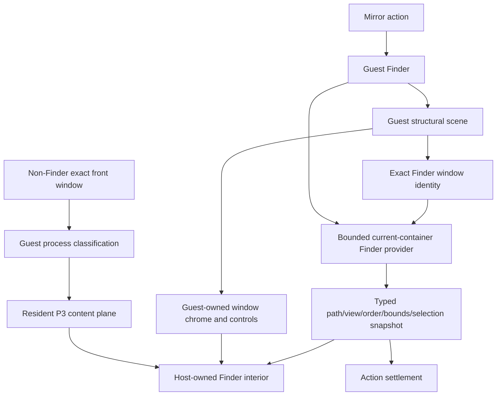

# Semantic Finder and safe application content

## Goal Capsule

- **Objective:** Make the Mirror stable enough to land by permanently excluding Finder from P3 drawing interception, preserving P3 for ordinary applications, and rendering Finder interiors from semantic directory state while Finder continues to own its windows and actions.
- **Authority:** The connected Macintosh is authoritative for directory membership, item identity, layout, view, selection, scroll state, window geometry, and action settlement. The host owns only the Finder interior's presentation.
- **Scope:** The whole guest disk is browsable through Finder, one displayed directory at a time. This is not the Files module's share-root browser and never becomes a whole-disk Finder search.
- **Execution profile:** Cross-cutting host, PPC guest, resident-extension safety, contract, tests, and durable documentation. Work is checkpointed by coherent unit.
- **Stop conditions:** Never arm Finder, never search `entire contents`, never invent a row or icon position, never claim metal verification from a build or host test, and stop before adding a resident callback that performs Process Manager, Finder, logging, allocation, or file-I/O work.

---

## Product Contract

### Summary

P3's QuickDraw capture is valuable for applications but is metal-proven unsafe for Finder on the PowerBook 1400c. Finder already exposes the semantic facts needed to reproduce its interior faithfully: displayed directory, view, item bounds, enumeration order, selection, and the guest-owned controls around that interior. This slice separates those domains. Finder becomes a semantic surface that can navigate the whole guest disk without P3, while non-Finder applications retain the content path whose development should not be discarded before it is tested under a narrower safety contract.

### Requirements

**P3 safety and lifecycle**

- R1. A `qdtrace start` request for Finder is refused before the resident content block is armed, whether the caller names Finder by PSN or asks for the front process.
- R2. Raw A5 is no longer an accepted public arming route because it bypasses process identity and therefore bypasses the Finder deny.
- R3. The host independently excludes Finder from content-plane targeting and removes any stale Finder display before rendering.
- R4. P3 remains available for non-Finder applications and retains exact-window, validated-anchor, bounded-ring, TTL, and policy gates.
- R5. Arm, retarget, renewal, refusal, settle, and release logs identify the process, exact window, resolution route, generation, and direct/offscreen attribution without logging from resident draw-time callbacks.

**Semantic Finder**

- R6. Each displayed Finder container publishes a stable identity, HFS path, view (`icon`, `name`, or `small icon`), completeness, and item rows in the Finder's current enumeration order.
- R7. Each item carries the Finder's live drawn bounds and selection state plus existing catalog identity where available; unknown facts remain absent.
- R8. Finder folders and disk roots outside the configured shared tree are browseable by opening them through Finder. No implementation may issue `entire contents` or recursively enumerate the disk.
- R9. Large directories are read in bounded pages. A partial, torn, or layout-changing read does not replace the last complete snapshot with a plausible subset.
- R10. Duplicate Finder window titles cannot cross-join semantic state. A window is keyed by process incarnation and exact WindowRecord address, with path/title used only as reported metadata or a guarded fallback.

**Presentation and interaction**

- R11. Finder P3 display operations never paint the interior. Icon and small-icon views render their icons and labels semantically; name view renders ordered rows and visible metadata available from the guest instead of relying on captured pixels.
- R12. The guest continues to own Finder window move, resize, close, zoom, view/sort controls, scrollbars, and their state.
- R13. Selecting, opening, deselecting, and scrolling from the Mirror sends an addressed action to Finder. Optimistic host selection is temporary and settles against the next semantic snapshot.
- R14. Direct actions on the PowerBook appear in the next semantic snapshot, including view, scroll, item order, and selection changes.
- R15. Finder semantic reads are observe-only: they do not activate Finder. Only an explicit user action whose Finder semantics require fronting may do so.

**Operations and documentation**

- R16. Logs report one bounded Finder-read summary per container or refusal: identity, path, view, pages, item count, selected count, completeness, duration, and the scene/layout generation it enriches.
- R17. README/status, `docs/open-issues.md`, `docs/mirror-knowledge.md`, contract coverage where applicable, and the parent durable findings corpus describe the implemented boundary and distinguish Tested from Metal-verified.

### Key Flows

- F1. Application content arm
  - **Trigger:** A non-Finder application owns the front exact window and P3 policy is enabled.
  - **Steps:** The host names its PSN and window; the guest resolves and classifies the live process; the resident receives an identity-approved A5 request; the host drains and attributes direct-window and offscreen-world operations.
  - **Outcome:** Application content can render without allowing Finder into the content plane.
  - **Covered by:** R1-R5
- F2. Finder directory observation
  - **Trigger:** A Finder folder or disk window is present in the structural scene.
  - **Steps:** The host asks for only that displayed container; the Finder returns path, view, bounds, order, and selection in bounded pages; the host joins the result to the exact window identity and catalog metadata.
  - **Outcome:** The Finder interior renders semantically, including anywhere on the guest disk reached by navigation.
  - **Covered by:** R6-R11, R14-R16
- F3. Host-driven Finder action
  - **Trigger:** A person selects, opens, scrolls, moves, or resizes a Finder surface in the Mirror.
  - **Steps:** Interior actions use semantic Finder identity; chrome/control actions use guest references; the next scene and Finder snapshot confirm the new state.
  - **Outcome:** The guest remains the state owner and the host remains a faithful projection.
  - **Covered by:** R12-R15

### Acceptance Examples

- AE1. **Given** Finder is frontmost and P3 is enabled, **when** a content cycle runs, **then** no `qdtrace start` reaches the resident, Finder has no `display`, and the log names the permanent Finder exclusion.
- AE2. **Given** SimpleText is frontmost, **when** a content cycle runs, **then** the exact window can arm by PSN and its drawing records can settle normally.
- AE3. **Given** two Finder windows share the same title, **when** both semantic reads complete, **then** each result joins only to its exact WindowRecord identity or is refused as ambiguous.
- AE4. **Given** a Finder window in name view, **when** the host renders it with P3 unavailable, **then** visible rows appear in the Finder-reported order with 16-pixel item geometry and selected state.
- AE5. **Given** a folder outside the guest share root, **when** it is opened from a Finder disk window, **then** its semantic contents appear without using `file.list` and without searching the disk.
- AE6. **Given** a directory changes between semantic pages, **when** the read finishes, **then** the host retains the previous complete snapshot and reports the changed/torn read rather than publishing a subset.
- AE7. **Given** the user changes Finder selection or scroll directly on the PowerBook, **when** the next observation settles, **then** the host reflects it without activating Finder.

### Scope Boundaries

- The current slice keeps strict Mirror behavior: Finder windows really exist and navigate on the guest.
- A later entirely host-owned Finder can reuse the semantic model and directory-provider boundary, but suppressing guest Finder windows is not part of this slice.
- Application interiors beyond the existing P3 vocabulary remain incomplete; Finder stability is not permission to claim all applications render fully.
- Recursive inventory, indexed search, and arbitrary whole-disk `file.list` are outside this slice. Whole-disk browsing is achieved through bounded navigation of the current Finder container.

---

## Planning Contract

### Key Technical Decisions

- KTD1. **Finder is permanently denied at both host and guest command boundaries.** (session-settled: user-directed — chosen over continuing to experiment with Finder P3 because Trace drawing contents is metal-proven to crash Finder on the PB1400c.) The resident remains identity-agnostic and draw-time safe; classification occurs before its request cells are written.
- KTD2. **P3 remains for applications.** (session-settled: user-directed — chosen over writing P3 off entirely because substantial application-rendering work exists and has not been tested under a Finder-free target policy.)
- KTD3. **Finder interior is semantic; Finder chrome and lifecycle stay guest-owned.** (session-settled: user-directed — chosen over literal Finder redraw because the semantic route is faithful, stable, and reusable by a future host-only Finder.)
- KTD4. **Finder browsing is whole-disk but current-container scoped.** (session-settled: user-directed — chosen over reusing the shared-tree Files contract because Finder's purpose is to browse the Mac, while recursive `entire contents` is rejected due to a measured twelve-minute hardware wedge.)
- KTD5. **Exact window identity replaces title-keyed enrichment.** A title is presentation, not identity; the join key is process incarnation plus WindowRecord address. If an older guest cannot supply it and titles collide, enrichment refuses rather than guesses.
- KTD6. **Extend the existing asynchronous Finder-complement lane before inventing a second cadence.** Finder reads remain outside the structural cycle and never block it. The provider produces a typed internal snapshot even if the current wire vehicle remains the policy-gated `script` command.
- KTD7. **No resident logging or Process Manager classification.** The INIT only enforces bounded A5/window/generation requests and exposes counters. All identity checks and human-readable logging stay in application task time.

### Technical Design

The semantic snapshot belongs beside `FinderItems`, not inside the Files module. It describes a displayed Finder container and is therefore allowed to name any HFS path Finder can display. The host source schedules it after scene publication, correlates it with the scene/layout generation, and joins it only to exact Finder windows. `Scene.Window` receives explicit Finder presentation state rather than inferring view from 16/32-pixel boxes. Renderer ownership becomes categorical: Finder `items` own the whole Finder interior; `display` is ignored there. Non-Finder windows continue through the existing semantic/display arbitration.

P3 requests become process selectors only. The guest resolves the PSN, reads process information, refuses Finder signatures (`MACS`, with the roster's compatibility classification), and only then writes the content request. The host also filters Finder, preventing avoidable calls and deleting historical Finder display during attachment. Retargeting remains explicit and serialized through stop/baseline/start; resident hook counters remain the evidence of draw-time behavior.

### Risks and Mitigations

| Risk | Mitigation |
|---|---|
| Finder Apple Events monopolize cooperative time | Bound pages and byte size, keep reads asynchronous, log duration, retain prior complete state, and never issue recursive searches. |
| Reading view/selection activates Finder | Use property reads only, add source guards against `activate`, and metal-test with another app frontmost. |
| A paged directory mutates mid-read | Carry a snapshot/layout token across pages and publish only a coherent complete generation. |
| Older guests lack exact window addresses | Allow one unique guarded title/path fallback; refuse duplicates and report incomplete coverage. |
| Finder signatures differ across systems | Centralize classification with the existing process-roster vocabulary and cover `MACS`/Finder compatibility in native tests. |
| P3 application hooks still destabilize another app | Preserve off-by-default policy, exact-window target, TTL, counters, and per-application metal matrix; Finder stability is not generalized safety proof. |
| List columns cannot all be read cheaply | Render only guest-reported fields; name/order/selection are required, other columns remain explicitly absent until measured. |

---

## Implementation Units

### U1. Freeze the P3 target boundary

- **Goal:** Make it impossible for Finder or an unclassified raw A5 to reach the resident content request.
- **Files:** `contract/asyncapi.yaml`, `now-guest-ppc/src/content/qdtrace_cmd.c`, `now-guest-ppc/src/content/qdtrace_target.{c,h}`, process-roster helpers, `now-host/Sources/Host/NOWMirrorContentPlane.swift`, focused C and Swift tests.
- **Work:** Remove raw-A5 start selection; classify resolved PSNs; refuse Finder before claim/commit; filter Finder host-side; scrub Finder display; add target/refusal logs.
- **Covers:** R1-R5; F1; AE1-AE2.
- **Verification:** Native target-policy tests watched failing under the prior raw-A5/Finder-allowed behavior; focused host content-plane tests.

### U2. Define the Finder semantic snapshot

- **Goal:** Replace title-keyed icon complements with an exact, coherent model for any displayed Finder directory on the guest disk.
- **Files:** `mirror/host/MirrorKit/Sources/MirrorKit/FinderItems.swift`, `Scene.swift`, `now-host/Sources/Host/NOWMirrorSource.swift`, contract description for the existing script purpose, parser and source tests.
- **Work:** Add exact container identity, path, view, ordered item bounds, selection, completeness, page/correlation metadata, bounded pagination, duplicate-title refusal, and duration logging. Keep the provider current-container scoped and independent of share-root file services.
- **Covers:** R6-R10, R14-R16; F2; AE3, AE5-AE7.
- **Verification:** Recorded output fixtures for all three views, duplicate titles, out-of-share paths, torn records, multi-page reads, and layout changes.

### U3. Give Finder interiors one semantic owner

- **Goal:** Render stable Finder interiors without any P3 contribution.
- **Files:** `mirror/host/MirrorKit/Sources/MirrorKitUI/SceneRenderer.swift`, Finder icon/font helpers, renderer tests/snapshots.
- **Work:** Make Finder items exclude the full interior display replay; render icon and small-icon labels; render name-view rows in guest order with selection; preserve scroll clipping and guest chrome.
- **Covers:** R3, R7, R11-R12, R14; F2; AE1, AE4.
- **Verification:** Deterministic renderer assertions for icon, name, small-icon, selection, scroll clipping, and stale P3 suppression.

### U4. Close the Finder action loop

- **Goal:** Keep interaction guest-owned and settle it against semantic state.
- **Files:** `MirrorKit` hit/action policy, `MirrorActionExecutor.swift`, `NOWMirrorSource.swift`, action and settlement tests.
- **Work:** Preserve addressed select/open/deselect; bind window actions to guest refs; keep scrollbar/view/sort actions on guest controls; correlate optimistic selection with the next snapshot; never front Finder for observe-only reads.
- **Covers:** R12-R15; F3; AE7.
- **Verification:** End-to-end host tests from list/icon hit through emitted action and confirming snapshot, plus a source guard rejecting `activate` in complement scripts.

### U5. Make the boundary diagnosable and durable

- **Goal:** Leave enough evidence to safely land and continue application P3 work.
- **Files:** logging docs, `README.md`, `docs/status.md`, `docs/open-issues.md`, `docs/mirror-knowledge.md`, `docs/contract-coverage.md` if served capability changes, and the parent `data/findings/` corpus.
- **Work:** Document Finder semantic ownership, whole-disk navigation versus whole-disk search, P3 application-only status, guest/host logging fields, tested/metal matrix, and remaining application risk. Validate findings with the parent corpus tool.
- **Covers:** R5, R16-R17.
- **Verification:** Documentation links resolve, coverage is derived, findings validation passes, and no claim exceeds its evidence level.

---

## Verification Contract

| Gate | Applies to | Done signal |
|---|---|---|
| Focused native content target tests | U1 | Finder and raw A5 mutations fail; application PSN passes. |
| Focused `MirrorKit` and Host tests | U1-U4 | Semantic parsing, exact joins, renderer ownership, and action settlement pass. |
| `scripts/test-native` | U1-U2 | Both guest native manifests pass. |
| `scripts/build-guests` | U1-U2 | PPC, 68K, extension, and helpers compile/package where the toolchain is available. |
| `scripts/test-host` | U1-U4 | Swift suites and Debug/Release app targets pass. |
| `scripts/test-all` | U1-U5 | Repository gate passes from the final tree. |
| Parent `tools/data check` | U5 | Durable findings corpus accepts the new or amended finding. |
| Wallstreet observe-only run | U1-U5 | Finder does not front from observation; no Finder P3 arm appears; semantic view/selection/scroll update. |
| PB1400c metal run | U1-U5 | At least 15 minutes of Finder navigation across icon/name/small-icon and multiple directories without Finder restart; a non-Finder application P3 probe is recorded separately. |

Metal runs record guest/host build stamps, machine, OS, settings, exact timing, P3 target/refusal lines, Finder-read summaries, and Finder process incarnation before/after. A host or emulator pass may be reported as Tested, never Metal-verified.

---

## Definition of Done

- Finder cannot arm P3 through any supported `qdtrace start` selector, and the host never asks it to.
- Non-Finder applications can still arm by validated process identity and exact window.
- Finder windows render useful icon, name, and small-icon interiors from typed semantic snapshots with no display replay underneath.
- Finder navigation can cross the entire guest disk through current-container reads without depending on the shared-tree Files contract or issuing a recursive search.
- Selection, open, scroll, move, and resize remain guest-owned and observable after either host or direct guest input.
- Large/ambiguous/torn Finder reads fail honestly and retain the prior complete snapshot.
- Focused tests and applicable repository gates pass; hardware claims are labelled at the evidence actually obtained.
- Current docs and the durable findings corpus record the new safety and ownership boundary, plus the remaining risk in application P3.
