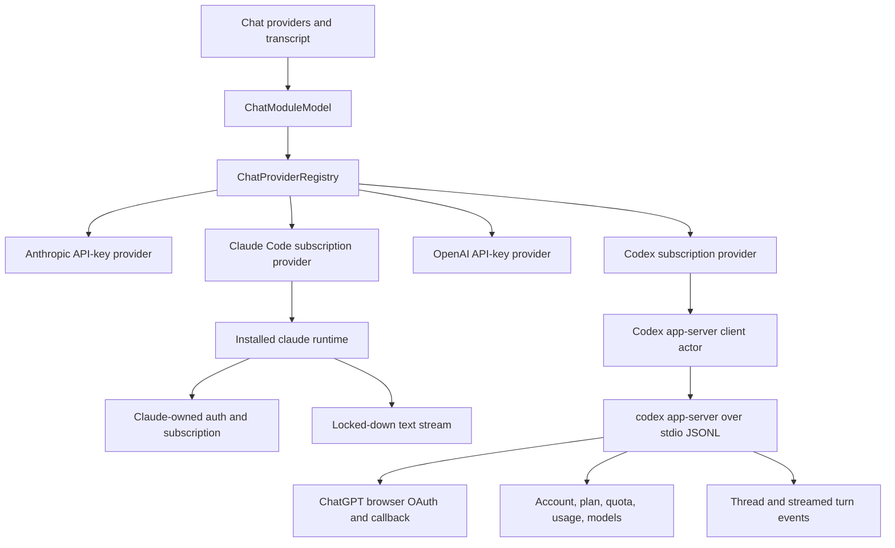
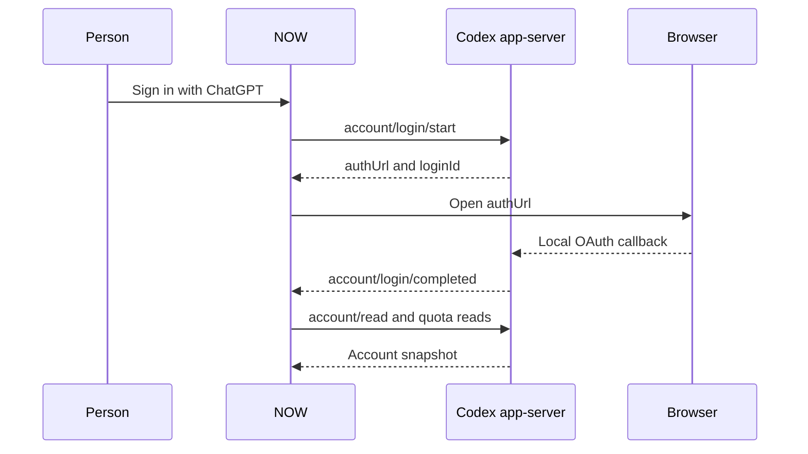

# Supported Chat Authentication - Plan

## Goal Capsule

- **Objective:** Remove NOW's private Anthropic OAuth, offer an explicitly experimental local Claude runtime adapter, and add supported ChatGPT subscription access through Codex app-server.
- **Authority:** Current Anthropic and OpenAI documentation governs vendor authentication and account-data boundaries. The repository contract and chat-provider abstractions govern wire behavior.
- **Execution profile:** Preserve direct API-key providers, add a separate Codex provider, and prove process, protocol, login, catalog, streaming, and UI behavior with deterministic tests.
- **Stop conditions:** Stop if the installed Codex protocol cannot provide the documented account, model, or streaming methods without exposing credentials to NOW.
- **Tail ownership:** Complete review, `scripts/test-all`, Developer ID signing, and build packaging on `codex/keychain-prompt-audit`.

---

## Product Contract

### Summary

NOW will stop owning subscription credentials. Anthropic remains supported through a Console API key. A separately gated, experimental Claude provider may control the user's installed and independently authenticated Claude Code runtime without claiming Anthropic approval. ChatGPT subscription access becomes a Codex provider whose login, credentials, account state, models, usage, quotas, and inference are owned by the official Codex app-server.

### Problem Frame

The current Anthropic card implements an undocumented OAuth client, manual authorization-code exchange, token refresh, and private subscription inference. The browser flow can complete while NOW remains signed out, and the design places NOW on an authentication surface Anthropic explicitly prohibits for third-party products.

T3 Code demonstrates the safer local-control pattern: it requires the official Claude Code runtime and delegates inference and credentials to that runtime. T3 does not implement OAuth. Its usage view scans local transcript records rather than calling a consumer account API. NOW can apply the same ownership boundary without importing T3's agent-workspace authority into a text chat provider.

OpenAI API-key support exists, but it cannot use a ChatGPT subscription. OpenAI exposes Codex app-server specifically for rich clients that need authentication, account state, conversation history, models, and streamed events. NOW should consume that boundary instead of owning ChatGPT tokens or using subscription credentials against public API endpoints.

### Requirements

#### Anthropic credential boundary

- R1. NOW must not implement Claude.ai OAuth, read Claude tokens, or send subscription credentials directly to Anthropic APIs.
- R2. Anthropic chat must continue to support Claude Console API keys through the public Messages and Models APIs.
- R3. Existing saved Anthropic OAuth data must not be read during passive refresh and must be removable without a Keychain authorization prompt.
- R4. The provider UI must distinguish Anthropic API access from the separately installed Claude Code runtime and must not claim access to a consumer subscription-usage API.
- R16. NOW must add a separate Claude Code provider that executes through the user's installed `claude` runtime and never through NOW-owned OAuth credentials.
- R17. Claude Code must own browser login, callback handling, credential storage, refresh, subscription selection, and logout.
- R18. NOW must display the authentication and subscription fields reported by `claude auth status --json` without reading Claude credential files.
- R19. Claude Code chat must run without tools, project instructions, plugins, hooks, session persistence, or workspace mutation authority.
- R20. Missing, signed-out, terminated, or malformed Claude runtimes must produce an honest unavailable state while the Anthropic API-key provider remains independent.
- R21. NOW must not initiate Claude login or call the provider supported; signed-out UI directs the person to authenticate in the official Claude application or CLI, then offers Refresh.
- R22. Claude UI and documentation must explain that programmatic runtime use may draw from a separate Agent SDK credit and that NOW cannot report remaining Claude quota unless the official runtime does.

#### OpenAI subscription boundary

- R5. NOW must offer a separate Codex provider for ChatGPT subscription access while retaining the direct OpenAI API-key provider.
- R6. Codex must own ChatGPT browser login, callback handling, token persistence, refresh, logout, and account state.
- R7. Successful ChatGPT login must return through the app-server callback without a copy-and-paste code step.
- R8. NOW must display Codex account email, plan type, current quota windows, and available usage summaries when app-server reports them.
- R9. NOW must discover Codex models through `model/list` and expose them through the existing host and guest chat catalogs.
- R10. NOW must execute Codex chat turns through app-server and translate streamed assistant text and completion state into the existing provider-neutral harness events.
- R11. The first Codex chat slice must be text-only and must refuse unexpected approval, tool, or interactive server requests instead of granting authority silently.
- R12. Missing, outdated, terminated, or malformed Codex runtimes must produce an honest unavailable provider state without crashing or blocking the main actor.

#### Credential and lifecycle safety

- R13. Opening Chat or its provider sheet must not trigger Keychain prompts.
- R14. NOW must not store ChatGPT access or refresh tokens in its own Keychain items.
- R15. Passive provider and model discovery must remain off the main actor and must have bounded process failure behavior.
- R23. Provider subprocesses must use a minimal allowlisted environment, exclude API-key variables that can change account identity, drain both output pipes, enforce startup/request/idle deadlines, and never log raw protocol, prompt, response, account, or diagnostic payloads.
- R24. Codex chat must use an empty ephemeral working directory, a tool-disabled runtime profile, approval policy `never`, and immediate interruption if any tool or approval item appears. Failure to prove that profile makes Codex inference unavailable while account setup remains usable.

### Acceptance Examples

- AE1. **Covers R1-R4.** Given a build that previously saved Anthropic OAuth, when Chat opens, then no Claude OAuth read or Keychain prompt occurs and Anthropic offers only API-key setup.
- AE2. **Covers R5-R8.** Given Codex is installed but signed out, when the person chooses ChatGPT sign-in, then the browser opens the app-server authorization URL and the UI becomes signed in after the app-server completion notification.
- AE3. **Covers R8.** Given a signed-in ChatGPT account with partial quota and usage data, when providers refresh, then NOW shows the plan and available values without inventing absent metrics.
- AE4. **Covers R9-R10.** Given a signed-in Codex runtime, when a Codex model is selected and a message is sent, then app-server streams assistant text through the existing host transcript and guest wire path.
- AE5. **Covers R11-R12.** Given app-server emits an approval request or exits mid-turn, then NOW declines or terminates the turn with a bounded provider error and never grants tool or filesystem authority.
- AE6. **Covers R12-R15.** Given Codex is absent or incompatible, when Chat opens, then the Codex row reports why it is unavailable while other cloud and local providers continue to refresh.
- AE7. **Covers R16-R20.** Given Claude Code is installed and authenticated, when a Claude Code model is selected, then NOW streams a text-only response through the official CLI without reading credentials or granting tools; signed-out or missing runtimes report why they cannot serve.
- AE8. **Covers R21-R22.** Given Claude is signed out, when the Providers sheet opens, then NOW identifies the adapter as experimental, directs external authentication, offers Refresh, and never claims current subscription quota or initiates OAuth.
- AE9. **Covers R23-R24.** Given a child hangs, floods stderr, emits a tool item, or inherits API-key variables, then NOW terminates or refuses it within the defined bound without logging content, executing the tool, or changing the displayed account type.

### Scope Boundaries

- Anthropic Console organization Admin API, API billing reports, and enterprise analytics are not consumer subscription data and are not added here.
- Private Anthropic `/api/oauth/profile` and `/api/oauth/usage` endpoints are excluded.
- Codex and Claude tool execution, approvals, images, conversation-history UI, and thread resumption are deferred.
- Claude subscription quota data is not inferred from private endpoints. Local transcript aggregation is deferred because it reports historical token activity rather than plan quota.

#### Deferred to Follow-Up Work

- Add explicit tool-call and approval UX for Codex and Claude after the text-only providers prove stable.
- Add richer Codex usage history visualization if the provider sheet needs more than the current compact account summary.

---

## Planning Contract

### Key Technical Decisions

- KTD1. **Delete the private Anthropic OAuth path.** (session-settled: user-approved — chosen over another best-effort private OAuth repair: current Anthropic policy explicitly forbids third-party Claude.ai login and subscription credential routing.) Remove authorization, refresh, bearer-header, and subscription-copy code rather than leaving a dormant unsupported path.
- KTD2. **Use Codex app-server as the OpenAI subscription owner.** (session-settled: user-approved — chosen over implementing OpenAI OAuth inside NOW: app-server is the documented rich-client boundary and owns token persistence and refresh.) NOW communicates over local stdio JSONL and never reads Codex credentials.
- KTD3. **Register Codex separately from OpenAI API.** The provider ID is `codex`; the existing `openai` provider remains usage-based API access so billing and account semantics stay visible.
- KTD4. **Own one long-lived app-server session per Chat model.** A process actor serializes request IDs, response continuations, notifications, and lifecycle state. Provider refreshes reuse that client so login and account notifications update the same session.
- KTD5. **Keep the first app-server provider text-only.** Launch app-server with shell, browser, app, MCP, skill, hook, image, and computer-use features disabled; use an empty ephemeral working directory, approval policy `never`, and read-only/no-network sandboxing; interrupt on any tool or approval event. If the installed protocol cannot prove that profile, account setup remains available but Codex inference does not.
- KTD6. **Treat Codex protocol availability as runtime capability.** NOW locates `codex`, initializes the documented protocol, and decodes only the fields it needs. Missing optional account or usage fields degrade to unavailable display values rather than failing the provider.
- KTD7. **Remove legacy OAuth without prompting.** Existing `anthropicOAuth` items are excluded from passive reads. Cleanup uses the existing prompt-free deletion posture; a failed cleanup is reported as residue rather than used as an authentication source.
- KTD8. **Adopt T3 Code's runtime-ownership pattern for Claude.** (session-settled: user-directed — chosen over removing Claude subscription access entirely: the user identified T3 Code's smooth local-runtime integration as the desired precedent.) NOW invokes the official CLI and consumes status and stream output, but does not copy T3's credential-file access or agent permissions.
- KTD9. **Keep Claude Code separate from the Anthropic API provider.** The provider ID is `claude`; `anthropic` remains direct Console API access so subscription and usage-based billing cannot be confused.
- KTD10. **Use a locked-down one-shot Claude process per completion.** Each run uses safe mode, no tools, no persisted session, no project setting sources, and a controlled system prompt. Authentication status is a separate bounded CLI query.
- KTD11. **Treat Claude as experimental, not supported.** T3 establishes the runtime-ownership pattern but does not establish Anthropic approval. The UI label is `Claude (Experimental)` and supporting copy identifies the separately installed Claude Code dependency without branding NOW as Claude Code.
- KTD12. **Keep Claude authentication external.** NOW reads only `claude auth status --json`; it never starts login. Signed-out UI points to the official login command or application and offers Refresh, matching T3's independently authenticated prerequisite.
- KTD13. **Use one shared bounded process transport.** Executable discovery, minimal environment construction, stdout/stderr draining, deadlines, cancellation, and termination are shared. Codex JSON-RPC correlation and Claude event parsing remain provider-owned.
- KTD14. **Keep completion providers stateless.** Each Codex completion starts one ephemeral thread and supplies the complete role-tagged transcript in a controlled prompt. The app-server actor routes notifications by thread and turn ID, interrupts on cancellation, and quarantines late events.
- KTD15. **Fail closed on runtime drift.** Capability probes record runtime versions and verify every required command, flag, feature switch, and protocol method. Unsupported versions name the missing capability without logging runtime payloads.

### High-Level Technical Design

### Assumptions

- The shipped app may depend on a separately installed Codex CLI and must report its absence rather than bundle or install it.
- The shipped app may depend on a separately installed Claude Code CLI and must report its absence rather than bundle or install it.
- The current documented stdio transport is suitable for a local macOS rich client even though alternative WebSocket transport remains experimental.
- A provider ID addition does not change the AsyncAPI message shape; the existing provider-prefixed wire-model contract already accepts new provider identifiers.
- The signed build inherits the user's existing Codex configuration and credentials through the app-server process without copying them into NOW.

### Risks and Dependencies

- Codex app-server is versioned with the installed CLI. Tests must use fixtures and a fake process seam, while live compatibility is verified against `codex-cli 0.147.0` on this machine.
- A process actor can deadlock or leak continuations if stdout, stderr, termination, and cancellation are not settled through one lifecycle owner.
- App-server's default Codex persona is agentic. The provider must set restrictive turn policy and reject approvals so a normal chat message cannot mutate the workspace.
- Removing Anthropic OAuth changes a visible feature, but preserves the supported integration boundary and avoids a future enforcement failure.
- Anthropic documents subscription use for `claude -p` but also prohibits third-party products from offering Claude.ai login or routing subscription credentials. NOW therefore presents an experimental Claude adapter to an independently installed local runtime, not an Anthropic-approved integration.

### Sources and Research

- Anthropic, [Legal and compliance](https://code.claude.com/docs/en/legal-and-compliance): third-party products may not offer Claude.ai login or route subscription credentials.
- Anthropic, [Agent SDK overview](https://code.claude.com/docs/en/agent-sdk/overview): third-party integrations should use API-key authentication unless approved.
- Anthropic, [Usage and Cost API](https://platform.claude.com/docs/en/manage-claude/usage-cost-api): organization API usage requires Admin access and is unavailable to individual accounts.
- Anthropic, [Run Claude Code programmatically](https://code.claude.com/docs/en/headless): `claude -p` is the official non-interactive runtime and can emit streaming output.
- T3 Code, [repository](https://github.com/pingdotgg/t3code) and [Claude provider guide](https://github.com/pingdotgg/t3code/blob/main/docs/user/providers-claude.md): authenticate the installed Claude Code runtime independently and delegate execution to it.
- OpenAI, [Codex App Server](https://developers.openai.com/codex/app-server): documented rich-client protocol for auth, account state, models, rate limits, usage, threads, and streamed events.
- OpenAI, [Authentication](https://developers.openai.com/codex/auth): ChatGPT subscription and API-key access are distinct supported Codex login modes.

---

## Implementation Units

### U1. Retire unsupported Anthropic OAuth

- **Goal:** Make Anthropic API-key-only and remove all private OAuth behavior and UI.
- **Requirements:** R1-R4, R13-R14; AE1.
- **Dependencies:** None.
- **Files:** `now-host/Sources/Host/Chat/AnthropicOAuth.swift`, `now-host/Sources/Host/Chat/AnthropicChatProvider.swift`, `now-host/Sources/Host/Chat/ChatCredentialStore.swift`, `now-host/Sources/Host/Chat/ChatModuleModel.swift`, `now-host/Sources/Host/Chat/ChatModuleView.swift`, `now-host/Tests/HostTests/ChatProviderTests.swift`, `now-host/Tests/HostTests/ChatCredentialStoreTests.swift`, `now-host/Tests/HostTests/ChatPaneTests.swift`.
- **Approach:** Remove the OAuth authentication branch, refresher ownership, subscription labels, sign-in state, manual code UI, and private protocol tests. Keep prompt-free cleanup for the legacy credential key without reading it during refresh.
- **Execution note:** Start by changing tests to assert API-key-only behavior and no passive OAuth read.
- **Patterns to follow:** Existing API-key handling in `OpenAICompatibleChatProvider.swift` and interaction-aware deletion in `ChatCredentialStore.swift`.
- **Test scenarios:**
  - A saved Anthropic API key lists models and sends Messages API requests with `x-api-key` and no OAuth beta header.
  - Missing API key reports an API-key-specific unavailable state.
  - Passive refresh never reads the legacy OAuth key.
  - Legacy OAuth cleanup succeeds without credential retrieval and reports cleanup failure honestly.
  - Provider UI contains no sign-in, code-paste, subscription, or private-usage claims.
- **Verification:** Anthropic provider and credential-store tests pass, and source search finds no private OAuth endpoints or subscription bearer path.

### U2. Build a deterministic Codex app-server client

- **Goal:** Provide one lifecycle owner for app-server process startup, JSONL requests, responses, notifications, login, account, usage, model, and turn primitives.
- **Requirements:** R6-R8, R12, R14-R15; AE2, AE3, AE5, AE6.
- **Dependencies:** U1.
- **Files:** `now-host/Sources/Host/Chat/CodexAppServerClient.swift`, `now-host/Sources/Host/Chat/CodexAppServerModels.swift`, `now-host/Tests/HostTests/CodexAppServerClientTests.swift`.
- **Approach:** Introduce the shared bounded process transport and an actor-backed JSONL client. Initialize once, correlate numeric request IDs, publish typed account notifications, and settle every pending request on termination, timeout, or cancellation. Decode a compatibility-focused subset of protocol fields and never log raw frames or stderr.
- **Execution note:** Prove parsing, request correlation, and termination behavior against a scripted fake transport before launching a real process.
- **Patterns to follow:** Bounded stream ownership in `ChatTransport.swift` and provider fault mapping in `ChatModels.swift`.
- **Test scenarios:**
  - Initialization sends `initialize` followed by `initialized` and accepts unrelated notifications between responses.
  - Concurrent requests receive the response matching their own IDs even when responses arrive out of order.
  - ChatGPT login returns the app-server URL and a completion notification updates account state.
  - Account, rate-limit, usage, and model responses decode absent optional fields without failure.
  - Malformed JSON is ignored or reported without losing later valid frames.
  - Process launch failure and mid-request termination fail all waiters once with a bounded unavailable error.
  - Cancellation removes its waiter and does not consume another request's response.
  - No-output, partial-line, and stderr-saturation fixtures settle within the configured deadline.
  - API-key and unrelated secret variables are absent from the child environment.
- **Verification:** Client tests pass with no real Codex process, and a focused compatibility probe succeeds against the installed CLI schema.

### U3. Add the Codex chat provider

- **Goal:** Expose ChatGPT subscription models and text streaming through the existing provider-neutral harness.
- **Requirements:** R5, R9-R12, R15; AE4-AE6.
- **Dependencies:** U2.
- **Files:** `now-host/Sources/Host/Chat/CodexChatProvider.swift`, `now-host/Sources/Host/Chat/ChatModuleModel.swift`, `now-host/Tests/HostTests/CodexChatProviderTests.swift`, `now-host/Tests/HostTests/ChatServingTests.swift`.
- **Approach:** Register provider ID `codex`, map `model/list` results into `ChatModel`, and start one ephemeral app-server thread per completion with the complete role-tagged transcript. Route assistant deltas and terminal events by thread and turn ID. Use the tool-disabled launch profile, empty temporary working directory, read-only/no-network sandbox, and approval policy `never`; interrupt and fail the turn on any tool or approval event.
- **Execution note:** Start with a failing provider integration test that covers registry discovery through streamed completion.
- **Patterns to follow:** Provider translation boundaries in `AnthropicChatProvider.swift`, streaming lifecycle in `OpenAICompatibleChatProvider.swift`, and registry-to-wire coverage in `ChatServingTests.swift`.
- **Test scenarios:**
  - Signed-out account reports unavailable and refuses model listing locally.
  - Signed-in account lists visible app-server models with `codex/` wire IDs.
  - Text deltas arrive in order and a completed turn emits one terminal finish event.
  - App-server error, turn failure, or process exit maps to a provider error.
  - Approval or tool server request receives a decline response and the provider refuses the turn.
  - Concurrent turns cannot consume each other's interleaved notifications.
  - Cancellation sends `turn/interrupt`, ignores late events, and settles exactly once.
  - A behavioral fixture requesting a file read proves that no tool starts.
  - Guest `chat.providers`, `chat.models`, and `chat.send` use the same Codex provider instance as the host pane.
- **Verification:** Provider and wire-serving tests pass, including one real-object integration over the scripted process transport.

### U4. Add runtime account, usage, and status UI

- **Goal:** Make ChatGPT login, logout, plan, quota, and usage understandable, and make the separate experimental Claude runtime state honest and recoverable.
- **Requirements:** R4-R8, R12-R13, R17-R18; AE2, AE3, AE6, AE7.
- **Dependencies:** U2, U3, U5.
- **Files:** `now-host/Sources/Host/Chat/ChatModuleModel.swift`, `now-host/Sources/Host/Chat/ChatModuleView.swift`, `now-host/Tests/HostTests/ChatPaneTests.swift`, `now-host/Tests/HostTests/CodexAppServerClientTests.swift`.
- **Approach:** Replace Anthropic sign-in state with runtime-owned account state. Open the Codex app-server `authUrl`, listen for completion, refresh the account snapshot, and render only plan, quota, and usage values app-server supplies. Preserve prior values as visibly stale on refresh failure. Render Claude status as an experimental external prerequisite: signed-out copy names the official external login step and offers Refresh; NOW never initiates it. All controls remain keyboard reachable and dynamic status has explicit accessibility labels.
- **Patterns to follow:** Existing provider cards and main-actor publication in `ChatModuleModel.swift`.
- **Test scenarios:**
  - Signed-out Codex card offers ChatGPT login and identifies direct OpenAI API-key access separately.
  - Login-in-progress disables duplicate starts and supports cancellation.
  - Login success transitions to the returned email and plan without app restart.
  - Login failure shows the app-server error and permits retry.
  - Missing quota or usage fields are omitted rather than rendered as zero.
  - Logout clears app-server account state but does not delete the OpenAI API key.
  - Opening the sheet performs no interactive Keychain reads.
  - Refreshing with prior account data preserves it with a stale/error state instead of flickering signed out.
  - Signed-out Claude identifies external authentication and updates after Refresh without restarting NOW.
- **Verification:** Pane and client tests pass, and a signed local smoke test completes browser login, returns to app-server, and renders account state.

### U5. Add the experimental Claude runtime provider

- **Goal:** Expose the independently authenticated Claude runtime through a clearly experimental locked-down text provider without handling credentials or claiming Anthropic approval.
- **Requirements:** R1, R4, R16-R23; AE7-AE9.
- **Dependencies:** U1.
- **Files:** `now-host/Sources/Host/Chat/ClaudeCodeClient.swift`, `now-host/Sources/Host/Chat/ClaudeCodeChatProvider.swift`, `now-host/Sources/Host/Chat/ChatModuleModel.swift`, `now-host/Tests/HostTests/ClaudeCodeClientTests.swift`, `now-host/Tests/HostTests/ClaudeCodeChatProviderTests.swift`, `now-host/Tests/HostTests/ChatServingTests.swift`.
- **Approach:** Reuse the shared bounded process transport for `claude auth status --json` and one-shot streaming completions. Decode only status, assistant text deltas, result state, and usage fields. Register provider ID `claude` with stable model aliases, label it experimental, and run every completion with tools and mutable workspace context disabled. NOW never initiates Claude authentication.
- **Execution note:** Characterize one real safe-mode CLI stream, then pin its meaningful frames in fixtures before implementing production parsing.
- **Patterns to follow:** T3 Code's `ClaudeAdapter` runtime ownership, process failure handling in U2, and provider translation boundaries in `AnthropicChatProvider.swift`.
- **Test scenarios:**
  - Authenticated status reports email and subscription type without exposing token or credential-file fields.
  - Signed-out status reports unavailable without starting a chat process.
  - Model aliases produce `claude/` wire IDs and the selected alias reaches the CLI.
  - Partial text stream events arrive in order and the result event emits one terminal finish.
  - CLI arguments disable tools, customizations, project setting sources, and session persistence.
  - Malformed output and process termination fail the stream once while other providers remain usable.
  - No-output, partial-line, stderr-saturation, and ignored-termination fixtures settle within their deadlines.
  - UI and provider detail identify experimental status and separate Agent SDK credit semantics.
- **Verification:** Client, provider, and wire tests pass, and one locked-down live smoke run returns text through the installed Claude Code runtime.

### U6. Document and package the supported boundary

- **Goal:** Record the changed provider capabilities and deliver a signed test build.
- **Requirements:** R1-R24; AE1-AE9.
- **Dependencies:** U1-U5.
- **Files:** `README.md`, `docs/open-issues.md`, `docs/plans/2026-08-09-001-fix-supported-chat-auth-plan.md`.
- **Approach:** Update the product's working/not-working account of Chat providers, name both external CLI dependencies, distinguish supported Anthropic API access from the experimental Claude runtime, explain separate Agent SDK credit semantics, and record Anthropic consumer subscription data as unsupported rather than unverified.
- **Test scenarios:** Test expectation: none -- documentation and packaging only; behavior is covered by U1-U5.
- **Verification:** Documentation matches the shipped UI, full repository gate passes, and the signed application bundle launches.

---

## Verification Contract

| Gate | Applies to | Done signal |
|---|---|---|
| Focused host tests | U1-U5 | New credential, app-server, provider, pane, and wire scenarios pass. |
| Installed Codex compatibility probe | U2-U4 | `codex-cli 0.147.0` initializes and returns account/model methods without exposing token material. |
| Installed Claude compatibility probe | U4-U5 | The installed runtime reports status, accepts the locked-down flags, and completes one text-only stream without NOW reading credentials. |
| `scripts/test-all` | U1-U6 | Native tests, host suites and Debug/Release app builds, and available guest builds pass. |
| Signed-app smoke | U4-U6 | Developer-signed app launches, Chat opens without Keychain prompts, ChatGPT login returns through the browser callback, and Claude refresh observes externally changed status. |
| Source boundary audit | U1-U6 | No private Anthropic OAuth/profile/usage endpoints remain, NOW contains no ChatGPT token storage, and raw provider payloads are never logged. |

---

## Definition of Done

- Anthropic offers supported API-key access only, with no passive legacy OAuth reads or direct Claude subscription claims.
- Claude appears as a separate experimental local-runtime provider and uses the independently authenticated Claude Code CLI without NOW reading credentials or claiming Anthropic approval.
- Codex appears as a separate provider and can authenticate through ChatGPT browser login without pasted codes.
- Account plan, quota, usage, models, and streamed text use documented app-server methods and degrade honestly when unavailable.
- Codex credentials remain owned by Codex; NOW stores no ChatGPT tokens.
- Unexpected Codex approvals or tools are denied in the text-only slice.
- Focused tests and `scripts/test-all` pass.
- README and open-issues state both the supported behavior and remaining limitations.
- Dead-end OAuth and app-server experiments are absent from the final diff.
- A Developer-signed test build is packaged for the user.
