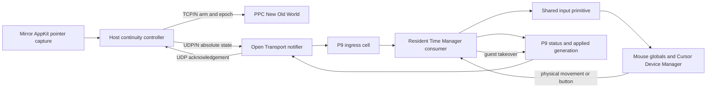

# Mirror Continuity Mode - Plan

## Goal Capsule

- **Objective:** Add an optional Continuity mode on top of NOW Mirror: first
  mirror the host pointer into the guest, then pass primary clicks directly to
  the guest, then make a held-button drag survive the guest's tracking loop.
- **Authority:** `contract/asyncapi.yaml` owns network behavior;
  `contract/peek_table.h` owns the application/resident ABI;
  `docs/resident-components.md` owns resident boundaries; the preserved
  `spikes/cursor-latency/` history owns what the cursor experiment measured.
- **Execution profile:** One main-derived feature branch that targets a
  release-candidate branch rather than landing independently on `main`, one
  existing NOW Extension, a TCP control plane and UDP input plane sharing one numeric
  port, absolute latest-state motion, and guest-side physical-input preemption.
- **Stop conditions:** Stop a release slice rather than weakening the safety
  model if the guest cannot prove its resident build, physical input cannot
  revoke ownership, a synthetic button can remain down after host loss, or a
  target machine cannot sustain its selected update rate.
- **Evidence language:** Host and guest builds are **Builds**; passing suites
  are **Tested**; only an observed PowerBook run is **Metal-verified**.

---

## Product Contract

### Summary

Continuity is a user-controlled Mirror input mode, not a new screen-sharing
product and not a public coordinate-action API. When it is enabled and the
host pointer enters the rendered guest screen, the host asks the connected
PPC guest to arm a short-lived input epoch. Absolute pointer state then travels
over a fixed-size UDP datagram to New Old World, whose Open Transport notifier
writes a bounded, preallocated cell in the existing NOW Extension table. A
resident Time Manager task consumes the latest state even while the foreground
application is inside a tracking loop.

The host and guest use the same configured number for both transports:

- **TCP/N:** the existing reliable NOW connection, capability negotiation,
  arm/disarm, epoch establishment, state reports, and ordinary product traffic.
- **UDP/N:** host-to-guest continuity state and guest-to-host acknowledgements.

TCP and UDP are separate sockets and separate protocol namespaces. Reusing the
number does not mean tunnelling UDP through the TCP connection and does not add
a second user-visible port setting. The host sends from a connected ephemeral
UDP socket to the guest at N; the guest replies to that source socket. Under
QEMU, `hostfwd=udp:127.0.0.1:N-:N` owns UDP/N while the NOW host owns TCP/N.

Continuity is off by default and enabled per Mirror session. Its update-rate
preference persists per stable guest identity; enablement does not persist, so
opening a Mirror never seizes a physical Macintosh's pointer unexpectedly.

### Release slices

#### v0 — mirrored movement

- A `Continuity` toggle appears with the Mirror's primary controls.
- When the toggle is on, the Mirror is running, the selected guest advertises
  continuity support, and the host pointer is inside the actual rendered guest
  screen, the guest cursor follows the corresponding absolute guest point.
- Letterbox, toolbar, inspector, event drawer, and other host chrome are not
  guest space and do not arm the lane.
- Movement is latest-state, coalesced, and never replayed. There is no motion
  backlog to catch up after a stall.
- The user chooses 15, 30, or 60 updates per second. The contract carries an
  integer requested and accepted rate so later hardware-specific values do not
  require another format. The initial default is 30 Hz until metal evidence
  justifies changing it.
- Stationary ownership uses a low-rate keepalive rather than sending unchanged
  positions at the selected movement rate.
- Leaving guest space disarms continuity immediately when no button is held.
- Physical guest movement is a higher-priority input. The resident revokes the
  epoch immediately, stops applying host packets, records `guest-input`, and
  leaves the host to learn about the already-completed handback afterward.
- The host does not draw a second synthetic guest cursor in v0. Its own pointer
  is already visible over Mirror; the physical guest's sprite is what P8 moves.

#### v0.5a — direct click-through

- While continuity is **active**, a primary host mouse down/up is consumed by
  the continuity lane and does not enter Mirror's semantic hit-testing,
  selection, act, press, or drag paths.
- The down and up are delivered as raw user input state at the mapped guest
  point. This is intentionally different from P4's identity-addressed acts.
- A click transition is acknowledged and ordered; it is not allowed to vanish
  through movement coalescing. The host holds a too-fast local release until
  the guest has acknowledged the down generation, then sends the up.
- Movement while the primary button is down remains pinned to the press point
  in v0.5a. That makes this release a click slice rather than accidentally
  claiming dragging.
- If continuity is requested but not yet active, unsupported, or revoked, the
  existing Mirror interaction path remains live. A failed arm must not turn a
  visible control into a dead click.
- Secondary-button translation, scroll-wheel forwarding, and multi-button
  mice are deferred. Existing non-primary Mirror behavior remains unchanged.

#### v0.5b — held movement and dragging

- A primary press that begins inside guest space captures the host pointer
  until mouse-up or cancellation and streams absolute movement while the
  synthetic guest button remains down.
- The guest resident, not New Old World's cooperative event loop, owns held
  movement and release. A Finder `DragGrayRgn`, `TrackControl`, or hand-written
  `StillDown`/`GetMouse` loop therefore continues to receive movement.
- If the captured host pointer leaves guest space while held, the guest point
  clamps to the nearest screen edge until release. The lane does not disarm in
  the middle of a gesture.
- Mouse-up, host-window resignation, app deactivation, connection loss,
  explicit disable, epoch replacement, guest physical input, and the resident
  dead-man all converge on the same release primitive.
- A release first makes `MBState` up at interrupt time. Any owed `mouseUp`
  event is posted later from a valid target context, matching P7's existing
  release split.
- Physical guest input during a synthetic drag aborts the synthetic gesture,
  releases it, revokes continuity, and hands the machine back without waiting
  for the host.

### User-visible state

The control has explicit states rather than one optimistic Boolean:

- `Off`
- `Waiting for the Mac`
- `Unavailable` with reason
- `Arming`
- `Active at <accepted rate> Hz`
- `Guest took control`
- `Degraded` with reason

`Guest took control` turns the session toggle off. Host packets from the old
epoch cannot re-arm it; the person must explicitly enable Continuity again.

### Requirements

#### Product and ownership

- R1. Continuity is optional, defaults off, and exists only on a running Mirror
  attached to one selected guest.
- R2. The host owns the policy toggle and requested rate. The guest Workshop is
  status-only and cannot become a second policy authority.
- R3. Continuity is not exposed through MCP, Agent Integration, guest Console,
  `command.request`, probe tooling, or a generic `click(x,y)` verb.
- R4. When continuity is inactive, every existing Mirror semantic click, drag,
  keyboard, menu, and Finder-interior path behaves as before.
- R5. NOW-68K is unsupported in these slices. It advertises no continuity
  capability and receives no implied Open Transport or resident claim.

#### Transport and contract

- R6. A behavior change starts in `contract/asyncapi.yaml`. Reliable control
  messages, capability fields, refusal reasons, and accepted rate land before
  either endpoint consumes them.
- R7. The binary UDP layout is stated once in a fixed-width shared contract,
  with explicit network byte order, size, version, flags, offsets, and static
  assertions. Swift encoding is checked against a C-built fixture rather than
  constructing and parsing the same packet in Swift.
- R8. TCP and UDP use the same configured numeric port N. The guest binds
  UDP/N; the host listens on TCP/N and uses a per-session ephemeral UDP source.
- R9. TCP establishes each unpredictable nonce and monotonically new epoch.
  UDP can update, acknowledge, leave, or release an established epoch but can
  never arm one.
- R10. The nonce prevents stale-session confusion but is not described as an
  authentication or hostile-network security boundary.
- R11. Datagrams are fixed-size, bounded, allocation-free at intake, and
  rejected for wrong magic, version, length, nonce, epoch, or sequence.
- R12. Position is a full absolute state. Newer position supersedes older
  position; no receiver replays intermediate motion.
- R13. Button generations are ordered separately from position sequence. The
  host does not advance an up transition past an unacknowledged down, and the
  resident reports which generation it actually applied.
- R14. Intake, apply, redraw, coalesced, stale, out-of-order, rejected,
  takeover, dead-man, and forced-release counts remain distinct.

#### Guest application and resident

- R15. The Open Transport endpoint and notifier live in PPC New Old World, not
  in the INIT. The notifier only drains a bounded number of preallocated
  datagrams, validates them, writes its owned ingress cell, and emits a
  preallocated acknowledgement.
- R16. The existing NOW Extension gains P9 Continuity. The spike's CursorRig
  INIT is research source and never installs or runs beside NOW Extension.
- R17. `contract/peek_table.h` appends a versioned continuity region. The PPC
  application exclusively writes its ingress half; the resident exclusively
  writes its status/acknowledgement half; each half has its own commit word.
- R18. P9's Time Manager task is unprimed at rest, primes only for an armed
  epoch, uses the accepted cadence, and stops re-priming immediately on exit.
- R19. P9 reuses one core-owned cursor/button application primitive. It does
  not copy P7's low-memory writes, P8's Cursor Device Manager glue, redraw
  debt, or button release logic into another implementation.
- R20. P7 semantic drag and P9 continuity cannot own the synthetic button at
  the same time. Arbitration refuses the second owner and reports which plane
  holds it.
- R21. The physical guest mouse is never disabled. Before each synthetic
  apply, the resident samples Cursor Device Manager position and button state
  against the last synthetic state. A genuine local change revokes P9 before
  applying another host state.
- R22. Button-only local preemption must be proved against
  `CursorDevice.buttons` and/or `CursorData.buttonCount` on emulator and metal
  before v0.5a is called complete. If neither is authoritative, implementation
  stops for a narrower physical-input probe; it does not patch out ADB input.
- R23. Every exit path guarantees synthetic button-up locally. A host process
  or network packet is never the sole owner of release.
- R24. The resident's accepted rate, last ingress/apply ticks, current epoch,
  ownership state, exit reason, and safety counters are readable by New Old
  World and surfaced to the host over the ordinary TCP session.

#### Host capture and routing

- R25. `PointerCaptureView` adds movement, primary up, cancellation, and
  window/app-loss callbacks while retaining exact button/modifier capture.
- R26. View points use the same `FitTransform` as `SceneRenderer`; points for
  an unknown screen size or outside the rendered guest rectangle are never
  guessed.
- R27. A host continuity controller owns the UDP socket, coalescer, cadence,
  epoch, transition acknowledgement, keepalive, and teardown. SwiftUI views do
  not own sockets or safety timers.
- R28. MirrorKit exposes a small driver protocol; NOW's host implementation
  supplies transport and guest state. MirrorKit does not import NOW host
  session types.
- R29. Semantic interaction is bypassed only after the guest reports the epoch
  active. Bypass ends immediately on guest takeover, degradation, or teardown.
- R30. The feature's internal names distinguish pointer Continuity from the
  existing `NOWMirrorSceneContinuity` scene reducer.

### Acceptance examples

- AE1. **v0:** Given a supported guest and Continuity on, moving across the
  rendered screen at 30 Hz moves the guest pointer to the same absolute points,
  with no replay after a host stall.
- AE2. **Bounds:** Moving over letterbox or Mirror chrome sends no guest point;
  leaving the guest rectangle disarms an unheld session.
- AE3. **Rate:** Selecting 15, 30, or 60 Hz produces a guest-accepted rate and
  matching resident cadence; unsupported input is clamped and reported.
- AE4. **Guest wins:** Moving or clicking the physical guest mouse revokes the
  epoch before another host point is applied. The host later shows `Guest took
  control`; continued old UDP packets do nothing.
- AE5. **v0.5a:** Clicking a raw, non-semantic point while active delivers one
  ordered guest down/up and causes no Mirror semantic act. The same click while
  inactive follows the existing Mirror path.
- AE6. **v0.5b:** Pressing a guest title bar, moving while held, and releasing
  completes a guest window drag even though its tracking loop does not pump New
  Old World's event loop.
- AE7. **Release:** Killing the host during a held drag leaves the guest button
  up after the resident bound and records `dead-man`; no later packet from that
  epoch can press it again.
- AE8. **Optional resident:** With no extension, old extension, missing P8/P9,
  failed UDP bind, or conflicting P7 owner, Continuity is unavailable by name
  and ordinary Mirror interaction remains usable.
- AE9. **Same port:** A QEMU lane and a real-LAN guest both use TCP/N plus UDP/N
  without a second preference or cross-lane port collision.

### Scope boundaries

- Screen-edge transfer between the host desktop and guest is deferred. This
  plan proves the mode inside Mirror first.
- Cross-machine file dragging is deferred. v0.5b is guest mouse dragging, not
  transfer of a host or guest item between machines.
- Guest cursor-shape capture and drawing are deferred.
- Secondary buttons, scroll-wheel forwarding, relative-pointer mode, pointer
  lock, and acceleration emulation are deferred.
- No second resident, driver, control panel, or QEMU-only input mechanism is
  introduced.

---

## Planning Contract

### Key technical decisions

- KTD1. **Preserve the whole spike series, do not merge its old lineage.** The
  ten commits at `91ec5a58` through `90d45a92` are linear and isolated under
  `spikes/cursor-latency/`. Cherry-pick them in order onto the implementation
  branch, preserving research, measurements, mutations, and the final shutdown
  correction. Do not cherry-pick only `6397c1ed`: the transferable resident
  mechanism continues through `408852a8` and `6515927f`.
- KTD2. **Port ideas, not binaries.** CursorRig, CursorRig Intake, Starver, and
  the rig contract keep measurement identities. Product code is implemented in
  NOW's current modules and unified extension.
- KTD3. **One number, two transports.** Reuse the configured wire number across
  TCP and UDP; do not add a continuity-port preference.
- KTD4. **Reliable arm, lossy state.** TCP owns epoch creation and policy;
  fixed UDP state owns low-latency motion and release acknowledgements.
- KTD5. **Absolute latest state.** Preserve the spike's measured coalescing
  result; never build a movement queue.
- KTD6. **Ordered button generations.** Movement may coalesce; down/up may not.
  Acknowledgement gating and a resident dead-man close both loss directions.
- KTD7. **Guest input preempts rather than being disabled.** This is the local
  escape path and does not depend on a healthy host.
- KTD8. **One resident input primitive.** P7, P8, and P9 share cursor placement,
  redraw debt, button state, ownership arbitration, and release; P9 does not
  become another implementation of them.
- KTD9. **Direct user input is not an automation verb.** Continuity does not
  reverse `docs/input-plane-decisions.md`'s no-coordinate-click ruling because
  only a person physically operating the Mirror can arm and feed this lane.
- KTD10. **The user controls cadence.** The first UI presents 15/30/60 Hz; 30
  Hz is the provisional default, and the guest reports the actual accepted
  value.

### High-level design

### Contract shapes

#### Reliable TCP control

The AsyncAPI change defines symmetric message meaning even though only the PPC
guest advertises the serving capability in this release:

- `continuity.arm`: nonce, new epoch, requested rate, lease bounds, protocol
  version, and guest identity already bound to the TCP session.
- `continuity.report`: requested/active/refused/revoked state, accepted rate,
  UDP readiness, current epoch, exit reason, and bounded counters.
- `continuity.disarm`: epoch and reason. Receiving an already-ended epoch is an
  idempotent acknowledgement, not an error.

A receiver without the capability refuses `unsupported` through the same
message semantics. The host does not silently acquire the reverse direction.

#### UDP packet and acknowledgement

Add `contract/continuity_udp.h` with fixed-width, network-order fields. The
initial state packet carries magic, version, flags, nonce words, epoch,
position sequence, absolute h/v, button level, button generation, requested
rate, and host stamp. The acknowledgement carries the same identity plus
accepted position sequence, resident-applied button generation, resident state,
exit reason, and guest arrival/apply stamps.

The exact byte layout is frozen only after a host-C fixture and Swift codec
round-trip agree on every offset. Datagram length is exact; trailing or short
packets refuse rather than being partially interpreted.

#### Shared application/resident cell

Append `continuity_format` and `NowPeekContinuityCell` to
`contract/peek_table.h`, with compile-time size and offset assertions. The cell
contains two independently committed halves:

- **Ingress, PPC application-owned:** nonce/epoch, latest accepted packet,
  absolute point, button generation/level, arrival tick, requested rate, lease,
  and intake counters.
- **Status, resident-owned:** state, accepted rate, applied point/button
  generations, last apply tick, exit reason, current synthetic button owner,
  and resident safety counters.

The application never writes resident state. The resident never rewrites
network intake accounting. Readers validate table length, format, and the
applicable half's sequence before using it.

### Module map

#### Preserved research

- `spikes/cursor-latency/**` — cherry-picked unchanged as the emulator-measured
  research lineage, load generator, cross-compiled rig, results, and mutation
  evidence.

#### Host

- `now-host/Packages/MirrorKit/Sources/MirrorKitUI/PointerCapture.swift` — add
  move/up/cancel/loss capture and mode-dependent event consumption.
- `now-host/Packages/MirrorKit/Sources/MirrorKitUI/LiveMirror.swift` — route
  exact guest points to an optional continuity driver and bypass semantic
  interaction only while the driver is active.
- `now-host/Packages/MirrorKit/Sources/MirrorKit/` — define small pointer-state,
  state-report, and driver protocols with no NOW session dependency.
- `now-host/Sources/Host/MirrorContinuityController.swift` — own lifecycle,
  rate/coalescing, UDP session, acknowledgements, edge ordering, and teardown.
- `now-host/Sources/Host/ContinuityDatagramCodec.swift` — explicit fixed-layout
  network-order encoder/decoder.
- `now-host/Sources/Host/NOWMirrorSource.swift` — expose the driver and bind it
  to the currently selected guest/session without adding socket ownership.
- `now-host/Sources/Host/MirrorControlView.swift` and
  `MirrorPlaneDomain.swift` — display support, requested/active rate, refusal,
  takeover, and counters.
- `now-host/Sources/Host/SettingsModel.swift` or a dedicated small preference
  owner — persist only per-guest update rate, not enabled state.

#### PPC guest application

- `now-guest-ppc/src/continuity/continuity_intake.[ch]` — endpoint lifecycle,
  bounded notifier, ingress publication, and acknowledgements.
- `now-guest-ppc/src/continuity/continuity_control.[ch]` — TCP arm/disarm/report
  handling and P9 claim ownership through `peek.c`'s existing lease aggregator.
- `now-guest-ppc/src/continuity/continuity_status.[ch]` — stable reads of the
  resident-owned half and host reports.
- Existing connection preferences supply N; no second port preference is
  introduced.

#### NOW Extension

- `ext/src/now_ext_continuity.c` and a small Time Manager shim — P9 state
  machine and cadence vehicle.
- A core-owned resident input module extracted only as far as necessary to let
  P7 and P9 share P8 placement, physical-input detection, button ownership,
  release, and redraw debt without duplicated low-memory addresses.
- `contract/peek_table.h` — P9 capability bit, format, state/exit enums, split
  cell, and pinned layout.

#### Lab and gates

- `scripts/spin-up-ppc` — add UDP host forwarding for the derived wire port and
  record TCP/UDP roles in run provenance.
- `tools/lane-ports` — treat the wire role as TCP plus UDP, report holders by
  protocol, and refuse a lane whose UDP side is occupied.
- `scripts/test-native` — list every new pure-C continuity/table/codec test in
  its manifest.

### Execution sequence

#### Phase 0 — preserve and reconcile the spike

1. Start the implementation branch from a refreshed `main` after this plan is
   accepted; prove its base SHA and dirty state before mutation.
2. Cherry-pick, in order:

   `91ec5a58 6397c1ed 0ffe90d4 95a1a4fd 6d97b2b7 408852a8 9cf5e8d8 6515927f 13daa522 90d45a92`

3. Prove the cherry-pick changed only `spikes/cursor-latency/**` and run its
   `scripts/check`. Preserve failures honestly if the old rig needs a bounded
   compatibility repair on current main.
4. Write a short reconciliation note inside the spike identifying which
   mechanisms transfer, which current P7/P8 code supersedes, and which rig
   binaries remain measurement-only.

#### Phase 1 — contracts and deterministic state machines

1. Add AsyncAPI control/report messages and capability fields first.
2. Add the fixed UDP header, C/Swift independent fixtures, nonce/epoch/sequence
   validation, rate negotiation, movement coalescer, and button-generation
   state machine.
3. Append P9 to `peek_table.h`; compile the header under the 68K extension, PPC
   application, and host `cc`; pin every new offset.
4. Extract pure resident logic for arm, tick, takeover, timeout, owner conflict,
   and forced release. Watch each guard fail against its named mutation.

**Gate:** Contract tests and native tests pass; stale epoch, out-of-order move,
lost edge acknowledgement, owner conflict, takeover, and dead-man mutations
each fail for their intended reason.

#### Phase 2 — PPC UDP intake and same-port harness

1. Add the PPC Open Transport datagram endpoint using the existing configured
   N, with preallocated buffers and a bounded drain count.
2. Publish ingress through only the application-owned half and acknowledge from
   preallocated state. Report bind, notifier, datagram, and resident states
   separately.
3. Add QEMU UDP forwarding at the lane-derived wire port. Update port guards,
   provenance, and reclaim diagnostics for TCP/UDP dual use.
4. Prove wrong build, wrong nonce, wrong epoch, malformed length, endpoint
   error, and socket collision all refuse by name.

**Gate:** PPC guest builds; a session-private emulator receives and
acknowledges the exact build's packets over UDP/N while TCP/N remains connected.
No resident cursor mutation is enabled yet.

#### Phase 3 — P9 resident integration and v0

1. Add P9 to NOW Extension, unprimed at rest.
2. Reconcile the spike writer with current P7/P8. Preserve P8's absolute
   position plus task-time picture settlement and P7's release ordering; do
   not import CursorRig's independent trap chain.
3. Implement physical movement preemption, epoch revocation, rate cadence,
   idle lease, counters, and guest status publication.
4. Extend MirrorKit capture for movement and add the host controller, toggle,
   rate picker, exact coordinate mapping, coalescing, keepalive, and teardown.
5. Keep existing semantic input active until the guest confirms P9 active.

**Gate:** v0 acceptance examples pass under idle, tracking, drawing, and polite
emulator loads. The spike's pathological no-event/no-tracking case remains a
named picture limitation rather than being hidden by position counters.

#### Phase 4 — v0.5a direct clicks

1. Prove the authoritative physical-button signal on the emulator and
   PowerBook before enabling synthetic button ownership.
2. Add ordered primary down/up generations, immediate edge sends,
   acknowledgement gating, and the resident button owner/release path.
3. Consume the host primary event only while P9 is active; otherwise retain the
   semantic Mirror route.
4. Pin movement to the press point until up so this slice cannot accidentally
   claim held motion or dragging.
5. Verify direct clicks on semantic and non-semantic screen points and prove no
   P4/Mirror act was emitted for the active direct path.

**Gate:** One local click becomes one guest down/up, a fast click cannot lose
its down edge, physical guest click revokes the epoch, and every cancellation
path leaves `MBState` up.

#### Phase 5 — v0.5b held movement

1. Enable motion after an acknowledged down and maintain capture outside the
   guest rectangle until release.
2. Feed held movement through the resident Time Manager path and settle the
   owed mouse-up at task time.
3. Reuse P7/P9 owner arbitration and dead-man logic; add no second release
   implementation.
4. Exercise Finder title-bar, grow box, scrollbar thumb, control tracking,
   TextEdit selection, and one application with a hand-written tracking loop.
5. Kill the host and sever UDP separately during a held gesture; both must
   release locally within the recorded bound.

**Gate:** Drag behavior is Tested on QEMU and then watched on the PowerBook
before v0.5b is called Metal-verified.

#### Phase 6 — metal rate selection and closeout

1. Bake the exact extension source through `scripts/bake-ext-image`; a commit
   touching `ext/` or `contract/peek_table.h` cannot rely on a note or deferred
   shared image.
2. On the PowerBook 1400c, run 15/30/60 Hz against idle, tracking, drawing, and
   polite loads. Record arrival, apply, picture, coalescing, CPU/interaction
   symptoms, and packet counts separately.
3. Verify guest takeover by physical move and button, host quit, host crash,
   network loss, Mirror stop, pointer leave, app deactivation, and extension
   removal.
4. Choose the default from the measurements without removing the user's rate
   control. If 60 Hz is too expensive, it may remain unsupported or visibly
   clamped on that guest.
5. Run `scripts/test-all`, rederive affected derived docs, and update current
   status rather than leaving this plan to describe the shipped system.

### Verification matrix

| Layer | Required evidence |
|---|---|
| Contract | AsyncAPI validation; C/Swift cross-fixture; table static asserts |
| Pure logic | epoch, ordering, coalescing, rate, takeover, owner, timeout, release mutations |
| Host | exact transform at fit and every zoom stop; bounds; active-only bypass; lifecycle teardown |
| PPC intake | bind/notifier/error handling; bounded drain; wrong packet refusal; ack identity |
| Resident | unprimed rest; timer cadence; P7/P9 arbitration; physical preemption; forced release |
| Emulator | idle/tracking/drawing/polite load; external sprite oracle; direct click and held drag |
| Metal | 15/30/60 sweep; local takeover; real NIC; Finder/control/TextEdit drag; host-loss release |

Every new guard is watched fail against the mutation it names, with proof that
the mutated artifact built and that the intended test actually ran.

### Documentation and accounting closeout

Implementation updates, in the same commits as behavior:

- `docs/resident-components.md` — P9 ownership, at-rest cost, arbitration, and
  removal behavior.
- `docs/cursor-follow.md` — continuity's use of P8 and the revised local-input
  preemption rule without rewriting P8's semantic-act courtesy.
- `docs/input-plane-decisions.md` — continuity is a user-only Mirror lane, not
  the rejected generic coordinate click verb.
- `docs/mirror-drive-loop.md` — direct-input acceptance rows and paired host /
  guest evidence.
- `docs/contract-coverage.md` — rederived for new messages and PPC-only serving
  support.
- `docs/status.md`, `README.md`, and `docs/open-issues.md` — what is built,
  tested, metal-verified, deferred, and still limited.
- `docs/staged-images.md` / extension receipt only if the current mechanisms or
  oracle change; do not restate derived image truth in this plan.

### Commit boundaries

Keep recoverable commits at these boundaries:

1. preserved spike history;
2. network and in-memory contracts plus pure logic;
3. PPC intake and same-port harness;
4. P9 resident integration;
5. host v0 movement and UI;
6. v0.5a button transitions;
7. v0.5b held movement and release hardening;
8. metal evidence, current-state docs, and open-issues closeout.

Extension-source commits obey the bake gate. Unverified checkpoints say so in
their commit message rather than keeping a large resident change uncommitted.

### Definition of done

This roadmap is complete when:

- the entire cursor spike is preserved on a current-main lineage;
- only one NOW Extension is installed and P9 is optional at rest;
- one configured port number serves TCP control and UDP continuity;
- v0, v0.5a, and v0.5b each satisfy their own acceptance gate;
- the user can select the update rate and see the accepted rate;
- physical guest input exits continuity immediately without host cooperation;
- no host or network failure can leave the guest button down;
- continuity-active clicks bypass Mirror semantics, while inactive clicks are
  unchanged;
- QEMU results are labelled Tested and PowerBook observations are recorded
  before Metal-verified is claimed; and
- current-state docs and the open-issues ledger, not this plan, describe what
  finally shipped.
