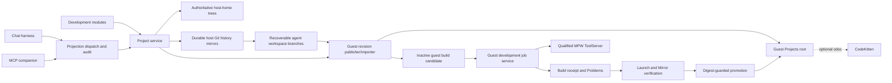

<!-- now-doc-provenance: generated reviewed=false -->

# Projects and Development - Plan

## Goal Capsule

- **Objective:** Let a person or agent create and revise a bounded software
  project, build it headlessly with a configured toolchain on the connected
  classic Macintosh, verify and run the product there, and optionally hand the
  project to CodeKitten for human editing.
- **Authority:** A project's declared home owns its authoritative working
  source; NOW owns orchestration, host-side history mirrors, recoverable agent
  workspaces, receipts and agent policy; the connected classic Mac owns
  installed toolchains, build execution and runtime truth.
- **First bounded slice:** Each project has an authoritative home on this Mac or
  the classic Mac. NOW may maintain a private host history mirror and agent
  working copies without changing that home. Agent writes on this Mac are
  confined to NOW's application-owned Projects directory. No agent-facing
  operation accepts an arbitrary modern-Mac path.
- **Execution profile:** Land Projects and revision/history semantics first,
  then recoverable workspaces, guest candidate staging/promotion, toolchain
  registration, headless builds, runtime verification, Chat/MCP exposure and
  optional CodeKitten handoff.
- **Stop conditions:** Stop before accepting shell text, widening the generic
  Files root to cover toolchains, treating guest agent consent as host
  filesystem consent, claiming a host mirror or workspace is current without a
  digest, promoting over guest divergence, or making CodeKitten a dependency of
  headless work.

---

## Product Contract

### Summary

NOW gains one **Development** module on each of its two human-facing apps. The
module is one surface with Projects, Toolchains, Builds and Runs as sections;
Projects remains its own implementation and authority slice rather than a
second sidebar product with overlapping ownership.

A project is a directory containing `Project.ckp` plus its source and project
assets. `CKPROJECT 1` is the new first-class format; `.ckp` means a CodeKitten
Project contract, not “a project that requires the CodeKitten IDE.” CodeKitten
may open it when a human wants eyes and hands on the work, while NOW can create,
revise, stage, promote, build, test and run it without CodeKitten running or
installed.

Every project has a stable opaque identity and one declared home:

- **host:** the working source lives beneath NOW's application-owned Projects
  root on this Mac;
- **guest:** the working source lives beneath a human-selected Projects root on
  the connected classic Mac.

Both homes receive host-owned Git history. A host-home project is committed
directly from its bounded working tree. A guest-home project has two private
host-side layers beneath the same NOW-owned root:

- a durable **history mirror** containing only verified guest snapshots and
  accepted agent revisions; and
- a recoverable **agent workspace** derived from one verified snapshot, where
  an agent reads, edits, commits and iterates without mutating the active guest
  source.

Neither layer changes the project's `guest` home. The mirror is not current
guest truth without a source digest and sync receipt. A workspace additionally
names its base guest digest and revision, so it can be staged, promoted,
rebased or refused without being mistaken for a second project.

Builds execute on the classic Mac through an asynchronous guest development
service. The first backend is MPW ToolServer, driven from a validated
declarative build plan rather than caller-supplied command text. A build receipt
binds the source actually seen on the guest, its project revision, the exact
toolchain, diagnostics, transcript and produced classic file. Launch and
runtime acceptance are separate receipts, with Mirror providing the semantic
and visible acceptance path after a successful build.

### Requirements

#### Project identity, storage and history

- R1. A project must have a stable opaque ID, display name, `host` or `guest`
  home, format version, source revision and content digest.
- R1a. An agent workspace must have an opaque workspace ID, project ID, base
  project revision, base guest digest when the home is `guest`, current commit
  and lifecycle state. It is an internal working copy, not another project or a
  change of project home.
- R2. Host-home projects must live beneath one application-owned Projects root
  resolved with the operating system's Application Support API. The product
  must not ship a personal `Lab` convention or infer a sibling directory from
  the application bundle.
- R3. An agent-facing host project request must use an opaque project reference
  and a canonical project-relative path. It must not accept an absolute host
  path, `..`, a symlink/alias escape, recursive unbounded input or a caller-
  selected repository root.
- R4. Host-home project changes and agent-workspace changes must be atomic
  batches guarded by an expected revision and expected prior digests. A
  conflict returns current revision metadata without partially applying the
  batch.
- R5. Every accepted source change must produce a typed revision receipt and a
  recoverable host Git commit. Git implementation details, refs and arbitrary
  Git commands must not be exposed as agent tools. The shipped history backend
  must not assume Command Line Tools, `/usr/bin/git` availability or the user's
  global Git configuration.
- R6. Guest-home projects must use a human-selected, persisted guest Projects
  root distinct from the generic Files `guestRoot` and from toolchain roots.
  First use may offer to create a `Projects` folder beside the guest app when
  that location is writable, but it must remain an explicit choice rather than
  a shipped `Lab` path or silent default.
- R7. A guest mirror must never be reported as current merely because it was
  copied successfully. Import, candidate-stage and promotion receipts must bind
  guest identity, project/workspace identity, file manifest, forks, metadata,
  aggregate digest and the base/current guest digest comparison.
- R8. Out-of-band guest edits are supported state. The next status or sync must
  report `dirtyOnGuest` or import a new revision; it must not overwrite or
  silently discard them.
- R8a. Opening a guest-home project for agent work must materialize or refresh
  its history mirror from one coherent guest snapshot, then create or resume a
  recoverable workspace branch from that verified revision. Agent reads,
  applies and Git commits target the workspace, never the active guest tree.
- R8b. A workspace must survive Chat/tool retries and host process restart long
  enough to support an iterative edit/build/fix loop. Explicit accept, discard
  and bounded cleanup states must preserve receipts and refuse to delete the
  only copy of unpromoted commits.

#### Project format and CodeKitten compatibility

- R9. `Project.ckp` with `CKPROJECT 1` must be the canonical new project file.
  The contract must define source membership, targets, configurations,
  toolchain pins, build actions, products and format evolution independently of
  either application's UI.
- R10. CodeKitten must continue to read legacy `Project.o9p` / `O9PROJECT`
  projects. Migration to `.ckp` must be explicit Save As or conversion, never a
  silent rewrite on open.
- R11. Shared CodeKitten/NOW code, if extracted, must have a neutral versioned
  owner and be limited to pure project/build vocabulary, receipt schemas and
  conformance fixtures. UI, MCP, transport, persistence and application
  lifecycle remain app-owned.
- R12. Headless create, edit, build, test and run must work without launching
  CodeKitten. “Open in CodeKitten” is a late optional handoff, not a prerequisite
  or a substitute for the development service.

#### Toolchains and build execution

- R13. Toolchains belong to the classic Mac. A person registers immutable root
  locations in the guest Development module; agents may list and select only
  registered entries in the first slice.
- R14. A toolchain record must include an opaque ID, display name, backend,
  version, root directory identity, supported CPU/OS/ABI, qualification state
  and measured capabilities. A project pins the ID and expected version.
- R15. Toolchain roots must not be exposed through generic Files or MCP file
  tools. Registration must not accept an agent-supplied path in the first
  slice.
- R16. The first build backend must drive MPW ToolServer from a closed set of
  declarative actions. No MCP, Chat, project file or wire message may contain
  arbitrary MPW command or shell text.
- R17. Build work must be asynchronous, cancellable and bounded. It must not
  monopolize the cooperative event loop; nested Toolbox loops must pump the
  wire, and late output after cancellation must be quarantined by job identity.
- R18. A build receipt must bind project ID/home, source revision, actual guest
  source manifest and digest, workspace ID/commit and candidate ID when
  applicable, toolchain ID/version, target/configuration, diagnostics, bounded
  transcript, timing, terminal state, product HFS path, data/resource fork
  sizes, type/creator and product digest.
- R19. Build success must not imply launch success. Run and test operations must
  produce separate receipts and settle against the expected product identity.
- R20. The first execution target is the PPC Carbon guest. NOW-68K must
  advertise typed unavailability for toolchain/build/run capabilities; no host
  code may infer support from guest name, CPU label or application identity.

#### Chat, MCP and authorization

- R21. Projects must be available to the host Chat harness through the same
  typed catalog, strict argument validation, dispatch and audit path used by
  MCP. There must not be a private Chat-only project mutation API.
- R22. Host project authority must be distinct from `hello.agent`, which is the
  classic Mac owner's consent for classic-Mac operations. Built-in Chat and the
  same-UID MCP companion may read and write only NOW's application-owned
  Projects root by product contract; the Development module must display that
  fixed scope rather than implying the guest's setting controls it.
- R23. Guest project reads require guest Read Only access; guest writes,
  publication, build, test and run require guest Full access. Cross-machine
  operations must enforce the host Projects scope and check the guest grant
  where both domains are touched.
- R24. Chat's prompt must state the two authority domains precisely: machine
  tools act on the connected classic Mac; project tools act only on a named
  NOW-managed project and always report whether its home is `host` or `guest`.
  For a guest-home edit, it must distinguish the authoritative guest project
  from the host workspace it is changing.
- R25. The agent surface must be semantic and compact: project list/status,
  open/resume/discard workspace, bounded read, atomic apply/history,
  development environment, stage/promote, build, run and optional IDE handoff.
  It must not expose Git, ToolServer, arbitrary host files or generic guest
  scripting.
- R26. The final tool grouping and descriptions must pass a catalog-context
  measurement before landing. Development capability must not impose a large
  prompt tax on ordinary machine-only Chat turns; a filtered Development tool
  set or explicit project context may be used while retaining one registry and
  dispatch.

#### Human surfaces and observability

- R27. The host Development module must show project home/revision/dirty state,
  history-mirror and workspace state, sync/divergence state, selected
  guest/toolchain, current job, latest receipts and Problems without requiring
  Chat.
- R28. The guest Workshop Development module must let a person choose the guest
  Projects root, register/qualify toolchains, inspect jobs and cancel work. It
  must remain one page behind `WorkshopModuleOps`, with free idle work and
  native controls.
- R29. Human actions and agent actions must call the same project, workspace,
  candidate-stage, promotion, build and run services. Both faces must produce
  the same receipts and audit facts.
- R30. “Open in CodeKitten” must launch CodeKitten if necessary, send one
  bounded `odoc` for the selected active `Project.ckp`, observe acceptance and
  bring it forward. Until CodeKitten implements `odoc`, the UI reports the
  handoff unavailable; headless operations remain unaffected.

### Authorization Matrix

| Operation | Host Projects scope | Guest agent grant |
|---|---:|---:|
| List/read host-home project | Read | none |
| Change/history host-home project | Write | none |
| List/read guest-home project or import its base | Write for private mirror | Read Only |
| Create/edit/commit guest project workspace | Write for private mirror/workspace | none after a verified base exists |
| Stage/build/test workspace candidate on guest | Read | Full |
| Promote workspace candidate to guest project | Read | Full plus unchanged base digest |
| Build/test/run active guest source without edits | none | Full |
| Reveal/export host project to a human | explicit human action | none |
| Operate outside NOW's Projects roots | unsupported | unsupported |

The host scope is always the root NOW already owns. It is not a promise that a
future Projects setting may authorize arbitrary repositories; that is a
separate later product decision.

### Key Flows

- F1. **Create and revise a host project.** Chat or the Development page creates
  a project beneath the NOW-owned root, writes `Project.ckp` and sources through
  one atomic apply, and receives a new revision plus host Git receipt.
- F2. **Work from a guest project.** NOW imports one coherent guest snapshot
  into the durable history mirror, records its guest digest, and creates or
  resumes a workspace branch identified by `workspaceRef`. The agent edits and
  commits there; the guest's active source does not change during ordinary
  iteration.
- F3. **Stage, build and promote.** NOW publishes the workspace commit to a new
  inactive guest candidate using the existing bounded transfer primitives,
  verifies every fork and digest, and builds/tests/runs that candidate in place.
  Promotion to the active guest project occurs last and only if the current
  guest digest still matches the workspace's base digest. Otherwise NOW keeps
  both sides, reports divergence and requires an import/rebase or explicit human
  resolution.
- F4. **Run and inspect.** A successful build mints a product reference. NOW
  launches that exact product, observes process/application identity and uses
  Mirror for visible or semantic acceptance. A build receipt and run receipt
  remain distinct.
- F5. **Human handoff.** A person selects Open in CodeKitten. NOW targets the
  active guest `Project.ckp` with the bounded open-document seam; CodeKitten may
  then edit normally while NOW treats any resulting change as out-of-band drift
  until synchronized.

### Acceptance Examples

- AE1. **Covers R1-R5, R21-R25.** Given host Projects write access, when Chat
  creates a memory-monitor applet and applies three files at expected revision
  zero, then all files appear under the NOW-owned root, one Git revision is
  recorded, and neither the request nor receipt contains an arbitrary host path.
- AE2. **Covers R3-R5.** Given revision four changed after an agent read it,
  when the agent applies against revision three, then nothing changes and the
  response reports a typed revision conflict.
- AE3. **Covers R6-R8.** Given a guest-home source was edited directly, when NOW
  next reads its status, then the private mirror is marked stale or a verified
  import becomes a new revision; the guest edit is never overwritten silently.
- AE3a. **Covers R1a, R8a-R8b.** Given an agent opens a guest-home project, when
  it edits and commits twice, then both commits land on one recoverable host
  workspace derived from the verified guest digest, while the active guest
  project remains unchanged.
- AE3b. **Covers R7-R8b.** Given CodeKitten changes the active guest project
  after an agent workspace was created, when that workspace finishes a
  successful staged build, then promotion refuses with both digests and neither
  the human edit nor the agent commits are discarded.
- AE4. **Covers R13-R18.** Given MPW is registered and qualified, when a pinned
  project builds, then ToolServer receives only rendered allowlisted actions and
  the terminal receipt binds the measured toolchain, source and product forks.
- AE5. **Covers R17.** Given ToolServer hangs while the wire remains active, when
  the deadline or person cancels the job, then the Workshop still responds,
  cancellation settles once, and late output cannot complete a later job.
- AE6. **Covers R18-R19.** Given compilation succeeds but the product does not
  launch, then Build is successful, Run is failed, and Chat reports both rather
  than saying the app works.
- AE7. **Covers R20.** Given NOW-68K is paired, when Development opens or an
  agent requests a build, then capability discovery and the response say the
  build backend is unavailable without attempting a PPC command.
- AE8. **Covers R22-R23.** Given host Projects write is allowed but guest access
  is Read Only, when an agent edits a host project and tries to publish it, then
  the edit succeeds and publication is declined before a guest mutation.
- AE9. **Covers R12, R30.** Given CodeKitten is absent or lacks `odoc`, when a
  headless build runs, then it completes normally and only Open in CodeKitten is
  unavailable.

### Scope Boundaries

- No arbitrary host repository, shell, build command, Git command or filesystem
  browser is added to Chat or MCP.
- No package manager, toolchain installer, dependency downloader, remote build
  farm or background indexing service is included.
- No CodeWarrior automation is included in the first backend. The build service
  is designed for another declarative backend later, but MPW ToolServer is the
  only implementation in this roadmap.
- No NOW-68K build service or resident-component execution is included.
- No multi-user collaboration, merge UI or remote Git hosting is included.
- No first-slice agent merge engine is implied by divergence handling. NOW
  preserves both histories and can materialize a refreshed workspace; semantic
  or human conflict resolution is follow-up work.
- No promise is made that a guest-home working directory is immutable. The
  base/current guest digests, candidate staging and promotion precondition are
  the protection against human edits, CodeKitten edits and other guest tools.

---

## Planning Contract

### Key Technical Decisions

- KTD1. **Use `.ckp`, not `.now` or new `.o9p`.** (session-settled:
  user-directed) `.o9p` preserves the old OS9 IDE name; `.now` would make a
  portable project format look owned by this bridge. CodeKitten becomes the
  format's first-class human editor, not its mandatory runtime.
- KTD2. **Keep Projects as a distinct domain inside one Development module.**
  (session-settled: user-directed slice, module composition proposed) Project
  storage/history can land and stabilize before guest builds without creating
  two sidebar pages that both own the active project.
- KTD3. **Bound host writes with structural authority.** (session-settled:
  user-directed) The root comes from NOW's Application Support container;
  callers receive opaque project refs and project-relative operations only.
- KTD4. **Separate project home, history mirror and agent workspace.** A host
  project is authoritative under the app-owned root. A guest project is
  authoritative under the selected guest root; its durable host Git repository
  is explicitly a history mirror, and each agent effort uses a recoverable
  workspace branch from a verified guest revision. Neither host-side layer is
  presented as a second project or silently changes the home.
- KTD5. **Put Git behind a project history service.** Host Git provides durable
  revision and recovery semantics for both homes, but neither agents nor the
  classic Mac receive a general Git execution surface. A future CodeKitten
  history UI consumes typed history/status operations rather than implementing
  Git process behavior in its UI layer. The backend writes a standard Git
  repository without invoking a shell or inheriting user configuration; U2
  must select an embedded library or a bounded owned object/ref implementation
  before taking a new runtime dependency. System Git is a conformance oracle,
  not the shipped runtime.
- KTD6. **Separate host scope from guest consent.** `hello.agent` answers
  whether an agent may drive the classic Mac; it neither authorizes nor denies
  modern-Mac storage. Built-in Chat and the same-UID MCP companion receive the
  fixed NOW-owned Projects scope, and every project operation is audited.
- KTD7. **Stage workspace candidates and promote last.** The existing staged,
  checked, create-only transfer lane is reused under a Development coordinator:
  a workspace commit writes a fresh inactive candidate directory, verifies it,
  and builds/tests/runs there. Only acceptance plus an unchanged base guest
  digest may update the active revision record. A failed build, failed publish
  or divergent guest cannot replace the prior active source.
- KTD8. **Hash what the builder actually reads.** Host Git identity and transfer
  success are provenance, not build input proof. The guest manifest/digest in
  the build receipt is the acceptance oracle and detects direct guest edits.
- KTD9. **Keep toolchain directories out of Files.** Toolchain registration is a
  human-owned guest setting and agent selection is by qualified opaque ID.
- KTD10. **Run builds in the NOW PPC guest, not in CodeKitten UI.** The service
  exists whenever NOW is running, operates independently of the selected
  Workshop page and owns ToolServer job lifecycle. CodeKitten is optional.
- KTD11. **Use declarative build actions.** The shared build vocabulary permits
  compile, Rez, link, copy/stage and product metadata operations whose arguments
  are validated as project/toolchain-relative values. The backend alone renders
  MPW commands and quoting.
- KTD12. **Reuse the projection catalog and dispatch, extend its authority
  model.** Host-owned projections still use strict schemas, one registry, one
  local protocol and one audit stream, but declare a host Projects authority
  domain rather than pretending guest consent covers it. Cross-domain
  projections enforce that structural scope and the guest grant.
- KTD13. **Reuse Mirror for runtime acceptance.** Build does not grow another
  UI-driving system. Launch and verification go through existing semantic
  launch/Mirror state, executor, settlement and journal paths.
- KTD14. **Use the existing closed `odoc` seam for IDE handoff.** Add a bounded
  `now_open_document` projection rather than Standard File clicking or generic
  `aesend`; CodeKitten adds a standard open-document handler when that optional
  integration is implemented.
- KTD15. **Extract shared code only after conformance fixtures pin the seam.**
  First write the pure `.ckp`, build-plan, diagnostics and receipt contract with
  fixtures consumable by both repos; then choose a neutral package/repository.
  NOW must not import CodeKitten application source as a dependency.

### Technical Design

The project service is transport-neutral. Host views, Chat and MCP call typed
operations over the same actor/service boundary. Project-relative path
validation, revision preconditions, atomic staging, Git commit settlement and
audit live there rather than in the SwiftUI view or projection rows.

For a guest-home project, the service first imports a coherent guest snapshot
to the history mirror and records the guest digest. It then gives each agent
effort a stable `workspaceRef` backed by its own branch or worktree. Workspace
commits may continue while the guest is disconnected. Anything that stages or
promotes those commits must reconnect, remeasure the guest and compare the
current digest with the workspace base. Divergence is a first-class terminal
outcome, not an overwrite option.

The guest development service is likewise page-neutral. Wire handlers enqueue
or query bounded jobs and return; the normal event loop advances them. The
Workshop page observes the same job model and may cancel it. ToolServer output
is decoded incrementally into structured Problems plus a capped transcript.

The shared project contract is data, not control. Its reference fixtures must
round-trip in the host Swift implementation, guest C implementation and
CodeKitten core. Wire messages remain in `contract/asyncapi.yaml`; `.ckp` and
receipt schemas have their own versioned specification because CodeKitten may
consume them without speaking NOW's transport.

### Proposed Semantic Projection Families

Exact row grouping remains subject to the context-cost gate, but the operation
vocabulary is fixed enough to prevent generic escape hatches:

| Family | Operations | Authority |
|---|---|---|
| Projects | list, create, status, open/resume workspace, bounded read, atomic apply, history | fixed host Projects scope; guest Read Only only when importing/refreshing a guest base |
| Development | environment/toolchains, import/sync, stage/promote, build status/start/cancel | guest Full when the guest is touched |
| Runtime | run exact product, inspect run receipt | guest Full |
| Handoff | open active project in CodeKitten | explicit human action initially; bounded guest Full if later projected |

A likely first catalog is `now_projects_list`, `now_project_create`,
`now_project_status`, `now_project_workspace`, `now_project_read`,
`now_project_apply`, `now_project_history`, `now_development_environment`,
`now_development_stage`, `now_development_promote`, `now_development_build` and
`now_development_run`. This naming is provisional; the implementation must
measure whether fewer discriminated family rows are clearer and cheaper while
retaining per-operation availability and strict schemas.

### Risks and Mitigations

| Risk | Mitigation |
|---|---|
| Host project access quietly becomes arbitrary disk access | Resolve one app-owned root internally; accept opaque project and relative path only; reject symlink/alias escapes at every component. |
| Git works only on a developer Mac | Hide it behind `ProjectHistoryStore`; do not invoke system Git in production; verify emitted repositories with independent Git fixtures and a system-Git oracle in tests. |
| Guest direct edits race an agent candidate | Workspace records its base guest digest; build in a fresh inactive candidate; promote only after a current digest check; preserve both sides on divergence. |
| Git mirror, workspace and guest state are conflated | Give each a distinct identity and lifecycle; receipts name mirror revision, workspace commit, base/current guest digests and candidate digest; only verified import or promotion advances sync state. |
| A host crash strands uncommitted agent work | Use recoverable workspaces with atomic applies and coherent checkpoint commits; resume by opaque workspace ID; cleanup refuses the sole copy of unpromoted commits. |
| ToolServer blocks the cooperative app | Asynchronous job state machine, bounded output reads, deadlines/cancel, free module idle, wire pumping in every nested loop. |
| Project data becomes command injection | Closed build actions, canonical relative paths, backend-owned quoting, no caller-supplied MPW line or environment. |
| Source/resource forks or Finder metadata are lost | Manifest each fork and metadata, reuse MacBinary/transfer primitives, compare terminal guest measurements before activation. |
| Project tools overwhelm ordinary Chat context | Measure catalog tokens and tool-selection accuracy; inject filtered Development tools only with an active project/development intent while using the same registry/dispatch. |
| CodeKitten and NOW drift on format | Versioned shared spec, golden fixtures and cross-repo conformance before extraction; legacy `.o9p` compatibility stays tested. |
| A build is reported as a working app | Separate build, launch and Mirror acceptance receipts; label verification as Builds, Tested or Metal-verified. |

---

## Implementation Units

### U1. Specify the project and receipt contract

- **Goal:** Pin the portable seam before either app grows another private
  project model.
- **Requirements:** R1-R1a, R9-R12, R18-R19; AE3a, AE6, AE9.
- **Files:** new `contract/project/` specification and golden fixtures;
  CodeKitten follow-up in its pure `core/`; conformance tests in both repos.
- **Work:** Define `CKPROJECT 1`, project/target/configuration/toolchain fields,
  relative-path grammar, workspace/candidate identities and lifecycle, build
  actions, Problems, source/stage/promotion/build/run receipts and legacy
  `.o9p` conversion rules. Prove fixtures round-trip before extracting a neutral
  shared package.
- **Gate:** Review the contract with both current models in view; no runtime
  dependency or cross-repo source import yet.

### U2. Land bounded host Projects, Git history and agent workspaces

- **Goal:** Make Projects useful and recoverable on this Mac before introducing
  guest build complexity.
- **Requirements:** R1-R5, R8a-R8b, R21-R22, R27, R29; AE1-AE3a, AE8.
- **Files:** new `now-host/Sources/Host/Projects/` domain, storage and history
  adapters; focused Host tests; Application Support migration/backup policy.
- **Work:** Resolve the NOW-owned root, mint project refs, validate relative
  paths and link boundaries, perform atomic expected-revision applies, create
  Git commits and typed receipts, and expose the fixed host scope. Put history
  behind `ProjectHistoryStore` and recoverable branches/worktrees behind a
  separate `ProjectWorkspaceStore`; every workspace records its project, base
  revision/digest, current commit and lifecycle. Make the embedded-library
  versus bounded-owned writer choice an explicit dependency review, with system
  Git excluded from the shipping path. Watch traversal, symlink escape,
  partial-apply, stale-revision, crash-resume and unsafe-cleanup tests fail
  first.
- **Gate:** No guest connection is needed; the host UI and service can create,
  revise, inspect history and recover a project without exposing a host path to
  an agent.

### U3. Add Development human surfaces

- **Goal:** Give both machines a native place to configure and inspect the
  system without Chat.
- **Requirements:** R27-R29.
- **Files:** `now-host/Sources/Host/ModuleRegistry.swift`, new host Development
  model/view files and app-state wiring; guest `workshop_module.h`, layout,
  sidebar, window registration, main View menu, resources, prefs version and new
  `now-guest-ppc/src/development/` module files.
- **Work:** Add one Development row to each app. Host sections show Projects,
  history mirrors, resumable workspaces, divergence, environment, jobs,
  Problems and receipts. Guest sections select the Projects root, register
  toolchains and show/cancel jobs. Follow the six-edit Workshop rule, preserve
  saved-order/prefs migration and keep `idle()` free.
- **Gate:** Pure layout/prefs tests, host view-model tests and a guest build;
  module selection and compact 640x480/800x600 layouts verified in emulator.

### U4. Add guest project import, candidate staging and promotion

- **Goal:** Support guest-home projects and safely stage workspace candidates
  from either home on the machine that will build them.
- **Requirements:** R6-R8b, R17-R18, R23; AE3-AE3b, AE8.
- **Files:** `contract/asyncapi.yaml`; new guest project service; host project
  sync coordinator; reuse/refactor of upload/download internals; command parity,
  wire-conformance and native/host tests.
- **Work:** Add capability-derived project manifest/status/import/publish
  messages. Import one coherent guest snapshot into the history mirror before
  creating a workspace. Reuse bounded fork-preserving transfers internally to
  stage a workspace commit as a fresh inactive candidate, verify its manifest,
  and build it without replacing active source. Promotion rechecks the current
  guest digest against the workspace base and updates the active revision last.
  Add explicit dirty, stale, divergent, accepted and discarded states.
- **Gate:** Mutation tests prove a failed/mismatched stage or build leaves the
  prior revision active; direct guest and CodeKitten edit fixtures produce
  divergence/import rather than overwrite; workspace commits remain
  recoverable after refusal and simulated host restart.

### U5. Register and qualify guest toolchains

- **Goal:** Make the build environment a human-owned, measurable guest fact.
- **Requirements:** R13-R15, R20.
- **Files:** contract capability/messages; guest ToolServer catalog and prefs;
  Development page controls; host environment models; pure native fixtures.
- **Work:** Register roots through the guest UI, resolve aliases/directory IDs,
  probe ToolServer and version/capability facts, persist immutable records and
  report qualified/refused/unavailable states. Port the useful pure vocabulary
  from CodeKitten only through the shared contract/fixtures.
- **Gate:** Agents can list/select a qualified opaque ID but cannot name or read
  a toolchain path. NOW-68K returns typed unavailable from the same capability
  route.

### U6. Implement the headless ToolServer job service

- **Goal:** Compile a pinned project on the guest without driving an IDE UI.
- **Requirements:** R16-R20, R28-R29; AE4-AE7.
- **Files:** contract job messages; new guest development job state machine,
  ToolServer adapter and diagnostic parser; host coordinator/model; native and
  host protocol tests.
- **Work:** Validate the build plan, compute the actual guest source manifest,
  correlate a workspace commit with its staged candidate, render allowlisted
  MPW actions, execute incrementally, parse Problems, cap the transcript, handle
  deadlines/cancel/late output, inspect product forks and emit one terminal
  receipt.
- **Gate:** Fake ToolServer tests cover success, diagnostics, malformed output,
  hang, cancel and late completion; emulator proves Workshop and wire liveness
  during a build; real MPW execution remains a separate metal gate.

### U7. Expose Projects and Development to MCP and Chat

- **Goal:** Let an agent perform the full bounded workflow without a private
  alternate control plane.
- **Requirements:** R21-R26; AE1-AE2, AE8.
- **Files:** `NOWAgentIntegration` projection models/catalog/dispatch/authority;
  local protocol and companion rendering; `ChatHarness`, `ChatSystemPrompt`,
  Development context/tool filtering; MCP/Chat/audit tests and docs.
- **Work:** Extend projection authority to host Projects and conjunctive cross-
  domain grants, add strict semantic rows, render them through MCP and Chat,
  teach Chat project home/history-mirror/workspace/candidate language, and
  record the same audit receipts from both faces. Measure catalog tokens and
  tool selection before fixing the final grouping.
- **Gate:** Parity tests prove one catalog/dispatcher; host workspace work
  continues with no guest after a verified base exists; candidate staging
  refuses under guest Read Only; no request schema accepts a host path, Git
  command or build text.

### U8. Run and verify the exact product

- **Goal:** Turn a build artifact into separately evidenced runtime behavior.
- **Requirements:** R19, R23, R27, R29; AE6-AE7.
- **Files:** development run coordinator; existing launch and Mirror projection/
  executor integration; receipt models and tests.
- **Work:** Mint an opaque product ref from a successful build, launch only that
  artifact, correlate the resulting process/application identity, and record a
  run receipt. Allow an explicit acceptance step through Mirror without adding
  a second driver.
- **Gate:** Fixtures distinguish build failure, launch failure, wrong product,
  timeout and accepted run. Emulator and metal results retain their evidence
  level.

### U9. Add optional CodeKitten handoff

- **Goal:** Let a human take over the same project without making the IDE part of
  automation.
- **Requirements:** R10-R12, R30; AE9.
- **Files:** bounded `now_open_document` projection from the existing guest
  `aesend`/`odoc` command; host Development action; CodeKitten `odoc` handler and
  `.ckp` support in its own repository; cross-repo fixtures.
- **Work:** Open only the active `Project.ckp`, observe acceptance, bring
  CodeKitten forward and mark subsequent guest edits as possible drift. Keep
  CodeKitten absence and old versions typed unavailable.
- **Gate:** Headless end-to-end tests run with CodeKitten absent. A separate
  guest acceptance test proves the project opens in CodeKitten and an edit is
  later imported without loss.

### U10. Reconcile coverage, operations and product truth

- **Goal:** Leave the new authority and verification boundaries understandable
  after the implementation branches land.
- **Requirements:** R20-R30.
- **Files:** `README.md`, `docs/status.md`, `docs/architecture.md`,
  `docs/agent-integration.md`, `docs/mcp-coverage.md`,
  `docs/command-parity.md`, `docs/contract-coverage.md`,
  `docs/open-issues.md`, lab runbooks and any durable parent findings.
- **Work:** Derive served/proven coverage, document Projects root/grants,
  project-home truth, toolchain qualification, job limits, Chat context cost,
  CodeKitten optionality and every unverified rung.
- **Gate:** Documentation matches the final catalog and dispatch; no plan claim
  is copied into current-state docs before its unit exists.

---

## Verification Contract

| Gate | Applies to | Done signal |
|---|---|---|
| Project-format conformance | U1-U10 | Swift, guest C and CodeKitten core accept the same golden `.ckp`, Problem and receipt fixtures and reject the same invalid ones. |
| Focused host Projects tests | U2-U10 | Root escape, symlink, stale revision, atomicity, Git settlement, mirror staleness, workspace resume/cleanup, divergence and authority mutations are named. |
| Focused guest native tests | U3-U10 | Layout, prefs, project manifest, toolchain catalog, build-plan validation, jobs and diagnostic parsing pass and are listed in `scripts/test-native`. |
| Projection/MCP/Chat parity | U7-U10 | Registry, local protocol, companion, Chat rendering, strict schemas, consent matrix and audit all agree. |
| Catalog-context audit | U7-U10 | Ordinary Chat does not receive unnecessary Development cost; Development intent selects the required semantic tools reliably. |
| `scripts/test-native` | U3-U10 | Both guest manifests pass; PPC capability and 68K typed absence stay explicit. |
| `scripts/build-guests` | U3-U10 | Both guests cross-compile where Retro68 is available; this is a build, not behavior proof. |
| `scripts/test-host` | U2-U10 | Swift suites and Debug/Release app targets pass. |
| `scripts/test-all` | Final | Repository gate passes from the final tree. |
| PPC emulator workflow | U4-U10 | Import/workspace/stage/build/cancel/promote/run works headlessly; divergence preserves both sides; Workshop and wire remain responsive; CodeKitten absence does not matter. |
| PowerBook MPW metal workflow | U5-U10 | A recorded exact build config creates a product with matching forks/digest and a separate launch receipt on the named machine. |
| CodeKitten metal handoff | U9-U10 | The exact active `.ckp` opens through `odoc`; a human edit becomes detected drift and a verified imported Git revision. |

Every hardware run records NOW host/guest build stamps, machine and OS,
project/revision IDs, source digest, toolchain ID/version, job ID, product fork
measurements and separate build/run outcomes. A compile is **Builds**, local
suites are **Tested**, and only an observed PowerBook run is **Metal-verified**.

---

## Sequencing and Review Boundaries

1. **Projects slice:** U1-U3. Review the project format, app-owned authority,
   atomic writes, Git history and recoverable workspace lifecycle before any
   guest build command exists.
2. **Guest development slice:** U4-U6. Review project sync, toolchain
   qualification and headless ToolServer receipts before agents receive them.
3. **Agent workflow slice:** U7-U8. Review grants, prompt/catalog cost and
   build-versus-run truth as one end-to-end automation boundary.
4. **Human IDE slice:** U9. Review `.ckp` compatibility and `odoc` handoff in
   both repositories without making it part of the headless acceptance gate.
5. **Closeout:** U10 and final gates. Promote current-state docs only for the
   pieces that actually landed and preserve unverified hardware work in the
   ledger.

Each slice should be implemented as small coherent commits, with contract and
fixtures first where wire behavior changes. Cross-repo shared extraction and
CodeKitten changes require a separately grounded CodeKitten branch from its
then-current main.

## Definition of Done

- A person or agent can create and revise a `.ckp` project with recoverable
  host Git history and agent workspaces, and agent host writes cannot leave
  NOW's Projects root.
- A project may be host-home or guest-home; status and receipts name the home,
  authoritative revision, history mirror, active workspace, drift and sync
  proof without conflating any host copy with guest truth.
- A guest-home agent workflow imports a verified base, edits and commits in a
  recoverable host workspace, builds from an inactive guest candidate, and
  promotes only while the base guest digest still matches; divergence preserves
  both the guest changes and unpromoted agent commits.
- A person can register and qualify MPW on the classic Mac without exposing the
  toolchain directory to generic Files or agents.
- The PPC guest can build headlessly through a cancellable, cooperative
  ToolServer job and return an actual-source/product receipt with structured
  Problems.
- Chat and MCP can perform the bounded project workflow through one catalog,
  dispatcher, authority matrix and audit stream; neither gains Git, shell,
  arbitrary host paths or arbitrary MPW text.
- Build, launch and Mirror acceptance are separate outcomes and are reported at
  their actual verification level.
- CodeKitten can optionally open the active `.ckp` through a standard document
  event, while the same workflow remains fully usable without CodeKitten.
- NOW-68K and missing/old CodeKitten versions fail with typed capability
  answers, not guessed identity branches or partial behavior.
- Contract coverage, command parity, MCP coverage, status and open issues match
  the implementation that actually landed.
