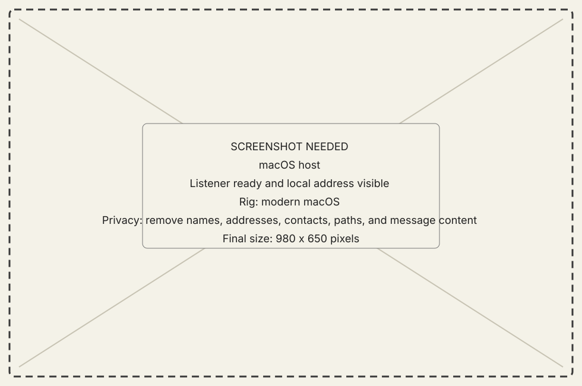
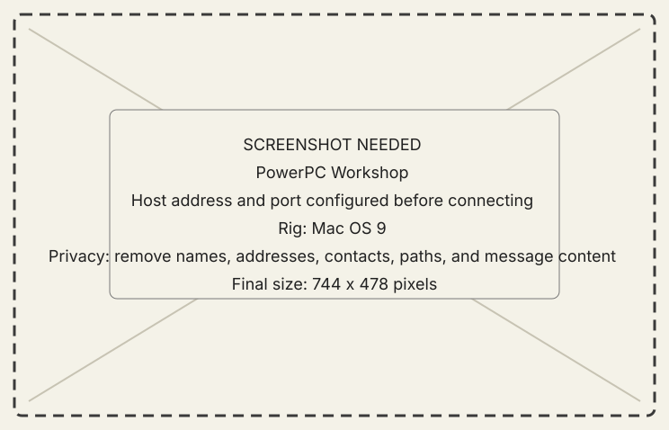
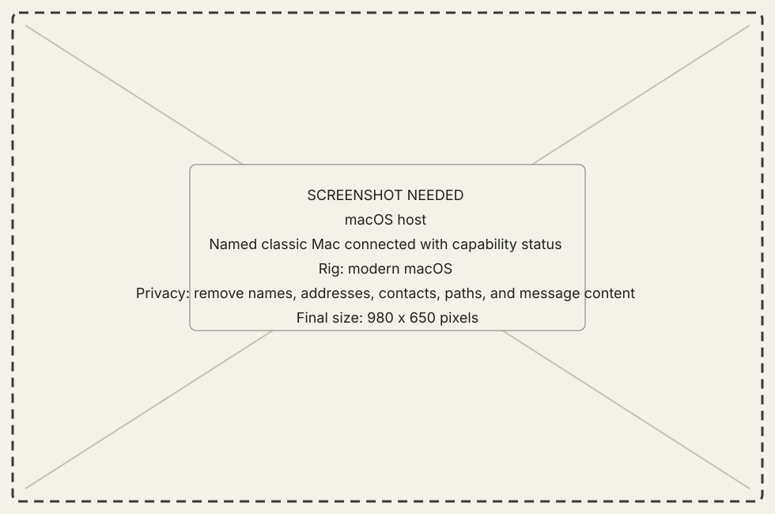

<!-- now-doc-provenance: generated reviewed=false -->

# Configure a connection

## Goal

Create one named session over a trusted local network.

## Steps

1. In the macOS host, open **Connections** and start the listener.
2. Record a host address reachable from the classic Mac and the listener port.
3. Enter both values on the classic guest's Connection surface.
4. Connect and wait for the `hello` exchange to settle.
5. Confirm the host names the intended classic Mac, then request one hardware
   or process read from that selected session.

{ .now-placeholder }

{ .now-placeholder }

{ .now-placeholder }

## Expected result

Both sides agree on contract revision and the host can identify which guest
answered. A socket alone is not the acceptance condition.

## Recovery

Use [Recover a connection](recover-a-connection.md) and retain any typed
refusal. Do not expose or forward the port to bypass LAN routing.
