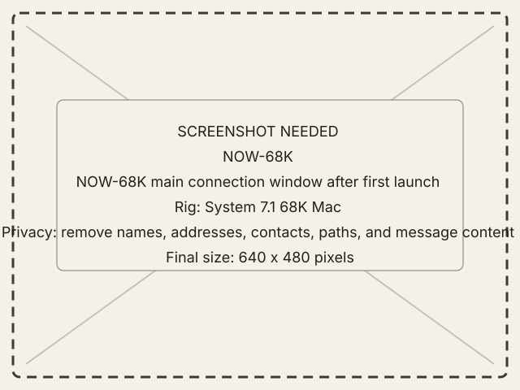

# Install NOW-68K

This page is retained for contributors and future pre-Carbon work. The current
NOW-68K build is stale and excluded from the alpha. Do not treat
these steps as a supported release path.

## Goal

Install the non-Carbon System 7.1 guest without applying PowerPC or Open
Transport instructions to it.

## Steps

1. Confirm the target matches the retained 68K profile: System 7.1, 68030, and
   MacTCP.
2. Transfer `now-guest-68k.bin` with MacBinary decoding enabled.
3. Launch NOW-68K and inspect the host, port, timeout, health, and status
   fields in its main window.
4. Enter the modern host's reachable address and listener port.

{ .now-placeholder }

## Expected result

The compact main window opens and the separate console is available. This is
not the PowerPC Workshop and does not promise all of its modules.

## Recovery

If MacTCP is absent or the machine differs from the currently targeted System
7.1 configuration, treat support as unverified. Do not substitute Open
Transport libraries into this build.
