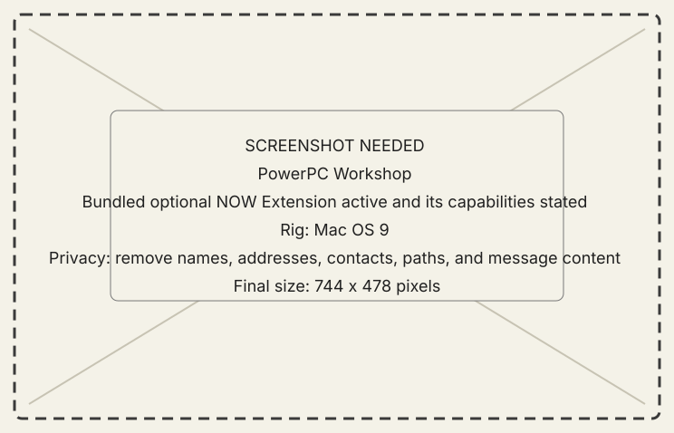

# Install the NOW Extension

## Goal

Enable deeper PowerPC Mirror observation and interaction while preserving a
boot-without-it recovery path.

Before installing it, review the [feature coverage
matrix](../explanation/core-features.md#feature-coverage).

## Prerequisites

- A PowerPC Mac in the documented Carbon guest range.
- A backup or removable way to disable Extensions during startup.
- The **NOW Extension** included in the same alpha bundle as the PowerPC guest.

## Steps

1. Quit New Old World on the classic Mac.
2. Place **NOW Extension** in the System Folder's Extensions folder.
3. Restart the classic Mac.
4. Launch the canonical **New Old World** application.
5. Open **Mirror** and confirm the extension state and capabilities. Absence
   must remain a supported degraded state.

{ .now-placeholder }

## Expected result

The app reports the resident contract it actually discovered. The extension
does not replace the application and never becomes required for ordinary
files, processes, screen capture, or console use.

## Recovery

If startup becomes unstable, boot with Extensions disabled and remove NOW
Extension. Report whether the behavior occurred on hardware or in an emulator.
