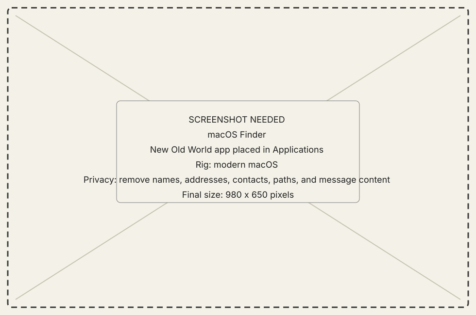

# Install the macOS host

## Goal

Install the host app without mixing it with a source-build staging directory.

## Prerequisites

- macOS 13 or later.
- The New Old World release DMG.

## Steps

1. Quit any older copy of New Old World.
2. Open the DMG and move `New Old World.app` to Applications or another stable
   local folder. The classic app, Extension, update sidecars, CarbonLib
   installer, and license material are embedded inside the host app; they move
   with it and do not depend on the mounted DMG remaining available.
3. Launch that copy and open **Connections**.
4. If macOS refuses the build, retain the exact Gatekeeper message and verify
   the artifact source. Do not strip signatures or quarantine attributes as a
   routine installation step.

{ .now-placeholder }

## Expected result

The host opens its native window and can start a listener. No classic Mac is
required merely to launch the host.

## Related reference

[Requirements](../reference/requirements.md) and
[Connections and preferences](../reference/modules/connections-and-preferences.md).
