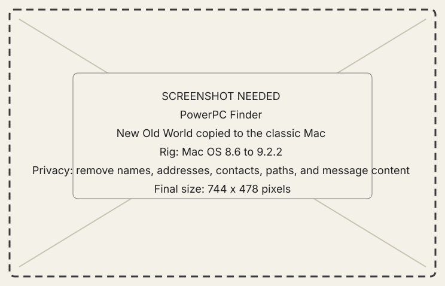

# Install the PowerPC guest

## Goal

Install the canonical **New Old World** guest with its Macintosh metadata and
product identity intact.

## Steps

1. Confirm the target is PowerPC Mac OS 8.6–9.2.2 with CarbonLib 1.6.
2. Transfer `New Old World.bin` with a tool that decodes MacBinary on the
   classic side.
3. Confirm the resulting application is named exactly **New Old World**.
4. Launch it and open the Workshop's **Connection** page.

{ .now-placeholder }

## Expected result

The Workshop opens with its navigation rail. The exact product name matters:
preferences and optional resident planes use it as part of their identity.

## Recovery

If the transferred file is a document, has no icon, or will not launch, the
MacBinary was probably not decoded. Re-transfer the `.bin`; do not rename a
data-fork-only file and assume its resource fork returned.
