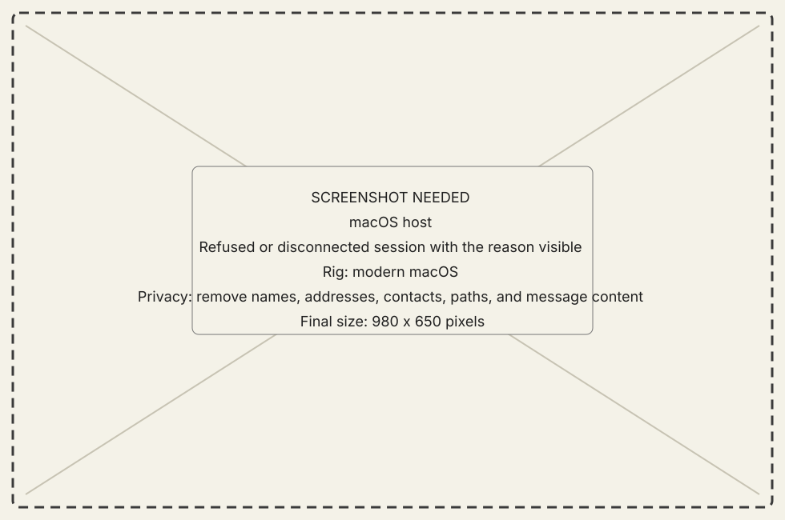

<!-- now-doc-provenance: generated reviewed=false -->

# Recover a connection

## Goal

Turn the visible symptom into one bounded next check.

## Steps

1. Read the exact host and guest status text. Preserve a typed `refuse` reason.
2. If the contract revisions differ, install matching host and guest builds.
3. If the host says the machine name is busy, close the older live session or
   resolve duplicate classic Mac names.
4. If nothing answers, verify the listener is running, the address is the
   modern Mac's reachable LAN address, and both sides use the same port.
5. If a session exists but data belongs to another machine, stop and select
   the named session explicitly before issuing another action.
6. Reconnect and prove the result with a fresh Hardware or Processes read.

{ .now-placeholder }

## Expected result

The original failure has a named cause or remains honestly unknown; the repair
does not rely on internet exposure, disabled contract checks, or a guessed
machine identity.

## Related reference

[Connections](../reference/modules/connections-and-preferences.md)
and [Verification and safety](../explanation/verification-and-safety.md).
