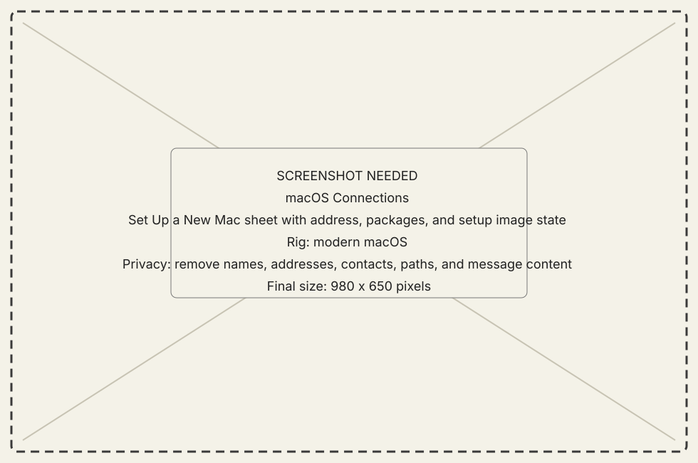
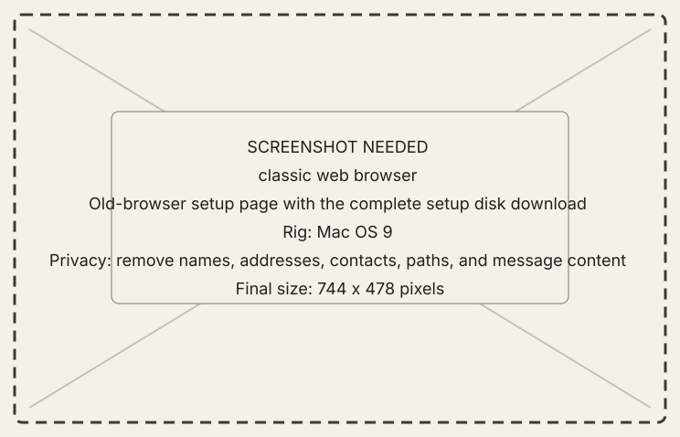
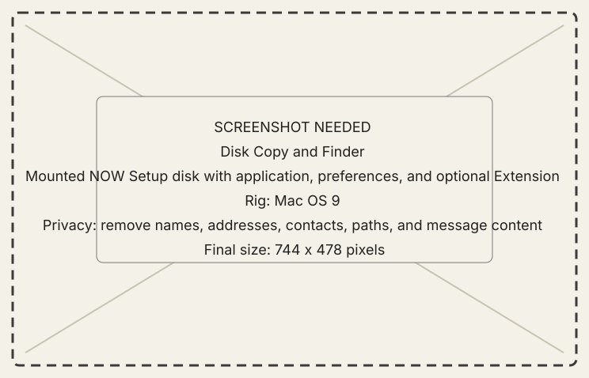

<!-- now-doc-provenance: generated reviewed=false -->

# Set up a new PowerPC Mac

Use the generic release image when you want one download that works on any
supported PowerPC Mac. Use **Set Up a New Mac** when you want the host to make
a personalized image with its address and port already filled in. Both paths
preserve classic file forks and require Disk Copy 6.3.3; direct download on the
classic Mac additionally requires a web browser.

!!! warning "Current verification boundary"
    The host flow is tested locally, and its image mounts in a Mac OS 9.1 QEMU
    guest. Downloading it through a classic browser and reaching the first
    physical-hardware connection have not yet been verified end to end.

## 1. Choose the generic or personalized image

Every release publishes `new-old-world-classic-VERSION.img.bin`. You can
download it directly on the classic Mac or move it there with any
MacBinary-preserving transfer. It contains the PowerPC application, the
optional NOW Extension, and the approved Apple CarbonLib installer package,
but no machine-specific preferences. After mounting it, enter the modern
Mac's address on the guest Connection page.

For a preconfigured image, open **Connections** on the modern Mac and choose
**Set Up a New Mac…**. The host builds from the assets embedded in its own app,
so those packages remain available after the host is copied to Applications.

## 2. Start personalized setup on the modern Mac

Open **Connections**, choose **Set Up a New Mac…**, and confirm the address and
port shown in the sheet. Both Macs must be on the same trusted local network.

{ .now-placeholder }

## 3. Choose the setup contents

The New Old World application and generated preferences are required in a
personalized image. The
bundled **NOW Extension is optional**: select it only if you want the deeper
Mirror features in [Core features](../explanation/core-features.md) and can
recover by starting with Extensions disabled. Select any dependency only when
the setup sheet identifies it and accepts the available package.

Build or rebuild the image after changing a selection. Check the displayed
contents and size before offering it to the other Mac.

CodeKitten is not part of the release bundle. A locally supplied copy may still
appear in a personalized development setup, but the normal product does not
require it.

The same is true of MPW. New Old World never downloads or redistributes
Apple's developer tools, but if you place your own MPW disk image and its
completed manifest in the Onboarding folder's `Dependencies` drop, the setup
image carries the image to the PowerPC Mac and the Read Me explains how to
register it. The manifest format and the exact steps are in the
developer guide's Development starter pack reference.

## 4. Download the complete setup disk

In the classic Mac's browser, open the exact `http://…/now` address shown by
the host. Choose the complete setup disk. If the browser cannot preserve the
download directly, use the `.bin` link and allow the classic transfer software
to decode its MacBinary envelope.

{ .now-placeholder }

The setup server supports the narrow, old-browser-compatible GET and HEAD
paths shown on that page. It does not accept uploads or expose a directory
listing.

## 5. Open and install

Open the downloaded image with **Disk Copy 6.3.3**. Copy **New Old World** to
the classic Mac. Put **New Old World Prefs** in **System Folder:Preferences**.
If you selected the Extension, put it in **System Folder:Extensions** and
restart before expecting its features.

If CarbonLib 1.6 is not already installed, run the bundled Apple installer and
accept its installer license. NOW does not extract or silently install
CarbonLib. On an older detected CarbonLib, the guest warns at launch; choosing
**Don't Warn Again** suppresses later warnings without changing the runtime.

{ .now-placeholder }

## 6. Prove the connection

Launch New Old World. A personalized image's generated preferences already
contain the host address and listener port; with the generic image, enter them
on the Connection page. Setup is complete only when the host shows a named
active session and a module returns a typed result; a successful download is
not connection evidence.

Stop the onboarding server when setup is complete. It is temporary plaintext
HTTP intended only for a trusted LAN.

## If setup stops

- A missing required package or rejected checksum leaves the image unavailable;
  replace or reacquire that package rather than bypassing the check.
- Selections changed after the last build require a new image.
- If the browser mishandles the disk image, use the offered MacBinary form and
  confirm the transfer software decoded it.
- If archive extraction support is unavailable on the host, install the named
  local prerequisite or provide an already accepted package.
- If the guest cannot connect, use [Recover a connection](recover-a-connection.md).

For a manual fallback, use [Install the PowerPC guest](install-ppc.md) and
[Configure a connection](configure-connection.md).
