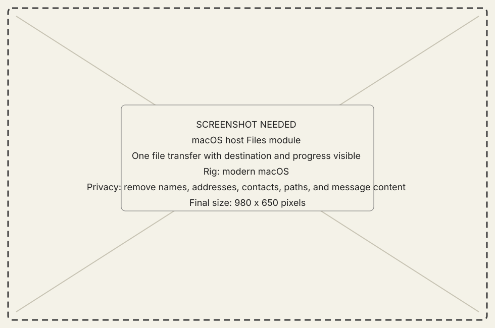
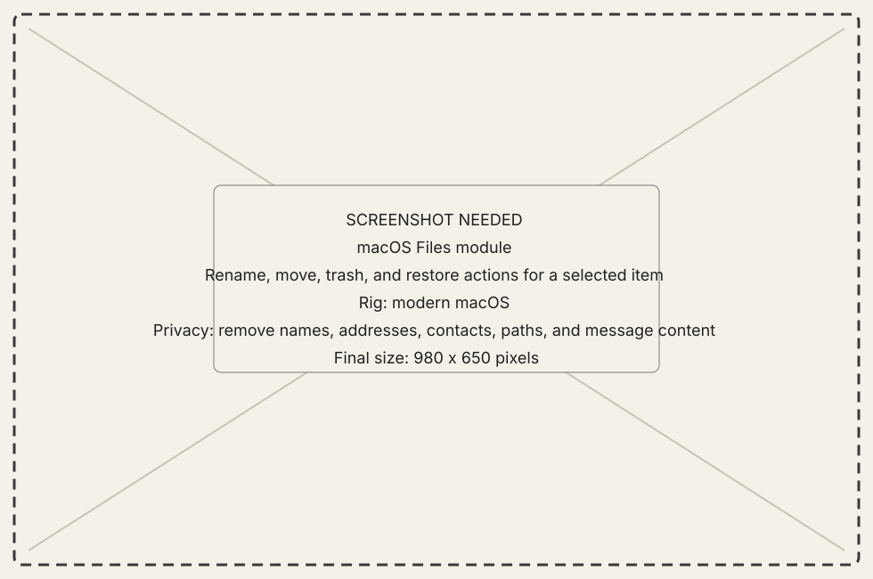

# Transfer a file

## Goal

Move one known file through the Files module and verify the receiver completed
it.

## Steps

1. Open **Files** for the intended named classic Mac.
2. Choose the destination inside the receiver's published share.
3. Start the transfer from the sender's Files surface.
4. Keep the session connected until the receiver reports completion; sender
   progress alone does not prove the file was written and stamped.
5. Refresh the destination and verify the expected name and fork/container
   posture.

{ .now-placeholder }

{ .now-placeholder }

## Expected result

The destination listing contains the file and the transfer has a terminal
receiver result.

## Recovery

Cancel from either face if the transfer is no longer wanted. For an interrupted
transfer, keep any partial/resume state until the next offer proves it refers
to the same source; do not manually rename a partial file into place.
