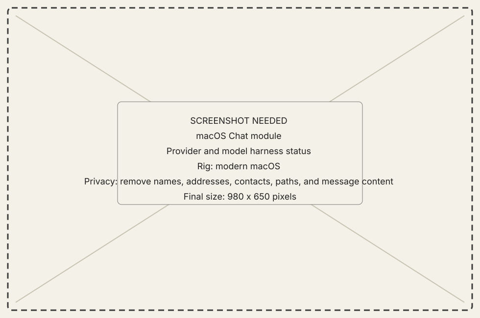
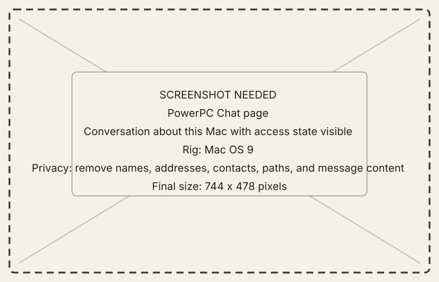
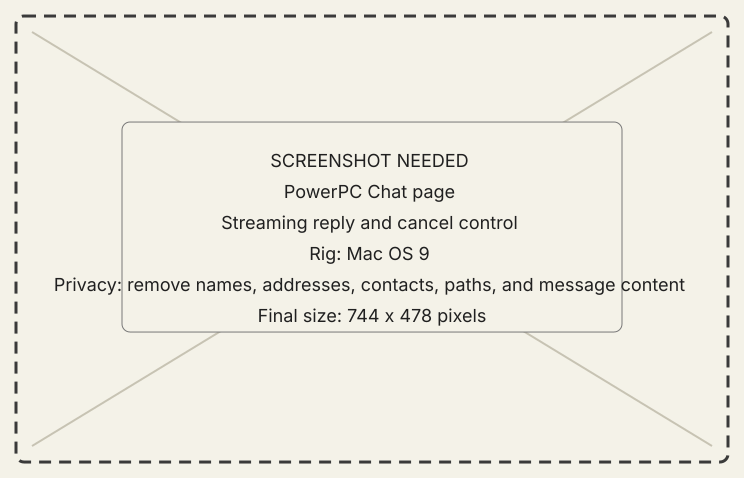

# Chat module

## What it does

Chat lets the PowerPC guest ask a model harness on the modern Mac. Provider and
model references are host-minted and the conversation can include only the
machine context the current grant permits.

{ .now-placeholder }

## Availability

Chat is a host-served, PowerPC-asked family. NOW-68K does not expose it.

## On the modern Mac

The host owns provider configuration, model catalog, authentication, request
execution, and typed errors. Provider credentials never cross the classic wire.

## On the classic Mac

The Workshop page selects a host-provided model reference, sends a prompt, and
renders deltas, status, result, cancellation, and reset.

{ .now-placeholder }

## Common tasks

- Select a provider and model only after their catalogs arrive.
- Cancel a reply from the visible conversation bracket.

{ .now-placeholder }

## Safety, consent, and privacy

Prompts and supplied machine context may leave the modern Mac when a cloud
provider is selected. MCP access remains a separate machine consent ceiling;
Chat cannot silently expand it.

## Failure states

Provider unavailable, model stale, not granted, cancelled, reset, and provider
error retain separate status.

## Current limitations

Chat availability depends on a configured host harness. It is not an offline
guarantee and has no 68K UI.

## For developers

See [agent boundary](../../../developer-guide/architecture/agent-boundary.md)
and the [wire contract](../../../developer-guide/architecture/wire-contract.md).
