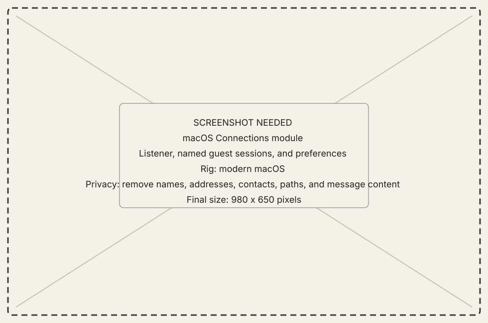
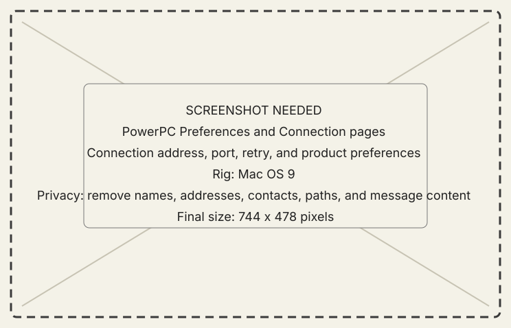

# Connections and preferences

## What it does

Connections owns the host listener, named sessions, and **Set Up a New Mac…**
portal. Preferences owns local application choices. The PowerPC Workshop
separates Preferences and Connection; the host presents one settings module,
and NOW-68K uses its main window.

{ .now-placeholder }

## Availability

All three applications expose the connection state they own. Preference depth
differs; NOW-68K intentionally keeps its compact connection UI rather than the
PowerPC preference model.

## On the modern Mac

The host starts and stops the listener, names simultaneous guests, selects the
active session, and reports duplicate-name or capacity refusals. Its setup
sheet can generate preferences, assemble a fork-preserving setup disk from
selected packages, and serve it temporarily over old-browser-compatible HTTP.

## On the classic Mac

PowerPC carries separate Connection and Preferences pages. Its Connection page
also compares the running application and active Extension with the exact
artifacts published by the connected host. A different development build of
the same release version is visible rather than collapsed into “current.”
NOW-68K shows host, port, timeout, health, status, and retained console
information in one window; it does not implement the update family.

{ .now-placeholder }

## Common tasks

- [Configure a connection](../../how-to/configure-connection.md).
- [Set up a new PowerPC Mac](../../how-to/set-up-new-mac.md).
- [Recover a connection](../../how-to/recover-a-connection.md).
- [Upgrade, roll back, or remove NOW](../../how-to/upgrade-rollback-remove.md).

## Safety, consent, and privacy

The listener is plaintext and unauthenticated. Bind and advertise it only on a
trusted LAN; never forward it through a router.

The setup portal is also plaintext. It exposes fixed download routes rather
than uploads or directory listings; stop it when onboarding is complete.

Update artifacts are currently **unsigned**. The host recomputes their SHA-256
before advertising them and the guest verifies the transferred bytes, but that
proves integrity against the host's manifest, not publisher authenticity. The
local Connection page requires an explicit confirmation; console and remote
command paths cannot bypass it.

## Failure states

Revision mismatch, duplicate machine name, host unreachable, timeout, listener
busy, capacity reached, and stale selected session retain exact reasons.
Setup also retains missing-package, checksum-refusal, stale-selection, image
build, archive-tool, and server-start failures instead of offering a partial
disk as complete.

Updates retain no-offer, busy-transfer, identity mismatch, checksum mismatch,
disk-space, Finder-identity, exchange, and relaunch/restart states rather than
presenting a downloaded file as installed.

Extension restart state survives an application relaunch and clears only when
a later boot reports the installed resident identity active. On launch,
PowerPC also warns when it detects CarbonLib below the supported 1.6 floor;
**Don't Warn Again** suppresses that advisory without changing CarbonLib.

## Current limitations

Guest display name is the current connection identity. Two live machines with
the same name collide intentionally rather than being guessed apart.

Classic update signing, internet discovery, and host self-update are not
implemented. The connected host is the only provider, and the flow is not yet
metal-verified.

## For developers

See [connection sequence](../../../developer-guide/architecture/wire-contract.md#connection-sequence)
and [network threat model](../../../developer-guide/reference/security.md).
