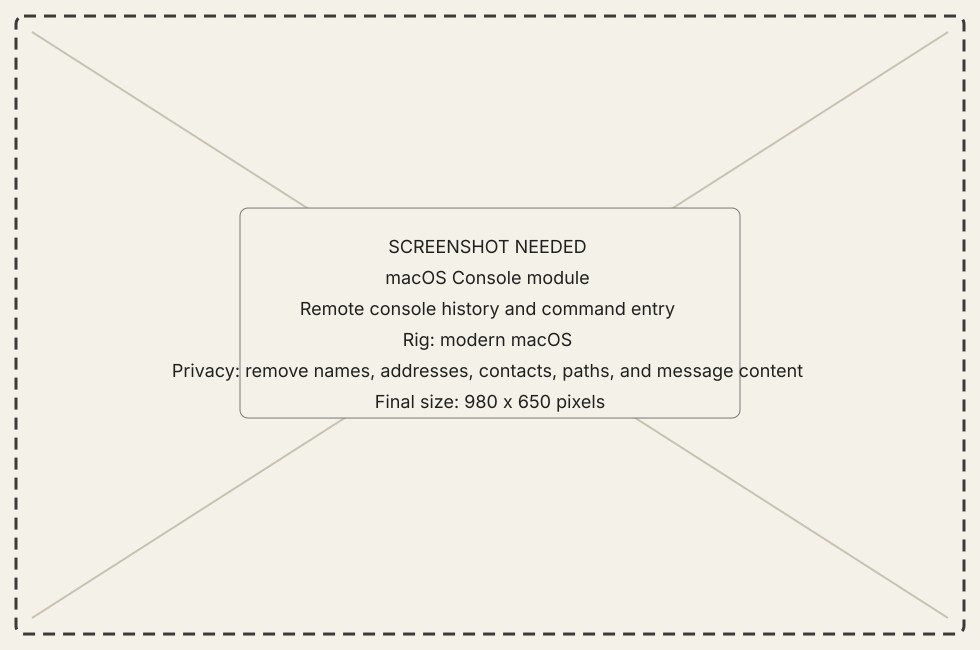
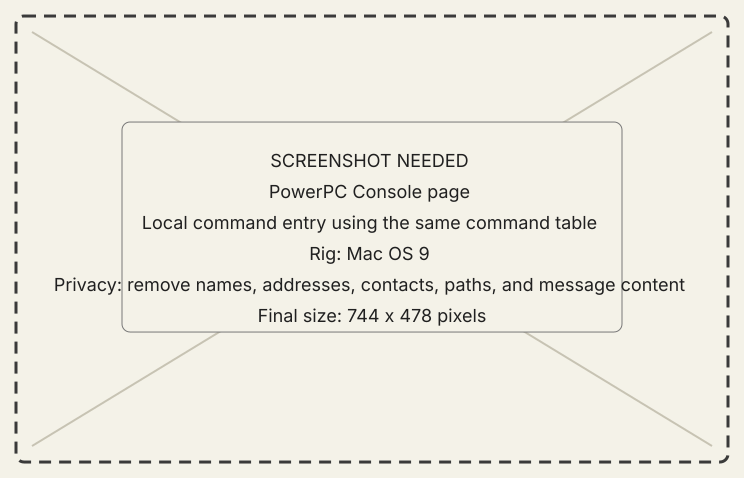

<!-- now-doc-provenance: generated reviewed=false -->

# Console module

## What it does

Console sends an entire line to the selected guest. The receiver owns parsing,
help, and command behavior.

{ .now-placeholder }

## Availability

Both guests have local consoles and wire-driven console behavior. Their command
sets differ and are discovered from the machine, not from a host-side union.

## On the modern Mac

The host is a dumb shell: it preserves the line and renders output and terminal
status. It does not guess where a verb or argument ends.

## On the classic Mac

The PowerPC Workshop page and NOW-68K console call the same implementation as
their wire dispatchers, preserving command parity.

{ .now-placeholder }

## Common tasks

- Run `help` on the selected guest before assuming a command exists.
- Use the module's cancel control for a long-running execution.

## Safety, consent, and privacy

Commands can launch or quit applications, move files, or reveal machine facts.
Read the command help and selected machine identity before running a mutation.

## Failure states

Unknown command, bad arguments, refused action, cancelled execution, output
truncated, and disconnect are explicit outcomes.

## Current limitations

Command parity means one implementation behind local and wire faces within a
guest. It does not mean the PPC and 68K command tables are identical.

## For developers

See [command parity](../../../command-parity.md) and the
[generated command registry](../../../generated/asyncapi.md#commands).
