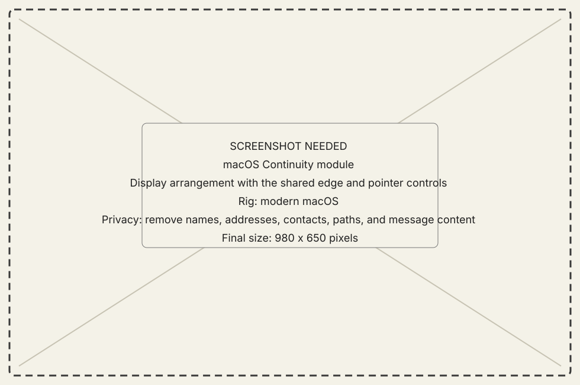
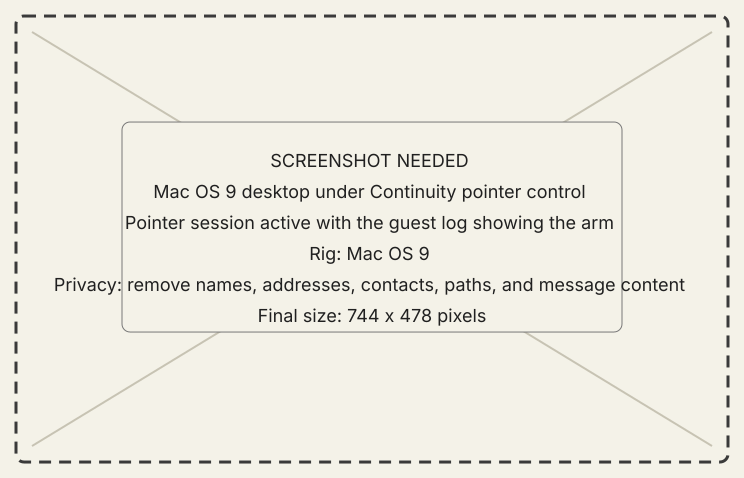

<!-- now-doc-provenance: generated reviewed=false -->

# Continuity module

## What it does

Continuity arranges the classic Mac's display beside this Mac's displays
and passes the pointer through their shared edge, the way two displays on
one desk share a mouse. While the classic Mac owns the pointer, clicks,
held drags, and (optionally) the keyboard follow it; touching the classic
Mac's own mouse or trackpad immediately returns control to it.

{ .now-placeholder }

## Availability

Continuity is PowerPC-only and experimental, and its deeper input
mechanisms require the optional NOW Extension on the classic Mac. Without
the Extension the pointer session refuses honestly rather than degrading
silently. NOW-68K has no Continuity subsystem.

## On the modern Mac

Drag the classic display to the edge where the pointer should pass, then
turn Continuity on. Crossing that edge hands the pointer to the classic
Mac; a configurable return shortcut, always handled on this Mac, brings
every control home at once. The update rate, reconnection behavior, and
the product input options live beside the arrangement, saved per machine.
Diagnostic probes record into Logs.

A classic Mac that has never connected before starts from a separate seed:
the "Defaults for New Connections" tab of the Settings window
(**New Old World > Settings…**) holds the update rate, reconnection
behavior, and option catalog a never-before-seen machine gets on first
connect. Editing it never touches a machine that already has its own saved
settings here.

Continuity is independent of the Mirror module: neither needs the other
running. The Mirror's own in-picture cursor borrows the same pointer
machinery, so while Continuity owns the shared edge the Mirror cursor
stands down, and one of them drives at a time.

## On the classic Mac

There is no Workshop page for Continuity: the classic half is the
resident pointer plane and the application's intake, which announce
themselves in the guest log. Using the classic Mac's own input at any
moment takes the pointer back — the classic Mac always wins its own
hardware.

{ .now-placeholder }

## Common tasks

- **Arrange the displays.** Drag the blue classic display to the edge of
  a host display where the pointer should pass, and pick a layout scale
  if the classic screen should count for more or fewer host points.
- **Hand the pointer over.** Turn Continuity on and move the pointer
  through the shared edge. Clicks, double-clicks, and held drags follow
  it.
- **Bring everything home.** Press the configured return shortcut, or
  simply touch the classic Mac's own mouse or trackpad.
- **Forward the keyboard.** Enable keyboard forwarding to type into
  classic applications while the pointer is over there; the return
  shortcut is never forwarded.

## Safety, consent, and privacy

The classic Mac's own input always wins: any local mouse or keyboard use
immediately ends the host's ownership. The return shortcut is handled
entirely on this Mac and is never sent to the guest. Keyboard forwarding
is a per-machine choice, off only sends the pointer, and nothing is
captured on this Mac except while a pointer session is actively owned.

## Failure states

- **No Mac connected** — the module says so and the switch is disabled.
- **The classic Mac lacks the Extension** — the pointer session refuses
  with a reason rather than degrading; the guest log names the refusal.
- **The link drops mid-session** — ownership returns to this Mac, held
  buttons on the classic side are released by the resident's own
  dead-man timers, and reconnection follows the configured delay.
- **The pointer seems stuck at the edge** — the classic display probably
  has no shared edge in the arrangement; drag it against a host display.

## Current limitations

- Cursor motion on the classic side can still show texture under load;
  the once-per-second stall class is fixed, and the remaining
  investigation is recorded in the engineering ledger.
- Control-panel sliders on the classic side do not yet track the
  synthetic pointer.
- File and window dragging across the edge is not yet available in
  either direction.
- One pointer consumer drives at a time: while Continuity owns the
  shared edge, the Mirror module's in-picture cursor stands down.

## For developers

The host half lives in `ContinuityHostModule.swift` with the app-owned
controller in `MirrorContinuityController.swift`; the classic half is
the resident pointer plane (`contract/peek_table.h`) and the PPC
application's intake under `now-guest-ppc/src/input/`. The control lane
is `continuity.arm`/`continuity.report` in `contract/asyncapi.yaml`, and
positions ride a UDP lane whose format lives in
`contract/continuity_udp.h`. The mechanism history — including why the
resident delivers a second click at interrupt time — is in
`docs/continuity-mode.md`.
