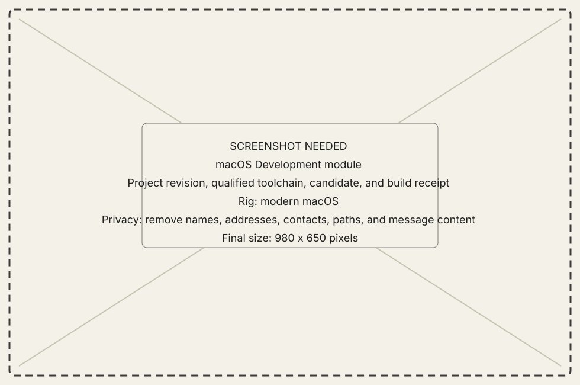
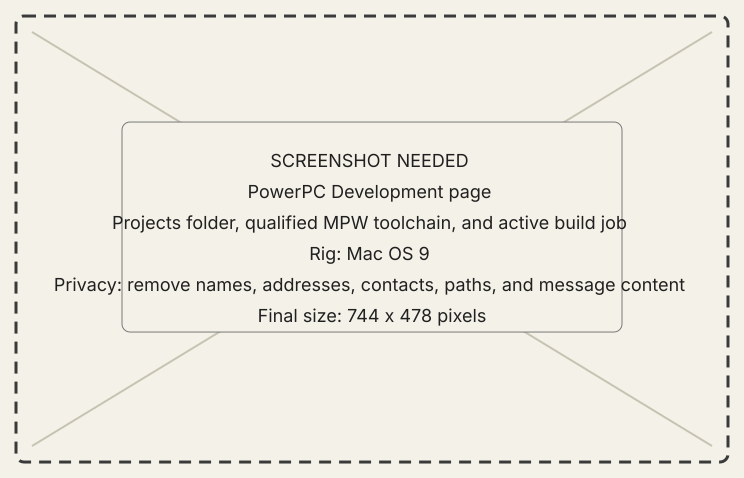

<!-- now-doc-provenance: generated reviewed=false -->

# Development module

## What it does

Development keeps source and recoverable Git history in a NOW-owned directory
on the modern Mac while using a human-selected toolchain on the PowerPC Mac.
It can stage an inactive candidate, build it through MPW ToolServer, verify the
classic product's data fork, resource fork, type, creator, and digest, and then
launch that exact product.

{ .now-placeholder }

## Availability

The module is experimental and PowerPC-only. It does not require the NOW
Extension. NOW-68K reports the capability as unavailable.

## On the modern Mac

The host owns the Projects root, project revisions, recoverable workspaces, and
build/run receipts. Host-owned project writes stay below the app's own
Application Support directory. A project that originally exists only on the
classic Mac can be imported into this root as a verified scratch/history copy;
editing it does not silently replace the active classic project.

## On the classic Mac

A person chooses the Projects folder and registers an MPW folder. NOW measures
ToolServer and the compiler before qualifying the toolchain. Projects pin that
measured identity; neither a project nor an agent can register an arbitrary
guest path.

The page lists the projects under that folder and shows the selected one's
target, configuration, pinned toolchain and declared product. Build and Run act
on that selection through the same commands the modern Mac drives, so both
machines get the same answers and the same refusals. The chosen project is
remembered across relaunches, and choosing a different Projects folder clears
it. The last few settled build jobs are listed for the session only; the
durable record of a build is the transcript it writes into the project's own
Build folder.

{ .now-placeholder }

## Common tasks

- Create or revise a host-owned classic project.
- List the projects on the PowerPC Mac, from either machine or from its own
  console (`development-project catalog`).
- Register and inspect an MPW installation on the PowerPC Mac.
- Stage and verify an inactive candidate before building it.
- Build through the closed compile, link, Rez, copy, stage, and metadata action
  vocabulary.
- Launch the exact measured product after a successful build.
- Optionally open the project in CodeKitten for a person to inspect and edit.

## Safety, consent, and privacy

Reading a guest project requires Read Only agent access. Staging, building,
promotion, launch, and discard require Full access. Generic Files operations
cannot enter NOW's private candidate directories. Build success never implies
launch, and host workspace edits never imply promotion to the active guest
tree.

## Failure states

NOW refuses stale project revisions, stale file digests, path traversal,
missing classic file identity, mismatched toolchains, changed active guest
projects, unsealed candidates, product digest changes, and a launched process
that does not match the measured product. Candidate and job identifiers remain
the handles for status, cancellation, recovery, and cleanup.

## Current limitations

The host-home MPW build/run/dialog lane is metal-verified on a PowerBook
1400c. Guest-home import and promotion, typed test actions and receipts,
CodeKitten's positive open receipt, coherent semantic settlement, and the
authenticated HTTP MCP loop are tested or emulator-verified but have not been
repeated together on metal. A redistributable starter pack cannot include MPW
until its payload license and provenance are settled. Recovery also needs a
clearer policy for candidate receipts retained from an ended guest session, and
the guest Files surface does not yet expose Finder flags when a logical-file
digest must be diagnosed.

## For developers

See [Projects and Development architecture](../../../developer-guide/architecture/development.md),
the detailed [engineering record](../../../development.md), and the
[hardening plan](../../../plans/2026-08-10-031-feat-development-agent-loop-hardening-plan.md).
