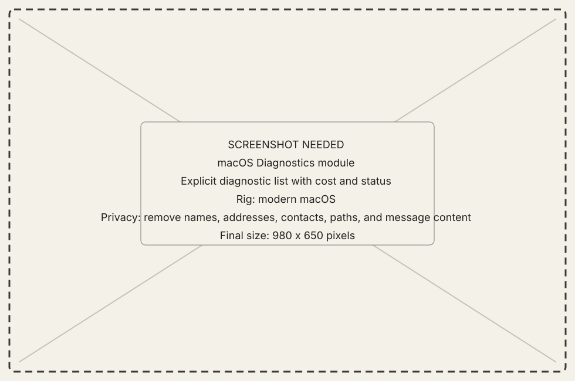
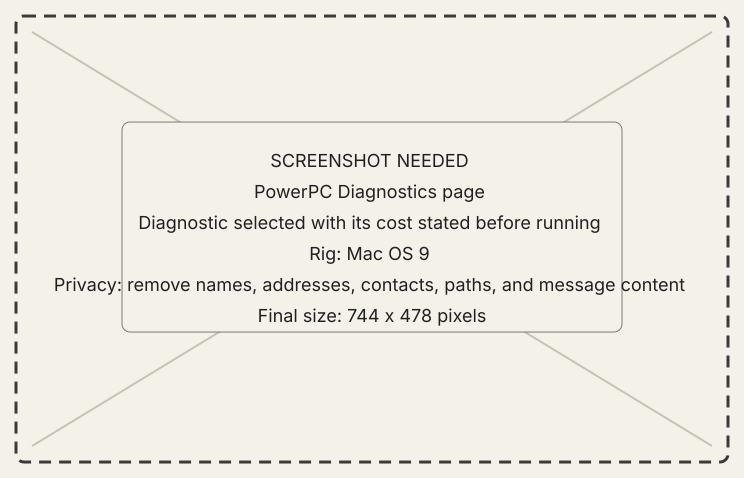

# Diagnostics module

## What it does

Diagnostics runs measurements that are too costly, invasive, or specialized
for idle collection. Each diagnostic must state its cost before execution.

{ .now-placeholder }

## Availability

PowerPC has the full page. NOW-68K exposes selected diagnostics such as VRAM
and screenshot-source probes through the console rather than a matching page.

## On the modern Mac

The host selects a named machine and records the request, status, and returned
evidence. It must not turn a timeout into a measurement.

## On the classic Mac

The PowerPC page states cost and progress. The 68K console's `vprobe` and
`shotdiag` commands use the same bounded diagnostic implementations as wire
calls.

{ .now-placeholder }

## Common tasks

- Read the cost and required rig before running a diagnostic.
- Save the resulting build, machine, port, and artifact identity with numbers.

## Safety, consent, and privacy

Some diagnostics allocate scarce classic memory, read the display, or hold a
transfer lane. Do not run them during unrelated machine use.

## Failure states

Not armed, unsafe on this machine, unavailable manager, timed out, partial,
and result-buffer limit are different outcomes.

## Current limitations

An instrument that wrote no artifact cannot support an absence claim. A count
not derived from the stored result is not evidence.

## For developers

See [emulator and metal workflow](../../../developer-guide/workflows/emulator-and-metal.md)
and [emulator readiness](../../../emu-readiness.md).
