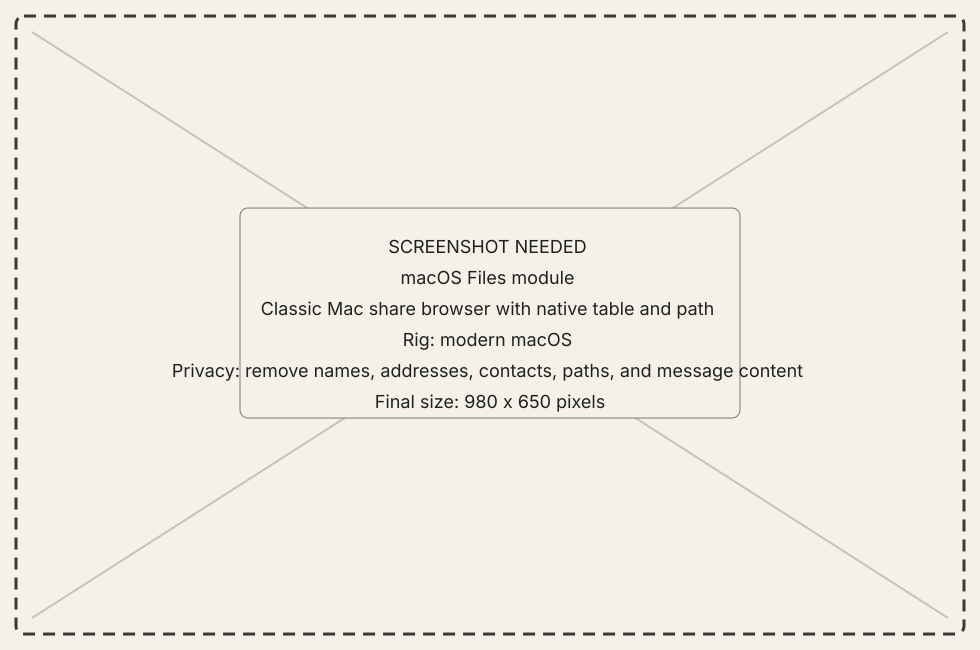
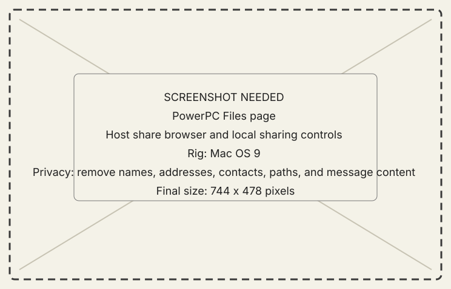

# Files module

## What it does

Files browses the other machine's published root, transfers one item through
the bulk lane, and exposes reversible rename, move, trash, restore, and folder
creation where supported.

{ .now-placeholder }

## Availability

Host and PowerPC have the full paired browser. NOW-68K serves a bounded listing
and transfer subset designed for its System 7.1 memory ceiling.

## On the modern Mac

The host uses a native table so files can participate in macOS selection and
drag behavior. The path always describes the selected classic session's share.

## On the classic Mac

The PowerPC Files page browses the host share and chooses the local share. The
68K console exposes the same bounded file behaviors without copying the
Workshop UI.

{ .now-placeholder }

## Common tasks

- [Transfer a file](../../how-to/transfer-a-file.md).
- Use the selected row's explicit actions for rename, move, trash, or restore.

{ .now-placeholder }

## Safety, consent, and privacy

The published share is the ordinary access boundary. A deliberate send may
choose a source outside that root, but the destination remains inside the
receiver's share. Trash is used instead of irreversible deletion.

## Failure states

Not found, outside share, name collision, transfer busy, stale listing,
unsupported container, cancelled, and incomplete are separate results.

## Current limitations

Basic transfer has broader evidence than resume-by-offset. Resource forks and
MacBinary/container choice must be read from the declared transfer metadata.

## For developers

See [the existing file design record](../../../files.md) and
[contract-change workflow](../../../developer-guide/workflows/change-the-contract.md).
