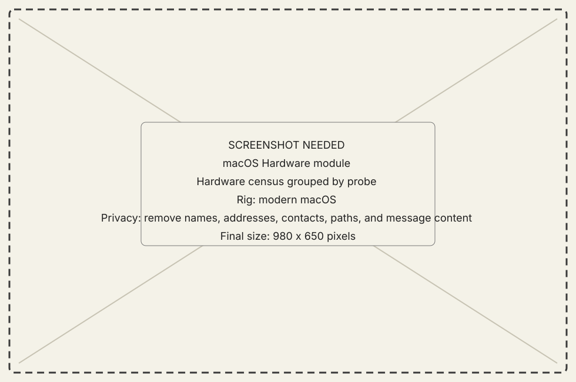
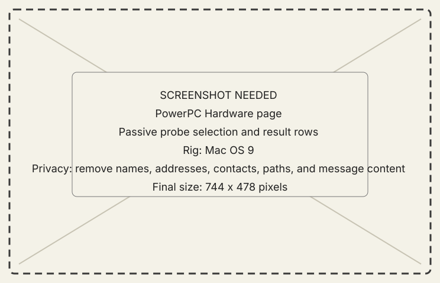

<!-- now-doc-provenance: generated reviewed=false -->

# Hardware module

## What it does

Hardware asks the selected classic Mac to describe itself through one bounded
probe at a time.

{ .now-placeholder }

## Availability

Both guests serve a census, but probe coverage differs. PowerPC exposes the
full Workshop page; NOW-68K serves the subset its System 7.1 managers and
hardware can answer.

## On the modern Mac

The host pages results without rewriting absent, partial, refused, or failed
into empty rows. The selected machine remains part of the result. PowerPC
volume capacity uses the wide HFS API when the guest supports it, rather than
the legacy 2 GB-limited fields.

## On the classic Mac

The PowerPC Hardware page selects probes and renders their rows. NOW-68K offers
the same probe registry through its wire and console at its smaller bounds.

{ .now-placeholder }

## Common tasks

- Run the overview before choosing a specialized probe.
- Use **Dump ROM** to ask the selected PowerPC guest to copy its complete ROM
  image into the Files share, transfer that exact file over NOW, and save it
  with a unique name in Downloads.
- Record the machine, build, probe, and verification rung with any result.

## Safety, consent, and privacy

The census is passive, but machine names, network addresses, volumes, and
hardware inventory may still be private when screenshots or logs are shared.

## Failure states

Unknown probe, absent manager, partial read, unsafe probe refusal, page limit,
and disconnect remain distinct.

## Current limitations

A probe listed in the contract is not automatically implemented or proven on
both guests. The PowerBook 1400 ROM presentation combines the 3 MiB Toolbox
region reported by Gestalt with its separate 1 MiB boot region, while retaining
the raw measured row. The 64 GB volume result, 4 MiB ROM dump, and known corpus
checksum remain to be verified on the physical PowerBook 1400c. Consult the
live capability and coverage table.

## For developers

See [contract coverage](../../../contract-coverage.md) and
[verification levels](../../../developer-guide/reference/verification-levels.md).
