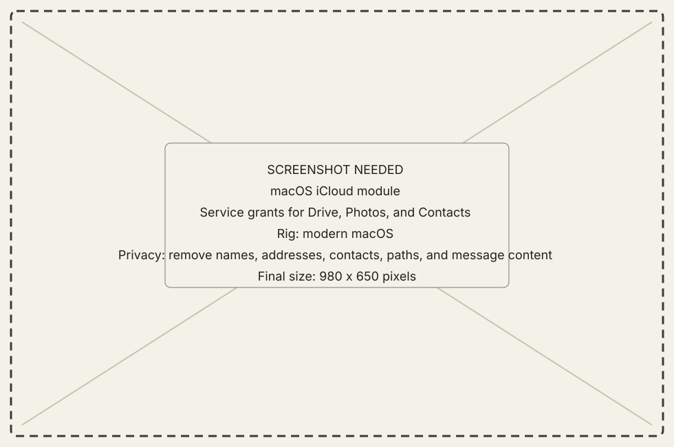
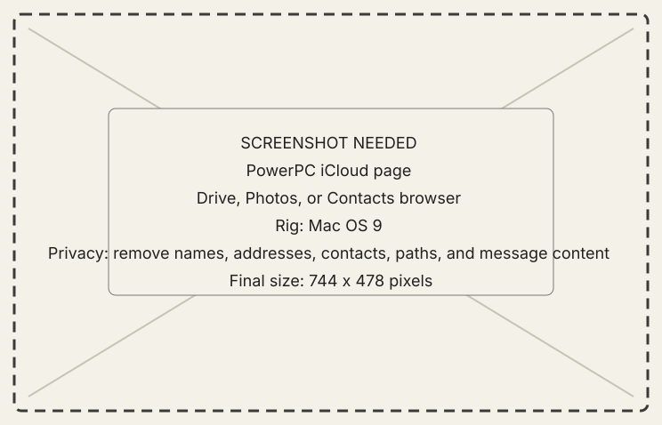
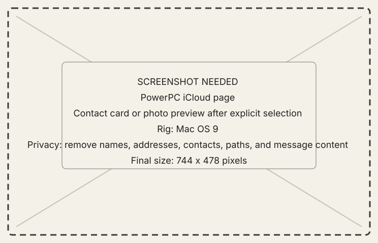

<!-- now-doc-provenance: generated reviewed=false -->

# iCloud module

## What it does

iCloud projects selected modern-Mac services to the PowerPC Workshop: Drive
listings and downloads, Photos listings and previews, and Contacts cards.

{ .now-placeholder }

## Availability

The host serves this family and the PowerPC iCloud page asks for it. NOW-68K
does not expose iCloud.

## On the modern Mac

The host owns platform permissions, service availability, paging, preview
conversion, and explicit refusal when a service is not granted.

## On the classic Mac

The PowerPC page browses one service at a time and requests detail only after a
selection. It never receives the host library wholesale.

{ .now-placeholder }

## Common tasks

- Grant only the service needed on the host.
- Select a Drive item, photo, or contact before asking for detail or download.

{ .now-placeholder }

## Safety, consent, and privacy

Drive paths, photos, and contacts are private data. Host permission is a real
boundary; an unavailable or ungranted service must refuse, not appear empty.

## Failure states

Permission denied, service disabled, item stale, preview unavailable, page
expired, and transfer busy retain different explanations.

## Current limitations

Messages is designed but not shipped. Real-library proof differs by service;
read the detailed verification section in the engineering record.

## For developers

See [iCloud design and verification](../../../icloud.md) and
[host architecture](../../../developer-guide/architecture/host.md).
