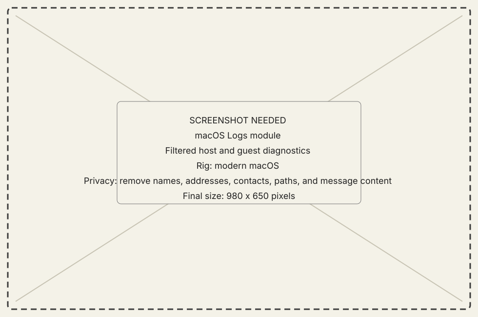
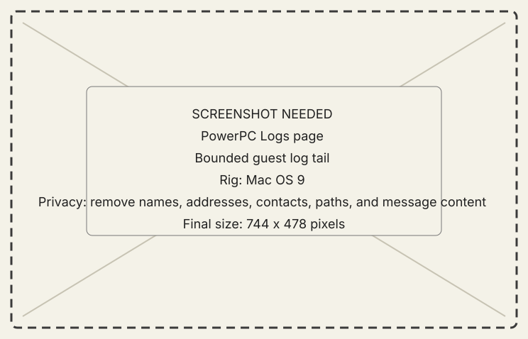

<!-- now-doc-provenance: generated reviewed=false -->

# Logs module

## What it does

Logs exposes bounded diagnostic history from the host and selected guest so a
failure can retain time, machine, operation, and reason.

{ .now-placeholder }

## Availability

PowerPC has a Workshop Logs page. NOW-68K records bounded logs and surfaces
important evidence through its console rather than a matching page.

## On the modern Mac

The host can filter by session and subsystem. A useful line identifies which
machine and operation it describes.

## On the classic Mac

The PowerPC page tails guest history. NOW-68K keeps a small log appropriate to
its partition and repeats critical state in the visible console.

{ .now-placeholder }

## Common tasks

- Filter to the named session and time window before copying evidence.
- Pair a log with the later authoritative state when diagnosing an action.

## Safety, consent, and privacy

Logs can contain machine names, file names, application names, addresses, and
failure text. Scrub them before publishing.

## Failure states

Log unavailable, rotated, truncated, stale session, and disconnected are
different from an operation failure described by a retained line.

## Current limitations

Logging is evidence, not authority. A line saying a request was sent does not
prove the target state changed.

## For developers

See [architecture logging rules](../../../architecture.md#logging) and
[source authority](../../../developer-guide/reference/source-authority.md).
