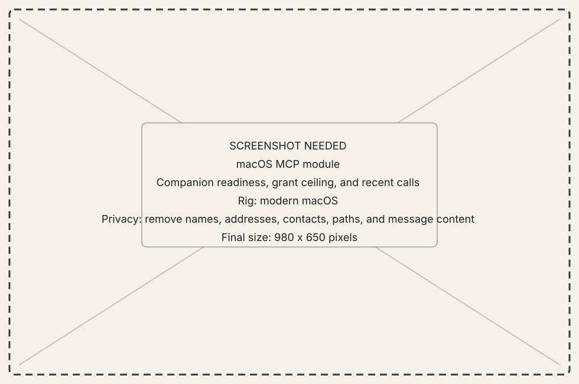
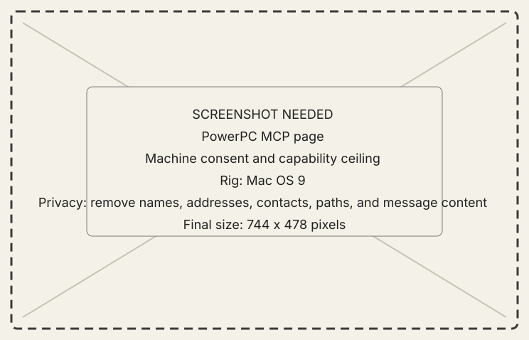

<!-- now-doc-provenance: generated reviewed=false -->

# MCP module

## What it does

MCP presents NOW's two local client transports and the selected classic Mac's
explicit ceiling on what an agent may observe or change. Both transports use
one catalog and dispatcher inside NOW; there is no separately installed MCP
service.

{ .now-placeholder }

## Availability

The host app owns both transports and all projections. PowerPC provides the
machine consent page. NOW-68K does not expose this MCP consent surface.

## On the modern Mac

The host exposes independent controls for:

- **Standard Input**, a narrow `New Old World --mcp-stdio` process launched by
  an MCP client. Its card copies the executable command and shows the private
  same-user socket it uses to reach the already-running app.
- **HTTP**, an authenticated loopback listener running directly inside the
  normal NOW app. Its card exposes an editable loopback port while stopped,
  shows and copies the derived URL, and copies the bearer token without
  rendering the secret in the module or logs.

Each card has independent **Start**, **Stop**, and **Start Automatically**
controls. Start and Stop affect the current app session; Start Automatically
is the persisted launch policy for that transport.

The module also shows the shared catalog, selected machine, available
capabilities, grant state, and auditable calls. A running transport is not a
machine grant.

## On the classic Mac

The PowerPC MCP page sets the machine's ceiling. It cannot supply host-local
credentials or prove that an MCP client can reach the host.

{ .now-placeholder }

## Common tasks

- Confirm the selected machine and requested capability before granting.
- Start only the transport required by the client, or enable **Start
  Automatically** for a transport that should be restored whenever NOW opens.
- Copy connection details from the relevant transport card rather than
  locating a helper executable.
- Read the recent call record after an agent action.

## Safety, consent, and privacy

Global transport availability, HTTP authentication, and per-machine grants
are separate controls. Do not weaken the same-user socket, loopback bind,
bearer, Host, Origin, session, or framing limits to connect a client.

## Failure states

Transport stopped, local socket unavailable, HTTP authentication failure, not
addressed, not granted, capability unavailable, stale reference, and machine
refusal are typed.

## Current limitations

The 68K guest has no matching consent UI. Experimental semantic tools inherit
Mirror's narrower observation and act evidence.

## For developers

See [agent boundary](../../../developer-guide/architecture/agent-boundary.md)
and [MCP coverage](../../../mcp-coverage.md).

<!-- derived-doc v1
sources: now-host/Sources/NOWAgentIntegration/Projection/HostProjectionCatalog.swift now-host/Sources/Host/AgentCompanionModel.swift docs/mcp-coverage.md scripts/docs-source-group tools/docs-gate
sources-sha1: 21cbebcb0219a9899a87495498351a7bc488ef27
derive mcp-catalog sha256=0c7b3a689c736e59a9fe6059037cacbfff4a291af2aa21f10e2dfa0bbde9714e lines=3
    scripts/docs-source-group mcp
rederived: pending
rederived: 2026-08-09T16:22:15-0400 9034e3eb sources, mcp-catalog 3->3
rederived: 2026-08-09T16:29:43-0400 9034e3eb sources
rederived: 2026-08-09T17:05:28-0400 446cf620 sources
rederived: 2026-08-09T17:08:04-0400 446cf620 sources
rederived: 2026-08-09T17:53:28-0400 ed9436c0 sources
rederived: 2026-08-09T18:53:52-0400 181db7a5 sources
rederived: 2026-08-09T18:56:23-0400 181db7a5 sources
rederived: 2026-08-09T19:21:56-0400 dc5bfcd2 sources
rederived: 2026-08-09T19:33:56-0400 c854246d sources
rederived: 2026-08-09T20:56:36-0400 9864da82 sources
rederived: 2026-08-09T21:05:28-0400 9864da82 sources
rederived: 2026-08-09T21:43:47-0400 2b3c2c0e sources
rederived: 2026-08-09T22:09:31-0400 d54812c2 sources
rederived: 2026-08-09T22:18:49-0400 e637efd3 sources
rederived: 2026-08-10T02:53:59-0400 62603174 sources, mcp-catalog 3->3
rederived: 2026-08-10T04:27:16-0400 886ee556 sources, mcp-catalog 3->3
rederived: 2026-08-10T04:38:55-0400 886ee556 sources
rederived: 2026-08-10T05:38:07-0400 a0ede9ec sources
rederived: 2026-08-10T13:10:56-0400 47bf54fb sources
rederived: 2026-08-10T13:36:45-0400 b15b4827 sources
rederived: 2026-08-10T14:49:45-0400 4ea2d97d sources
rederived: 2026-08-10T14:45:43-0400 26b75393 sources
rederived: 2026-08-10T14:48:16-0400 26b75393 sources
rederived: 2026-08-10T15:30:54-0400 32bdd096 sources
rederived: 2026-08-10T15:34:29-0400 72868e9e sources
rederived: 2026-08-10T15:46:03-0400 72868e9e sources
rederived: 2026-08-10T15:52:48-0400 77329146 sources
rederived: 2026-08-10T16:52:02-0400 d77cc444 sources
rederived: 2026-08-10T20:03:22-0400 d3e26c39 sources
rederived: 2026-08-10T20:22:53-0400 818c1577 sources
rederived: 2026-08-10T21:35:35-0400 a79833e9 sources
rederived: 2026-08-10T22:33:06-0400 e9bf9632 sources
rederived: 2026-08-10T22:47:49-0400 431e7308 sources
rederived: 2026-08-11T00:25:05-0400 bbab04b9 sources
rederived: 2026-08-11T00:33:22-0400 4b24cc1f sources
rederived: 2026-08-11T19:45:16-0400 065da692 sources
rederived: 2026-08-11T20:08:53-0400 852b41ae sources
rederived: 2026-08-11T20:43:59-0400 5c07bcd6 sources
rederived: 2026-08-11T20:54:11-0400 f9ceab81 sources
rederived: 2026-08-11T21:13:10-0400 098805ff sources
rederived: 2026-08-11T21:20:51-0400 15514cc9 sources
rederived: 2026-08-11T21:26:23-0400 7bfb617b sources
rederived: 2026-08-11T21:32:39-0400 57a081ab sources
rederived: 2026-08-11T21:39:37-0400 5a82bf82 sources
rederived: 2026-08-11T21:49:35-0400 7dc5b09d sources
rederived: 2026-08-11T21:54:55-0400 8c482312 sources
rederived: 2026-08-11T21:59:54-0400 562b4b50 sources
rederived: 2026-08-11T22:06:35-0400 65f52bf3 sources
rederived: 2026-08-11T22:10:48-0400 3df65dde sources
rederived: 2026-08-11T22:15:21-0400 68853632 sources
rederived: 2026-08-11T22:31:04-0400 a16b6a61 sources
rederived: 2026-08-11T22:41:40-0400 e1fc84c4 sources
rederived: 2026-08-11T22:47:34-0400 9776cf7a sources
rederived: 2026-08-11T23:12:02-0400 ddf740ce sources
rederived: 2026-08-11T23:31:22-0400 ad4d680 sources
rederived: 2026-08-11T23:37:12-0400 ad4d680 sources
rederived: 2026-08-12T13:02:41-0400 7cea759e sources
rederived: 2026-08-12T13:11:34-0400 7cea759e sources
rederived: 2026-08-12T13:12:13-0400 7cea759e sources
rederived: 2026-08-12T15:54:08-0400 939e43b7 sources
rederived: 2026-08-12T17:19:20-0400 338eca21 sources
rederived: 2026-08-12T18:34:29-0400 3688b9f6 sources
rederived: 2026-08-12T18:58:27-0400 3771e144 sources
rederived: 2026-08-12T19:15:24-0400 3771e144 sources
rederived: 2026-08-12T19:31:58-0400 3771e144 sources
rederived: 2026-08-12T20:08:33-0400 5a601a18 sources
rederived: 2026-08-12T20:15:22-0400 9e828cdc sources
rederived: 2026-08-12T20:34:42-0400 4d9ba67d sources
rederived: 2026-08-12T20:37:08-0400 633da491 sources
rederived: 2026-08-12T20:45:46-0400 a0878023 sources
rederived: 2026-08-12T22:18:37-0400 18d0d3c4 sources
rederived: 2026-08-12T23:59:07-0400 e5b16a71 sources
rederived: 2026-08-13T00:21:46-0400 e5b16a71 sources
rederived: 2026-08-13T00:58:13-0400 9f5139cf sources
rederived: 2026-08-13T01:23:46-0400 9f5139cf sources
rederived: 2026-08-13T01:47:14-0400 59852197 sources
rederived: 2026-08-13T02:45:49-0400 e504061c sources
rederived: 2026-08-13T04:30:01-0400 47f632b3 sources
rederived: 2026-08-13T13:50:55-0400 a9e64fa4 sources
rederived: 2026-08-13T14:32:32-0400 4da9c4a3 sources
rederived: 2026-08-13T15:15:23-0400 2ccde05b sources
rederived: 2026-08-13T17:36:05-0400 043777df sources
rederived: 2026-08-13T17:37:43-0400 043777df sources
rederived: 2026-08-13T18:23:47-0400 e6d7996d sources
rederived: 2026-08-13T19:30:44-0400 1d154b67 sources
rederived: 2026-08-13T21:59:04-0400 8433efda sources
rederived: 2026-08-13T23:16:02-0400 fc235d4e sources
rederived: 2026-08-14T00:51:51-0400 94f1c614 sources
rederived: 2026-08-14T00:55:48-0400 3bd83df2 sources
rederived: 2026-08-14T02:20:51-0400 81247e50 sources
rederived: 2026-08-14T03:25:53-0400 ee8ef8a4 sources
rederived: 2026-08-14T03:54:49-0400 d016e771 sources
rederived: 2026-08-14T03:57:10-0400 e122c6c3 sources
rederived: 2026-08-14T04:03:19-0400 908215de sources
rederived: 2026-08-14T04:36:35-0400 e66db808 sources
rederived: 2026-08-14T12:32:39-0400 7742eab5 sources
rederived: 2026-08-14T12:35:45-0400 49e6dd98 sources
rederived: 2026-08-14T12:44:43-0400 4d52ba1a sources
rederived: 2026-08-14T12:47:23-0400 804be291 sources
rederived: 2026-08-14T12:49:06-0400 655b2bf1 sources
rederived: 2026-08-14T13:16:43-0400 90cfd8fa sources
rederived: 2026-08-14T14:27:58-0400 6d037a57 sources
rederived: 2026-08-14T15:56:44-0400 835e6acf sources
rederived: 2026-08-14T16:58:28-0400 cf962dbb sources
rederived: 2026-08-14T17:12:28-0400 32ac9165 sources
rederived: 2026-08-14T17:36:05-0400 02e9de5e sources
rederived: 2026-08-14T18:14:39-0400 db6a7c6a sources
rederived: 2026-08-14T18:17:42-0400 d9ed70d2 sources
rederived: 2026-08-14T18:19:51-0400 60bb3427 sources, sources
rederived: 2026-08-14T18:20:42-0400 23dc0759 sources, sources, sources
rederived: 2026-08-14T18:22:07-0400 23dc0759 sources, sources, sources
rederived: 2026-08-14T18:23:12-0400 e2c66126 sources, sources, sources, sources
rederived: 2026-08-14T18:30:53-0400 b248c9a1 sources, sources, sources, sources
rederived: 2026-08-14T18:31:13-0400 b248c9a1 sources, sources, sources
rederived: 2026-08-14T18:31:26-0400 b248c9a1 sources
rederived: 2026-08-14T19:50:32-0400 d20eee81 sources
rederived: 2026-08-14T19:50:54-0400 d20eee81 sources
rederived: 2026-08-14T20:02:53-0400 068ca7fd sources
rederived: 2026-08-14T21:00:58-0400 ab304cb2 sources
rederived: 2026-08-14T21:15:09-0400 5316a23e sources
rederived: 2026-08-14T23:07:32-0400 9d85a31d sources
rederived: 2026-08-15T00:30:16-0400 f4dab407 sources, mcp-catalog 3->3
rederived: 2026-08-15T01:11:36-0400 c9a1a8a4 sources
rederived: 2026-08-15T03:16:30-0400 2c7ff2a1 sources
rederived: 2026-08-15T03:17:33-0400 2c7ff2a1 sources
rederived: 2026-08-15T03:18:50-0400 2c7ff2a1 sources
rederived: 2026-08-15T03:32:08-0400 083691c4 sources
rederived: 2026-08-15T04:01:11-0400 b18a891c sources
rederived: 2026-08-15T12:33:04-0400 eadb1784 sources
rederived: 2026-08-15T13:22:25-0400 4e897bc6 sources
rederived: 2026-08-15T14:24:09-0400 599da71e sources
rederived: 2026-08-15T14:56:50-0400 4caf46ef sources
rederived: 2026-08-15T15:02:00-0400 a06d9396 sources
rederived: 2026-08-15T15:16:39-0400 cc0d429b sources
rederived: 2026-08-15T15:19:24-0400 658719b4 sources
rederived: 2026-08-15T15:25:08-0400 7949e13a sources
rederived: 2026-08-15T16:00:10-0400 69217d7a sources
rederived: 2026-08-15T16:06:11-0400 69217d7a sources
rederived: 2026-08-15T16:43:48-0400 919bcc60 sources
-->
